# *第二章*

# 统计可视化

## 学习目标

我们将从理解 Python 在数据处理和可视化方面的强大能力开始，创造出有用的分析结果。

本章结束时，你将能够：

+   使用图表进行数据分析

+   创建各种类型的图表

+   更改图表参数，如颜色、标题和轴

+   导出图表以用于展示、打印及其他用途

在本章中，我们将演示学生如何使用 Matplotlib 和 Seaborn 生成可视化图表。

## 引言

在上一章中，我们学习了最常用于数据科学的 Python 库。虽然这些库本身并不是大数据库，但 Python 数据科学堆栈的库（**NumPy**、**Jupyter**、**IPython**、**Pandas**和**Matplotlib**）在大数据分析中非常重要。

正如本章所演示的，任何分析都离不开可视化，哪怕是大数据集也不例外，因此，掌握如何从数据中生成图像和图表，对于我们大数据分析的目标非常重要。在接下来的章节中，我们将演示如何处理大量数据并使用 Python 工具进行聚合和可视化。

Python 有多个可视化库，如 Plotly、Bokeh 等。但其中最古老、最灵活、使用最广泛的就是 Matplotlib。在详细讲解如何使用 Matplotlib 创建图表之前，我们先来了解哪些类型的图表对于分析是相关的。

## 图表的类型及其使用时机

每一次分析，无论是针对小型数据集还是大型数据集，都涉及到一个描述性统计步骤，在这个步骤中，数据通过均值、中位数、百分比和相关性等统计量进行汇总和描述。这个步骤通常是分析工作流程中的第一步，它有助于初步理解数据及其一般模式和行为，为分析师提出假设提供基础，并指导分析的下一步。图表是帮助此步骤的有力工具，它使分析师能够可视化数据，创建新的视图和概念，并将其传达给更广泛的受众。

关于可视化信息的统计学文献浩如烟海。Edward Tufte 的经典书籍《*Envisioning Information*》展示了如何以图形形式呈现信息的美丽而有用的例子。在另一本书《*The Visual Display of Quantitative Information*》中，Tufte 列举了一个用于分析和传递信息（包括统计数据）的图表应该具备的几个特征：

+   显示数据

+   避免扭曲数据所传达的信息

+   使大型数据集具有可理解性

+   具有合理清晰的目的——描述、探索、表格化或装饰

图表必须揭示信息。在创建分析时，我们应牢记这些原则来创建图表。

一个图表还应该能够独立于分析而突出表现。假设你正在撰写一份分析报告，这份报告变得非常详细。现在，我们需要对这份详细的分析做一个总结。为了使分析的要点清晰，图表可以用来表示数据。这个图表应该能够在没有整个详细分析的情况下支持这个总结。为了让图表能提供更多信息，并且能够在总结中独立存在，我们需要为它添加更多信息，例如标题和标签。

### 练习 8：绘制分析函数

在这个练习中，我们将使用 Matplotlib 库创建一个基本的图表，我们将可视化一个二元函数，例如，`y = f(x)`，其中 `f(x)` 是 `x²`：

1.  首先，创建一个新的 Jupyter Notebook 并导入所有必需的库：

    ```py
    %matplotlib inline
    import pandas as pd
    import numpy as np
    import matplotlib as mpl
    import matplotlib.pyplot as plt
    ```

1.  现在，让我们生成一个数据集并使用以下代码绘制它：

    ```py
    x = np.linspace(-50, 50, 100)
    y = np.power(x, 2)
    ```

1.  使用以下命令创建一个基本的 Matplotlib 图表：

    ```py
    plt.plot(x, y)
    ```

    输出结果如下：

    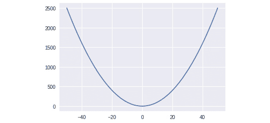

    ###### 图 2.1：X 轴和 Y 轴的基本图表

1.  现在，将数据生成函数从 `x²` 修改为 `x³`，保持相同的区间 `[-50,50]`，并重新绘制线图：

    ```py
    y_hat = np.power(x, 3)
    plt.plot(x, y_hat)
    ```

    输出结果如下：

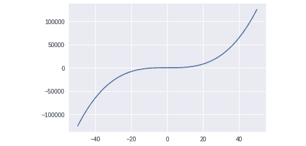

###### 图 2.2：X 轴和 Y 轴的基本图表

如你所见，函数的形状发生了变化，正如预期的那样。我们使用的基本图表类型足以看到 `y` 和 `y_hat` 值之间的变化。但仍然有一些问题：我们只绘制了一个数学函数，但通常我们收集的数据是有维度的，比如长度、时间和质量。我们如何将这些信息添加到图表中？我们如何添加标题？让我们在下一节中探讨这个问题。

## 图表的组成部分

每个图表都有一组可以调整的公共组成部分。Matplotlib 使用的这些组件名称将在下图中展示：

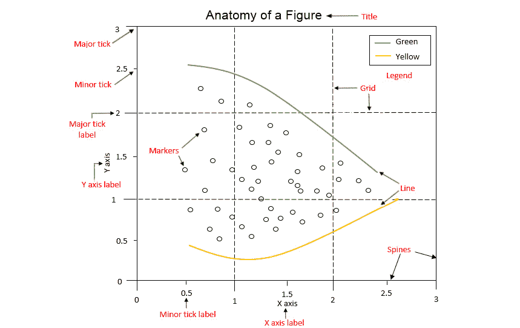

###### 图 2.3：图表的组成部分

图表的组成部分如下：

+   **图形**：图表的基础，所有其他组件都绘制在这里。

+   **坐标轴**：包含图形元素并设置坐标系统。

+   **标题**：标题给图表命名。

+   **X 轴标签**：*x* 轴的名称，通常带有单位。

+   **Y 轴标签**：*y* 轴的名称，通常带有单位。

+   **图例**：图例是对图表中数据的描述，帮助你识别图中的曲线和点。

+   **刻度和刻度标签**：它们表示图表中刻度上的参考点，数据值所在的位置。标签则表示具体的数值。

+   **线图**：这些是与数据一起绘制的线条。

+   **标记**：标记是用来标示数据点的图形符号。

+   **坐标轴**：限定图表区域的线条，数据将在该区域中绘制。

这些组件中的每一个都可以根据当前可视化任务的需求进行配置。我们将逐一介绍每种图形类型以及如何调整之前描述的组件。

### 练习 9：创建一个图形

使用 Matplotlib 创建图形有多种方式。第一种方式与 MATLAB 的方法非常相似，称为 **Pyplot**。Pyplot 是一个 API，是 Matplotlib 的*基于状态的接口*，这意味着它会将配置和其他参数保存在对象中。Pyplot 被设计为一种简单的用法。

执行以下步骤，使用 Matplotlib 库绘制正弦函数图形：

1.  导入所有需要的库，就像我们在前面的练习中做的那样：

    ```py
    %matplotlib inline
    import pandas as pd
    import numpy as np
    import matplotlib as mpl
    import matplotlib.pyplot as plt
    ```

    第二个 API，称为 `plt.subplots` 模块。

1.  现在，要获取图形和坐标轴，请使用以下命令：

    ```py
    fig, ax = plt.subplots()
    ```

    #### 注意

    图形是所有其他图形组件的顶层容器。坐标轴设置了诸如轴、坐标系统等内容，并包含了图形元素，如线条、文本等。

1.  要将一个图形添加到使用面向对象 API 创建的图表中，请使用以下命令：

    ```py
    x = np.linspace(0,100,500)
    y = np.sin(2*np.pi*x/100)
    ax.plot(x, y)
    ```

    输出结果如下：

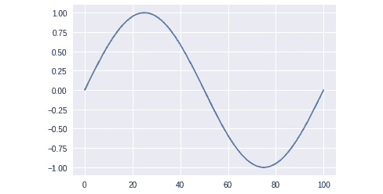

###### 图 2.4：使用面向对象 API 绘制的图形输出

我们正在将一条线性图添加到属于 `fig` 图形的 `ax` 坐标轴中。图形的修改，如标签名称、标题等，将在本章稍后演示。现在，让我们看看如何创建我们可能在分析中使用的每种类型的图形。

### 练习 10：为数学函数创建图形

在*练习 1：绘制一个解析函数*中，我们使用类似 MATLAB 的接口 Pyplot 为一个数学函数创建了图表。现在我们已经知道如何使用 Matplotlib 的面向对象 API，让我们使用它创建一个新图表。当使用面向对象 API 时，分析人员可以根据数据来源灵活地创建图表。

让我们使用面向对象 API 和 NumPy 的 `sine` 函数，在区间 `[0,100]` 上创建一个图形：

1.  创建 `x` 轴的数据点：

    ```py
    import numpy as np
    x = np.linspace(0,100,200)
    y = np.sin(x)
    ```

1.  创建 Matplotlib 的 API 接口：

    ```py
    %matplotlib inline
    import matplotlib.pyplot as plt
    fig, ax = plt.subplots()
    ```

1.  使用坐标轴对象 `ax` 添加图表：

    ```py
    ax.plot(x, y)
    ```

    输出结果如下：

    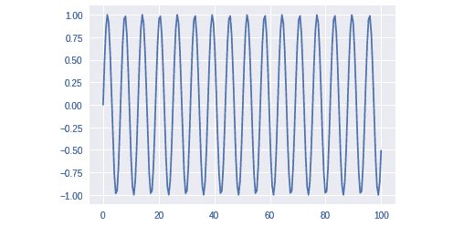

###### 图 2.5：数学函数的图形

请注意，我们再次使用 `linspace` 函数在线性区间 `[0, 100]` 上创建了 `200` 个值，然后对这些值应用了 `sine` 函数，生成了 `y` 轴。这是在创建数据区间时常用的一种方法。

## Seaborn

**Seaborn** ([`seaborn.pydata.org/`](https://seaborn.pydata.org/)) 是 PyData 工具家族的一部分，是一个基于 Matplotlib 的可视化库，旨在更轻松地创建统计图形。它可以直接操作 DataFrame 和 Series，进行内部的聚合和映射。Seaborn 使用颜色调色板和样式，使可视化更加一致且信息更丰富。它还具有一些可以计算统计数据的函数，例如回归、估计和误差。Seaborn 也能轻松创建一些特殊的图形，如小提琴图和多面图。

## 应该使用哪个工具？

Seaborn 尝试使一些常见分析图表的创建比直接使用 Matplotlib 更加简单。Matplotlib 可以被认为比 Seaborn 更低级，虽然这使得它有些繁琐和冗长，但它为分析师提供了更大的灵活性。有些图表，在 Seaborn 中只需调用一个函数即可创建，而在 Matplotlib 中可能需要几行代码才能实现。

没有明确的规则来确定分析师应该只使用 pandas 的绘图接口、直接使用 Matplotlib 还是使用 Seaborn。分析师应当牢记可视化需求以及创建所需图形所需的配置级别。

Pandas 的绘图接口更易于使用，但功能较为受限和局限。Seaborn 提供了多种现成的图表模式，包括常见的统计图表，如配对图和箱型图，但要求数据必须以整洁的格式进行整理，并且对图表的外观有较为明确的意见。Matplotlib 是两者的基础，比这两者更灵活，但要创建与其他两者相同的可视化效果，需要写更多的代码。

本书中的经验法则是：如何用最少的代码、且不改变数据的情况下，创建我需要的图形？有了这个原则，我们将使用三种选择，有时同时使用它们，以达到我们的可视化目标。分析师不应该局限于使用其中一种选项。我们鼓励使用任何能够创建有意义可视化的工具。

让我们来了解统计分析中最常见的几种图表类型。

## 图形类型

我们将展示的第一种图形是**折线图**或**线性图**。折线图通过在两个坐标轴（*x* 和 *y*）上连接的点来显示数据，通常是**笛卡尔坐标系**，并通常按 *x* 轴顺序排列。折线图用于展示数据的趋势，比如**时间序列**数据。

与折线图相关的图形是**散点图**。散点图通过笛卡尔坐标系将数据表示为点。通常，这个图表展示两个变量，尽管如果通过类别对数据进行颜色编码或大小编码，可能会传达更多的信息。散点图对于展示变量之间的关系和可能的相关性非常有用。

**直方图**用于表示数据的分布。与前两个示例不同，直方图通常只显示一个变量，通常在 *x*-轴上，而 *y*-轴显示数据的发生频率。创建直方图的过程比折线图和散点图要复杂一些，因此我们将更详细地解释它们。

**箱线图**也可用于表示频率分布，但它有助于通过一些统计量，如均值、中位数和标准差，比较数据组。箱线图用于可视化数据分布和异常值。

每种图表类型都有其应用，选择正确的图表类型对于分析的成功至关重要。例如，折线图可以用于展示过去一个世纪的经济增长趋势，而箱线图则很难用于此类分析。另一个常见的数据分析任务是识别变量之间的相关性：理解两个变量是否表现出相关的行为。散点图是常用的可视化工具。直方图对于可视化某个范围或区间内的数据点数量很有用，例如显示每加仑油耗在 10 到 20 英里之间的汽车数量。

### 折线图

如前一节所述，折线图通过连接数据点来展示数据。折线图非常适合展示趋势和倾向。在同一图表上可以绘制多条折线，用于比较各条线的行为，尽管必须确保图表上的单位一致。折线图还可以展示自变量和因变量之间的关系。一个常见的例子就是时间序列。

### 时间序列图

**时间序列图**顾名思义，用于展示数据相对于时间的变化。时间序列图在金融领域和环境科学中使用频繁。例如，以下图表展示了历史温度异常的时间序列：


###### 图 2.6: 时间序列图

#### 来源

[`upload.wikimedia.org/wikipedia/commons/c/c1/2000_Year_Temperature_Comparison.png`](https://upload.wikimedia.org/wikipedia/commons/c/c1/2000_Year_Temperature_Comparison.png)

通常，时间序列图的 `time` 变量位于 *x*-轴。

### 练习 11: 使用不同库创建折线图

让我们比较 Matplotlib、Pandas 和 Seaborn 之间的创建过程。我们将创建一个包含随机值的 Pandas DataFrame，并使用不同的方法进行绘制：

1.  创建一个包含随机值的数据集：

    ```py
    import numpy as np
    X = np.arange(0,100)
    Y = np.random.randint(0,200, size=X.shape[0])
    ```

1.  使用 Matplotlib Pyplot 接口绘制数据：

    ```py
    %matplotlib inline
    import matplotlib.pyplot as plt
    plt.plot(X, Y)
    ```

1.  现在，让我们使用创建的值创建一个 Pandas DataFrame：

    ```py
    import pandas as pd
    df = pd.DataFrame({'x':X, 'y_col':Y})
    ```

1.  使用 Pyplot 接口绘制图表，但需要使用 `data` 参数：

    ```py
    plt.plot('x', 'y_col', data=df)
    ```

    输出结果如下：

    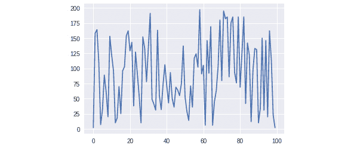

    ###### 图 2.7: 使用不同库的折线图

1.  使用相同的 DataFrame，我们还可以直接从 Pandas DataFrame 绘制：

    ```py
    df.plot('x', 'y_col')
    ```

    输出结果如下：

    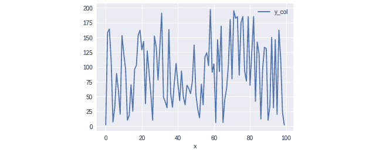

    ###### 图 2.8：来自 pandas DataFrame 的折线图

1.  那么 Seaborn 怎么样？我们来使用 Seaborn 绘制相同的折线图：

    ```py
    import seaborn as sns
    sns.lineplot(X, Y)
    sns.lineplot('x', 'y_col', data=df)
    ```

    输出结果如下：

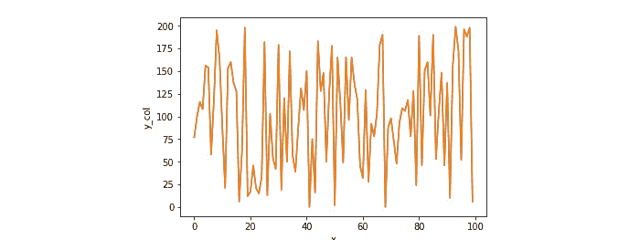

###### 图 2.9：来自 Seaborn DataFrame 的折线图

我们可以看到，在这种情况下，Matplotlib 和 Seaborn 使用的接口非常相似。

## Pandas DataFrames 和分组数据

正如我们在上一章中学习的，当分析数据并使用 Pandas 时，我们可以使用 Pandas 的 plot 函数或直接使用 Matplotlib。Pandas 在后台使用 Matplotlib，因此集成得非常好。根据具体情况，我们可以直接从 pandas 绘制，或者使用 Matplotlib 创建 **figure** 和 **axes**，并将其传递给 pandas 来绘制。例如，当进行 GroupBy 时，我们可以根据 GroupBy 键将数据分开。那么如何绘制 GroupBy 的结果呢？我们有几种方法可以选择。例如，如果 DataFrame 已经是正确格式，我们可以直接使用 pandas：

#### 注意

以下代码是示例，无法执行。

```py
fig, ax = plt.subplots()
df = pd.read_csv('data/dow_jones_index.data')
df[df.stock.isin(['MSFT', 'GE', 'PG'])].groupby('stock')['volume'].plot(ax=ax)
```

或者，我们可以将每个 GroupBy 键绘制在同一个图上：

```py
fig, ax = plt.subplots()
df.groupby('stock').volume.plot(ax=ax)
```

在以下活动中，我们将使用上一章中学到的内容，从 URL 读取 CSV 文件并解析它。数据集是 Auto-MPG 数据集（[`raw.githubusercontent.com/TrainingByPackt/Big-Data-Analysis-with-Python/master/Lesson02/Dataset/auto-mpg.data`](https://raw.githubusercontent.com/TrainingByPackt/Big-Data-Analysis-with-Python/master/Lesson02/Dataset/auto-mpg.data)）。

#### 注意

该数据集是从 `StatLib` 库提供的数据集修改而来的。原始数据集可以在 `auto-mpg.data-original` 文件中找到。

数据涉及城市循环的每加仑燃油消耗，包含三种多值离散属性和五种连续属性。

### 活动 4：使用面向对象 API 和 Pandas DataFrame 绘制折线图

在本活动中，我们将从 Auto-MPG 数据集中创建一个时间序列折线图，作为使用 pandas 和面向对象 API 绘图的第一个示例。这种类型的图在分析中非常常见，帮助回答诸如“平均马力是否随着时间的推移增加或减少？”的问题。

现在，按照这些步骤使用 pandas 和面向对象 API 绘制每年平均马力的图：

1.  将所需的库和包导入 Jupyter 笔记本。

1.  将 Auto-MPG 数据集读入 Spark 对象。

1.  提供列名以简化数据集，如下所示：

    ```py
    column_names = ['mpg', 'cylinders', 'displacement', 'horsepower', 'weight', 'acceleration', 'year', 'origin', 'name']
    ```

1.  现在读取带列名的新数据集并显示它。

1.  将 `horsepower` 和 `year` 数据类型转换为浮动和整数。

1.  现在使用 pandas 绘制每年平均马力的图：

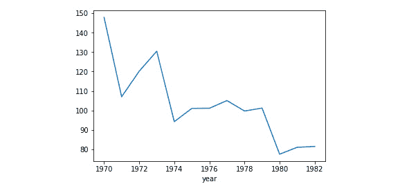

###### 图 2.10：使用面向对象 API 和 Pandas DataFrame 绘制的折线图

#### 注意

此活动的解答可以在第 205 页找到。

请注意，我们使用的是来自 pandas 的绘图函数，但将我们通过 Matplotlib 创建的轴直接作为参数传递给这些函数。如前一章所述，虽然这不是必需的，但它可以让你在 pandas 之外配置图形，并在之后更改其配置。这种行为也适用于其他类型的图形。现在让我们来处理散点图。

### 散点图

为了理解两个变量之间的相关性，通常使用散点图，因为它们可以让我们看到点的分布。使用 Matplotlib 创建散点图与创建线图类似，但我们使用的是 `scatter` 方法，而不是 `plot` 方法。

让我们来看一个使用 Auto-MPG 数据集的例子（[`archive.ics.uci.edu/ml/machine-learning-databases/auto-mpg/`](https://archive.ics.uci.edu/ml/machine-learning-databases/auto-mpg/)）：

```py
fig, ax = plt.subplots()
ax.scatter(x = df['horsepower'], y=df['weight'])
```

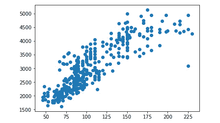

###### 图 2.11：使用 Matplotlib 库绘制的散点图

请注意，我们是直接从轴上调用散点图方法的。在 Matplotlib 的术语中，我们向属于 `fig` 图形的轴 `ax` 添加了一个散点图。我们还可以通过 Seaborn 很容易地向图中添加更多维度，比如 `color` 和点的 `size`：

```py
import seaborn as sns
sns.scatterplot(data=df, x='horsepower', y='weight', hue='cylinders', size='mpg')
```

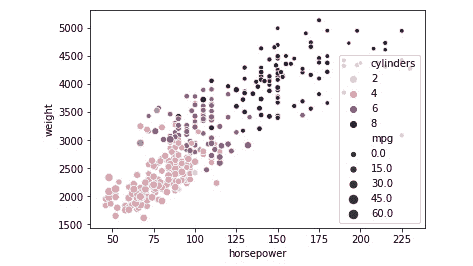

###### 图 2.12：使用 Seaborn 库绘制的散点图

如我们所见，散点图对于理解两个变量，甚至更多变量之间的关系非常有帮助。我们可以推断出，例如，`horsepower`（马力）和 `weight`（重量）之间存在正相关。通过散点图，我们还可以轻松地看到一个异常值，而使用其他类型的图形时，可能会更复杂。我们在折线图中看到的关于分组数据和 pandas DataFrame 的相同原则也适用于散点图。

我们可以通过 `kind` 参数直接从 pandas 生成散点图：

```py
df.plot(kind='scatter', x='horsepower', y='weight')
```

创建一个图形并将其传递给 Pandas：

```py
fig, ax = plt.subplots()
df.plot(kind='scatter', x='horsepower', y='weight', ax =ax)
```

### 活动 5：使用散点图理解变量之间的关系

为了继续我们的数据分析并学习如何绘制数据，让我们来看一个散点图可以帮助解答的问题。例如，使用散点图回答以下问题：

马力与重量之间是否存在关系？

为了回答这个问题，我们需要使用 Auto-MPG 数据创建一个散点图：

1.  使用已经导入的 Auto-MPG 数据集。

    #### 注意

    请参考前面的练习，了解如何导入数据集。

1.  使用 Matplotlib 的面向对象 API：

    ```py
    %matplotlib inline
    import matplotlib.pyplot as plt
    fig, ax = plt.subplots()
    ```

1.  使用 `scatter` 方法创建一个散点图：

    ```py
    ax.scatter(x = df['horsepower'], y=df['weight'])
    ```

    #### 注意

    此活动的解答可以在第 208 页找到。

我们可以识别出马力与重量之间的大致线性关系，其中有一些异常值，它们的马力较高但重量较低。这种图形有助于分析师解读数据的行为。

### 直方图

直方图与我们迄今所见的图形稍有不同，因为它们只尝试可视化一个变量的分布，而不是两个或多个。直方图的目标是可视化一个变量的概率分布，换句话说，就是计算某些值在固定区间（或箱子）内出现的次数。

区间是连续且相邻的，但不需要具有相同的大小，尽管这种安排最为常见。

区间数和区间大小的选择更多依赖于数据和分析目标，而非任何固定的通用规则。区间数越大，每个区间的大小就越小（更窄），反之亦然。例如，当数据有很多噪声或变化时，少量的区间（较大的区间）可以显示数据的总体轮廓，从而减少噪声在初步分析中的影响。当数据的密度较高时，更多的区间会更有用。

### 练习 12：创建马力分布的直方图

在我们努力理解数据时，现在我们想看看所有汽车的马力分布。具有适当直方图的分析问题包括：一个变量的最频繁值是多少？分布是集中在中间还是有尾巴？让我们绘制一个马力分布的直方图：

1.  在 Jupyter 笔记本中导入所需的库，并从 Auto-MPG 数据集仓库读取数据集：

    ```py
    import pandas as pd
    import numpy as np
    import matplotlib as mpl
    import matplotlib.pyplot as plt
    import seaborn as sns
    url = "https://archive.ics.uci.edu/ml/machine-learning-databases/auto-mpg/auto-mpg.data"
    df = pd.read_csv(url)
    ```

1.  提供列名称以简化数据集，如下所示：

    ```py
    column_names = ['mpg', 'Cylinders', 'displacement', 'horsepower', 'weight', 'acceleration', 'year', 'origin', 'name']
    ```

1.  现在读取带有列名的新数据集并显示它：

    ```py
    df = pd.read_csv(url, names= column_names, delim_whitespace=True)
    df.head()
    ```

    图形如下：

    

    ###### 图 2.13：自动 mpg 数据集

1.  使用以下命令将`horsepower`（马力）和`year`（年份）数据类型转换为浮动和整数：

    ```py
    df.loc[df.horsepower == '?', 'horsepower'] = np.nan
    df['horsepower'] = pd.to_numeric(df['horsepower'])
    df['full_date'] = pd.to_datetime(df.year, format='%y')
    df['year'] = df['full_date'].dt.year
    ```

1.  使用`plot`函数和`kind='hist'`从 Pandas DataFrame 直接创建图形：

    ```py
    df.horsepower.plot(kind='hist')
    ```

    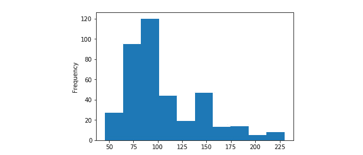

    ###### 图 2.14：直方图图

1.  识别`horsepower`（马力）浓度：

    ```py
    sns.distplot(df['weight'])
    ```

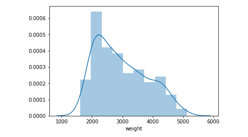

###### 图 2.15：直方图浓度图

我们可以从这张图中看到，值的分布偏向左侧，比如在`50`到`100`马力之间的汽车更多，而大于`200`马力的汽车较少。这对于理解一些数据在分析中的变化可能非常有用。

### 箱型图

箱型图也用于查看值的变化，但现在是每列内的变化。我们希望看到当按另一个变量分组时，值如何比较。例如，由于它们的格式，箱型图有时被称为**胡须图**或**箱型胡须图**，因为从主框中垂直延伸出的线条：

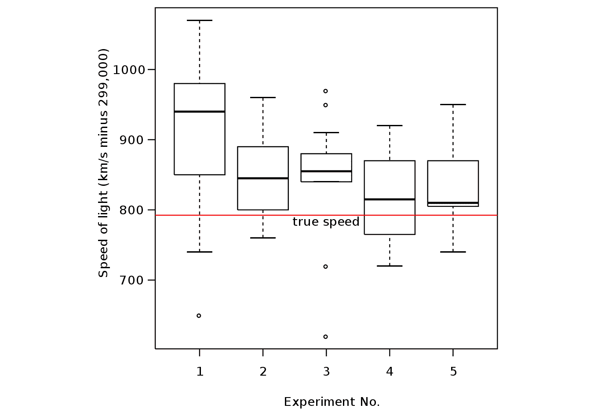

###### 图 2.16：箱型图

#### 来源

[`en.wikipedia.org/wiki/File:Michelsonmorley-boxplot.svg`](https://en.wikipedia.org/wiki/File:Michelsonmorley-boxplot.svg)

箱型图使用四分位数（第一和第三四分位数）来创建箱子和须。箱子中的线是第二四分位数——即中位数。须的定义可以有所不同，例如使用数据的平均值上下一个标准差，但通常使用 1.5 倍的四分位差（Q3 - Q1）从箱子的边缘开始。如果某个值超出这些范围，不论是上方还是下方，都将绘制为一个`点`，通常被认为是异常值。

### 练习 13：使用箱型图分析缸数和马力的关系

有时我们不仅希望看到每个变量的分布，还希望看到所关注的变量相对于另一个属性的变化。例如，我们想知道给定缸数时，马力如何变化。让我们使用 Seaborn 创建一个箱型图，将马力分布与缸数进行比较：

1.  在 Jupyter Notebook 中导入所需的库并从 Auto-MPG 数据集仓库读取数据集：

    ```py
    %matplotlib inline
    import pandas as pd
    import numpy as np
    import matplotlib as mpl
    import matplotlib.pyplot as plt
    import seaborn as sns
    url = "https://archive.ics.uci.edu/ml/machine-learning-databases/auto-mpg/auto-mpg.data"
    df = pd.read_csv(url)
    ```

1.  提供列名以简化数据集，如下所示：

    ```py
    column_names = ['mpg', 'Cylinders', 'displacement', 'horsepower', 'weight', 'acceleration', 'year', 'origin', 'name']
    ```

1.  现在读取带有列名的新数据集并显示它：

    ```py
    df = pd.read_csv(url, names= column_names, delim_whitespace=True)
    df.head()
    ```

    图形如下所示：

    

    ###### 图 2.17：auto-mpg 数据集

1.  使用以下命令将马力和年份的数据类型转换为浮动型和整数型：

    ```py
    df.loc[df.horsepower == '?', 'horsepower'] = np.nan
    df['horsepower'] = pd.to_numeric(df['horsepower'])
    df['full_date'] = pd.to_datetime(df.year, format='%y')
    df['year'] = df['full_date'].dt.year
    ```

1.  使用 Seaborn 的 `boxplot` 函数创建一个箱型图：

    ```py
    sns.boxplot(data=df, x="cylinders", y="horsepower")
    ```

    

    ###### 图 2.18：使用 Seaborn 箱型图函数

1.  现在，为了对比目的，直接使用 pandas 创建相同的`boxplot`：

    ```py
    df.boxplot(column='horsepower', by='cylinders')
    ```

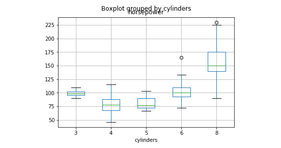

###### 图 2.19：使用 pandas 的箱型图

在分析方面，我们可以看到，**3** 缸的马力变动范围小于 **8** 缸。我们还可以看到，**6** 缸和 **8** 缸的数据显示了异常值。至于绘图，Seaborn 函数更为完整，自动为不同的缸数显示不同的颜色，并将 DataFrame 列的名称作为标签显示在图表中。

## 更改图形设计：修改图形组件

到目前为止，我们已经查看了用于分析数据的主要图表，无论是直接展示还是按组展示，用于比较和趋势可视化。但我们可以看到的一点是，每个图形的设计都与其他图形不同，我们没有基本的元素，比如标题和图例。

我们已经了解到，图形由多个组件组成，例如图形**标题**、**x** 和 **y** 标签等。在使用 Seaborn 时，图形已经有了**x** 和 **y** 标签，并且列的名称被作为标签显示。而使用 Matplotlib 时，我们没有这些。这样的变化不仅仅是外观上的。

除了标签和标题外，通过调整线宽、颜色和点大小等因素，我们可以大大改善图形的理解性。一个图形必须能够独立存在，因此标题、图例和单位至关重要。我们如何应用前面描述的概念，在 Matplotlib 和 Seaborn 中制作出好的、富有信息的图形呢？

绘图的配置方式多种多样，选择极为丰富。Matplotlib 在配置方面功能强大，但也牺牲了简便性。在使用 Matplotlib 更改图形的某些基本参数时可能会显得笨重，而这时 Seaborn 和其他库可以提供帮助。但在某些情况下，这种方式是值得的，例如在自定义图形时，因此在技术栈中具备此类能力是必要的。我们将在本节中重点讨论如何更改一些基本的绘图参数。

### 坐标轴对象的标题和标签配置

如前所述，Matplotlib 的面向对象 API 提供了更大的灵活性。让我们在接下来的练习中探讨如何配置坐标轴对象的标题和标签。

### 练习 14：配置坐标轴对象的标题和标签

执行以下步骤以配置标题和坐标轴对象的标签。我们将从上一个练习继续，并按照这些步骤进行操作：

1.  通过调用 `set` 方法设置 `title`、x 轴标签和 y 轴标签：

    ```py
    import matplotlib.pyplot as plt
    fig, ax = plt.subplots()
    ax.set(title="Graph title", xlabel="Label of x axis (units)", ylabel="Label of y axis (units)")
    ax.plot()
    ```

    绘图如下：

    

    ###### 图 2.20：配置标题和标签

1.  图例可以通过外部传递（仅使用 Matplotlib 时），也可以在 Pandas 绘图时设置，并与坐标轴一起绘制。使用以下命令绘制图例：

    ```py
    fig, ax = plt.subplots()
    df.groupby('year')['horsepower'].mean().plot(ax=ax, label='horsepower')
    ax.legend()
    ```

    绘图如下：

    

    ###### 图 2.21：带有图例的折线图

1.  绘制图例的替代方法如下：

    ```py
    fig, ax = plt.subplots()
    df.groupby('year')['horsepower'].mean().plot(ax=ax)
    ax.legend(['horsepower'])
    ```

    绘图如下：

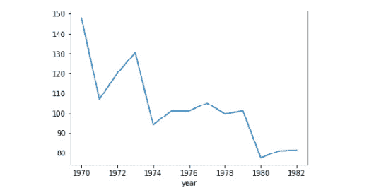

###### 图 2.22：带有图例的折线图（替代方法）

### 线条样式和颜色

对于折线图，可以通过 `ls`、`lw`、`marker` 和 `color` 参数来配置线条的颜色、粗细、标记和样式：

```py
df.groupby('year')['horsepower'].mean().plot(ls='-.', color='r', lw=3)
```


###### 图 2.23：带有颜色和样式的折线图

### 图形大小

我们还可以配置图形的大小。`figsize` 参数可以作为一个元组（`x` 轴，`y` 轴）传递给所有绘图函数，单位为英寸：

```py
df.plot(kind='scatter', x='weight', y='horsepower', figsize=(20,10))
```

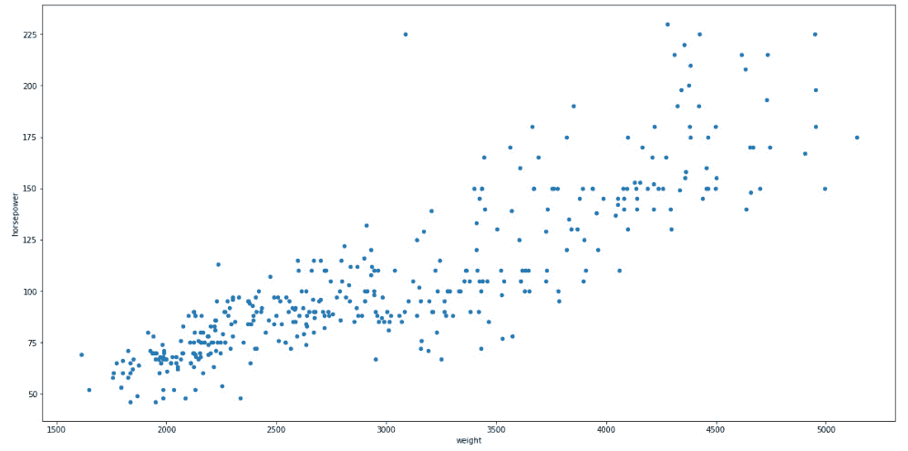

###### 图 2.24：更大图形大小的绘图

### 练习 15：使用 Matplotlib 样式表

Matplotlib 有一些样式表，定义了图形的一般规则，如**背景** **颜色**、**刻度线**、**图形颜色**和**调色板**。假设我们想更改样式，以便我们的图形在打印时具有更好的颜色。为此，按照以下步骤操作：

1.  首先使用以下命令打印可用样式列表：

    ```py
    import matplotlib.pyplot as plt
    print(plt.style.available)
    ```

    输出如下：

    ```py
    ['bmh', 'classic', 'dark_background', 'fast', 'fivethirtyeight', 'ggplot', 'grayscale', 'seaborn-bright', 'seaborn-colorblind', 'seaborn-dark-palette', 'seaborn-dark', 'seaborn-darkgrid', 'seaborn-deep', 'seaborn-muted', 'seaborn-notebook', 'seaborn-paper', 'seaborn-pastel', 'seaborn-poster', 'seaborn-talk', 'seaborn-ticks', 'seaborn-white', 'seaborn-whitegrid', 'seaborn', 'Solarize_Light2', 'tableau-colorblind10', '_classic_test']
    ```

1.  现在，让我们使用 `classic` 样式创建一个散点图。在继续之前，确保先导入 Matplotlib 库：

    ```py
    %matplotlib inline
    import numpy as np
    import matplotlib.pyplot as plt
    url = ('https://raw.githubusercontent.com/TrainingByPackt/Big-Data-Analysis-with-Python/master/Lesson02/Dataset/auto-mpg.data')
    df = pd.read_csv(url)
    column_names = ['mpg', 'cylinders', 'displacement', 'horsepower', 'weight', 'acceleration', 'year', 'origin', 'name']
    df = pd.read_csv(url, names= column_names, delim_whitespace=True)
    df.loc[df.horsepower == '?', 'horsepower'] = np.nan
    df['horsepower'] = pd.to_numeric(df['horsepower'])
    plt.style.use(['classic'])
    df.plot(kind='scatter', x='weight', y='horsepower')
    ```

    输出如下：

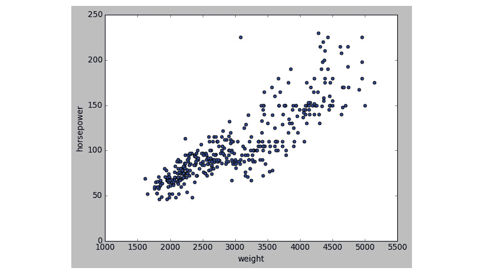

###### 图 2.25：使用 classic 样式的散点图

#### 注意

要使用样式表，请使用以下命令：

`plt.style.use('presentation')`

Seaborn 在导入时所做的其中一项更改是将一些样式添加到可用样式列表中。样式在为不同受众创建图像时也非常有用，例如为笔记本中的可视化创建一个样式，为打印或演示创建另一个样式。

## 导出图表

在生成可视化并配置好细节后，我们可以将图表导出为硬拷贝格式，如 PNG、JPEG 或 SVG。如果我们在笔记本中使用交互式 API，我们只需在 `pyplot` 接口上调用 `savefig` 函数，最后生成的图表将被导出到文件：

```py
df.plot(kind='scatter', x='weight', y='horsepower', figsize=(20,10))
plt.savefig('horsepower_weight_scatter.png')
```

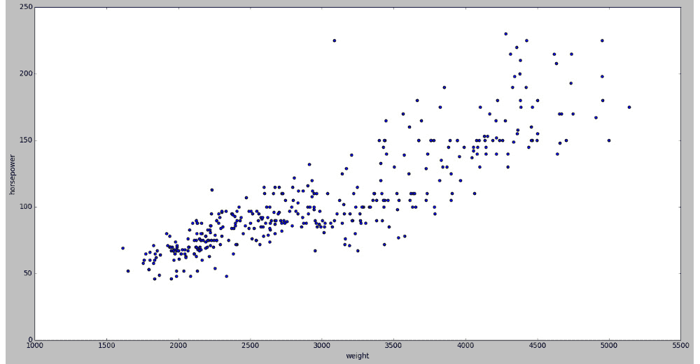

###### 图 2.26：导出图表

所有的图表配置将传递到 `plot`。要在使用面向对象的 API 时导出图表，我们可以从图形中调用 `savefig`：

```py
fig, ax = plt.subplots()
df.plot(kind='scatter', x='weight', y='horsepower', figsize=(20,10), ax=ax)
fig.savefig('horsepower_weight_scatter.jpg')
```

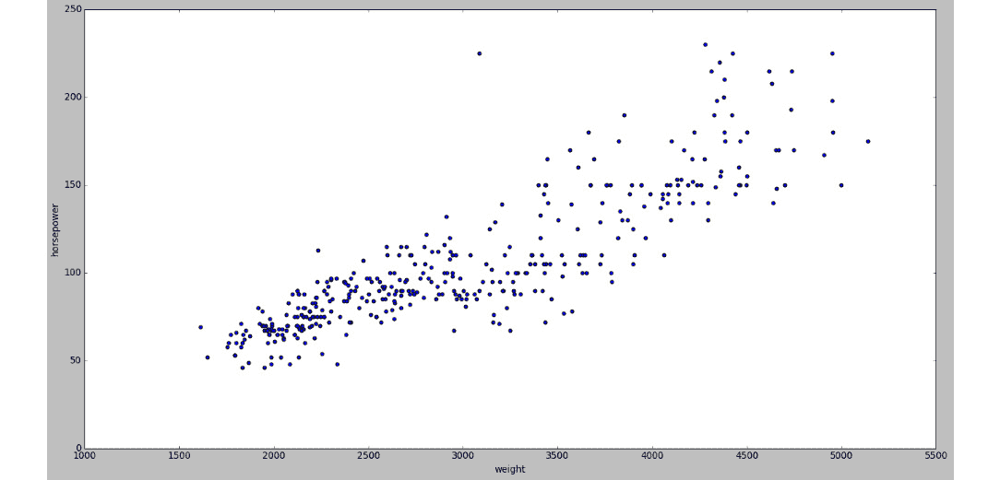

###### 图 2.27：保存图表

我们可以更改一些保存图像的参数：

+   **dpi**：调整保存的图像分辨率。

+   **facecolor**：图形的面颜色。

+   **edgecolor**：图形周围的边框颜色。

+   **format**：通常为 PNG、PDF、PS、EPS、JPG 或 SVG。根据文件名扩展名推断。

Seaborn 也使用相同的底层 Matplotlib 机制来保存图形。直接从 Seaborn 图表中调用 `savefig` 方法：

```py
sns_scatter = sns.scatterplot(data=df, x='horsepower', y='weight', hue='cylinders', size='mpg')
plt.savefig('scatter_fig.png', dpi=300)
```

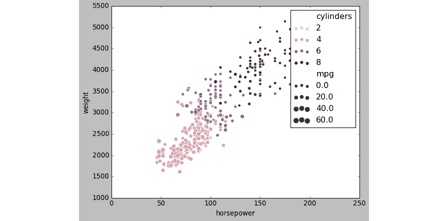

###### 图 2.28：使用 savefig 方法绘制图表

通过这些补充选项，分析人员可以为不同的受众生成可视化内容，无论是在笔记本中、网站上，还是打印出来。

### 活动 6：将图表导出到磁盘文件

将我们的工作保存到文件中是一个很好的方法，可以使结果在不同媒介中共享。如果我们想要将其留作未来参考，这也是一个好方法。让我们创建一个图表并保存到磁盘：

1.  导入 Auto-MPG 数据集。

1.  使用 Matplotlib 面向对象的 API 创建任何类型的图表。例如，这里是一个体重的直方图：

    ```py
    %matplotlib inline
    import matplotlib.pyplot
    fig, ax = plt.subplots()
    df.weight.plot(kind='hist', ax=ax)
    ```

1.  使用 `savefig` 函数将其导出为 PNG 文件：

    ```py
    fig.savefig('weight_hist.png')
    ```

    #### 注意

    本活动的解决方案可以在第 209 页找到。

### 活动 7：完整的图表设计

为了让我们的图表独立存在，与分析分离，我们需要在图表中添加更多信息，以便其他分析人员或用户能够理解图表的内容，并明白所表示的内容。我们现在将结合本章所学，创建一个完整的图表，包括标题、标签和图例，并调整图表大小。

作为分析师，我们希望了解每年平均每加仑英里数是否增加，并希望按气缸数进行分组。例如，三缸车的燃油消耗随时间变化如何？它的表现是高于还是低于四缸车？

按照以下步骤创建我们的最终图表：

1.  导入 Auto-MPG 数据集。

1.  对`year`和`cylinders`进行`groupby`操作，并取消将它们作为索引的选项。

1.  计算分组后的平均每加仑英里数，并将年份设置为索引。

1.  将年份设置为数据框的索引。

1.  使用面向对象的 API 创建图形和坐标轴。

1.  在`df_g`数据集上按气缸数进行`groupby`操作，并使用大小为`(10,8)`的坐标轴绘制每加仑英里数变量。

1.  在坐标轴上设置**标题**、**x**轴标签和**y**轴标签。

1.  在图表中包含图例。

1.  将图形保存为 PNG 文件到磁盘。

    #### 注意

    这个活动的解决方案可以在第 211 页找到。

我们可以从这张图表中推断出，四缸车比八缸车更为经济。我们还可以推断出，在研究期间，所有汽车的燃油效率都有所提高，1980 到 1982 年间，四缸车的燃油效率有所下降。

#### 注意

注意，借助标签轴和图例，使用 Pandas 所做的复杂转换（按组汇总和平均，之后设置索引）在最终结果中变得容易解释。

## 总结

在本章中，我们已经看到，在分析数据时，创建有意义且有趣的可视化图形的重要性。一张好的数据可视化图能够极大地帮助分析师的工作，以一种能够触及更广泛受众的方式呈现数据，并解释那些可能难以用文字表达或用表格展示的概念。

一张有效的图表，作为数据可视化工具，必须展示数据，避免失真，使理解大型数据集变得容易，并有明确的目的，比如描述或探索。图表的主要目标是传达数据，因此分析师在创建图表时必须牢记这一点。一张有用的图表比一张美丽的图表更为重要。

我们展示了一些在分析中常用的图表类型：折线图、散点图、直方图和箱形图。每种图表都有其目的和应用，取决于数据和目标。我们还展示了如何直接从 Matplotlib、从 pandas，或是两者结合使用 Matplotlib 的 API（Pyplot、交互式 API 和面向对象 API）来创建图表。我们以解释如何更改图表外观的选项（从线条样式到标记和颜色），以及如何将图表保存为打印或共享的硬拷贝格式，结束了本章。

这里我们没有覆盖的还有许多配置图形的方式。可视化是一个庞大的领域，工具也提供了大量的选项。

在接下来的章节中，我们将重点讨论数据处理，包括使用 Hadoop 和 Spark 操作大规模数据。在学习这两种工具的基础知识后，我们将回到分析过程，其中将包含各种形式的图表。
