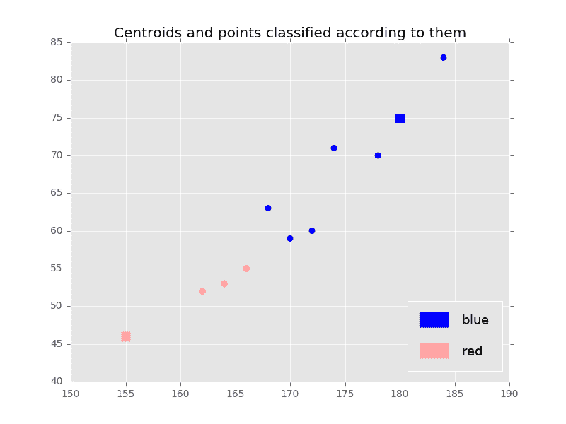
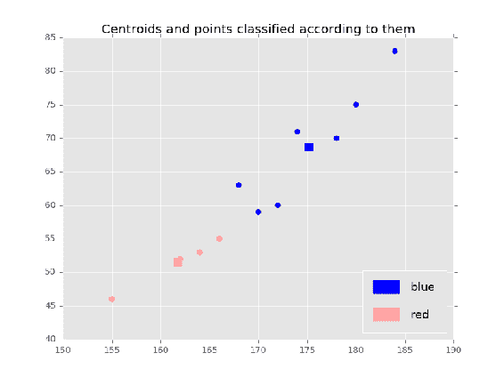
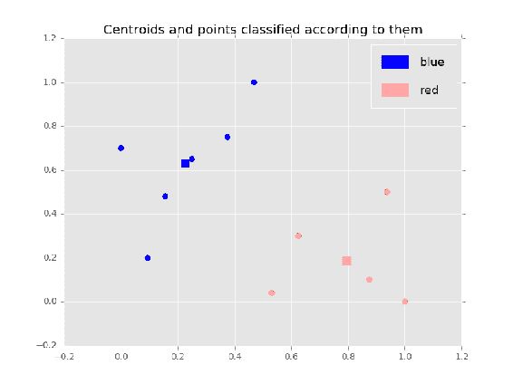
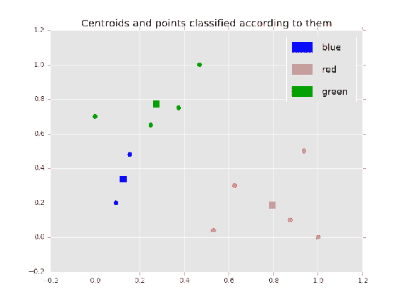
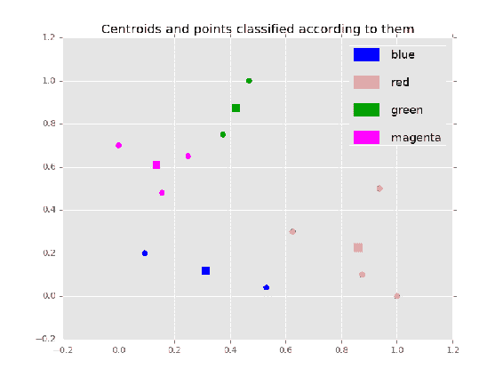
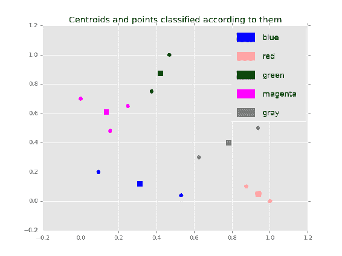
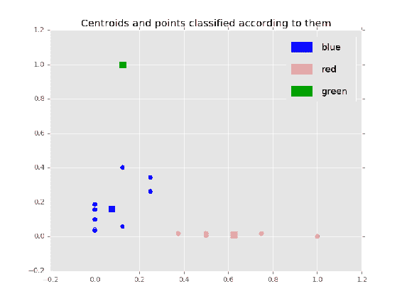
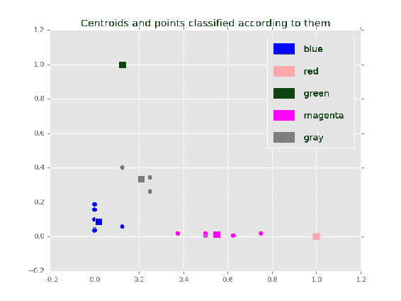

# 将数据聚类为 K 个簇

聚类是一种将数据划分为簇的技术，相同特征的项会被归为同一个簇。

在本章中，我们将覆盖以下主题：

+   如何使用*k*-均值聚类算法，通过涉及家庭收入的例子来演示

+   如何通过将特征与已知类别一起聚类，使用性别分类的例子来对特征进行分类

+   如何在*实现 k 均值聚类算法*部分中使用 Python 实现*k*-均值聚类算法

+   房屋拥有情况的例子，以及如何为你的分析选择合适的簇数

+   如何通过使用聚类算法，利用房屋拥有情况的例子，合理地缩放给定的数值数据，以提高分类的准确性

+   理解不同簇数如何改变簇与簇之间分界线的含义，通过文档聚类的例子来说明

# 家庭收入 – 将数据聚类为 k 个簇

例如，我们来看一下年收入分别为 40,000 美元、55,000 美元、70,000 美元、100,000 美元、115,000 美元、130,000 美元和 135,000 美元的家庭。然后，如果我们将这些家庭根据收入作为相似度标准分为两个簇，第一个簇会包括年收入为 40k、55k 和 70k 的家庭，而第二个簇会包括年收入为 100k、115k、130k 和 135k 的家庭。

这是因为 40k 和 135k 相距最远，所以我们希望分成两个簇，它们必须分别属于不同的簇。55k 比 135k 更接近 40k，因此 40k 和 55k 会在同一个簇。类似地，130k 和 135k 会在同一个簇。70k 比 130k 和 135k 更接近 40k 和 55k，因此 70k 应该和 40k、55k 在同一个簇。115k 比 40k、55k 和 70k 所在的第一个簇更接近 130k 和 135k，因此它会在第二个簇。最后，100k 更接近包含 115k、130k 和 135k 的第二个簇，因此它会被归类到那里。因此，第一个簇将包括年收入为 40k、55k 和 70k 的家庭。第二个簇将包括年收入为 100k、115k、130k 和 135k 的家庭。

聚类具有相似属性的组的特征，并将簇分配给某个特征是一种分类形式。数据科学家需要解释聚类结果以及它所引发的分类。在这里，包含年收入为 40k、55k 和 70k 家庭的簇代表了低收入家庭类。第二个簇，包括年收入为 100k、115k、130k 和 135k 的家庭，代表了高收入家庭类。

我们根据直觉和常识，非正式地将家庭收入划分为两个簇。也有一些聚类算法根据精确的规则对数据进行聚类。这些算法包括模糊 C 均值聚类算法、层次聚类算法、高斯（EM）聚类算法、质量阈值聚类算法和*k*均值聚类算法，本章将重点介绍后者。

# K 均值聚类算法

*k*均值聚类算法将给定的点分类到*k*个组中，使得同一组内的成员之间的距离最小。

*k*均值聚类算法确定初始的*k*质心（每个簇的中心点）——每个簇一个质心。然后，每个特征会被分类到与该特征距离最近的簇中。分类所有特征之后，我们就形成了初始的*k*个簇。

对于每个簇，我们重新计算质心，作为该簇内所有点的平均值。在移动了质心之后，我们再次重新计算类别。类别中的特征可能会发生变化。在这种情况下，我们需要重新计算质心。如果质心不再移动，则*k*均值聚类算法终止。

# 选择初始的 k 个质心

我们可以将初始的*k*个质心选择为数据中任意的*k*个特征。但是，理想情况下，我们希望从一开始就选择属于不同簇的点。因此，我们可能希望通过某种方式最大化它们之间的相互距离。简化过程后，我们可以将第一个质心选为数据中任意一个点。第二个质心可以选为距离第一个质心最远的点。第三个质心可以选为同时距离第一个和第二个质心最远的点，依此类推。

# 计算给定簇的质心

一个簇的质心只是该簇内所有点的平均值。如果一个簇包含一维点，其坐标为*x[1]、x[2]、…、x[n]*，那么该簇的质心为。如果一个簇包含二维点，其坐标为*(x[1],y[1])、(x[2],y[2])、…、(x[n],y[n])*，那么该簇的质心在*x*坐标的值为*(1/n)*(x[1]+x[2]+...+x[n])*，在*y*坐标的值为。

这个计算方法可以轻松扩展到更高的维度。如果在*x*坐标的高维特征值为*x[1]、x[2]、…、x[n]*，那么该簇的质心在*x*坐标的值为。

# 在家庭收入的例子中使用 k 均值聚类算法

我们将应用*k*聚类算法来分析家庭收入的例子。一开始，我们有收入分别为$40,000、$55,000、$70,000、$100,000、$115,000、$130,000 和$135,000 的家庭。

第一个被选择的质心可以是任何特征，例如，$70,000\. 第二个质心应该是与第一个最远的特征，即 135 k，因为 135 k 减去 70 k 是 65 k，这是任何其他特征与 70 k 之间的最大差异。因此，70 k 是第一个簇的质心，而 135 k 是第二个簇的质心。

现在，通过差异，40 k、55 k、70 k 和 100 k 更接近 70 k 而不是 135 k，因此它们将位于第一个簇中，而 115 k、130 k 和 135 k 更接近 135 k 而不是 70 k，因此它们将位于第二个簇中。

在根据初始质心对特征进行分类之后，我们重新计算质心。第一个簇的质心如下：


第二个簇的质心如下：


使用新的质心，我们重新分类特征如下：

+   包含质心 66.25 k 的第一个簇将包含特征 40 k、55 k 和 70 k

+   包含质心 126.66 k 的第二个簇将包含特征 100 k、115 k、130 k 和 135 k

我们注意到，100 k 特征从第一个簇移动到第二个簇，因为它现在更接近第二个簇的质心（*距离 |100 k-126.66 k|=26.66 k*），而不是第一个簇的质心（*距离 |100 k-66.25 k|=33.75 k*）。由于簇中的特征已经改变，我们必须重新计算质心。

第一个簇的质心如下：


第二个簇的质心如下：


使用这些质心，我们将特征重新分类到簇中。第一个质心，55 k，将包含特征 40 k、55 k 和 70 k。第二个质心，120 k，将包含特征 100 k、115 k、130 k 和 135 k。因此，在更新质心时，簇没有改变。因此，它们的质心将保持不变。

因此，算法以两个簇终止：第一个簇包含特征 40 k、55 k 和 70 k，第二个簇包含特征 100 k、115 k、130 k 和 135 k。

# 性别分类 – 聚类分类

下面的数据来自性别分类示例，*问题 6*，第二章，*朴素贝叶斯*：

| **身高（厘米）** | **体重（公斤）** | **头发长度** | **性别** |
| --- | --- | --- | --- |
| 180 | 75 | 短 | 男 |
| 174 | 71 | 短 | 男 |
| 184 | 83 | 短 | 男 |
| 168 | 63 | 短 | 男 |
| 178 | 70 | 长 | 男 |
| 170 | 59 | 长 | 女 |
| 164 | 53 | 短 | 女 |
| 155 | 46 | 长 | 女 |
| 162 | 52 | 长 | 女 |
| 166 | 55 | 长 | 女 |
| 172 | 60 | 长 | ? |

为了简化问题，我们将移除名为 **Hair length** 的列。我们还将移除名为 **Gender** 的列，因为我们希望根据身高和体重对表中的人进行聚类。我们希望通过聚类判断表中第十一位人的性别更可能是男性还是女性：

| **Height in cm** | **Weight in kg** |
| --- | --- |
| 180 | 75 |
| 174 | 71 |
| 184 | 83 |
| 168 | 63 |
| 178 | 70 |
| 170 | 59 |
| 164 | 53 |
| 155 | 46 |
| 162 | 52 |
| 166 | 55 |
| 172 | 60 |

# 分析

我们可以对初始数据进行缩放，但为了简化问题，我们将在算法中使用未经缩放的数据。我们将把已有数据聚类为两个簇，因为性别只有两种可能——男性或女性。然后，我们将根据聚类结果来分类一个身高为 172 厘米、体重为 60 公斤的人，如果且仅当该聚类中男性更多时，才将其归类为男性。聚类算法是一种非常高效的技术。因此，以这种方式进行分类非常快速，尤其是在需要分类的特征非常多的情况下。

所以，让我们对已有数据应用 *k*-均值聚类算法。首先，选择初始质心。例如，将第一个质心设为一个身高 180 厘米、体重 75 公斤的人，用向量表示为 *(180,75)*。与 *(180,75)* 最远的点是 *(155,46)*。所以它将作为第二个质心。

通过计算欧几里得距离，离第一个质心 *(180,75)* 最近的点是 *(180,75)*, *(174,71)*, *(184,83)*, *(168,63)*, *(178,70)*, *(170,59)* 和 *(172,60)*。所以这些点将属于第一个簇。离第二个质心 *(155,46)* 最近的点是 *(155,46)*, *(164,53)*, *(162,52)* 和 *(166,55)*。所以这些点将属于第二个簇。涉及这两个聚类的当前情况如下面的图示所示：



图 5.1：根据身高和体重对人的聚类

让我们重新计算聚类的质心。具有特征 (*180,75)*, *(174,71)*, *(184,83)*, *(168,63)*, *(178,70)*, *(170,59)* 和 *(172,60)* 的蓝色聚类将有质心 *((180+174+184+168+178+170+172)/7,(75+71+83+63+70+59+60)/7)~(175.14,68.71)*。

红色聚类包含特征 *(155,46)*, *(164,53)*, *(162,52)* 和 *(166,55)*，其质心为 *((155+164+162+166)/4,(46+53+52+55)/4)=(161.75, 51.5)*。

使用新的质心重新分类点时，点的类别没有变化。蓝色聚类将包含点 *(180,75)*, *(174,71)*, *(184,83)*, *(168,63)*, *(178,70)*, *(170,59)* 和 *(172,60)*。红色聚类将包含点 *(155,46)*, *(164,53)*, *(162,52)* 和 *(166,55)*。因此，聚类算法在以下图示中结束，得到了聚类：



图 5.2：根据身高和体重对人的聚类

现在我们希望将实例 *(172,60)* 分类为男性还是女性。实例 *(172,60)* 位于蓝色簇中，因此它与蓝色簇中的特征相似。剩余的特征是在蓝色簇中更可能是男性还是女性呢？六个特征中有五个是男性，只有一个是女性。由于蓝色簇中的大多数特征是男性，而且 *(172,60)* 也位于蓝色簇中，因此我们将身高 172 cm、体重 60 kg 的人分类为男性。

# k-means 聚类算法的实现

我们现在将实现 *k*-means 聚类算法。它以 CSV 文件作为输入，每一行代表一个数据项。每个数据项被转换为一个点。算法将这些点分为指定数量的簇。最终，聚类结果将在图表上可视化，使用 `matplotlib` 库：

```py
# source_code/5/k-means_clustering.py
import math
import imp
import sys
import matplotlib.pyplot as plt
import matplotlib
import sys
sys.path.append('../common')
import common # noqa
matplotlib.style.use('ggplot')

# Returns k initial centroids for the given points.
def choose_init_centroids(points, k):
    centroids = []
    centroids.append(points[0])
    while len(centroids) < k:
        # Find the centroid that with the greatest possible distance
        # to the closest already chosen centroid.
        candidate = points[0]
        candidate_dist = min_dist(points[0], centroids)
        for point in points:
            dist = min_dist(point, centroids)
            if dist > candidate_dist:
                candidate = point
                candidate_dist = dist
        centroids.append(candidate)
    return centroids

# Returns the distance of a point from the closest point in points.
def min_dist(point, points):
    min_dist = euclidean_dist(point, points[0])
    for point2 in points:
        dist = euclidean_dist(point, point2)
        if dist < min_dist:
            min_dist = dist
    return min_dist

# Returns an Euclidean distance of two 2-dimensional points.
def euclidean_dist((x1, y1), (x2, y2)):
    return math.sqrt((x1 - x2) * (x1 - x2) + (y1 - y2) * (y1 - y2))

# PointGroup is a tuple that contains in the first coordinate a 2d point
# and in the second coordinate a group which a point is classified to.
def choose_centroids(point_groups, k):
    centroid_xs = [0] * k
    centroid_ys = [0] * k
    group_counts = [0] * k
    for ((x, y), group) in point_groups:
        centroid_xs[group] += x
        centroid_ys[group] += y
        group_counts[group] += 1
    centroids = []
    for group in range(0, k):
        centroids.append((
            float(centroid_xs[group]) / group_counts[group],
            float(centroid_ys[group]) / group_counts[group]))
    return centroids

# Returns the number of the centroid which is closest to the point.
# This number of the centroid is the number of the group where
# the point belongs to.
def closest_group(point, centroids):
    selected_group = 0
    selected_dist = euclidean_dist(point, centroids[0])
    for i in range(1, len(centroids)):
        dist = euclidean_dist(point, centroids[i])
        if dist < selected_dist:
            selected_group = i
            selected_dist = dist
    return selected_group

# Reassigns the groups to the points according to which centroid
# a point is closest to.
def assign_groups(point_groups, centroids):
    new_point_groups = []
    for (point, group) in point_groups:
        new_point_groups.append(
            (point, closest_group(point, centroids)))
    return new_point_groups

# Returns a list of pointgroups given a list of points.
def points_to_point_groups(points):
    point_groups = []
    for point in points:
        point_groups.append((point, 0))
    return point_groups

# Clusters points into the k groups adding every stage
# of the algorithm to the history which is returned.
def cluster_with_history(points, k):
    history = []
    centroids = choose_init_centroids(points, k)
    point_groups = points_to_point_groups(points)
    while True:
        point_groups = assign_groups(point_groups, centroids)
        history.append((point_groups, centroids))
        new_centroids = choose_centroids(point_groups, k)
        done = True
        for i in range(0, len(centroids)):
            if centroids[i] != new_centroids[i]:
                done = False
                break
        if done:
            return history
        centroids = new_centroids

# Program start
csv_file = sys.argv[1]
k = int(sys.argv[2])
everything = False
# The third argument sys.argv[3] represents the number of the step of the
# algorithm starting from 0 to be shown or "last" for displaying the last
# step and the number of the steps.
if sys.argv[3] == "last":
    everything = True
else:
    step = int(sys.argv[3])

data = common.csv_file_to_list(csv_file)
points = data_to_points(data)  # Represent every data item by a point.
history = cluster_with_history(points, k)
if everything:
    print "The total number of steps:", len(history)
    print "The history of the algorithm:"
    (point_groups, centroids) = history[len(history) - 1]
    # Print all the history.
    print_cluster_history(history)
    # But display the situation graphically at the last step only.
    draw(point_groups, centroids)
else:
    (point_groups, centroids) = history[step]
    print "Data for the step number", step, ":"
    print point_groups, centroids
    draw(point_groups, centroids)
```

# 性别分类输入数据

我们将性别分类示例中的数据保存到 CSV 文件中，如下所示：

```py
# source_code/5/persons_by_height_and_weight.csv 180,75
174,71
184,83
168,63
178,70
170,59
164,53
155,46
162,52
166,55
172,60
```

# 性别分类数据的程序输出

我们运行程序，实施 *k*-means 聚类算法在性别分类示例的数据上。数值参数 `2` 表示我们希望将数据聚类成两个簇，如下方代码块所示：

```py
$ python k-means_clustering.py persons_by_height_weight.csv 2 last The total number of steps: 2
The history of the algorithm:
Step number 0: point_groups = [((180.0, 75.0), 0), ((174.0, 71.0), 0), ((184.0, 83.0), 0), ((168.0, 63.0), 0), ((178.0, 70.0), 0), ((170.0, 59.0), 0), ((164.0, 53.0), 1), ((155.0, 46.0), 1), ((162.0, 52.0), 1), ((166.0, 55.0), 1), ((172.0, 60.0), 0)]
centroids = [(180.0, 75.0), (155.0, 46.0)]
Step number 1: point_groups = [((180.0, 75.0), 0), ((174.0, 71.0), 0), ((184.0, 83.0), 0), ((168.0, 63.0), 0), ((178.0, 70.0), 0), ((170.0, 59.0), 0), ((164.0, 53.0), 1), ((155.0, 46.0), 1), ((162.0, 52.0), 1), ((166.0, 55.0), 1), ((172.0, 60.0), 0)]
centroids = [(175.14285714285714, 68.71428571428571), (161.75, 51.5)]
```

程序还输出了一个图表，见于*图 5.2*。`last` 参数表示我们希望程序进行聚类直到最后一步。如果我们只想显示第一步（步骤 0），可以将 `last` 改为 `0`，如下面的代码所示：

```py
$ python k-means_clustering.py persons_by_height_weight.csv 2 0
```

在程序执行后，我们将得到一个关于聚类及其质心的图像，如*图 5.1*所示。

# 房屋所有权 – 选择聚类数量

让我们以第一章中的房屋所有权示例为例：

| **年龄** | **年收入（美元）** | **房屋所有权状态** |
| --- | --- | --- |
| 23 | 50,000 | 非拥有者 |
| 37 | 34,000 | 非拥有者 |
| 48 | 40,000 | 拥有者 |
| 52 | 30,000 | 非拥有者 |
| 28 | 95,000 | 拥有者 |
| 25 | 78,000 | 非拥有者 |
| 35 | 13,0000 | 拥有者 |
| 32 | 10,5000 | 拥有者 |
| 20 | 10,0000 | 非拥有者 |
| 40 | 60,000 | 拥有者 |
| 50 | 80,000 | Peter |

我们希望通过聚类预测 Peter 是否是房屋拥有者。

# 分析

就像第一章一样，我们需要对数据进行缩放，因为 *收入* 轴的数值明显大于 *年龄* 轴，从而减少了 *年龄* 轴的影响，而实际上在这种问题中，*年龄* 具有很好的预测能力。因为预期年长的人有更多的时间定居、存钱并购买房产，而相较于年轻人，年长的人更可能是房屋拥有者。

我们应用了第一章中的相同重缩放方法，*基于 K 最近邻的分类*，并得到了以下表格：

| **年龄** | **缩放后的年龄** | **年收入（美元）** | **缩放后的年收入** | **房屋所有权状态** |
| --- | --- | --- | --- | --- |
| 23 | 0.09375 | 50000 | 0.2 | 非房主 |
| 37 | 0.53125 | 34000 | 0.04 | 非房主 |
| 48 | 0.875 | 40000 | 0.1 | 房主 |
| 52 | 1 | 30000 | 0 | 非房主 |
| 28 | 0.25 | 95000 | 0.65 | 房主 |
| 25 | 0.15625 | 78000 | 0.48 | 非房主 |
| 35 | 0.46875 | 130000 | 1 | 房主 |
| 32 | 0.375 | 105000 | 0.75 | 房主 |
| 20 | 0 | 100000 | 0.7 | 非房主 |
| 40 | 0.625 | 60000 | 0.3 | 房主 |
| 50 | 0.9375 | 80000 | 0.5 | ? |

根据该表，我们生成算法的输入文件并执行它，将特征聚类为两个簇。

**输入**：

```py
# source_code/5/house_ownership2.csv 0.09375,0.2
0.53125,0.04
0.875,0.1
1,0
0.25,0.65
0.15625,0.48
0.46875,1
0.375,0.75
0,0.7
0.625,0.3
0.9375,0.5
```

**两个簇的输出**：

```py
$ python k-means_clustering.py house_ownership2.csv 2 last The total number of steps: 3
The history of the algorithm:
Step number 0: point_groups = [((0.09375, 0.2), 0), ((0.53125, 0.04), 0), ((0.875, 0.1), 1), ((1.0, 0.0), 1), ((0.25, 0.65), 0), ((0.15625, 0.48), 0), ((0.46875, 1.0), 0), ((0.375, 0.75), 0), ((0.0, 0.7), 0), ((0.625, 0.3), 1), ((0.9375, 0.5), 1)]
centroids = [(0.09375, 0.2), (1.0, 0.0)]
Step number 1: point_groups = [((0.09375, 0.2), 0), ((0.53125, 0.04), 1), ((0.875, 0.1), 1), ((1.0, 0.0), 1), ((0.25, 0.65), 0), ((0.15625, 0.48), 0), ((0.46875, 1.0), 0), ((0.375, 0.75), 0), ((0.0, 0.7), 0), ((0.625, 0.3), 1), ((0.9375, 0.5), 1)]
centroids = [(0.26785714285714285, 0.5457142857142857), (0.859375, 0.225)]
Step number 2: point_groups = [((0.09375, 0.2), 0), ((0.53125, 0.04), 1), ((0.875, 0.1), 1), ((1.0, 0.0), 1), ((0.25, 0.65), 0), ((0.15625, 0.48), 0), ((0.46875, 1.0), 0), ((0.375, 0.75), 0), ((0.0, 0.7), 0), ((0.625, 0.3), 1), ((0.9375, 0.5), 1)]
centroids = [(0.22395833333333334, 0.63), (0.79375, 0.188)]
```



蓝色簇包含已缩放的特征–*(0.09375,0.2)*，*(0.25,0.65)*，*(0.15625,0.48)*，*(0.46875,1)*，*(0.375,0.75)*，和未缩放的特征–*(23,50000)*，*(28,95000)*，*(25,78000)*，*(35,130000)*，*(32,105000)*，和*(20,100000)*。红色簇包含已缩放的特征–*(0.53125,0.04)*，*(0.875,0.1)*，*(1,0)*，*(0.625,0.3)*，和*(0.9375,0.5)*，以及未缩放的特征–*(37,34000)*，*(48,40000)*，*(52,30000)*，*(40,60000)*，和*(50,80000)*。

所以，彼得属于红色簇。那么，在不计彼得的情况下，红色簇中房主的比例是多少？红色簇中有 2/4，或者说 1/2 的人是房主。因此，彼得所在的红色簇似乎在判断彼得是否为房主上没有太高的预测能力。我们可以尝试将数据聚类成更多簇，希望能获得一个更纯粹的簇，这样对预测彼得是否为房主会更可靠。因此，让我们尝试将数据聚类成三个簇。

**三个簇的输出**：

```py
$ python k-means_clustering.py house_ownership2.csv 3 last The total number of steps: 3
The history of the algorithm:
Step number 0: point_groups = [((0.09375, 0.2), 0), ((0.53125, 0.04), 0), ((0.875, 0.1), 1), ((1.0, 0.0), 1), ((0.25, 0.65), 2), ((0.15625, 0.48), 0), ((0.46875, 1.0), 2), ((0.375, 0.75), 2), ((0.0, 0.7), 0), ((0.625, 0.3), 1), ((0.9375, 0.5), 1)]
centroids = [(0.09375, 0.2), (1.0, 0.0), (0.46875, 1.0)]
Step number 1: point_groups = [((0.09375, 0.2), 0), ((0.53125, 0.04), 1), ((0.875, 0.1), 1), ((1.0, 0.0), 1), ((0.25, 0.65), 2), ((0.15625, 0.48), 0), ((0.46875, 1.0), 2), ((0.375, 0.75), 2), ((0.0, 0.7), 2), ((0.625, 0.3), 1), ((0.9375, 0.5), 1)]
centroids = [(0.1953125, 0.355), (0.859375, 0.225), (0.3645833333333333, 0.7999999999999999)]
Step number 2: point_groups = [((0.09375, 0.2), 0), ((0.53125, 0.04), 1), ((0.875, 0.1), 1), ((1.0, 0.0), 1), ((0.25, 0.65), 2), ((0.15625, 0.48), 0), ((0.46875, 1.0), 2), ((0.375, 0.75), 2), ((0.0, 0.7), 2), ((0.625, 0.3), 1), ((0.9375, 0.5), 1)]
centroids = [(0.125, 0.33999999999999997), (0.79375, 0.188), (0.2734375, 0.7749999999999999)]
```



红色簇保持不变。所以我们将数据聚类成四个簇。

**四个簇的输出**：

```py
$ python k-means_clustering.py house_ownership2.csv 4 last The total number of steps: 2
The history of the algorithm:
Step number 0: point_groups = [((0.09375, 0.2), 0), ((0.53125, 0.04), 0), ((0.875, 0.1), 1), ((1.0, 0.0), 1), ((0.25, 0.65), 3), ((0.15625, 0.48), 3), ((0.46875, 1.0), 2), ((0.375, 0.75), 2), ((0.0, 0.7), 3), ((0.625, 0.3), 1), ((0.9375, 0.5), 1)]
centroids = [(0.09375, 0.2), (1.0, 0.0), (0.46875, 1.0), (0.0, 0.7)]
Step number 1: point_groups = [((0.09375, 0.2), 0), ((0.53125, 0.04), 0), ((0.875, 0.1), 1), ((1.0, 0.0), 1), ((0.25, 0.65), 3), ((0.15625, 0.48), 3), ((0.46875, 1.0), 2), ((0.375, 0.75), 2), ((0.0, 0.7), 3), ((0.625, 0.3), 1), ((0.9375, 0.5), 1)]
centroids = [(0.3125, 0.12000000000000001), (0.859375, 0.225), (0.421875, 0.875), (0.13541666666666666, 0.61)]
```



现在，彼得所在的红色簇发生了变化。那么，红色簇中房主的比例是多少呢？如果不计算彼得，红色簇中有 2/3 的人是房主。当我们聚成两个簇或三个簇时，这个比例只有 1/2，这并没有告诉我们彼得是否是房主。现在，红色簇中房主的比例多数（不算彼得），所以我们更相信彼得也是房主。然而，2/3 仍然是一个相对较低的置信度，无法将彼得确定为房主。让我们将数据聚类成五个簇，看看会发生什么。

**五个簇的输出**：

```py
$ python k-means_clustering.py house_ownership2.csv 5 last The total number of steps: 2
The history of the algorithm:
Step number 0: point_groups = [((0.09375, 0.2), 0), ((0.53125, 0.04), 0), ((0.875, 0.1), 1), ((1.0, 0.0), 1), ((0.25, 0.65), 3), ((0.15625, 0.48), 3), ((0.46875, 1.0), 2), ((0.375, 0.75), 2), ((0.0, 0.7), 3), ((0.625, 0.3), 4), ((0.9375, 0.5), 4)]
centroids = [(0.09375, 0.2), (1.0, 0.0), (0.46875, 1.0), (0.0, 0.7), (0.9375, 0.5)]
Step number 1: point_groups = [((0.09375, 0.2), 0), ((0.53125, 0.04), 0), ((0.875, 0.1), 1), ((1.0, 0.0), 1), ((0.25, 0.65), 3), ((0.15625, 0.48), 3), ((0.46875, 1.0), 2), ((0.375, 0.75), 2), ((0.0, 0.7), 3), ((0.625, 0.3), 4), ((0.9375, 0.5), 4)]
centroids = [(0.3125, 0.12000000000000001), (0.9375, 0.05), (0.421875, 0.875), (0.13541666666666666, 0.61), (0.78125, 0.4)]
```



现在，红色聚类只包含彼得和一名非所有者。这种聚类表明，彼得更可能是一个非所有者。然而，根据之前的聚类，彼得更可能是房主。因此，是否拥有房产的问题可能并不那么清晰。收集更多数据将有助于改善我们的分析，并应在做出最终分类之前进行。

通过我们的分析，我们注意到，聚类的不同数量可能会导致分类结果不同，因为单个聚类中的成员性质可能会变化。收集更多数据后，我们应进行交叉验证，以确定能够以最高准确率对数据进行分类的聚类数量。

# 文档聚类——理解语义上下文中的 k 个聚类数量

我们提供了关于来自古腾堡计划的 17 本书中 *money* 和 *god(s)* 词汇频率的信息如下：

| **书籍编号** | **书名** | **货币占比** | **神明占比** |
| --- | --- | --- | --- |
| 1 | *吠檀多经注释* 由**拉马努贾**翻译，乔治·希博特译 | 0 | 0.07 |
| 2 | *克里希纳·德瓦伊帕亚纳·维亚萨史诗* ——阿底帕尔瓦卷，由吉萨里·莫汉·甘古利翻译 | 0 | 0.17 |
| 3 | *克里希纳·德瓦伊帕亚纳·维亚萨史诗* 第二部分，由克里希纳·德瓦伊帕亚纳·维亚萨编著 | 0.01 | 0.10 |
| 4 | *克里希纳·德瓦伊帕亚纳·维亚萨史诗* 第 3 卷 第一部分，由克里希纳·德瓦伊帕亚纳·维亚萨编著 | 0 | 0.32 |
| 5 | *克里希纳·德瓦伊帕亚纳·维亚萨史诗* 第 4 卷，由吉萨里·莫汉·甘古利翻译 | 0 | 0.06 |
| 6 | *克里希纳·德瓦伊帕亚纳·维亚萨史诗* 第 3 卷 第二部分，由吉萨里·莫汉·甘古利翻译 | 0 | 0.27 |
| 7 | *吠檀多经注释* 由桑卡拉查里亚编著 | 0 | 0.06 |
| 8 | *钦定版圣经* | 0.02 | 0.59 |
| 9 | *失乐园*，由约翰·弥尔顿编著 | 0.02 | 0.45 |
| 10 | *基督的模仿*，由托马斯·阿·肯皮斯编著 | 0.01 | 0.69 |
| 11 | *可兰经*，由罗德威尔翻译 | 0.01 | 1.72 |
| 12 | *汤姆·索亚历险记* 完整版，马克·吐温（塞缪尔·克莱门斯）编著 | 0.05 | 0.01 |
| 13 | *哈克贝里·费恩历险记* 完整版，由马克·吐温（塞缪尔·克莱门斯）编著 | 0.08 | 0 |
| 14 | *远大前程*，由查尔斯·狄更斯编著 | 0.04 | 0.01 |
| 15 | *道林·格雷的画像*，由奥斯卡·王尔德编著 | 0.03 | 0.03 |
| 16 | *福尔摩斯的冒险*，由阿瑟·柯南·道尔编著 | 0.04 | 0.03 |
| 17 | *变形记*，由弗朗茨·卡夫卡，戴维·威利翻译 | 0.06 | 0.03 |

我们希望根据所选的单词频率，将该数据集按照其语义上下文聚类成不同的组。

# 分析

首先，我们将进行重缩放，因为单词 *money* 的最高频率为 0.08%，而单词 “god(s)” 的最高频率为 1.72%。因此，我们将 money 的频率除以 0.08，god(s) 的频率除以 1.72，计算结果如下：

| **书籍编号** | **货币重缩放** | **神明重缩放** |
| --- | --- | --- |
| 1 | 0 | 0.0406976744 |
| 2 | 0 | 0.0988372093 |
| 3 | 0.125 | 0.0581395349 |
| 4 | 0 | 0.1860465116 |
| 5 | 0 | 0.0348837209 |
| 6 | 0 | 0.1569767442 |
| 7 | 0 | 0.0348837209 |
| 8 | 0.25 | 0.3430232558 |
| 9 | 0.25 | 0.261627907 |
| 10 | 0.125 | 0.4011627907 |
| 11 | 0.125 | 1 |
| 12 | 0.625 | 0.0058139535 |
| 13 | 1 | 0 |
| 14 | 0.5 | 0.0058139535 |
| 15 | 0.375 | 0.0174418605 |
| 16 | 0.5 | 0.0174418605 |
| 17 | 0.75 | 0.0174418605 |

现在我们已经对数据进行了重缩放，接下来我们通过尝试将数据划分为不同数量的聚类，应用 *k*-均值聚类算法。

**输入**：

```py
source_code/5/document_clustering/word_frequencies_money_god_scaled.csv 0,0.0406976744
0,0.0988372093
0.125,0.0581395349
0,0.1860465116
0,0.0348837209
0,0.1569767442
0,0.0348837209
0.25,0.3430232558
0.25,0.261627907
0.125,0.4011627907
0.125,1
0.625,0.0058139535
1,0
0.5,0.0058139535
0.375,0.0174418605
0.5,0.0174418605
0.75,0.0174418605
```

**两个聚类的输出**：

```py
$ python k-means_clustering.py document_clustering/word_frequencies_money_god_scaled.csv 2 last The total number of steps: 3
The history of the algorithm:
Step number 0: point_groups = [((0.0, 0.0406976744), 0), ((0.0, 0.0988372093), 0), ((0.125, 0.0581395349), 0), ((0.0, 0.1860465116), 0), ((0.0, 0.0348837209), 0), ((0.0, 0.1569767442), 0), ((0.0, 0.0348837209), 0), ((0.25, 0.3430232558), 0), ((0.25, 0.261627907), 0), ((0.125, 0.4011627907), 0), ((0.125, 1.0), 0), ((0.625, 0.0058139535), 1), ((1.0, 0.0), 1), ((0.5, 0.0058139535), 1), ((0.375, 0.0174418605), 0), ((0.5, 0.0174418605), 1), ((0.75, 0.0174418605), 1)]
centroids = [(0.0, 0.0406976744), (1.0, 0.0)]
Step number 1: point_groups = [((0.0, 0.0406976744), 0), ((0.0, 0.0988372093), 0), ((0.125, 0.0581395349), 0), ((0.0, 0.1860465116), 0), ((0.0, 0.0348837209), 0), ((0.0, 0.1569767442), 0), ((0.0, 0.0348837209), 0), ((0.25, 0.3430232558), 0), ((0.25, 0.261627907), 0), ((0.125, 0.4011627907), 0), ((0.125, 1.0), 0), ((0.625, 0.0058139535), 1), ((1.0, 0.0), 1), ((0.5, 0.0058139535), 1), ((0.375, 0.0174418605), 1), ((0.5, 0.0174418605), 1), ((0.75, 0.0174418605), 1)]
centroids = [(0.10416666666666667, 0.21947674418333332), (0.675, 0.0093023256)]
Step number 2: point_groups = [((0.0, 0.0406976744), 0), ((0.0, 0.0988372093), 0), ((0.125, 0.0581395349), 0), ((0.0, 0.1860465116), 0), ((0.0, 0.0348837209), 0), ((0.0, 0.1569767442), 0), ((0.0, 0.0348837209), 0), ((0.25, 0.3430232558), 0), ((0.25, 0.261627907), 0), ((0.125, 0.4011627907), 0), ((0.125, 1.0), 0), ((0.625, 0.0058139535), 1), ((1.0, 0.0), 1), ((0.5, 0.0058139535), 1), ((0.375, 0.0174418605), 1), ((0.5, 0.0174418605), 1), ((0.75, 0.0174418605), 1)]
centroids = [(0.07954545454545454, 0.2378435517909091), (0.625, 0.01065891475)]
```


我们可以观察到，将数据聚类成两个类别时，书籍被划分为宗教书籍（蓝色聚类）和非宗教书籍（红色聚类）。现在我们尝试将书籍分成三个聚类，看看算法是如何划分数据的。

**三个聚类的输出**：

```py
$ python k-means_clustering.py document_clustering/word_frequencies_money_god_scaled.csv 3 last The total number of steps: 3
The history of the algorithm:
Step number 0: point_groups = [((0.0, 0.0406976744), 0), ((0.0, 0.0988372093), 0), ((0.125, 0.0581395349), 0), ((0.0, 0.1860465116), 0), ((0.0, 0.0348837209), 0), ((0.0, 0.1569767442), 0), ((0.0, 0.0348837209), 0), ((0.25, 0.3430232558), 0), ((0.25, 0.261627907), 0), ((0.125, 0.4011627907), 0), ((0.125, 1.0), 2), ((0.625, 0.0058139535), 1), ((1.0, 0.0), 1), ((0.5, 0.0058139535), 1), ((0.375, 0.0174418605), 0), ((0.5, 0.0174418605), 1), ((0.75, 0.0174418605), 1)]
centroids = [(0.0, 0.0406976744), (1.0, 0.0), (0.125, 1.0)]
Step number 1: point_groups = [((0.0, 0.0406976744), 0), ((0.0, 0.0988372093), 0), ((0.125, 0.0581395349), 0), ((0.0, 0.1860465116), 0), ((0.0, 0.0348837209), 0), ((0.0, 0.1569767442), 0), ((0.0, 0.0348837209), 0), ((0.25, 0.3430232558), 0), ((0.25, 0.261627907), 0), ((0.125, 0.4011627907), 0), ((0.125, 1.0), 2), ((0.625, 0.0058139535), 1), ((1.0, 0.0), 1), ((0.5, 0.0058139535), 1), ((0.375, 0.0174418605), 1), ((0.5, 0.0174418605), 1), ((0.75, 0.0174418605), 1)]
centroids = [(0.10227272727272728, 0.14852008456363636), (0.675, 0.0093023256), (0.125, 1.0)]
Step number 2: point_groups = [((0.0, 0.0406976744), 0), ((0.0, 0.0988372093), 0), ((0.125, 0.0581395349), 0), ((0.0, 0.1860465116), 0), ((0.0, 0.0348837209), 0), ((0.0, 0.1569767442), 0), ((0.0, 0.0348837209), 0), ((0.25, 0.3430232558), 0), ((0.25, 0.261627907), 0), ((0.125, 0.4011627907), 0), ((0.125, 1.0), 2), ((0.625, 0.0058139535), 1), ((1.0, 0.0), 1), ((0.5, 0.0058139535), 1), ((0.375, 0.0174418605), 1), ((0.5, 0.0174418605), 1), ((0.75, 0.0174418605), 1)]
centroids = [(0.075, 0.16162790697), (0.625, 0.01065891475), (0.125, 1.0)]
```



这一次，算法将《可兰经》从宗教书籍中分离出来，单独放入一个绿色聚类。这是因为事实上，*god*（上帝）一词是《可兰经》中第五大高频词。这里的聚类恰好是根据书籍的写作风格将其划分的。四个聚类的结果将一本高频出现 *money*（金钱）一词的书从红色的非宗教书籍聚类中分离出来，单独成类。现在我们来看一下五个聚类的情况。

**五个聚类的输出**：

```py
$ python k-means_clustering.py word_frequencies_money_god_scaled.csv 5 last The total number of steps: 2
The history of the algorithm:
Step number 0: point_groups = [((0.0, 0.0406976744), 0), ((0.0, 0.0988372093), 0), ((0.125, 0.0581395349), 0), ((0.0, 0.1860465116), 0), ((0.0, 0.0348837209), 0), ((0.0, 0.1569767442), 0), ((0.0, 0.0348837209), 0), ((0.25, 0.3430232558), 4), ((0.25, 0.261627907), 4), ((0.125, 0.4011627907), 4), ((0.125, 1.0), 2), ((0.625, 0.0058139535), 3), ((1.0, 0.0), 1), ((0.5, 0.0058139535), 3), ((0.375, 0.0174418605), 3), ((0.5, 0.0174418605), 3), ((0.75, 0.0174418605), 3)]
centroids = [(0.0, 0.0406976744), (1.0, 0.0), (0.125, 1.0), (0.5, 0.0174418605), (0.25, 0.3430232558)]
Step number 1: point_groups = [((0.0, 0.0406976744), 0), ((0.0, 0.0988372093), 0), ((0.125, 0.0581395349), 0), ((0.0, 0.1860465116), 0), ((0.0, 0.0348837209), 0), ((0.0, 0.1569767442), 0), ((0.0, 0.0348837209), 0), ((0.25, 0.3430232558), 4), ((0.25, 0.261627907), 4), ((0.125, 0.4011627907), 4), ((0.125, 1.0), 2), ((0.625, 0.0058139535), 3), ((1.0, 0.0), 1), ((0.5, 0.0058139535), 3), ((0.375, 0.0174418605), 3), ((0.5, 0.0174418605), 3), ((0.75, 0.0174418605), 3)]
centroids = [(0.017857142857142856, 0.08720930231428571), (1.0, 0.0), (0.125, 1.0), (0.55, 0.0127906977), (0.20833333333333334, 0.3352713178333333)]
```



这种聚类进一步将蓝色宗教书籍聚类划分为印度教书籍的蓝色聚类和基督教书籍的灰色聚类。

我们可以通过这种方式使用聚类将具有相似属性的项分组，然后基于给定示例快速找到相似的项。聚类的粒度由参数 *k* 决定，它决定了我们可以期望组内项目之间的相似度。参数越高，聚类中的项目相似度越大，但聚类中的项目数量会减少。

# 总结

在本章中，我们学习了数据聚类的高效性，并且了解了如何通过将特征分类为属于该特征所在聚类的类别，从而加速新特征的分类。通过交叉验证，可以确定一个合适的聚类数量，选择最能提供准确分类结果的聚类数。

聚类根据数据的相似性对其进行排序。聚类的数量越多，聚类中各特征的相似性越大，但每个聚类中的特征数越少。

我们还了解到，*k*-均值算法是一种聚类算法，它试图以最小化簇内特征之间的互相距离为目标将特征聚集在一起。为了实现这一点，算法计算每个簇的质心，并且一个特征会归属于其质心最近的簇。算法在簇或其质心不再变化时结束计算。

在下一章中，我们将使用数学回归分析因变量之间的关系。与分类和聚类算法不同，回归分析将用于估算一个变量的最可能值，例如体重、距离或温度。

# 问题

**问题 1**：计算以下簇的质心：

a) 2, 3, 4

b) 100 美元，400 美元，1,000 美元

c) (10,20)，(40,60)，(0,40)

d) (200 美元，40 公里)，(300 美元，60 公里)，(500 美元，100 公里)，(250 美元，200 公里)

e) (1,2,4), (0,0,3), (10,20,5), (4,8,2), (5,0,1)

**问题 2**：使用 *k*-均值聚类算法将以下数据集聚成两个、三个和四个簇：

a) 0，2，5，4，8，10，12，11

b) (2,2)，(2,5)，(10,4)，(3,5)，(7,3)，(5,9)，(2,8)，(4,10)，(7,4)，(4,4)，(5,8)，(9,3)

**问题 3**：我们给出了一对夫妇的年龄以及他们的子女数量：

| **夫妻编号** | **妻子年龄** | **丈夫年龄** | **子女数量** |
| --- | --- | --- | --- |
| 1 | 48 | 49 | 5 |
| 2 | 40 | 43 | 2 |
| 3 | 24 | 28 | 1 |
| 4 | 49 | 42 | 3 |
| 5 | 32 | 34 | 0 |
| 6 | 24 | 27 | 0 |
| 7 | 29 | 32 | 2 |
| 8 | 35 | 35 | 2 |
| 9 | 33 | 36 | 1 |
| 10 | 42 | 47 | 3 |
| 11 | 22 | 27 | 2 |
| 12 | 41 | 45 | 4 |
| 13 | 39 | 43 | 4 |
| 14 | 36 | 38 | 2 |
| 15 | 30 | 32 | 1 |
| 16 | 36 | 38 | 0 |
| 17 | 36 | 39 | 3 |
| 18 | 37 | 38 | ? |

我们想通过聚类来猜测一对夫妻的子女数量，其中丈夫的年龄为 37 岁，妻子的年龄为 38 岁。

# 分析

**问题 1**： a) ****

b) ****

c) ****

d)****

e) ****

**问题 2**： a) 我们添加第二个坐标，并将其设置为所有特征的 `0`。这样，特征之间的距离保持不变，我们可以使用本章早些时候实现的聚类算法。

**输入**：

```py
# source_code/5/problem5_2.csv 0,0
2,0
5,0
4,0
8,0
10,0
12,0
11,0
```

**对于两个簇**：

```py
$ python k-means_clustering.py problem5_2.csv 2 last The total number of steps: 2
The history of the algorithm:
Step number 0: point_groups = [((0.0, 0.0), 0), ((2.0, 0.0), 0), ((5.0, 0.0), 0), ((4.0, 0.0), 0), ((8.0, 0.0), 1), ((10.0, 0.0), 1), ((12.0, 0.0), 1), ((11.0, 0.0), 1)]
centroids = [(0.0, 0.0), (12.0, 0.0)]
Step number 1: point_groups = [((0.0, 0.0), 0), ((2.0, 0.0), 0), ((5.0, 0.0), 0), ((4.0, 0.0), 0), ((8.0, 0.0), 1), ((10.0, 0.0), 1), ((12.0, 0.0), 1), ((11.0, 0.0), 1)]
centroids = [(2.75, 0.0), (10.25, 0.0)]
```

**对于三个簇**：

```py
$ python k-means_clustering.py problem5_2.csv 3 last The total number of steps: 2
The history of the algorithm:
Step number 0: point_groups = [((0.0, 0.0), 0), ((2.0, 0.0), 0), ((5.0, 0.0), 2), ((4.0, 0.0), 2), ((8.0, 0.0), 2), ((10.0, 0.0), 1), ((12.0, 0.0), 1), ((11.0, 0.0), 1)]
centroids = [(0.0, 0.0), (12.0, 0.0), (5.0, 0.0)]
Step number 1: point_groups = [((0.0, 0.0), 0), ((2.0, 0.0), 0), ((5.0, 0.0), 2), ((4.0, 0.0), 2), ((8.0, 0.0), 2), ((10.0, 0.0), 1), ((12.0, 0.0), 1), ((11.0, 0.0), 1)]
centroids = [(1.0, 0.0), (11.0, 0.0), (5.666666666666667, 0.0)]
```

**对于四个簇**：

```py
$ python k-means_clustering.py problem5_2.csv 4 last The total number of steps: 2
The history of the algorithm:
Step number 0: point_groups = [((0.0, 0.0), 0), ((2.0, 0.0), 0), ((5.0, 0.0), 2), ((4.0, 0.0), 2), ((8.0, 0.0), 3), ((10.0, 0.0), 1), ((12.0, 0.0), 1), ((11.0, 0.0), 1)]
centroids = [(0.0, 0.0), (12.0, 0.0), (5.0, 0.0), (8.0, 0.0)]
Step number 1: point_groups = [((0.0, 0.0), 0), ((2.0, 0.0), 0), ((5.0, 0.0), 2), ((4.0, 0.0), 2), ((8.0, 0.0), 3), ((10.0, 0.0), 1), ((12.0, 0.0), 1), ((11.0, 0.0), 1)]
centroids = [(1.0, 0.0), (11.0, 0.0), (4.5, 0.0), (8.0, 0.0)]
```

b) 我们再次使用实现的算法。

**输入**：

```py
# source_code/5/problem5_2b.csv 2,2
2,5
10,4
3,5
7,3
5,9
2,8
4,10
7,4
4,4
5,8
9,3
```

**两个簇的输出**：

```py
$ python k-means_clustering.py problem5_2b.csv 2 last The total number of steps: 3
The history of the algorithm:
Step number 0: point_groups = [((2.0, 2.0), 0), ((2.0, 5.0), 0), ((10.0, 4.0), 1), ((3.0, 5.0), 0), ((7.0, 3.0), 1), ((5.0, 9.0), 1), ((2.0, 8.0), 0), ((4.0, 10.0), 0), ((7.0, 4.0), 1), ((4.0, 4.0), 0), ((5.0, 8.0), 1), ((9.0, 3.0), 1)]
centroids = [(2.0, 2.0), (10.0, 4.0)]
Step number 1: point_groups = [((2.0, 2.0), 0), ((2.0, 5.0), 0), ((10.0, 4.0), 1), ((3.0, 5.0), 0), ((7.0, 3.0), 1), ((5.0, 9.0), 0), ((2.0, 8.0), 0), ((4.0, 10.0), 0), ((7.0, 4.0), 1), ((4.0, 4.0), 0), ((5.0, 8.0), 0), ((9.0, 3.0), 1)]
centroids = [(2.8333333333333335, 5.666666666666667), (7.166666666666667, 5.166666666666667)]
Step number 2: point_groups = [((2.0, 2.0), 0), ((2.0, 5.0), 0), ((10.0, 4.0), 1), ((3.0, 5.0), 0), ((7.0, 3.0), 1), ((5.0, 9.0), 0), ((2.0, 8.0), 0), ((4.0, 10.0), 0), ((7.0, 4.0), 1), ((4.0, 4.0), 0), ((5.0, 8.0), 0), ((9.0, 3.0), 1)]
centroids = [(3.375, 6.375), (8.25, 3.5)]
```

**三个簇的输出**：

```py
$ python k-means_clustering.py problem5_2b.csv 3 last The total number of steps: 2
The history of the algorithm:
Step number 0: point_groups = [((2.0, 2.0), 0), ((2.0, 5.0), 0), ((10.0, 4.0), 1), ((3.0, 5.0), 0), ((7.0, 3.0), 1), ((5.0, 9.0), 2), ((2.0, 8.0), 2), ((4.0, 10.0), 2), ((7.0, 4.0), 1), ((4.0, 4.0), 0), ((5.0, 8.0), 2), ((9.0, 3.0), 1)]
centroids = [(2.0, 2.0), (10.0, 4.0), (4.0, 10.0)]
Step number 1: point_groups = [((2.0, 2.0), 0), ((2.0, 5.0), 0), ((10.0, 4.0), 1), ((3.0, 5.0), 0), ((7.0, 3.0), 1), ((5.0, 9.0), 2), ((2.0, 8.0), 2), ((4.0, 10.0), 2), ((7.0, 4.0), 1), ((4.0, 4.0), 0), ((5.0, 8.0), 2), ((9.0, 3.0), 1)]
centroids = [(2.75, 4.0), (8.25, 3.5), (4.0, 8.75)]
```

**四个簇的输出**：

```py
$ python k-means_clustering.py problem5_2b.csv 4 last The total number of steps: 2
The history of the algorithm:
Step number 0: point_groups = [((2.0, 2.0), 0), ((2.0, 5.0), 3), ((10.0, 4.0), 1), ((3.0, 5.0), 3), ((7.0, 3.0), 1), ((5.0, 9.0), 2), ((2.0, 8.0), 2), ((4.0, 10.0), 2), ((7.0, 4.0), 1), ((4.0, 4.0), 3), ((5.0, 8.0), 2), ((9.0, 3.0), 1)]
centroids = [(2.0, 2.0), (10.0, 4.0), (4.0, 10.0), (3.0, 5.0)]
Step number 1: point_groups = [((2.0, 2.0), 0), ((2.0, 5.0), 3), ((10.0, 4.0), 1), ((3.0, 5.0), 3), ((7.0, 3.0), 1), ((5.0, 9.0), 2), ((2.0, 8.0), 2), ((4.0, 10.0), 2), ((7.0, 4.0), 1), ((4.0, 4.0), 3), ((5.0, 8.0), 2), ((9.0, 3.0), 1)]
centroids = [(2.0, 2.0), (8.25, 3.5), (4.0, 8.75), (3.0, 4.666666666666667)]
```

**问题 3**：我们给出了 17 对夫妇的年龄和他们的孩子数量，并希望找出第 18 对夫妇的孩子数量。我们将使用前 14 对夫妇的数据作为训练数据，接下来的 3 对夫妇用于交叉验证，以确定我们将用来估算第 18 对夫妇孩子数量的聚类数*k*。

聚类后，我们会说，一对夫妇很可能会拥有该聚类中的平均孩子数量。通过交叉验证，我们将选择能够最小化实际孩子数量与预测孩子数量之间差异的聚类数。我们将通过聚类内所有项的差异的平方和的平方根来累计捕捉这种差异。这将最小化随机变量与第 18 对夫妇预测的孩子数量之间的方差。

我们将进行两个、三个、四个和五个聚类的聚类分析。

**输入**：

```py
# source_code/5/couples_children.csv 48,49
40,43
24,28
49,42
32,34
24,27
29,32
35,35
33,36
42,47
22,27
41,45
39,43
36,38
30,32
36,38
36,39
37,38
```

**两个聚类的输出**：

列出的每对夫妇对应一个聚类的形式是`(couple_number,(wife_age,husband_age))`：

```py
Cluster 0: [(1, (48.0, 49.0)), (2, (40.0, 43.0)), (4, (49.0, 42.0)), (10, (42.0, 47.0)), (12, (41.0, 45.0)), (13, (39.0, 43.0)), (14, (36.0, 38.0)), (16, (36.0, 38.0)), (17, (36.0, 39.0)), (18, (37.0, 38.0))]
Cluster 1: [(3, (24.0, 28.0)), (5, (32.0, 34.0)), (6, (24.0, 27.0)), (7, (29.0, 32.0)), (8, (35.0, 35.0)), (9, (33.0, 36.0)), (11, (22.0, 27.0)), (15, (30.0, 32.0))]
```

我们希望确定第 15 对夫妇*(30,32)*的预计孩子数量，即妻子 30 岁，丈夫 32 岁。*(30,32)*属于聚类 1。聚类 1 中的夫妇如下：*(24.0, 28.0)*，*(32.0, 34.0)*，*(24.0, 27.0)*，*(29.0, 32.0)*，*(35.0, 35.0)*，*(33.0, 36.0)*，*(22.0, 27.0)*，以及*(30.0, 32.0)*。其中，包括前 14 对夫妇的数据，剩余的夫妇是：*(24.0, 28.0)*，*(32.0, 34.0)*，*(24.0, 27.0)*，*(29.0, 32.0)*，*(35.0, 35.0)*，*(33.0, 36.0)*，以及*(22.0, 27.0)*。这些夫妇的孩子数量平均值是*est15=8/7~1.14*。这是基于前 14 对夫妇数据估算的第 15 对夫妇的孩子数量。

第 16 对夫妇的估计孩子数量是*est16=23/7~3.29*。第 17 对夫妇的估计孩子数量也是*est17=23/7~3.29*，因为第 16 对和第 17 对夫妇属于同一聚类。

现在我们将计算*E2*误差（对于两个聚类来说是两个）在估计孩子数量（例如，第 15 对夫妇的孩子数量用*est15*表示）与实际孩子数量（例如，第 15 对夫妇的孩子数量用*act15*表示）之间的差异，如下所示：


现在我们已经计算了*E2*误差，我们将根据其他聚类来计算估算误差。我们将选择包含最少误差的聚类数来估算第 18 对夫妇的孩子数量。

**三个聚类的输出**：

```py
Cluster 0: [(1, (48.0, 49.0)), (2, (40.0, 43.0)), (4, (49.0, 42.0)), (10, (42.0, 47.0)), (12, (41.0, 45.0)), (13, (39.0, 43.0))]
Cluster 1: [(3, (24.0, 28.0)), (6, (24.0, 27.0)), (7, (29.0, 32.0)), (11, (22.0, 27.0)), (15, (30.0, 32.0))]
Cluster 2: [(5, (32.0, 34.0)), (8, (35.0, 35.0)), (9, (33.0, 36.0)), (14, (36.0, 38.0)), (16, (36.0, 38.0)), (17, (36.0, 39.0)), (18, (37.0, 38.0))]
```

现在，第 15 对夫妇在聚类 1，第 16 对夫妇在聚类 2，第 17 对夫妇在聚类 2。因此，每对夫妇的估计孩子数量是*5/4=1.25*。

估算的 *E3* 错误如下：


**四个聚类的输出**：

```py
Cluster 0: [(1, (48.0, 49.0)), (4, (49.0, 42.0)), (10, (42.0, 47.0)), (12, (41.0, 45.0))]
Cluster 1: [(3, (24.0, 28.0)), (6, (24.0, 27.0)), (11, (22.0, 27.0))]
Cluster 2: [(2, (40.0, 43.0)), (13, (39.0, 43.0)), (14, (36.0, 38.0)), (16, (36.0, 38.0)), (17, (36.0, 39.0)), (18, (37.0, 38.0))]
Cluster 3: [(5, (32.0, 34.0)), (7, (29.0, 32.0)), (8, (35.0, 35.0)), (9, (33.0, 36.0)), (15, (30.0, 32.0))]
```

第 15^(th) 对夫妻位于聚类 3，第 16^(th) 对夫妻位于聚类 2，第 17^(th) 对夫妻也位于聚类 2。因此，第 15^(th) 对夫妻的估计子女数为 *5/4=1.25*。第 16^(th) 和第 17^(th) 对夫妻的估计子女数为 8/3=2.67。

估算的 *E4* 错误如下：


**五个聚类的输出**：

```py
Cluster 0: [(1, (48.0, 49.0)), (4, (49.0, 42.0))]
Cluster 1: [(3, (24.0, 28.0)), (6, (24.0, 27.0)), (11, (22.0, 27.0))]
Cluster 2: [(8, (35.0, 35.0)), (9, (33.0, 36.0)), (14, (36.0, 38.0)), (16, (36.0, 38.0)), (17, (36.0, 39.0)), (18, (37.0, 38.0))]
Cluster 3: [(5, (32.0, 34.0)), (7, (29.0, 32.0)), (15, (30.0, 32.0))]
Cluster 4: [(2, (40.0, 43.0)), (10, (42.0, 47.0)), (12, (41.0, 45.0)), (13, (39.0, 43.0))]
```

第 15^(th) 对夫妻位于聚类 3，第 16^(th) 对夫妻位于聚类 2，第 17^(th) 对夫妻也位于聚类 2。因此，第 15^(th) 对夫妻的估计子女数为 1。第 16^(th) 和第 17^(th) 对夫妻的估计子女数为 5/3=1.67。

估算的 *E5* 错误如下：


**使用交叉验证来确定结果**

我们使用了 14 对夫妻作为估算的训练数据，并使用另外三对夫妻进行交叉验证，以找出在 2、3、4 和 5 个聚类值之间的最佳 *k* 聚类参数。我们可以尝试聚类为更多的聚类，但由于数据量相对较小，最多聚类为五个聚类就足够了。让我们总结一下估算过程中产生的错误：

| **聚类数** | **错误率** |
| --- | --- |
| 2 | 3.3 |
| 3 | 2.17 |
| 4 | 2.7 |
| 5 | 2.13 |

**3** 和 **5** 个聚类的错误率最低。错误率在 **4** 个聚类时上升，随后在 **5** 个聚类时下降，这可能表明我们没有足够的数据来做出准确的估计。一个自然的预期是，对于 *k* 大于 2 的值，不应存在局部最大错误值。此外，**3** 个聚类和 **5** 个聚类的错误率差异非常小，而且 **5** 个聚类中的单个聚类要比 **3** 个聚类中的单个聚类小。因此，我们选择 **3** 个聚类而非 **5** 个聚类来估算第 18^(th) 对夫妻的子女数量。

当聚类为三个时，第 18^(th) 对夫妻位于聚类 **2**。因此，第 18^(th) 对夫妻的估计子女数为 1.25。
