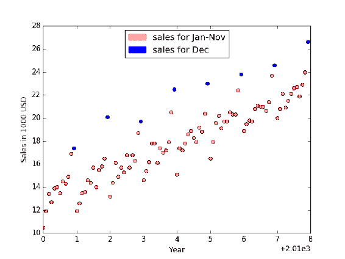
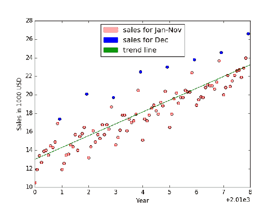
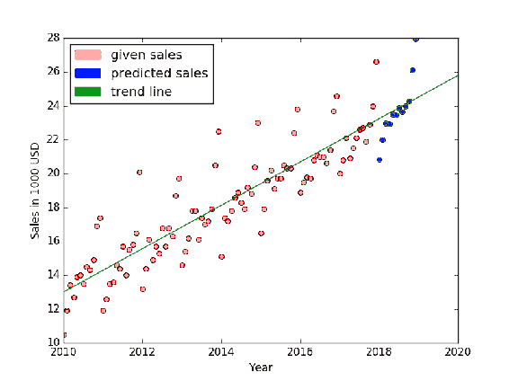
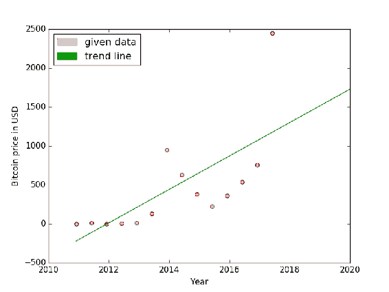
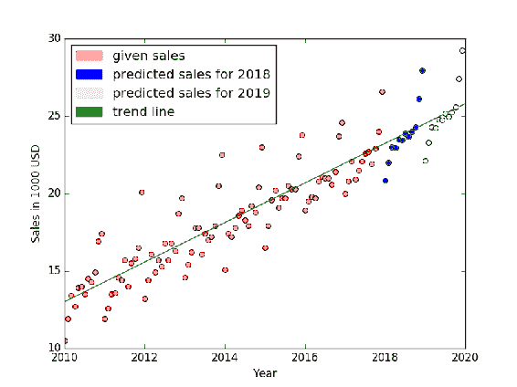

# 时间序列分析

时间序列分析是对时间依赖数据的分析。给定一段时间的数据，目的是预测不同时间段的数据，通常是未来的数据。例如，时间序列分析被用来预测金融市场、地震和天气。

在本章中，我们主要关注的是预测某些量的数值，例如，预测 2030 年的人口。

时间预测的主要元素如下：

+   **趋势**：随着时间的推移，变量是趋于上升还是下降？例如，人类人口是增长还是减少？

+   **季节性**：数据是否依赖于某些定期事件？例如，餐馆的利润在星期五比星期二要高吗？

将这两个时间序列分析元素结合起来，赋予我们一种强大的方法来进行时间依赖的预测。

在本章中，你将学习以下主题：

+   通过商业利润的例子，使用回归分析数据趋势

+   通过电子商店的销售例子，观察和分析数据中的季节性模式

+   通过电子商店销售的例子，你将学习如何将趋势分析和季节性分析结合起来，预测时间依赖的数据。

+   使用商业利润和电子商店销售的例子，在 Python 中创建时间依赖的模型

# 商业利润 – 分析趋势

我们希望预测 2018 年企业的利润，基于其前几年的利润：

| **年份** | **利润（美元）** |
| --- | --- |
| 2011 | $40,000 |
| 2012 | $43,000 |
| 2013 | $45,000 |
| 2014 | $50,000 |
| 2015 | $54,000 |
| 2016 | $57,000 |
| 2017 | $59,000 |
| 2018 | ? |

# 分析

在这个例子中，利润一直在增长，所以我们可以将利润看作是一个依赖于时间变量的增长函数，而时间变量用年份表示。各年份之间的利润变化分别为$3,000、$2,000、$5,000、$4,000、$3,000 和$2,000。这些差异似乎不受时间影响，而且它们之间的变化相对较小。因此，我们可以尝试通过进行线性回归来预测未来几年的利润。我们用线性方程表示利润*p*，它与年份*y*相关，也叫做趋势线：


我们可以通过线性回归找到常数*a*和*b*。

# 使用 Python 中的最小二乘法分析趋势

**输入**：

我们将前表中的数据存储在 Python 代码中的`year`和`profit`向量中：

```py
# source_code/7/profit_year.py #Predicting profit based on the year
import numpy as np
from scipy.linalg import lstsq

year = np.array([2011,2012,2013,2014,2015,2016,2017])
profit = np.array([40,43,45,50,54,57,59])

M = year[:, np.newaxis]**[0, 1]
model, _, _, _ = lstsq(M,profit)
print "Intercept =", model[0]
print "year coefficient =", model[1]
```

**输出**：

```py
$ python profit_year.py Intercept = -6711.571428570175
year coefficient = 3.3571428571422364
```

# 可视化

现在，我们将趋势线添加到图表中：


商业利润 - 数据分析

# 结论

该公司利润的趋势线方程如下：


从这个方程中，我们可以预测 2018 年的利润为：


这个示例很简单——我们仅通过对趋势线进行线性回归就能够做出预测。

在下一个示例中，我们将查看既受趋势又受季节性影响的数据。

# 电子商店的销售 – 分析季节性

我们有一个小型电子商店从 2010 年到 2017 年的每月销售数据，单位为千美元。我们想要预测 2018 年每个月的销售额：

| **月份/年份** | **2010** | **2011** | **2012** | **2013** | **2014** | **2015** | **2016** | **2017** | **2018** |
| --- | --- | --- | --- | --- | --- | --- | --- | --- | --- |
| 1 月 | 10.5 | 11.9 | 13.2 | 14.6 | 15.1 | 16.5 | 18.9 | 20 |  |
| 2 月 | 11.9 | 12.6 | 14.4 | 15.4 | 17.4 | 17.9 | 19.5 | 20.8 |  |
| 3 月 | 13.4 | 13.5 | 16.1 | 16.2 | 17.2 | 19.6 | 19.8 | 22.1 |  |
| 4 月 | 12.7 | 13.6 | 14.9 | 17.8 | 17.8 | 20.2 | 19.7 | 20.9 |  |
| 5 月 | 13.9 | 14.6 | 15.7 | 17.8 | 18.6 | 19.1 | 20.8 | 21.5 |  |
| 6 月 | 14 | 14.4 | 15.3 | 16.1 | 18.9 | 19.7 | 21.1 | 22.1 |  |
| 7 月 | 13.5 | 15.7 | 16.8 | 17.4 | 18.3 | 19.7 | 21 | 22.6 |  |
| 8 月 | 14.5 | 14 | 15.7 | 17 | 17.9 | 20.5 | 21 | 22.7 |  |
| 9 月 | 14.3 | 15.5 | 16.8 | 17.2 | 19.2 | 20.3 | 20.6 | 21.9 |  |
| 10 月 | 14.9 | 15.8 | 16.3 | 17.9 | 18.8 | 20.3 | 21.4 | 22.9 |  |
| 11 月 | 16.9 | 16.5 | 18.7 | 20.5 | 20.4 | 22.4 | 23.7 | 24 |  |
| 12 月 | 17.4 | 20.1 | 19.7 | 22.5 | 23 | 23.8 | 24.6 | 26.6 |  |

表格中的数据是以千美元为单位的销售额。

# 分析

为了能够分析这个问题，我们将首先绘制数据图表，以便观察模式并进行分析：



从图表和表格中，我们注意到，从长远来看，销售额呈线性增长。这是趋势。然而，我们也可以看到，12 月的销售额往往比其他任何月份都高。因此，我们有理由相信，销售额也受到月份的影响。

我们如何预测未来几年的月度销售额？首先，我们确定数据的确切长期趋势。然后，我们分析每个月的变化。

# 使用最小二乘法在 Python 中分析趋势

**输入**：

年份列表包含按小数表示的年份周期 *年+月/12*。销售列表包含对应周期的千美元销售额。我们将使用线性回归来建立趋势线。从初步图表中，我们观察到趋势呈线性：

```py
# source_code/6/sales_year.py
#Predicting sales based on the period in the year
import numpy as np
from scipy.linalg import lstsq

year = np.array([2010.000000, 2010.083333, 2010.166667, 2010.250000,
    2010.333333, 2010.416667, 2010.500000, 2010.583333,
    2010.666667, 2010.750000, 2010.833333, 2010.916667,
    2011.000000, 2011.083333, 2011.166667, 2011.250000,
    2011.333333, 2011.416667, 2011.500000, 2011.583333,
    2011.666667, 2011.750000, 2011.833333, 2011.916667,
    2012.000000, 2012.083333, 2012.166667, 2012.250000,
    2012.333333, 2012.416667, 2012.500000, 2012.583333,
    2012.666667, 2012.750000, 2012.833333, 2012.916667,
    2013.000000, 2013.083333, 2013.166667, 2013.250000,
    2013.333333, 2013.416667, 2013.500000, 2013.583333,
    2013.666667, 2013.750000, 2013.833333, 2013.916667,
    2014.000000, 2014.083333, 2014.166667, 2014.250000,
    2014.333333, 2014.416667, 2014.500000, 2014.583333,
    2014.666667, 2014.750000, 2014.833333, 2014.916667,
    2015.000000, 2015.083333, 2015.166667, 2015.250000,
    2015.333333, 2015.416667, 2015.500000, 2015.583333,
    2015.666667, 2015.750000, 2015.833333, 2015.916667,
    2016.000000, 2016.083333, 2016.166667, 2016.250000,
    2016.333333, 2016.416667, 2016.500000, 2016.583333,
    2016.666667, 2016.750000, 2016.833333, 2016.916667,
    2017.000000, 2017.083333, 2017.166667, 2017.250000,
    2017.333333, 2017.416667, 2017.500000, 2017.583333,
    2017.666667, 2017.750000, 2017.833333, 2017.916667])
sale = np.array([10.500000, 11.900000, 13.400000, 12.700000, 13.900000,
    14.000000, 13.500000, 14.500000, 14.300000, 14.900000,
    16.900000, 17.400000, 11.900000, 12.600000, 13.500000,
    13.600000, 14.600000, 14.400000, 15.700000, 14.000000,
    15.500000, 15.800000, 16.500000, 20.100000, 13.200000,
    14.400000, 16.100000, 14.900000, 15.700000, 15.300000,
    16.800000, 15.700000, 16.800000, 16.300000, 18.700000,
    19.700000, 14.600000, 15.400000, 16.200000, 17.800000, 
    17.800000, 16.100000, 17.400000, 17.000000, 17.200000,
    17.900000, 20.500000, 22.500000, 15.100000, 17.400000,
    17.200000, 17.800000, 18.600000, 18.900000, 18.300000,
    17.900000, 19.200000, 18.800000, 20.400000, 23.000000,
    16.500000, 17.900000, 19.600000, 20.200000, 19.100000,
    19.700000, 19.700000, 20.500000, 20.300000, 20.300000, 
    22.400000, 23.800000, 18.900000, 19.500000, 19.800000,
    19.700000, 20.800000, 21.100000, 21.000000, 21.000000,
    20.600000, 21.400000, 23.700000, 24.600000, 20.000000,
    20.800000, 22.100000, 20.900000, 21.500000, 22.100000,
    22.600000, 22.700000, 21.900000, 22.900000, 24.000000,
    26.600000])

M = year[:, np.newaxis]**[0, 1]
model, _, _, _ = lstsq(M,sale)
print "Intercept =", model[0]
print "year coefficient =", model[1]
```

**输出**：

```py
$ python sales_year.py Intercept = -2557.777649371433
year coefficient = 1.2789880745818643
```

因此，趋势线的方程如下：


# 可视化

现在，我们将趋势线添加到图表中：



# 分析季节性

现在，我们可以分析季节性——即数据如何随着月份变化。从我们的观察中，我们知道在某些月份，销售额往往较高，而在其他月份，销售额则较低。我们评估线性趋势与实际销售额之间的差异。根据这些差异中的模式，我们构建了一个季节性模型，以便更准确地预测每个月的销售额：

| **一月销售额** |  |  |  |  |  |  |  |  |  |
| --- | --- | --- | --- | --- | --- | --- | --- | --- | --- |
| 年份 | 2010 | 2011 | 2012 | 2013 | 2014 | 2015 | 2016 | 2017 | 平均值 |
| 实际销售额 | 10.5 | 11.9 | 13.2 | 14.6 | 15.1 | 16.5 | 18.9 | 20 |  |
| 趋势线上的销售额 | 13.012 | 14.291 | 15.57 | 16.849 | 18.128 | 19.407 | 20.686 | 21.965 |  |
| 差异 | -2.512 | -2.391 | -2.37 | -2.249 | -3.028 | -2.907 | -1.786 | -1.965 | -2.401 |
|  |  |  |  |  |  |  |  |  |  |
| **二月销售额** |  |  |  |  |  |  |  |  |  |
| 年份 | 2010 | 2011 | 2012 | 2013 | 2014 | 2015 | 2016 | 2017 | 平均值 |
| 实际销售额 | 11.9 | 12.6 | 14.4 | 15.4 | 17.4 | 17.9 | 19.5 | 20.8 |  |
| 趋势线上的销售额 | 13.1185833333 | 14.3975833333 | 15.6765833333 | 16.9555833333 | 18.2345833333 | 19.5135833333 | 20.7925833333 | 22.0715833333 |  |
| 差异 | -1.2185833333 | -1.7975833333 | -1.2765833333 | -1.5555833333 | -0.8345833333 | -1.6135833333 | -1.2925833333 | -1.2715833333 | -1.3575833333 |
|  |  |  |  |  |  |  |  |  |  |
| **三月销售额** |  |  |  |  |  |  |  |  |  |
| 年份 | 2010 | 2011 | 2012 | 2013 | 2014 | 2015 | 2016 | 2017 | 平均值 |
| 实际销售额 | 13.4 | 13.5 | 16.1 | 16.2 | 17.2 | 19.6 | 19.8 | 22.1 |  |
| 趋势线上的销售额 | 13.2251666667 | 14.5041666667 | 15.7831666667 | 17.0621666667 | 18.3411666667 | 19.6201666667 | 20.8991666667 | 22.1781666667 |  |
| 差异 | 0.1748333333 | -1.0041666667 | 0.3168333333 | -0.8621666667 | -1.1411666667 | -0.0201666667 | -1.0991666667 | -0.0781666667 | -0.4641666667 |
|  |  |  |  |  |  |  |  |  |  |
| **四月销售额** |  |  |  |  |  |  |  |  |  |
| 年份 | 2010 | 2011 | 2012 | 2013 | 2014 | 2015 | 2016 | 2017 | 平均值 |
| 实际销售额 | 12.7 | 13.6 | 14.9 | 17.8 | 17.8 | 20.2 | 19.7 | 20.9 |  |
| 趋势线上的销售额 | 13.33175 | 14.61075 | 15.88975 | 17.16875 | 18.44775 | 19.72675 | 21.00575 | 22.28475 |  |
| 差异 | -0.63175 | -1.01075 | -0.98975 | 0.63125 | -0.64775 | 0.47325 | -1.30575 | -1.38475 | -0.60825 |
|  |  |  |  |  |  |  |  |  |  |
| **五月销售额** |  |  |  |  |  |  |  |  |  |
| 年份 | 2010 | 2011 | 2012 | 2013 | 2014 | 2015 | 2016 | 2017 | 平均值 |
| 实际销售额 | 13.9 | 14.6 | 15.7 | 17.8 | 18.6 | 19.1 | 20.8 | 21.5 |  |
| 趋势线上的销售额 | 13.4383333333 | 14.7173333333 | 15.9963333333 | 17.2753333333 | 18.5543333333 | 19.8333333333 | 21.1123333333 | 22.3913333333 |  |
| 差异 | 0.4616666667 | -0.1173333333 | -0.2963333333 | 0.5246666667 | 0.0456666667 | -0.7333333333 | -0.3123333333 | -0.8913333333 | -0.1648333333 |
|  |  |  |  |  |  |  |  |  |  |
| **六月销售** |  |  |  |  |  |  |  |  |  |
| 年份 | 2010 | 2011 | 2012 | 2013 | 2014 | 2015 | 2016 | 2017 | 平均 |
| 实际销售 | 14 | 14.4 | 15.3 | 16.1 | 18.9 | 19.7 | 21.1 | 22.1 |  |
| 趋势线上的销售 | 13.5449166667 | 14.8239166667 | 16.1029166667 | 17.3819166667 | 18.6609166667 | 19.9399166667 | 21.2189166667 | 22.4979166667 |  |
| 差异 | 0.4550833333 | -0.4239166667 | -0.8029166667 | -1.2819166667 | 0.2390833333 | -0.2399166667 | -0.1189166667 | -0.3979166667 | -0.3214166667 |
|  |  |  |  |  |  |  |  |  |  |
| **七月销售** |  |  |  |  |  |  |  |  |  |
| 年份 | 2010 | 2011 | 2012 | 2013 | 2014 | 2015 | 2016 | 2017 | 平均 |
| 实际销售 | 13.5 | 15.7 | 16.8 | 17.4 | 18.3 | 19.7 | 21 | 22.6 |  |
| 趋势线上的销售 | 13.6515 | 14.9305 | 16.2095 | 17.4885 | 18.7675 | 20.0465 | 21.3255 | 22.6045 |  |
| 差异 | -0.1515 | 0.7695 | 0.5905 | -0.0885 | -0.4675 | -0.3465 | -0.3255 | -0.0045 | -0.003 |
|  |  |  |  |  |  |  |  |  |  |
| **八月销售** |  |  |  |  |  |  |  |  |  |
| 年份 | 2010 | 2011 | 2012 | 2013 | 2014 | 2015 | 2016 | 2017 | 平均 |
| 实际销售 | 14.5 | 14 | 15.7 | 17 | 17.9 | 20.5 | 21 | 22.7 |  |
| 趋势线上的销售 | 13.7580833333 | 15.0370833333 | 16.3160833333 | 17.5950833333 | 18.8740833333 | 20.1530833333 | 21.4320833333 | 22.7110833333 |  |
| 差异 | 0.7419166667 | -1.0370833333 | -0.6160833333 | -0.5950833333 | -0.9740833333 | 0.3469166667 | -0.4320833333 | -0.0110833333 | -0.3220833333 |
|  |  |  |  |  |  |  |  |  |  |
| **九月销售** |  |  |  |  |  |  |  |  |  |
| 年份 | 2010 | 2011 | 2012 | 2013 | 2014 | 2015 | 2016 | 2017 | 平均 |
| 实际销售 | 14.3 | 15.5 | 16.8 | 17.2 | 19.2 | 20.3 | 20.6 | 21.9 |  |
| 趋势线上的销售 | 13.8646666667 | 15.1436666667 | 16.4226666667 | 17.7016666667 | 18.9806666667 | 20.2596666667 | 21.5386666667 | 22.8176666667 |  |
| 差异 | 0.4353333333 | 0.3563333333 | 0.3773333333 | -0.5016666667 | 0.2193333333 | 0.0403333333 | -0.9386666667 | -0.9176666667 | -0.1161666667 |
|  |  |  |  |  |  |  |  |  |  |
| **十月销售** |  |  |  |  |  |  |  |  |  |
| 年份 | 2010 | 2011 | 2012 | 2013 | 2014 | 2015 | 2016 | 2017 | 平均 |
| 实际销售 | 14.9 | 15.8 | 16.3 | 17.9 | 18.8 | 20.3 | 21.4 | 22.9 |  |
| 趋势线上的销售 | 13.97125 | 15.25025 | 16.52925 | 17.80825 | 19.08725 | 20.36625 | 21.64525 | 22.92425 |  |
| 差异 | 0.92875 | 0.54975 | -0.22925 | 0.09175 | -0.28725 | -0.06625 | -0.24525 | -0.02425 | 0.08975 |
|  |  |  |  |  |  |  |  |  |  |
| **十一月销售** |  |  |  |  |  |  |  |  |  |
| 年份 | 2010 | 2011 | 2012 | 2013 | 2014 | 2015 | 2016 | 2017 | 平均 |
| 实际销售 | 16.9 | 16.5 | 18.7 | 20.5 | 20.4 | 22.4 | 23.7 | 24 |  |
| 趋势线上的销售 | 14.0778333333 | 15.3568333333 | 16.6358333333 | 17.9148333333 | 19.1938333333 | 20.4728333333 | 21.7518333333 | 23.0308333333 |  |
| 差异 | 2.8221666667 | 1.1431666667 | 2.0641666667 | 2.5851666667 | 1.2061666667 | 1.9271666667 | 1.9481666667 | 0.9691666667 | 1.8331666667 |
|  |  |  |  |  |  |  |  |  |  |
| **12 月销售额** |  |  |  |  |  |  |  |  |  |
| 年份 | 2010 | 2011 | 2012 | 2013 | 2014 | 2015 | 2016 | 2017 | 平均 |
| 实际销售额 | 17.4 | 20.1 | 19.7 | 22.5 | 23 | 23.8 | 24.6 | 26.6 |  |
| 趋势线上的销售额 | 14.1844166667 | 15.4634166667 | 16.7424166667 | 18.0214166667 | 19.3004166667 | 20.5794166667 | 21.8584166667 | 23.1374166667 |  |
| 差异 | 3.2155833333 | 4.6365833333 | 2.9575833333 | 4.4785833333 | 3.6995833333 | 3.2205833333 | 2.7415833333 | 3.4625833333 | 3.5515833333 |

我们无法观察到实际销售额与趋势线销售额之间的差异有任何明显的趋势。因此，我们仅计算每个月这些差异的算术平均值。

例如，我们注意到，12 月的销售额通常比趋势线预测的销售额高出大约 3,551.58 美元。类似地，1 月的销售额通常较低，平均低于趋势线预测的销售额约 2,401 美元。

假设月份对实际销售额有影响，这是根据我们观察到的不同月份销售额的变化来得出的，我们采用以下预测规则：


然后我们将其更新为新的规则：


这里，*sales* 是所选月份和年份的销售额预测值，*month_difference* 是我们在给定数据中实际销售额与趋势线销售额之间的平均差异。更具体地说，我们得到以下 12 个方程和 2018 年的销售额预测（单位：千美元）：


# 结论

该表格包含了 2018 年基于前面季节性方程的销售数据。

我们可以将预测的数据可视化为图形：



# 总结

本章中，我们研究了时间依赖数据的分析。此分析中最重要的两个因素是趋势和季节性。

趋势分析可以看作是确定数据分布的函数。利用数据依赖于时间这一事实，可以通过回归来确定该函数。许多现象有线性趋势线，而其他现象可能不遵循线性模式。

我们还了解到，季节性分析试图发现时间中反复出现的规律模式，例如圣诞节前的销售增加。为了检测季节性模式，必须将数据划分为不同的季节，以便模式在同一季节中重复出现。此划分可以将一年分为月份，一周分为天数或工作日和周末等。合理的季节划分和对这些季节中的模式分析是良好季节性分析的关键。

一旦趋势和季节性在数据中被分析完，结合的结果就是对时间依赖数据在未来将遵循的模式的预测。

本章介绍了本书中呈现的最后一种数据分析方法。在本章之后，您可以找到关于统计学、Python 编程语言概念以及数据科学中算法和方法的参考资料。

# 问题

**问题 1**：**确定比特币价格的趋势**：

a) 我们给出了一个包含 2010-2017 年比特币价格（美元）的表格。请确定这些价格的线性趋势线。每月价格取自每个月的第一天：

| 日期：年-月-日 | 比特币价格（美元） |
| --- | --- |
| 2010-12-01 | 0.23 |
| 2011-06-01 | 9.57 |
| 2011-12-01 | 3.06 |
| 2012-06-01 | 5.27 |
| 2012-12-01 | 12.56 |
| 2013-06-01 | 129.3 |
| 2013-12-01 | 946.92 |
| 2014-06-01 | 629.02 |
| 2014-12-01 | 378.64 |
| 2015-06-01 | 223.31 |
| 2015-12-01 | 362.73 |
| 2016-06-01 | 536.42 |
| 2016-12-01 | 753.25 |
| 2017-06-01 | 2,452.18 |

b) 根据 a)部分的线性趋势线，预计 2020 年比特币的价格是多少？

c) 讨论线性趋势线是否适合作为预测比特币未来价格的良好指标。

**问题 2**：**电子商店销售：** 使用电子商店销售示例中的数据，预测 2019 年每个月的销售情况。

# 分析

**问题 1**：

输入：

```py
source_code/7/year_bitcoin.py #Determining a linear trend line for Bitcoin
import numpy as np
from scipy.linalg import lstsq

year = np.array([2010.91666666666, 2011.41666666666, 2011.91666666666,
             2012.41666666666, 2012.91666666666, 2013.41666666666,
             2013.91666666666, 2014.41666666666, 2014.91666666666,
             2015.41666666666, 2015.91666666666, 2016.41666666666,
             2016.91666666666, 2017.41666666666])
btc_price = np.array([0.23, 9.57, 3.06, 5.27, 12.56, 129.3, 946.92, 629.02,
                378.64, 223.31, 362.73, 536.42, 753.25, 2452.18])

M = year[:, np.newaxis]**[0, 1]
model, _, _, _ = lstsq(M,btc_price)
print "Intercept =", model[0]
print "year coefficient =", model[1]
```

输出：

```py
$ python year_bitcoin.py Intercept = -431962.903846178
year coefficient = 214.69081318682586
```

趋势线：

从 Python 代码的输出中，我们发现比特币美元价格的线性趋势线如下：


这为我们提供了以下趋势线图：



根据趋势线，预计 2020 年 1 月 1 日比特币的价格为 1,731.10 美元。

线性趋势线可能不是比特币价格的一个良好指标或预测工具。这是因为有许多因素在起作用，而且比特币价格有可能呈现出技术趋势中常见的指数性增长。例如，Facebook 活跃用户的数量和低于 1000 美元的最佳消费类 CPU 中的晶体管数量。

有三个重要因素可能促使比特币的指数型采用，从而推动其价格上涨：

+   **技术成熟度（可扩展性）**：每秒交易数量可以确保即时转账，即使许多人使用比特币进行收付款。

+   **稳定性**：一旦卖家不再害怕因收到比特币付款而失去利润，他们会更加愿意接受比特币作为货币。

+   **用户友好性**：一旦普通用户能够自然地进行比特币的收付款，就不会有技术障碍，使用比特币就像使用他们习惯的任何其他货币一样。

要分析比特币的价格，我们必须考虑更多的数据，并且很可能其价格不会遵循线性趋势。

**问题 2**：我们使用示例中的 12 个公式，每个月一个，来预测 2019 年每个月的销售额：

*sales_january = 1.279*(year+0/12) - 2557.778 - 2.401*

*= 1.279*(2019 + 0/12) - 2557.778 - 2.401 = 22.122*

*sales_february = 1.279*(2019+1/12) - 2557.778 - 1.358 = 23.272*

*sales_march = 1.279*(2019+2/12) - 2557.778 - 0.464 = 24.272*

*sales_april = 1.279*(2019+3/12) - 2557.778 - 0.608 = 24.234*

*sales_may = 1.279*(2019+4/12) - 2557.778 - 0.165 = 24.784*

*sales_june = 1.279*(2019+5/12) - 2557.778 - 0.321 = 24.735*

*sales_july = 1.279*(2019+6/12) - 2557.778 - 0.003 = 25.160*

*sales_august = 1.279*(2019+7/12) - 2557.778 - 0.322 = 24.947*

*sales_september = 1.279*(2019+8/12) - 2557.778 - 0.116 = 25.259*

*sales_october = 1.279*(2019+9/12) - 2557.778 + 0.090 = 25.572*

*sales_november = 1.279*(2019+10/12) - 2557.778 + 1.833 = 27.422*

*sales_december = 1.279*(2019+11/12) - 2557.778 + 3.552 = 29.247*



电子商店销售额 - 数据分析
