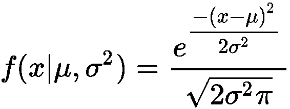
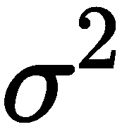
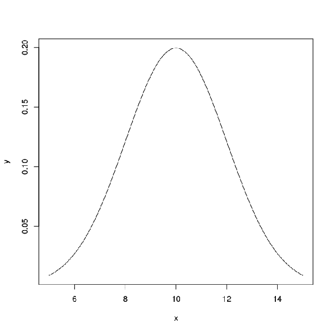

# 统计学

# 基本概念

**符号**

两个集合*A*和*B*的交集，表示为*A ∩ B*，是集合*A*或*B*的一个子集，包含所有在*A*和*B*中都有的元素。换句话说，*A ∩ B := { x : x in A and x in B}*。

两个集合*A*和 B 的并集，表示为*A ∪ B*，是一个包含所有在*A*中或在*B*中的元素的集合。换句话说，*A ∪ B := { x : x in A or x in B}*。

两个集合*A*和*B*的差集，表示为*A – B*或*A\B*，是集合*A*的一个子集，其中包含所有在*A*中但不在*B*中的元素。换句话说，*A – B := { x : x in A and x not in B}*。

求和符号∑表示集合中所有成员的和，例如：

**定义与术语**

+   **总体**：一组相似的数据或项，用于分析。

+   **样本**：总体的一个子集。

+   **一组的算术平均数**：一组中所有值的总和除以该组的大小。

+   **中位数**：一个有序集合中的中间值，例如，集合*{x1, …, x2k+1}*的中位数，其中*x1 <…< x2k+1* 是值*xk+1*。

+   **随机变量**：从可能结果集合（例如，正面或反面）到值集合（例如，正面为 0，反面为 1）的一个函数。

+   **期望**：随机变量的期望是随机变量给定的值的增加集的平均值的极限。

+   **方差**：衡量总体与其均值之间的离散程度。从数学角度来看，随机变量*X*的方差是随机变量与其均值*μ*之差的平方的期望值，即 。

+   **标准差**：随机变量*X*的偏差是*X*变量变化的平方根，即 。

+   **相关性**：随机变量之间依赖关系的度量。从数学角度来看，随机变量*X*和*Y*之间的相关性定义为 。

+   **因果关系**：通过发生一个现象来解释另一个现象的依赖关系。因果关系意味着相关性，但相关性不一定意味着因果关系！

+   **斜率**：线性方程*y=a*x+b*中的*a*变量。

+   **截距**：线性方程*y=a*x+b*中的*b*变量。

# 贝叶斯推断

设*P(A)*和*P(B)*分别为*A*和*B*的概率，*P(A|B)*为在给定*B*的条件下*A*的条件概率，*P(B|A)*为在给定*A*的条件下*B*的概率。

然后，贝叶斯定理给出了以下公式：

*P(A|B)=(P(B|A) * P(A))/P(B)*

# 分布

概率分布是一个从可能结果集合（例如，正面和反面）到这些结果的概率集合（即，正面和反面各 50%）的函数。

# 正态分布

许多自然现象的随机变量可以通过正态分布来建模。正态分布具有以下概率密度：

其中，μ是分布的均值，是分布的方差。正态分布的图形呈钟形曲线；例如，参见以下均值为 10、标准差为 2 的正态分布图：

均值为 10，标准差为 2 的正态分布

# 交叉验证

交叉验证是一种验证数据假设的方法。在分析过程开始时，数据被划分为学习数据和测试数据。一个假设被拟合到学习数据上，然后其实际误差在测试数据上进行测量。通过这种方式，我们可以估计假设在未来数据上的表现。减少学习数据的数量也有好处，因为它可以减少假设过拟合的机会。这是指假设被训练到数据的特别狭窄子集上。

# K 折交叉验证

原始数据随机分成*k*个子集。一个子集用于验证，剩余的*k*-1 个子集用于假设训练。

# A/B 测试

A/B 测试是对数据的两个假设进行验证——通常是在真实数据上进行。然后，选择具有更好结果（更低估计误差）的假设作为未来数据的估计器。
