# Anaconda 中的监督学习

由于我们大多数人都理解函数*y=f(x)*的格式，因此使用它来解释监督学习是一个不错的主意。当有了* y *和* x *时，我们可以进行各种回归分析，以识别正确的函数形式。这就是监督学习的精髓。对于监督学习，我们有两个数据集：**训练数据**和**测试数据**。通常，训练集包含一组输入变量，如* x *，以及相关的输出值，如* y *（即监督信号）。监督学习算法分析训练数据并生成推断的函数形式。然后，我们将这个推断的函数应用于映射我们的测试数据集。

本章将涵盖以下主题：

+   监督学习概览

+   分类

+   通过 R、Python、Julia 和 Octave 实现监督学习

+   R 中的机器学习任务视图

# 监督学习概览

在上一章中，我们讨论了无监督学习，其中我们只有输入数据。就函数* y = f(x)*而言，对于无监督学习，我们只有输入* x *。与无监督学习不同，监督学习有输入* x *和相应的输出* y *。我们的任务是基于训练数据集找到最佳的函数，将* x *与* y *联系起来。在监督学习中，我们的训练数据集包含一个输入对象，通常是一个向量，以及一个期望的输出值，可以是二进制、分类、离散或连续的。监督学习算法检查给定的训练数据集，并生成推断的最佳拟合函数。为了验证这个推断的函数的准确性，我们使用第二个数据集——测试集。

在理想情况下，我们希望拥有一个大的样本量。然而，在很多情况下，情况并非如此。在这些情况下，我们可以应用自助法（bootstrap）来估计统计量。**自助聚合（Bootstrap Aggregation）**算法用于从单个训练数据集中创建多个不同的模型。实际上，随机森林就是通过*袋装法（bagging）*将多个决策树集成的一个别名。正因如此，它最终形成了一个非常强大的分类器。

我们以著名的“泰坦尼克号”悲剧为例。1912 年，泰坦尼克号在处女航行中撞上冰山沉没，超过 1500 名乘客和船员丧生。首先，让我们看一下这个简单的数据集。以下的 R 代码可以从作者的网站下载：[`canisius.edu/~yany/RData/titanic.RData`](http://canisius.edu/~yany/RData/titanic.RData)：

```py
> path<-"http://canisius.edu/~yany/RData/" 
> dataSet<-"titanic" 
> link<-paste(path,dataSet,".RData",sep='') 
> con<-url(link) 
> load(con)  
> dim(.titanic) 
[1] 2201    4 
> head(.titanic) 
 CLASS   AGE GENDER SURVIVED 
1 First Adult   Male      Yes 
2 First Adult   Male      Yes 
3 First Adult   Male      Yes 
4 First Adult   Male      Yes 
5 First Adult   Male      Yes 
6 First Adult   Male      Yes 
> summary(.titanic) 
 CLASS        AGE          GENDER     SURVIVED   
 Crew  :885   Adult:2092   Female: 470   No :1490   
 First :325   Child: 109   Male  :1731   Yes: 711   
 Second:285                                         
 Third :706   
```

从之前的输出中可以看到，该数据集包含`2,201`条观测值，且仅有`4`个变量。`CLASS`表示舱位或经济状态，`GENDER`表示性别，`SURVIVED`表示乘客是否幸存。`unique()`函数可以显示它们的唯一值，如下所示：

```py
> unique(.titanic$CLASS) 
[1] First  Second Third  Crew   
Levels: Crew First Second Third
> unique(.titanic$GENDER) 
[1] Male   Female 
Levels: Female Male 
> unique(.titanic$SURVIVED) 
[1] Yes No  
Levels: No Yes
```

我们的任务是使用决策树来找出这三个输入变量对生还率的贡献。让我们使用名为`Rattle`的 R 包，通过使用内置数据集来运行一个简单的决策树模型。要启动`Rattle`包，我们可以使用以下两行代码：

```py
>library(rattle) 
>rattle() 
```

下一个截图展示了如何选择一个库和相关数据集。请注意，根据版本的不同，数据集可能不可用。另一种方式是从作者的网页下载：[`canisius.edu/~yany/RData/titanic.RData`](http://canisius.edu/~yany/RData/titanic.RData)。默认的分割设置是 70%（训练集）、15%（验证集）和 15%（测试集）：

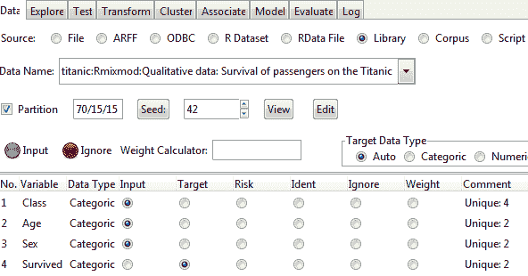

如果我们选择模型 | 树，然后在左上角点击执行，我们将得到以下结果：

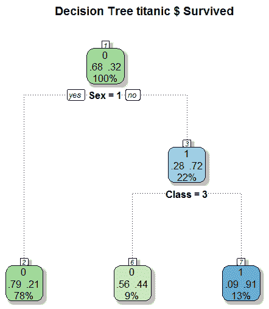

**68%**的最高比例代表未生还者，而**32%**则代表幸存率。第一个问题是乘客是否为男性。如果答案是肯定的，那么这个人将有**21%**的生还机会，显示在左下叶子上。对于预定了**3 级舱**的女性乘客，她将有**44%**的生还机会。对于女性乘客，当她们占据一等或二等舱时，她们的生还机会将高达**91%**。由于年龄没有出现在我们的最终结果中，模型认为它没有用。

请注意，如果你打算使用名为`.titanic`的加载数据集，你可以使用`x<-.titanic`，然后在 Rattle 启动后选择 R 数据集。对于具有更多变量的不同相关数据集，用户得出不同结论并不奇怪。你可以保存日志，即代码，以供日后使用。简化的代码如下所示。日志位于 Rattle 菜单栏：

```py
library(rpart, quietly=TRUE) 
con<-url("http://canisius.edu/~yany/RData/titanic.RData") 
load(con) 
x<-.titanic 
scoring  <- FALSE 
set.seed(42) 
risk<-ident<-ignore<-weights<-numeric<-NULL 
str(dataset) 
n<- nrow(dataset) 
train  <- sample <- sample(n,0.7*n) 
validate<- sample(setdiff(seq_len(n),train),0.15*n) 
test<- setdiff(setdiff(seq_len(n), train), validate) 
inputVars<-categoric<-c("CLASS","AGE","GENDER") 
target<-"SURVIVED"
output<-rpart(SURVIVED~.,data=x[train, c(inputVars, target)], 
   method="class",parms=list(split="information"),control= 
   rpart.control(usesurrogate=0,maxsurrogate=0)) 
fancyRpartPlot(output, main="Decision Tree for Titanic") 
```

第二个示例与名为`iris`的数据集相关。这一次，使用的编程语言是 Python。首先，让我们查看数据本身。代码和相关输出如下所示：

```py
import sklearn as sk 
from sklearn import datasets 
iris = datasets.load_iris() 
print("data:n",iris.data[0:4,]) 
print("target",iris.target[0:2,]) 
mylist=list(iris.target) 
used = [] 
[x for x in mylist if x not in used and used.append(x)] 
print("unique values for targetsn",used) 
```

输出将如下所示：

```py
data: 
 [[ 5.1  3.5  1.4  0.2] 
 [ 4.9  3\.   1.4  0.2] 
 [ 4.7  3.2  1.3  0.2] 
 [ 4.6  3.1  1.5  0.2]] 
target [0 0] 
unique values for targets 
 [0, 1, 2] 
```

数据集有五个变量：花萼长度、花萼宽度、花瓣长度、花瓣宽度（均为厘米），以及类别。最后一个变量有三个唯一值，分别为 Setosa、Versicolour 和 Virginica；更多信息请参见[`archive.ics.uci.edu/ml/datasets/Iris`](https://archive.ics.uci.edu/ml/datasets/Iris)。原始数据集的前几行如下所示：


数据集可以从 UCI 机器学习库下载：[`archive.ics.uci.edu/ml/machine-learning-databases/iris/iris.data`](https://archive.ics.uci.edu/ml/machine-learning-databases/iris/iris.data)。首先，我们将数据集切分为训练集和测试集。然后，使用监督学习来找出映射函数，即推断函数：

```py
import numpy as np
from sklearn import datasets
from sklearn.neighbors import KNeighborsClassifier as KNC
iris = datasets.load_iris()
x= iris.data
y= iris.target
np.unique(y)
np.random.seed(123)
indices = np.random.permutation(len(x))
iris_x_train = x[indices[:-10]]
iris_y_train = y[indices[:-10]]
iris_x_test = x[indices[-10:]]
iris_y_test = y[indices[-10:]]
knn = KNC()
knn.fit(iris_x_train, iris_y_train)
KNC(algorithm='auto',leaf_size=30, metric='minkowski',
metric_params=None,n_jobs=1,n_neighbors=5, p=2,weights='uniform')
knn.predict(iris_x_test)
out=knn.predict(iris_x_test)
print("predicted:",out)
print("True :",iris_y_test)
```

输出如下所示：

```py
predicted: [1 1 2 1 2 0 1 1 2 2] 
True     : [1 1 2 2 1 0 1 1 2 2] 
```

# 分类

监督学习问题可以进一步分为两类：**分类**和**回归**。对于分类问题，输出变量（如*y*）可以是二元变量，即 0 或 1，或多个类别。对于回归问题，变量或值可以是离散的或连续的。在泰坦尼克号的例子中，1 表示生还，0 表示未生还。对于回归问题，输出可能是一个值，例如 2.5 或 0.234。在上一章中，我们讨论了同一组内成员之间的距离以及不同组之间的距离概念。

分类的逻辑是，同组成员之间的距离比不同组之间的距离要短。换句话说，同组成员之间的相似度高于不同组或类别之间的相似度。由于类别数据无法排序，我们可以使用以下方法对其进行分组：


这里，*n[matched]* 是匹配的治疗数，*n[total]* 是治疗总数。当同时有类别数据和数值数据时，我们可以首先估算两种类型的距离，然后选择适当的权重来将它们组合起来。

假设*d[num]* 是基于数值数据的距离，*d[cat]* 是基于类别数据的距离。那么，我们得到以下的综合距离：


这里，*w[num]* 是数值的权重。

# k-最近邻算法

在模式识别或分组中，**k-最近邻**（**k-NN**）算法是一种用于分类和回归的非参数方法。对于这两种情况，输入由特征空间中 k 个最接近的训练样本组成。以下四行 R 代码尝试通过使用名为`iris`的数据集将植物分成 k 组：

```py
library(ggvis) 
x<-ggvis 
y<-layer_points 
iris %>% x(~Petal.Length,~Petal.Width,fill=~Species) %>% y() 
```

图表显示如下：

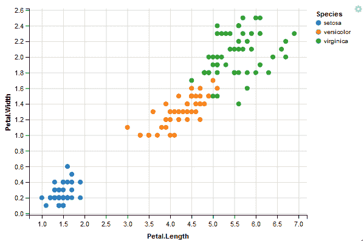

以下图显示了五个最近邻：


这里给出了由五个最近邻生成的代码。该代码稍微修改自其他人提供的代码，来源于[`stats.stackexchange.com/questions/21572/how-to-plot-decision-boundary-of-a-k-nearest-neighbor-classifier-from-elements-o/21602#21602`](https://stats.stackexchange.com/questions/21572/how-to-plot-decision-boundary-of-a-k-nearest-neighbor-classifier-from-elements-o/21602#21602)：

```py
library(ElemStatLearn) 
require(class) 
x <- mixture.example$x 
y <- mixture.example$y 
xnew <- mixture.example$xnew 
px1 <- mixture.example$px1 
px2 <- mixture.example$px2 
# 
color1<-"blue" 
color2<-"pink3" 
kNearest<-5   
model<- knn(x, xnew,y,k=kNearest,prob=TRUE) 
title<-paste(kNearest,"-nearest neighbour") 
prob <- attr(model,"prob") 
prob <- ifelse(model=="1",prob,1-prob) 
prob15 <- matrix(prob,length(px1),length(px2)) 
par(mar=rep(2,4)) 
contour(px1,px2,prob15,levels=0.5,main=title,axes=FALSE) 
points(x, col=ifelse(g==1,color1,color2)) 
gd <- expand.grid(x=px1, y=px2) 
points(gd,pch=".",cex=1.5,col=ifelse(prob15>0.5,color1,color2)) 
box() 
```

关于每个函数的更多详细信息，读者可以查阅`ElemStatLearn`包的相关手册。

# 贝叶斯分类器

这是一种基于贝叶斯定理的分类技术，假设预测变量之间相互独立。通俗来说，朴素贝叶斯分类器假设某个特征在某一类别中的出现与该类别中其他特征的出现无关。首先，让我们来看一下`HouseVotes84`数据集：

```py
> library(mlbench)
> data(HouseVotes84)
> head(HouseVotes84)
```

输出如下所示：


第一个变量 `Class` 是二元的：`republican` 或 `democrat`。此外，我们有与每个个体相关的 16 个特征。以下程序调用了 `naiveBayes()` 函数，利用贝叶斯规则计算给定独立预测变量时，分类类变量的条件后验概率：

```py
library(e1071) 
data(HouseVotes84, package = "mlbench") 
model<-naiveBayes(Class ~ ., data = HouseVotes84) 
# 
predict(model, HouseVotes84[1:10,]) 
predict(model, HouseVotes84[1:10,], type = "raw") 
pred <- predict(model, HouseVotes84) 
table(pred, HouseVotes84$Class) 
```

最终输出如下所示：

```py
pred         democrat   republican 
democrat        238       13 
republican      29        155 
```

下一个示例是通过应用朴素贝叶斯方法来预测泰坦尼克号数据集的生还率：

```py
> library(e1071) 
> data(Titanic) 
> m <- naiveBayes(Survived ~ ., data = Titanic) 
> output<-predict(m, as.data.frame(Titanic)) 
```

输出如下所示：

```py
> print(m) 
Naive Bayes Classifier for Discrete Predictors 
Call: 
naiveBayes.formula(formula = Survived ~ ., data = Titanic) 
A-priori probabilities: 
Survived 
      No      Yes  
0.676965 0.323035  
Conditional probabilities: 
        Class 
Survived        1st        2nd        3rd       Crew 
     No  0.08187919 0.11208054 0.35436242 0.45167785 
     Yes 0.28551336 0.16596343 0.25035162 0.29817159 
        Sex 
Survived       Male     Female 
     No  0.91543624 0.08456376 
     Yes 0.51617440 0.48382560 
        Age 
Survived      Child      Adult 
     No  0.03489933 0.96510067 
     Yes 0.08016878 0.91983122 
> print(output) 
[1] Yes No  No  No  Yes Yes Yes Yes No  No  No  No  Yes Yes 
[15] Yes Yes Yes No  No  No  Yes Yes Yes Yes No  No  No  No  
[29] Yes Yes Yes Yes 
Levels: No Yes 
```

从前面的输出中，我们可以找到关于 32 个个体的最终预测。

# 强化学习

强化学习是机器学习的一个精彩研究领域，它起源于行为心理学。其机制是在一组环境中采取某些行动时，最大化某种累积奖励的概念（也就是说，智能体通过在动态环境设置中的反复试验与互动来学习最优行为）。

让我们使用一个叫做 `ReinforcementLearning` 的 R 包。首先，查看如下数据集：

```py
> library("ReinforcementLearning") 
> set.seed(123) 
> data <- sampleGridSequence(1000) 
> dim(data) 
[1] 1000    4 
> head(data) 
  State Action Reward NextState 
1    s2   left     -1        s2 
2    s4  right     -1        s4 
3    s2   down     -1        s2 
4    s4     up     -1        s4 
5    s4     up     -1        s4 
6    s1   left     -1        s1 
> unique(data$State) 
[1] "s2" "s4" "s1" "s3" 
> unique(data$Action) 
[1] "left"  "right" "down"  "up"    
> unique(data$NextState) 
[1] "s2" "s4" "s1" "s3" 
> unique(data$Reward) 
[1] -1 10  
```

调用的函数 `sampleGridSequence()` 用于生成 *n* 个观测值。`State` 和 `NextState` 变量有四个独特的值：`s1`、`s2`、`s3` 和 `s4`。变量 `Action` 有四个值：`left`、`right`、`down` 和 `up`。变量 `Award` 有两个独特的值 `-1` 和 `10`，我们可以将 `-1` 视为惩罚，将 `10` 视为奖励。对于第一个观测，如果当前状态和下一个状态是 `s2`，我们的动作是 `left`，那么我们将遭受 `-1` 的惩罚。以下结果显示，如果下一个状态与当前状态相同，不论我们的行动是什么，我们总会受到负面惩罚：

```py
> x<-subset(data,data$State==data$NextState) 
> head(x) 
 State Action Reward NextState 
1    s2   left     -1        s2 
2    s4  right     -1        s4 
3    s2   down     -1        s2 
4    s4     up     -1        s4 
5    s4     up     -1        s4 
6    s1   left     -1        s1 
> unique(x$Reward) 
[1] -1  
```

问题是，当处于不同的状态时，我们应该采取什么最优行动？例如，在 `s1` 状态下，我们应该选择 `left`、`right`、`up` 还是 `down`？请注意，`set.seed()` 函数用于确保每个用户在使用相同随机种子 `123` 时得到相同的结果：

```py
library(ReinforcementLearning) 
set.seed(123) 
data <- sampleGridSequence(1000) 
control <- list(alpha = 0.1, gamma = 0.1, epsilon = 0.1) 
model <- ReinforcementLearning(data,s="State",a="Action",r="Reward",s_new="NextState",control=control) 
print(model) 
```

输出如下所示：

```py
> print(model) 
State-Action function Q 
         right        up        down      left 
s1 -1.09768561 -1.098833 -1.00284548 -1.098910 
s2 -0.03076799 -1.099211 -1.00501562 -1.005837 
s3 -0.02826295  9.808764 -0.02869875 -1.003904 
s4 -1.10177002 -1.106688 -1.10776585 -1.106276 

Policy 
     s1      s2      s3      s4  
 "down" "right"    "up" "right"  
Reward (last iteration) 
[1] -505 
```

# 通过 R 实现监督学习

如我们在上一章讨论的那样，进行各种监督学习测试的最佳选择是使用一个叫做 `Rattle` 的 R 包。这里，我们展示两个更多的例子。首先来看一下 `iris` 数据集：

```py
> library(rattle) 
> rattle() 
```

下一个示例是使用 `diabetes` 数据集，截图如下所示：

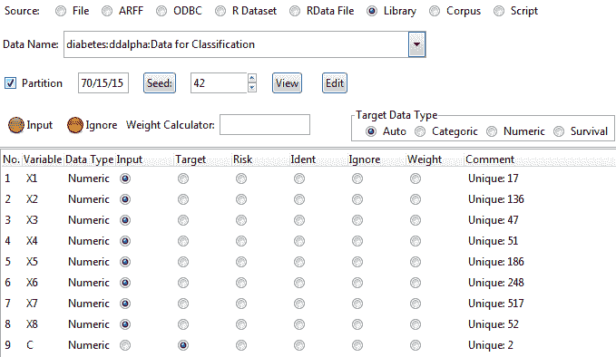

例如，在菜单栏点击 Model 后，我们可以选择逻辑回归模型。点击 Execute 后，我们将得到以下输出：

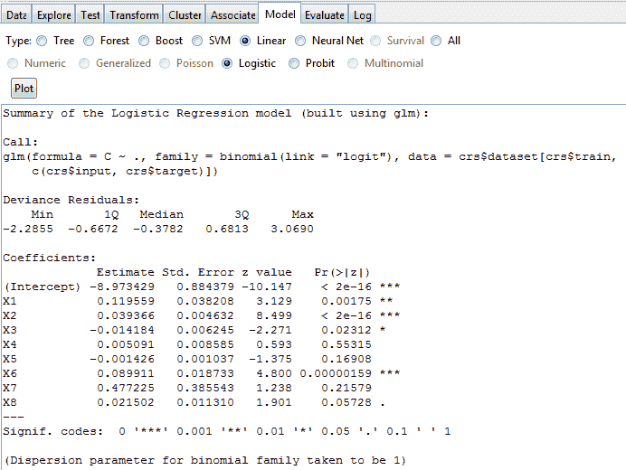

基于 p 值的显著性水平，我们可以看到，除了截距外，`x1`*，* `x2`*，* `x3` 和 `x6` 在统计上是显著的。

下一个示例来自名为`LogicReg`的 R 包。代码如下：

```py
library(LogicReg) 
data(logreg.testdat) 
y<-logreg.testdat[,1] 
x<-logreg.testdat[, 2:21] 
n=1000 
n2=25000 
set.seed(123) 
myanneal<-logreg.anneal.control(start=-1,end=-4,iter=n2,update=n) 
output<-logreg(resp=y,bin=x,type=2,select = 1,ntrees=2,anneal.control=myanneal) 
plot(output) 
```

相关图表如下。再次使用`set.seed()`函数便于复制。如果用户省略此函数或选择不同的种子值，则可能得到完全不同的结果：

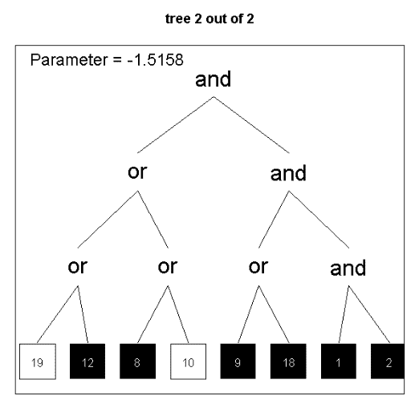

# RTextTools 简介

这个 R 包是关于*自动文本分类通过监督学习*的。它是一个自动文本分类的机器学习包，简化了新手用户的入门，同时也允许经验丰富的用户轻松地尝试不同的设置和算法组合。该包包含九种集成分类算法（svm、slda、boosting、bagging、随机森林、glmnet、决策树、神经网络和最大熵），综合分析功能，以及全面的文档。这里，我们以《纽约时报》文章为例。首先，让我们查看数据：

```py
>library(RTextTools)  
>data(NYTimes) 
>set.seed(123) # guarantees the same result  
>data <- NYTimes[sample(1:3100,size=100,replace=FALSE),] 
>head(data) 
```

运行程序时，用户应删除此行。输出如下：


接下来，我们可以使用`print_algorithms()`函数查看现有算法的类型，以下是代码和输出：

```py
>library(RTextTools) 
>print_algorithms() 
[1] "BAGGING"  "BOOSTING" "GLMNET"   "MAXENT"   "NNET"     
[6] "RF"       "SLDA"     "SVM"      "TREE"     
```

`BAGGING`用于 zbc，`BOOSTING`用于 bbb，`GLMNET`用于一般线性模型，`MAXENT`用于最大熵模型，`NNET`用于神经网络，`RF`用于随机森林，`SLDA`用于监督学习算法，`SVM`用于支持向量机，`TREE`用于决策树。代码如下：

```py
library(RTextTools) 
data(NYTimes) 
data <- NYTimes[sample(1:3100,size=100,replace=FALSE),] 
matrix <- create_matrix(cbind(data["Title"],data["Subject"]), language="english", 
removeNumbers=TRUE, stemWords=FALSE, weighting=tm::weightTfIdf) 
container <- create_container(matrix,data$Topic.Code,trainSize=1:75, testSize=76:100, 
virgin=TRUE) 
models <- train_models(container, algorithms=c("MAXENT","SVM")) 
results <- classify_models(container, models) 
analytics <- create_analytics(container, results) 
summary(analytics) 
```

# 通过 Python 实现

在上一章有关无监督学习的内容中，我们已经学习了几种 Python 包。幸运的是，这些包也可以应用于监督学习算法。以下示例是使用一些 Python 数据集进行线性回归。Python 数据集可以从作者的网站下载，地址为[`www.canisius.edu/~yany/python/ffcMonthly.pkl`](http://www.canisius.edu/~yany/python/ffcMonthly.pkl)。假设数据保存在`c:/temp/`目录下：

```py
import pandas as pd 
x=pd.read_pickle("c:/temp/ffcMonthly.pkl") 
print(x.head()) 
print(x.tail()) 
```

输出如下：

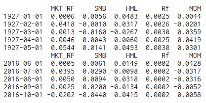

我们计划运行线性回归；请参见公式：


在这里，*R[i]* 是股票 i 的收益，*R[mkt]* 是*市场收益*，*R[SMB]* 是*小盘股投资组合收益*减去*大盘股投资组合收益*，*R[HML]* 是*高账面市值比投资组合收益*（股票）减去*低账面市值比股票投资组合收益*。以下是给出的 Python 程序。请注意，名为`ffDaily.pkl`的 Python 数据集可以从[`canisius.edu/~yany/python/data/ffDaily.pkl`](http://canisius.edu/~yany/python/data/ffDaily.pkl)下载：

```py
import  scipy as sp 
import pandas as pd 
import quandl as qd 
import statsmodels.api as sm 
#quandl.ApiConfig.api_key = 'YOUR_API_KEY' 
a=qd.get("WIKI/IBM")  
p=a['Adj. Close'] 
n=len(p) 
ret=[] 
# 
for i in range(n-1): 
    ret.append(p[i+1]/p[i]-1) 
# 
c=pd.DataFrame(ret,a.index[1:n],columns=['RET']) 
ff=pd.read_pickle('c:/temp/ffDaily.pkl') 
final=pd.merge(c,ff,left_index=True,right_index=True) 
y=final['RET'] 
x=final[['MKT_RF','SMB','HML']] 
#x=final[['MKT_RF']] 
x=sm.add_constant(x) 
results=sm.OLS(y,x).fit() 
print(results.summary()) 
```

输出如下：

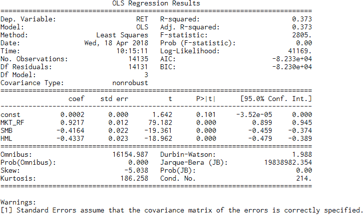

下一个示例预测`iris`类别。首先给出代码：

```py
from sklearn import metrics 
from sklearn import datasets 
from sklearn.tree import DecisionTreeClassifier 
x=datasets.load_iris() 
model=DecisionTreeClassifier() 
model.fit(x.data, x.target) 
print(model) 
true=x.target 
predicted=model.predict(x.data) 
print("------ output below --------- n") 
print(metrics.classification_report(true, predicted)) 
print(metrics.confusion_matrix(true, predicted)) 
```

美观的输出在此展示：

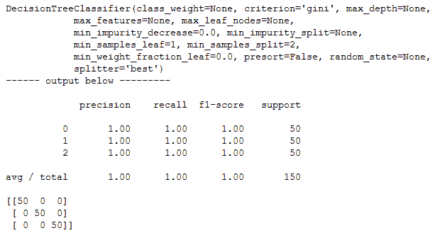

# 使用 scikit-learn（sklearn）模块

以下例子借鉴自[`scikit-learn.org/stable/auto_examples/classification/plot_digits_classification.html#sphx-glr-auto-examples-classification-plot-digits-classification-py`](http://scikit-learn.org/stable/auto_examples/classification/plot_digits_classification.html#sphx-glr-auto-examples-classification-plot-digits-classification-py)。该程序使用`scikit-learn`模块来识别手写数字的图像。为了便于展示，稍作修改后的代码如下所示：

```py
import matplotlib.pyplot as plt 
from sklearn import datasets, svm, metrics 
from sklearn.metrics import classification_report as report 
# 
format1="Classification report for classifier %s:n%sn" 
format2="Confusion matrix:n%s" 
digits = datasets.load_digits() 
imageLabels = list(zip(digits.images, digits.target)) 
for index,(image,label) in enumerate(imageLabels[:4]): 
    plt.subplot(2, 4, index + 1) 
    plt.axis('off') 
    plt.imshow(image,cmap=plt.cm.gray_r,interpolation='nearest') 
    plt.title('Training: %i' % label) 
n=len(digits.images) 
data = digits.images.reshape((n,-1)) 
classifier = svm.SVC(gamma=0.001) 
classifier.fit(data[:n//2],digits.target[:n//2]) 
expected = digits.target[n//2:] 
predicted = classifier.predict(data[n//2:]) 
print(format1 % (classifier,report(expected, predicted))) 
print(format2 % metrics.confusion_matrix(expected,predicted)) 
imageAndPrediction=list(zip(digits.images[n//2:],predicted)) 
for index,(image,prediction) in enumerate(imageAndPrediction[:4]): 
    plt.subplot(2,4,index+5) 
    plt.axis('off') 
    plt.imshow(image,cmap=plt.cm.gray_r,interpolation='nearest') 
    plt.title('Prediction: %i' % prediction) 
plt.show() 
```

部分输出在此展示：

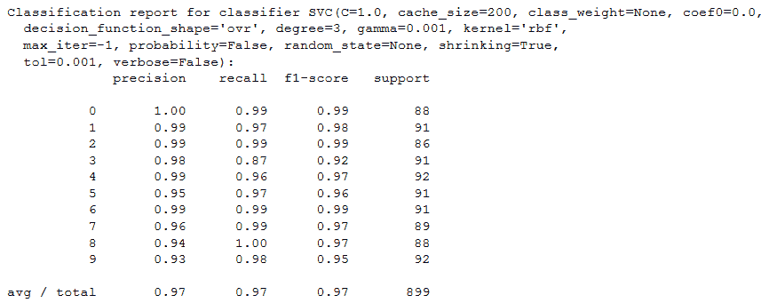

# 通过 Octave 实现

下一个线性回归的例子及相关数据集可以在[`canisius.edu/~yany/data/c9_input.csv`](http://canisius.edu/~yany/data/c9_input.csv)下载。在以下程序中，假设输入数据集位于`c:/temp`：

```py
a=csvread("c:/temp/c9_input.csv");
x=a(:,2);
y=a(:,3);
figure % open a window for graph
plot(x, y, 'o');
ylabel('Annual returns for S&P500')
xlabel('Annual returns for IBM')
```

第一个图在此展示：

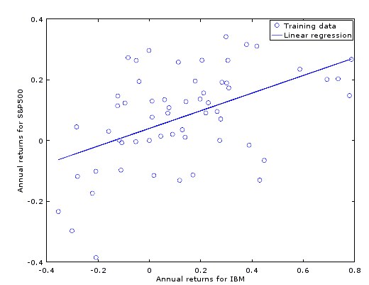

为节省空间，长程序将在此不显示。有兴趣的读者可以使用前面的链接。这里展示的是其输出图：

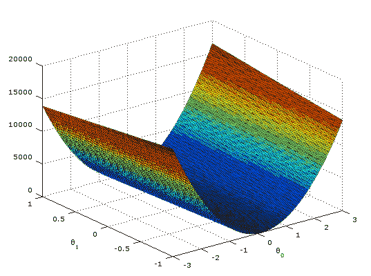

对于下一个例子，我们下载一个 Octave 机器库，地址为[`github.com/partharamanujam/octave-ml`](https://github.com/partharamanujam/octave-ml)。假设目录的位置是`C:\Octave\octave-ml-master`，相关的`octavelib`目录为`C:\Octave\octave-ml-master\octavelib`。然后，我们使用以下单行命令将其路径添加到 Octave 程序中：

```py
addpath(genpath('C:\Octave\octave-ml-master\octavelib'));
```

子目录下包含许多有用的程序。为了简便起见，以下表格中已移除`.m`扩展名。目录中包含的一些有用程序如下表所示：

| addBiasTerm | kMeansClosestCentroids |
| --- | --- |
| choosePolynomialForLinearGradDesc | kMeansComputeCentroids |
| chooseRBFParamsForSVM | kMeansCostFunction |
| chooseRegularizationForLinearGradDesc | kMeansInitCentroids |
| chooseRegularizationForLogisticGradDesc | linearRegressionCostFunction |
| collaborativeFilteringCostFunction | logisticRegressionCostFunction |
| computeCoFiParamsByGradDescFmincg | logisticRegressionOneVsAllError |
| computeGaussianParams | logisticRegressionOneVsAllTheta |
| computeMultivarGaussianDistribution | normalizeRatings |
| computePCA | porterStemmer |
| computeScalingParams | predictByLinearGradDesc |
| computeThetaByLinearGradDescFminunc | predictByLogisticGradDescOneVsAll |
| computeThetaByLogisticGradDescFminunc | predictByNormalEquation |
| computeThetaByNormalEquation | projectPCAData |
| computeThresholdForMultivarGaussian | recoverPCAData |
| fmincg | scaleFeatures |
| generateFeaturesPolynomial | sigmoid |
| generateKMeansClusters |  |
| generateKMeansClustersMinCost |  |

表 9.1 支持 Octave 程序位于 octavelib 目录下

此外，示例程序及其相关输入数据集包含在名为`examples`的子目录下（见下表）：

| **程序** | **数据集** |
| --- | --- |
| cofi.m | movieList.mat |
| extractEmailFeatures.m | email-sample-1.txtemail-sample-2.txtemail-sample-3.txt |
| gaussian_m.m | anomaly.dat |
| initEnv.m | 注：设置程序 |
| k_means.m | bird_small.png |
| linear_gd.m | damlevels.mat |
| logistic_gd.m | numbers.mat |
| normal_eq.m | prices.csv |
| pca.m | faces.mat |
| svm.m | spam-vocab.txt |

表 9.2 示例及其相关数据集

让我们看一下以下的 k-means 程序。原始程序叫做`k_means.m`，它的输入图像是`bird_small.png`。该程序尝试通过使用 k-means 方法为给定的图片节省空间：

```py
A = double(imread('bird_small.png')); 
A = A / 255; % Divide by 255, values in the range 0 - 1 
imgSize = size(A); 
X = reshape(A, imgSize(1) * imgSize(2), 3); 
k = 16; % using 4-bit (16) colors,minimize cost 
[Centroids,idx,cost]=generateKMeansClustersMinCost(X,k,10,10); 
fprintf('Cost/Distortion of computed clusters:%.3fn', cost); 
% regenerate colors & image 
NewX = Centroids(idx, :); 
NewA = reshape(NewX, imgSize(1), imgSize(2), 3); 
% compare both the images 
fprintf('Comparing original & compressed imagesn'); 
subplot(1, 2, 1); 
imagesc(A); 
axis("square"); 
title('Original'); 
subplot(1, 2, 2); 
imagesc(NewA); 
axis("square"); 
title('Compressed'); 
```

相关的两张照片如下所示：

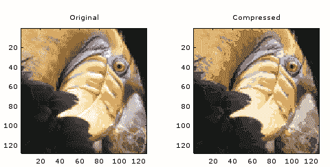

# 通过 Julia 的实现

第一个示例再次使用熟悉的数据集`iris`。通过使用`kmeans()`函数，程序尝试将这些植物进行分组：

```py
using Gadfly 
using RDatasets 
using Clustering 
iris = dataset("datasets", "iris") 
head(iris) 
features=permutedims(convert(Array, iris[:,1:4]),[2, 1]) 
result=kmeans(features,3)                           
nameX="PetalLength" 
nameY="PetalWidth" 
assignments=result.assignments   
plot(iris, x=nameX,y=nameY,color=assignments,Geom.point) 
```

相关的输出如下所示：

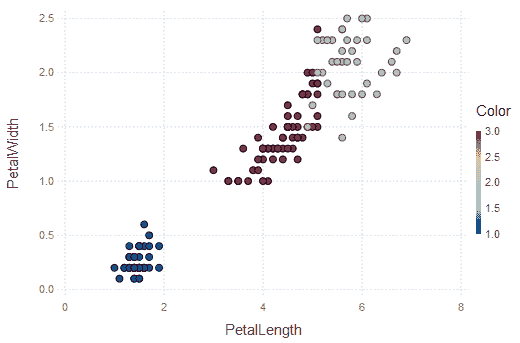

对于下一个例子，我们尝试将一组随机数字分成`20`个簇。代码如下所示：

```py
using Clustering 
srand(1234) 
nRow=5 
nCol=1000 
x = rand(nRow,nCol) 
maxInter=200  #max interation  
nCluster=20 
R = kmeans(x,nCluster;maxiter=maxInter,display=:iter) 
@assert nclusters(R) ==nCluster 
c = counts(R) 
clusters=R.centers 
```

为了显示`x`和`clusters`的值，我们只需在命令行中输入它们，如下所示：


# 任务视图：R 中的机器学习

从前面的章节中，我们知道不同主题大约有三十多个任务视图。任务视图是围绕特定主题（如金融、计量经济学等）的一组 R 包。在上一章中，我们简要讨论了聚类任务视图。没有以“监督学习”为名的任务视图。相反，最接近的任务视图是机器学习任务视图；请参见这里的截图（上部）：

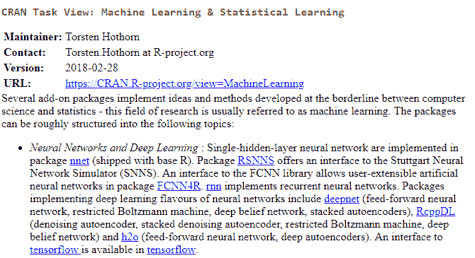

上述截图给出了 URL。再次强调，我们可以仅使用三行 R 代码来安装任务视图中包含的 R 包：

```py
>install.packages("ctv") 
>library("ctv") 
>install.views("MachineLearning") 
```

截至 2018 年 4 月 3 日，约 105 个相关的 R 包已被安装。

# 总结

在本章中，我们讨论了监督学习，如分类、k 近邻算法、贝叶斯分类器、强化学习以及 R 中的`RTextTools`和`sklearn`模块。此外，我们还讨论了通过 R、Python、Julia 和 Octave 实现监督学习。

在下一章中，我们将讨论预测数据分析、建模与验证、一些有用的数据集、时间序列分析、如何预测未来、季节性以及如何可视化我们的数据。对于 Python 包，我们将提到`predictives-models-building`、`model-catwalk`和`easyML`。对于 R 包，我们将讨论`datarobot`、`LiblineaR`、`eclust`和`AppliedPredictiveModeling`。对于 Julia 包，我们将解释`EmpiricalRisks`和`ValidatedNumerics`。

# 复习问题和练习

1.  *无监督学习*是什么意思？

1.  无监督学习和监督学习之间的主要区别是什么？

1.  如何安装 Python 包`sklearn`？

1.  讨论距离和聚类分类之间的关系。

1.  贝叶斯分类是什么意思？

1.  查找 R、Python、Octave 和 Julia 中与贝叶斯分类相关的函数。

1.  在运行以下三行 R 代码后，安装了多少个 R 包？

```py
>install.packages("ctv")
>library("ctv")
>install.views("MachineLearning")
```

1.  从 Yahoo!Finance 下载 IBM 的月度数据，[`finance.yahoo.com`](https://finance.yahoo.com)。然后使用 Python 运行 Fama-French-Carhart 四因子模型。四因子模型在此给出：


与这四个因子相关的 Python 数据集可以从作者的网站下载，[`www.canisius.edu/~yany/python/ffcMonthly.pkl`](http://www.canisius.edu/~yany/python/ffcMonthly.pkl)。

1.  从 UCI 机器学习库下载著名的鸢尾花数据集。以下是前几行数据：


然后为 R 和 Python 生成数据集。

1.  为了使用 Octave 实现机器学习，本章中如何引入并使用`octavelib`库？该库下有多少个程序？

1.  从本章提供的 Octave 程序中，运行名为`logistic_gd.m`的程序，并使用名为`numbers.mat`的输入 Octave 数据集。有关更多细节，请参见表 9.1 和 9.2 及相关解释。

1.  讨论`spa` R 包并展示一些相关示例。

1.  下载 Fama-French-Carhart 四因子模型，见此：


其中 R[i]是股票*i*的收益率，R[mkt]是市场收益率，R[SMB]是小股票的组合收益率，可能是大股票的组合收益率，R[HML]是高账面市值比（股票）组合收益率减去低账面市值比股票的组合收益率，R[MOM]是动量因子。编写 R/Python/Octave/Julia 程序，对 IBM 股票进行线性回归分析。数据来源：1）法国教授的数据库，[`mba.tuck.dartmouth.edu/pages/faculty/ken.french/data_library.html`](http://mba.tuck.dartmouth.edu/pages/faculty/ken.french/data_library.html) 和 Yahoo!Finance，[`finance.yahoo.com`](https://finance.yahoo.com)。

1.  从 UCI 机器学习库下载银行营销数据集，[`archive.ics.uci.edu/ml/datasets/Bank+Marketing`](https://archive.ics.uci.edu/ml/datasets/Bank+Marketing)。该数据集与葡萄牙银行机构的直销营销活动相关。这些营销活动是通过电话进行的。通常，为了确定客户是否订购了产品（银行定期存款），需要与同一客户进行多次联系（结果为“是”或“否”）。使用监督学习来识别最具影响力的因素。

1.  下载名为*Census Income*的数据集，[`archive.ics.uci.edu/ml/datasets/Census+Income`](https://archive.ics.uci.edu/ml/datasets/Census+Income)*。该数据集由 Barry Becker 从 1994 年人口普查数据库提取。使用以下条件提取了一组较为干净的记录：`((AAGE>16) && (AGI>100) && (AFNLWGT>1) && (HRSWK>0))`。编写 R 和 Python 程序预测一个人年收入是否超过$50,000。

1.  投资者的效用函数如下所示：


其中，U 是效用函数，E(R)是预期投资组合回报，我们可以用其均值来近似，A 是风险厌恶系数，σ²是投资组合的方差。前往 French 教授的数据库下载 10 个行业投资组合的回报数据。假设风险厌恶系数 A 的值从 1 到 100 不等。使用 k-means 方法根据 E(R)、A 和风险将投资者分组。

1.  下载名为“Bike Sharing Data Set”的数据集，来自 UCI 机器学习库，[`archive.ics.uci.edu/ml/datasets/Bike+Sharing+Dataset`](https://archive.ics.uci.edu/ml/datasets/Bike+Sharing+Dataset)。该数据集包含 2011 年和 2012 年间 Capital bike share 系统的租赁自行车的小时和日租赁数量，以及相应的天气和季节信息。编写 R 程序将单独的骑行者分成 k 个组。

1.  下载名为“Bag of Words”的数据集，[`archive.ics.uci.edu/ml/datasets/Bag+of+Words`](https://archive.ics.uci.edu/ml/datasets/Bag+of+Words)。使用 R 和 Python 编写程序进行聚类分析。

1.  下载名为“Sonar Dataset”的数据集。Sonar 数据集涉及根据不同角度的声呐回波强度预测一个物体是矿石还是岩石。

1.  使用名为 Boston 的数据集进行回归分析（Python）。前几行数据如下所示：

```py
from sklearn import datasets
boston = datasets.load_boston()
print(boston.data.shape)
(506, 13)
```
