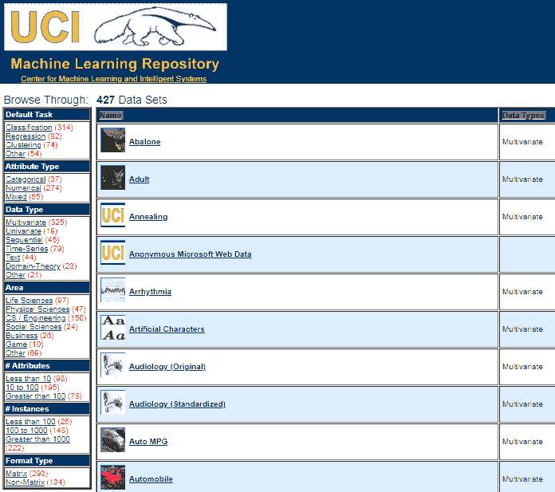
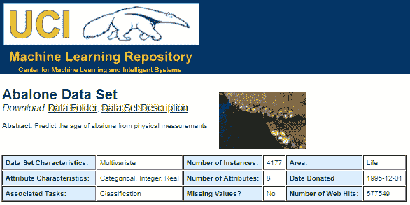
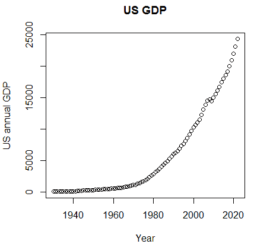
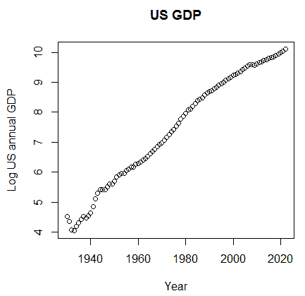
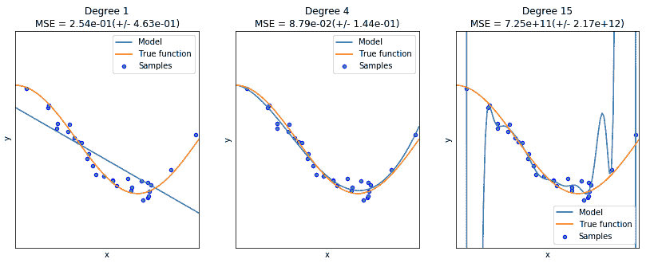
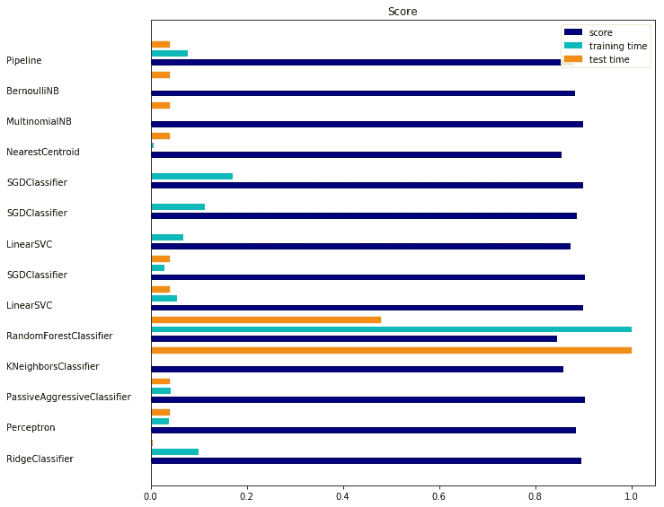
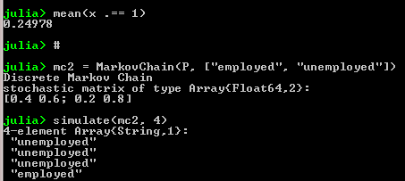
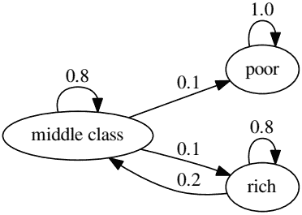
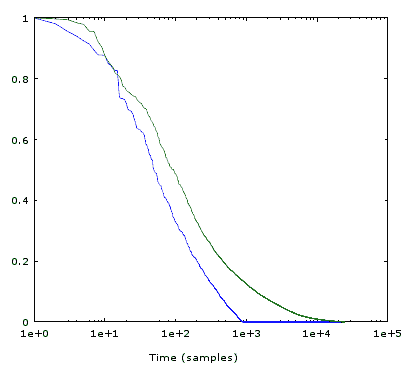

# 预测性数据分析 – 建模与验证

我们进行各种数据分析的首要目标是试图找到模式，以预测未来可能发生的事情。对于股市来说，研究人员和专业人士正在进行各种测试，以理解市场机制。在这种情况下，可能会提出许多问题。未来五年市场指数将会怎样？IBM 的股价区间明年会是怎样？市场的波动性会增加还是减少？如果政府改变税收政策，可能会产生什么影响？如果一个国家与另一个国家发动贸易战，可能的盈亏是什么？通过分析一些相关变量，我们如何预测消费者的行为？我们能否预测一名本科生顺利毕业的概率？我们能否找到某些特定行为与某一特定疾病之间的关联？

本章将涵盖以下主题：

+   理解预测性数据分析

+   有用的数据集

+   预测未来事件

+   模型选择

+   格兰杰因果关系检验

# 理解预测性数据分析

关于未来事件，人们可能会有很多问题。对于投资者来说，如果他/她能够预测股票价格的未来走势，便能获得更多利润。对于公司来说，如果他们能够预测产品的趋势，就能提升股价和产品的市场份额。对于政府来说，如果他们能够预测人口老龄化对社会和经济的影响，就能更有动力设计出更好的政策，涉及政府预算和其他相关的战略决策。

对于大学来说，如果他们能够很好地掌握毕业生的质量和技能需求，就能设计出更好的课程，或推出新课程以满足未来劳动力市场的需求。

为了更好的预测或预报，研究人员必须考虑许多问题。例如，样本是否太小？我们如何处理缺失变量？数据集在数据收集过程中是否存在偏差？我们如何处理极端值或离群值？季节性是什么，我们如何应对？我们应该应用什么样的模型？本章将涉及其中的一些问题。我们从有用的数据集开始。

# 有用的数据集

最佳的数据来源之一是**UCI 机器学习库**。当我们访问网页[`archive.ics.uci.edu/ml/datasets.html`](https://archive.ics.uci.edu/ml/datasets.html)时，我们会看到以下列表：



例如，如果我们点击第一个数据集（Abalone），我们会看到以下内容。为了节省空间，仅显示顶部部分：



用户可以从网页上下载数据集，并找到变量定义，甚至是引用。以下代码可以用来下载相关的 R 数据集：

```py
dataSet<-"UCIdatasets" 
path<-"http://canisius.edu/~yany/RData/" 
con<-paste(path,dataSet,".RData",sep='') 
load(url(con)) 
dim(.UCIdatasets) 
head(.UCIdatasets) 
```

相关输出如下所示：


从上面的输出中，我们知道该数据集有 `427` 个观测值（数据集）。对于每个数据集，我们有 `7` 个相关特征，如 `Name`、`Data_Types`、`Default_Task`、`Attribute_Types`、`N_Instances`（实例数）、`N_Attributes`（属性数）和 `Year`。名为 `Default_Task` 的变量可以解释为每个数据集的基本用途。例如，第一个数据集 `Abalone` 可以用于 `分类` 问题。可以使用 `unique()` 函数来查找所有可能的 `Default_Task`，如下所示：


# 应用预测建模 R 包

该包包含了许多有用的数据集，可以用于本章节及其他章节。查找这些数据集最简单的方法是使用 `help()` 函数，如下所示：

```py
>library(AppliedPredictiveModeling) 
>help(package=AppliedPredictiveModeling) 
```

以下表格展示了该包中包含的数据集：

| **数据（名称）** | **数据集名称** | **说明** |
| --- | --- | --- |
| `abalone` | `abalone` | 鲍鱼数据 |
| `bio` | `bio` | 肝损伤数据 |
| `bookTheme` | `bookTheme` | 格子主题 |
| `cars2010`,`cars2011`, 和 `cars2012` | `cars2010`,`cars2011`, `cars2012` | 燃油经济性数据 |
| `chem` | `chem` | 肝损伤数据 |
| `ChemicalManufacturingProcess` | `ChemicalManufacturingProcess` | 化学制造过程数据 |
| `classes` | `classes` | 两类示例数据 |
| `concrete` | `concrete` | 混凝土抗压强度 |
| `diagnosis` | `diagnosis` | 阿尔茨海默病脑脊液数据 |
| `easyBoundaryFunc` | `easyBoundaryFunc` | 用于模拟数据的函数 |
| `fingerprints` | `fingerprints` | 渗透性数据 |
| `getPackages` | `getPackages` | 安装每个章节的包 |
| `injury` | `injury` | 肝损伤数据 |
| `logisticCreditPredictions` | `logisticCreditPredictions` | 信用数据 |
| `mixtures` | `mixtures` | 混凝土抗压强度 |
| `permeability` | `permeability` | 渗透性数据 |
| `permuteRelief` | `permuteRelief` | 缓解算法的置换统计数据 |
| `predictors` | `predictors` | 阿尔茨海默病脑脊液数据 |
| `quadBoundaryFunc` | `quadBoundaryFunc` | 用于模拟数据的函数 |
| `schedulingData` | `schedulingData` | HPC 作业调度数据 |
| `scriptLocation` | `scriptLocation` | 查找章节脚本文件 |
| `segmentationOriginal` | `segmentationOriginal` | 细胞体分割 |
| `solubility` | `solTestX`,`solTestXtrans`,`solTestY`,`solTrainX`,`solTrainXtrans`,`solTrainY`, 和 `trainX` | 溶解度数据 |
| `transparentTheme` | `transparentTheme` | 格子主题 |
| `twoClassData` | `twoClassData` | 两类示例数据 |

表 10.1 数据集，嵌入在 R 包应用预测建模中

这里，我们展示了如何加载这些数据集的一些示例。要加载一组数据，我们使用 `data()` 函数。对于第一个数据集，名为 `abalone`，我们有以下代码：

```py
> library(AppliedPredictiveModeling) 
> data(abalone) 
> dim(abalone) 
> head(abalone)
```

输出如下：


对于某些人来说，大数据集包括一些子数据集：

```py
> library(AppliedPredictiveModeling) 
> data(solubility) 
> ls(pattern="sol") 
[1] "solTestX"       "solTestXtrans"  "solTestY"
[4] "solTrainX"      "solTrainXtrans" "solTrainY"
```

要加载每个数据集，我们可以使用`dim()`、`head()`、`tail()`和`summary()`函数。

# 时间序列分析

时间序列可以定义为在连续的时间点上获得的一组值，通常它们之间有相等的间隔。时间序列有不同的频率，如年度、季度、月度、周度和日度。对于 GDP（国内生产总值）时间序列，我们通常会有季度或年度数据。对于股票数据，我们通常有年度、月度和日度数据。使用以下代码，我们可以上传美国 GDP 的季度和年度数据：

```py
> path<-"http://canisius.edu/~yany/RData/" 
> dataSet<-"usGDPannual" 
> con<-paste(path,dataSet,".RData",sep='') 
> load(url(con)) 
> head(.usGDPannual) 
 YEAR  GDP 
1 1930 92.2 
2 1931 77.4 
3 1932 59.5 
4 1933 57.2 
5 1934 66.8 
6 1935 74.3 
> dataSet<-"usGDPquarterly" 
> con<-paste(path,dataSet,".RData",sep='') 
> load(url(con)) 
> head(.usGDPquarterly) 
 DATE GDP_CURRENT GDP2009DOLLAR 
1 1947Q1       243.1        1934.5 
2 1947Q2       246.3        1932.3 
3 1947Q3       250.1        1930.3 
4 1947Q4       260.3        1960.7 
5 1948Q1       266.2        1989.5 
6 1948Q2       272.9        2021.9 
```

然而，在时间序列分析中我们会遇到许多问题。例如，从宏观经济学的角度来看，我们有商业或经济周期，可以观察到经济扩张和衰退的阶段。行业或公司可能存在季节性波动。以农业行业为例，农民在春季和秋季的支出会更多，而在冬季则较少。对于零售行业来说，年末假期季节会有大量现金流入。

要操作时间序列，我们可以使用 R 包`timeSeries`中包含的许多有用函数。在以下程序中，我们将按周频率对日数据进行平均：

```py
> library(timeSeries)
> data(MSFT)
> x <- MSFT
> by <- timeSequence(from = start(x), to = end(x), by = "week")
> y<-aggregate(x,by,mean)
```

我们还可以使用`head()`函数查看一些观察值：

```py
> head(x)
GMT
 Open High Low Close Volume
2000-09-27 63.4375 63.5625 59.8125 60.6250 53077800
2000-09-28 60.8125 61.8750 60.6250 61.3125 26180200
2000-09-29 61.0000 61.3125 58.6250 60.3125 37026800
2000-10-02 60.5000 60.8125 58.2500 59.1250 29281200
2000-10-03 59.5625 59.8125 56.5000 56.5625 42687000
2000-10-04 56.3750 56.5625 54.5000 55.4375 68226700
> head(y)
GMT
 Open High Low Close Volume
2000-09-27 63.4375 63.5625 59.8125 60.6250 53077800
2000-10-04 59.6500 60.0750 57.7000 58.5500 40680380
2000-10-11 54.9750 56.4500 54.1625 55.0875 36448900
2000-10-18 53.0375 54.2500 50.8375 52.1375 50631280
2000-10-25 61.7875 64.1875 60.0875 62.3875 86457340
2000-11-01 66.1375 68.7875 65.8500 67.9375 53496000
```

# 预测未来事件

在预测未来时，我们可以使用许多技术，如**移动平均**（**MA**）、回归、自回归等。首先，让我们从最简单的移动平均开始：

```py
movingAverageFunction<- function(data,n=10){
  out= data
  for(i in n:length(data)){
    out[i] = mean(data[(i-n+1):i])
  }
  return(out)
}
```

在前面的程序中，周期数的默认值为`10`。我们可以使用名为`MSFT`的数据集，该数据集包含在 R 包`timeSeries`中（请参见以下代码）：

```py
> library(timeSeries)
> data(MSFT)
> p<-MSFT$Close
> #
> ma<-movingAverageFunction(p,3)
> head(p)
[1] 60.6250 61.3125 60.3125 59.1250 56.5625 55.4375
> head(ma)
[1] 60.62500 61.31250 60.75000 60.25000 58.66667 57.04167
> mean(p[1:3])
[1] 60.75
> mean(p[2:4])
[1] 60.25
```

手动计算时，我们发现* x *的前三个值的平均值与* y *的第三个值相同。从某种意义上讲，我们可以使用移动平均来预测未来。

在下一个示例中，我们将展示如何估计明年市场的预期回报。在这里，我们使用标准普尔 500 指数和历史年均值作为我们的预期值。首先，我们可以去 Yahoo!Finance 下载数据。标准普尔 500 指数的符号是`^GSPC`：

```py
library(plyr)
year<-c(2000,2000,2001,2001,2004)
values<-c(2, 3, 3, 5, 6)
df <- data.frame(DATE=year,B =values )
dfsum <- ddply(df, c("DATE"),summarize,B=sum(B))
```

输出如下所示：

```py
> df
 DATE B
1 2000 2
2 2000 3
3 2001 3
4 2001 5
5 2004 6
> dfsum
 DATE B
1 2000 5
2 2001 8
3 2004 6
```

现在，我们从 Yahoo!Finance 下载标准普尔 500 指数的历史月度价格数据。或者，我们可以使用以下代码下载 R 数据集。前几条命令用于下载相关的数据集`.sp500monthly`。程序的目标是估计年均值及其 90%的置信区间：

```py
> library(data.table)
> path<-'http://canisius.edu/~yany/RData/'
> dataSet<-'sp500monthly.RData'
> link<-paste(path,dataSet,sep='')
> load(url(link))
> #head(.sp500monthly,2)
> p<-.sp500monthly$ADJ.CLOSE
> n<-length(p)
> logRet<-log(p[2:n]/p[1:(n-1)])
> years<-format(.sp500monthly$DATE[2:n],"%Y")
> y<-data.frame(.sp500monthly$DATE[2:n],years,logRet)
> colnames(y)<-c("DATE","YEAR","LOGRET")
> y2<- data.table(y)
> z<-y2[,sum(LOGRET),by=YEAR]
> z2<-na.omit(z)
> annualRet<-data.frame(z2$YEAR,exp(z2[,2])-1)
> n<-nrow(annualRet)
> std<-sd(annualRet[,2])
> stdErr<-std/sqrt(n)
> ourMean<-mean(annualRet[,2])
> min2<-ourMean-2*stdErr
> max2<-ourMean+2*stdErr
> cat("[min mean max ]\n")
[min mean max ]
> cat(min2,ourMean,max2,"\n")
0.05032956 0.09022369 0.1301178
```

从结果来看，标准普尔 500 的历史年均回报率为 9%。如果我们宣称明年的指数回报率也为 9%，那么它可能在 5%到 13%之间波动，这是一个可能的巨大波动。

# 季节性

在下一个例子中，我们将展示自相关。首先，我们上传一个名为`astsa`的 R 包，它代表**应用统计时间序列分析**。然后，我们上传美国 GDP 的季度频率数据：

```py
library(astsa)
path<-"http://canisius.edu/~yany/RData/"
dataSet<-"usGDPquarterly"
con<-paste(path,dataSet,".RData",sep='')
load(url(con))
x<-.usGDPquarterly$DATE
y<-.usGDPquarterly$GDP_CURRENT
plot(x,y)
diff4 = diff(y,4)
acf2(diff4,24)
```

在前面的程序中，`diff()`函数计算差值，例如当前值减去前一个值。第二个输入值表示滞后期。`acf2()`函数用于绘制和打印时间序列的 ACF 和 PACF。ACF 代表**自协方差函数**，PACF 代表**偏自相关函数**。相关的图表如下所示：


# 可视化组件

如果我们能够使用图表，理解这些概念和数据集会更加清晰。第一个例子展示了过去五十年美国 GDP 的波动：

```py
> path<-"http://canisius.edu/~yany/RData/"
> dataSet<-"usGDPannual"
> con<-paste(path,dataSet,".RData",sep='')
> load(url(con))
> title<-"US GDP"
> xTitle<-"Year"
> yTitle<-"US annual GDP"
> x<-.usGDPannual$YEAR
> y<-.usGDPannual$GDP
> plot(x,y,main=title,xlab=xTitle,ylab=yTitle)
```

相关的图表如下所示：



如果我们使用对数尺度来表示 GDP，那么我们将会得到以下的代码和图表：

```py
> yTitle<-"Log US annual GDP" 
> plot(x,log(y),main=title,xlab=xTitle,ylab=yTitle)
```

以下图表接近一条直线：



# R 包 – LiblineaR

这个包是基于`LIBLINEAR C/C++库`的线性预测模型。这里是一个使用`iris`数据集的例子。程序通过使用训练数据来预测植物属于哪个类别：

```py
library(LiblineaR)
data(iris)
attach(iris)
x=iris[,1:4]
y=factor(iris[,5])
train=sample(1:dim(iris)[1],100)
xTrain=x[train,];xTest=x[-train,]
yTrain=y[train]; yTest=y[-train]
s=scale(xTrain,center=TRUE,scale=TRUE)
#
tryTypes=c(0:7)
tryCosts=c(1000,1,0.001)
bestCost=NA
bestAcc=0
bestType=NA
#
for(ty in tryTypes){
   for(co in tryCosts){
     acc=LiblineaR(data=s,target=yTrain,type=ty,cost=co,bias=1,cross=5,verbose=FALSE)
     cat("Results for C=",co,": ",acc," accuracy.\n",sep="")
     if(acc>bestAcc){
         bestCost=co
         bestAcc=acc
         bestType=ty
     }
   }
}
cat("Best model type is:",bestType,"\n")
cat("Best cost is:",bestCost,"\n")
cat("Best accuracy is:",bestAcc,"\n")
# Re-train best model with best cost value.
m=LiblineaR(data=s,target=yTrain,type=bestType,cost=bestCost,bias=1,verbose=FALSE)
# Scale the test data
s2=scale(xTest,attr(s,"scaled:center"),attr(s,"scaled:scale"))
pr=FALSE; # Make prediction
if(bestType==0 || bestType==7) pr=TRUE
p=predict(m,s2,proba=pr,decisionValues=TRUE)
res=table(p$predictions,yTest) # Display confusion matrix
print(res)
# Compute Balanced Classification Rate
BCR=mean(c(res[1,1]/sum(res[,1]),res[2,2]/sum(res[,2]),res[3,3]/sum(res[,3])))
print(BCR)
```

输出如下。`BCR`是**平衡分类率**。对于这个率，越高越好：

```py
> cat("Best model type is:",bestType,"\n")
Best model type is: 4 
> cat("Best cost is:",bestCost,"\n")
Best cost is: 1 
> cat("Best accuracy is:",bestAcc,"\n")
Best accuracy is: 0.98 
> print(res)
            yTest
 setosa versicolor virginica
 setosa 16 0 0
 versicolor 0 17 0
 virginica 0 3 14
> print(BCR)
[1] 0.95
```

# R 包 – datarobot

DataRobot 这个名字指代三件事：一家位于波士顿的软件公司，DataRobot 公司开发的大规模并行建模引擎，以及一个开源的 R 包，允许交互式 R 用户连接到这个建模引擎。本文档简要介绍了`datarobot` R 包，重点介绍其使用的以下关键细节：

+   从交互式 R 会话连接到 DataRobot 建模引擎

+   在 DataRobot 建模引擎中创建一个新的建模项目

+   从 DataRobot 建模项目中检索结果

+   从任何 DataRobot 模型生成预测

要启动该包，我们使用`library()`函数：

```py
> library(datarobot)
```

在之前的代码执行后，新用户很有可能会收到类似以下的错误消息：

```py
> library(datarobot)
Did not connect to DataRobot on package startup. Use `ConnectToDataRobot`.
To connect by default on startup, you can put a config file at: C:\Users\yany\Documents/.config/datarobot/drconfig.yaml
```

这意味着我们必须先在公司注册，以获得一个验证过的令牌密钥。最终的令牌格式如下所示：

```py
loc<- "YOUR-ENDPOINT-HERE"
myToken<-"YOUR-API_TOKEN-HERE"
ConnectToDataRobot(endpoint=loc,token=myToken)
```

我们也可以使用`help()`函数来查找包的用户：

```py
> help(package=datarobot)
```

# R 包 – eclust

这个包是**基于环境的可解释预测模型聚类方法，用于高维数据**。首先，让我们看一个名为`simdata`的数据集，它包含了该包的模拟数据：

```py
> library(eclust)
> data("simdata")
> dim(simdata)
[1] 100 502
> simdata[1:5, 1:6]
 Y E Gene1 Gene2 Gene3 Gene4
[1,] -94.131497 0 -0.4821629 0.1298527 0.4228393 0.36643188
[2,] 7.134990 0 -1.5216289 -0.3304428 -0.4384459 1.57602830
[3,] 1.974194 0 0.7590055 -0.3600983 1.9006443 -1.47250061
[4,] -44.855010 0 0.6833635 1.8051352 0.1527713 -0.06442029
[5,] 23.547378 0 0.4587626 -0.3996984 -0.5727255 -1.75716775
> table(simdata[,"E"])
 0 1 
50 50 
>
```

上述输出显示数据的维度为 `100` 乘以 `502`。`Y` 是一个连续响应向量，`E` 是用于 ECLUST 方法的二元环境变量。*E = 0* 表示未暴露 *(n=50)*，*E = 1* 表示已暴露 *(n=50)*。以下的 R 程序估计了相关性的 Fisher z 转换。Fisher 的 Z 转换的定义如下代码所示：

```py
> library(eclust)
> data("simdata")
> X = simdata[,c(-1,-2)]
> firstCorr<-cor(X[1:50,])
> secondCorr<-cor(X[51:100,])
> score<-u_fisherZ(n0=100,cor0=firstCorr,n1=100,cor1=secondCorr)
> dim(score)
[1] 500 500
> score[1:5,1:5]
 Gene1 Gene2 Gene3 Gene4 Gene5
Gene1 1.000000 -8.062020 6.260050 -8.133437 -7.825391
Gene2 -8.062020 1.000000 9.162208 -7.431822 -7.814067
Gene3 6.260050 9.162208 1.000000 8.072412 6.529433
Gene4 -8.133437 -7.431822 8.072412 1.000000 -5.099261
Gene5 -7.825391 -7.814067 6.529433 -5.099261 1.000000
>
```

Fisher 的 Z 转换在这里定义。假设我们有一组 *n* 对的 x[i] 和 y[i]，我们可以通过应用以下公式来估计它们的相关性：


在这里，ρ 是两个变量之间的相关性，而  和  是 *x* 和 *y* 的均值。Fisher 的 z 值定义为 *:*


在这是自然对数函数，`arctanh()` 是反双曲正切函数。

# 模型选择

当寻找一个好的模型时，有时我们会面对欠拟合和过拟合。第一个例子是借用的；您可以在[`scikit-learn.org/stable/auto_examples/model_selection/plot_underfitting_overfitting.html#sphx-glr-auto-examples-model-selection-plot-underfitting-overfitting-py`](http://scikit-learn.org/stable/auto_examples/model_selection/plot_underfitting_overfitting.html#sphx-glr-auto-examples-model-selection-plot-underfitting-overfitting-py)下载程序。它演示了欠拟合和过拟合的问题，以及如何使用具有多项式特征的线性回归来逼近非线性函数。真实函数如下所示：


在以下程序中，我们尝试使用线性和多项式模型来逼近方程。稍作修改的代码如下所示。该程序试图展示不同模型在欠拟合和过拟合方面的影响：

```py
import sklearn
import numpy as np
import matplotlib.pyplot as plt
from sklearn.pipeline import Pipeline
from sklearn.preprocessing import PolynomialFeatures 
from sklearn.linear_model import LinearRegression
from sklearn.model_selection import cross_val_score 
#
np.random.seed(123)
n= 30 # number of samples 
degrees = [1, 4, 15]
def true_fun(x):
    return np.cos(1.5*np.pi*x)
x = np.sort(np.random.rand(n))
y = true_fun(x) + np.random.randn(n) * 0.1
plt.figure(figsize=(14, 5))
title="Degree {}\nMSE = {:.2e}(+/- {:.2e})"
name1="polynomial_features"
name2="linear_regression"
name3="neg_mean_squared_error"
#
for i in range(len(degrees)):
    ax=plt.subplot(1,len(degrees),i+1)
    plt.setp(ax, xticks=(), yticks=())
    pFeatures=PolynomialFeatures(degree=degrees[i],include_bias=False)
    linear_regression = LinearRegression()
    pipeline=Pipeline([(name1,pFeatures),(name2,linear_regression)])
    pipeline.fit(x[:,np.newaxis],y)
    scores=cross_val_score(pipeline,x[:,np.newaxis],y,scoring=name3,cv=10)
    xTest = np.linspace(0, 1, 100)
    plt.plot(xTest,pipeline.predict(xTest[:,np.newaxis]),label="Model")
    plt.plot(xTest,true_fun(xTest),label="True function")
    plt.scatter(x,y,edgecolor='b',s=20,label="Samples")
    plt.xlabel("x")
    plt.ylabel("y")
    plt.xlim((0,1))
    plt.ylim((-2,2))
    plt.legend(loc="best")
    plt.title(title.format(degrees[i],-scores.mean(),scores.std()))
plt.show()
```

相关图表显示如下：



请注意，每个图表的顶部，**MSE** 代表 **均方误差**。对于左侧的图表，该程序试图使用一条线来拟合基于输入数据集的真实模型。由于它是线性的，**Degree** 是 **1**。与具有 **Degree** 为 **4** 的第二模型相比，这个学习模型的 **MSE** 更大，分别为 0.54 和 0.0879。这表明线性模型可能会欠拟合模型，而第二模型可能会过拟合模型。

# Python 包 - model-catwalk

一个示例可以在[`pypi.python.org/pypi/model-catwalk/0.2.1`](https://pypi.python.org/pypi/model-catwalk/0.2.1)找到。其前几行代码如下所示：

```py
import datetime
import pandas
from sqlalchemy import create_engine
from metta import metta_io as metta
from catwalk.storage import FSModelStorageEngine, CSVMatrixStore
from catwalk.model_trainers import ModelTrainer
from catwalk.predictors import Predictor
from catwalk.evaluation import ModelEvaluator
from catwalk.utils import save_experiment_and_get_hash
help(FSModelStorageEngine)
```

相关输出显示如下。为节省空间，仅呈现顶部部分：

```py
 Help on class FSModelStorageEngine in module catwalk.storage:

class FSModelStorageEngine(ModelStorageEngine)
 | Method resolution order:
 | FSModelStorageEngine
 | ModelStorageEngine
 | builtins.object
 | 
 | Methods defined here:
 | 
 | __init__(self, *args, **kwargs)
 | Initialize self. See help(type(self)) for accurate signature.
 | 
 | get_store(self, model_hash)
 | 
 | ----------------------------------------------------------------------
 | Data descriptors inherited from ModelStorageEngine:
 | 
 | __dict__
 | dictionary for instance variables (if defined)
 | 
 | __weakref__
 | list of weak references to the object (if defined)
```

# Python 包 - sklearn

由于 Python 的`sklearn`是一个非常有用的包，因此值得向您展示更多使用该包的示例。此处引用的示例是如何使用该包通过词袋模型按主题对文档进行分类。

这个示例使用了一个`scipy.sparse`矩阵来存储特征，并展示了几种能够高效处理稀疏矩阵的分类器。该示例使用的数据集是 20 个新闻组数据集。它将自动下载并缓存。该 ZIP 文件包含输入文件，可以在[`people.csail.mit.edu/jrennie/20Newsgroups/20news-bydate.tar.gz`](http://people.csail.mit.edu/jrennie/20Newsgroups/20news-bydate.tar.gz)下载。文件大小约为 14 MB。代码可以通过以下网页链接访问：[`scikit-learn.org/stable/auto_examples/text/document_classification_20newsgroups.html#sphx-glr-auto-examples-text-document-classification-20newsgroups-py`](http://scikit-learn.org/stable/auto_examples/text/document_classification_20newsgroups.html#sphx-glr-auto-examples-text-document-classification-20newsgroups-py)。为了节省空间，这里仅显示前几行：

```py
import logging
import numpy as np
from optparse import OptionParser
import sys
from time import time
import matplotlib.pyplot as plt
from sklearn.datasets import fetch_20newsgroups
from sklearn.feature_extraction.text import TfidfVectorizer
from sklearn.feature_extraction.text import HashingVectorizer
from sklearn.feature_selection import SelectFromModel
```

相关的输出显示如下：



对于每种方法，有三个衡量指标：**得分**、**训练时间**和**测试时间**。例如，对于`RandomForestClassifier`方法，它在训练和测试中消耗了大量时间；请参见最长的三根条形图。这个现象是可以理解的，因为该方法需要进行大量的模拟。

# Julia 包 – QuantEcon

对于预测未来可能发生的事件，其中一个工具是蒙特卡洛模拟。为此，我们可以使用一个名为`QuantEcon`的 Julia 包。这个包是**使用 Julia 进行定量经济学**。第一个示例是马尔可夫模拟：

```py
using QuantEcon
P = [0.4 0.6; 0.2 0.8];
mc = MarkovChain(P)
x = simulate(mc, 100000);
mean(x .== 1)
#
mc2 = MarkovChain(P, ["employed", "unemployed"])
simulate(mc2, 4)
```

程序的第一部分模拟了 100,000 次的 P 矩阵，而第二部分模拟了两种状态：`employed`和`unemployed`。请看以下输出：



下一个示例也来自手册。目标是查看一个经济状态的人如何在未来转变为另一个经济状态。首先，让我们看看以下图表：


让我们看一下最左边的椭圆，其中写着**贫穷**。这意味着对于一个**贫穷**的人，他/她有 90%的机会保持**贫穷**，10%的机会转到**中产阶级**。它可以通过以下矩阵表示，矩阵中没有节点之间的边则填充为零：


两个状态，*x*和*y*，如果存在正整数*j*和*k*，则称它们可以互相通信，例如：


如果所有状态都能互相通信，则称随机矩阵 P 是不可约的；也就是说，如果对于每一对（*x*，*y*），*x*和*y*是可达的。从图中可以看出，这个随机矩阵是不可约的：我们最终可以从任何状态到达任何其他状态。以下代码将确认这一点：

```py
using QuantEcon
P = [0.9 0.1 0.0; 0.4 0.4 0.2; 0.1 0.1 0.8];
mc = MarkovChain(P)
is_irreducible(mc) 
```

以下图形将表示一个极端的不可约案例，因为一个**贫穷**的人未来将 100%是**贫穷**的：



以下代码也将确认这一点，因为结果将是`false`：

```py
using QuantEcon
P2 = [1.0 0.0 0.0; 0.1 0.8 0.1; 0.0 0.2 0.8];
mc2 = MarkovChain(P2)
is_irreducible(mc2)
```

# Octave 包 – ltfat

`ltfat`包代表**大时间/频率分析工具箱**，是一个用于处理时间频率分析、小波和信号处理的 Matlab/Octave 工具箱。它既是一个教育工具，也是一个计算工具。该工具箱提供了大量的线性变换，包括 Gabor 和小波变换，以及用于构建窗（滤波原型）和操作系数的例程。以下示例取自他们的手册，手册可以在[`ltfat.github.io/doc/ltfat.pdf`](http://ltfat.github.io/doc/ltfat.pdf)找到。以下示例展示了`franalasso()`函数如何生成测试信号`greasy`的稀疏表示：

```py
pkg load ltfat
f = greasy;
name1="sparsified coefficients"
name2="dual system coefficients"
F = frame('dgtreal','gauss',64,512);
lambda = 0.1;
% Solve the basis pursuit problem
[c,~,~,frec,cd] = franalasso(F,f,lambda);
figure(1); % Plot sparse coefficients
plotframe(F,c,’dynrange’,50);
figure(2); % Plot coefficients 
plotframe(F,cd,’dynrange’,50);
norm(f-frec)
figure(3);
semilogx([sort(abs(c),'descend')/max(abs(c)),...
sort(abs(cd),’descend’)/max(abs(cd))]);
legend({name1,name2});
```

程序输出了三张图，最后一张如下所示：



# Granger 因果检验

当说 A 引起 B 时，这意味着 A 是 B 发生的原因。这是因果关系的常见定义：即哪个因素引起了下一个因素。Granger 因果检验用于确定一个时间序列是否是因素，并在预测第二个时间序列时提供有用信息。在以下代码中，使用了一个名为`ChickEgg`的数据集作为示例。该数据集有两列，分别是小鸡的数量和蛋的数量，并带有时间戳：

```py
> library(lmtest)
> data(ChickEgg)
> dim(ChickEgg)
[1] 54 2
> ChickEgg[1:5,]
 chicken egg
[1,] 468491 3581
[2,] 449743 3532
[3,] 436815 3327
[4,] 444523 3255
[5,] 433937 3156
```

问题是：我们能否利用今年的蛋的数量来预测明年的鸡的数量？如果这是正确的，我们的说法将是*小鸡的数量 Granger 引起蛋的数量*。如果不正确，我们说*小鸡的数量不会 Granger 引起蛋的数量*。下面是相关的代码：

```py
> library(lmtest)
> data(ChickEgg)
> grangertest(chicken~egg, order = 3, data = ChickEgg)
Granger causality test
Model 1: chicken ~ Lags(chicken, 1:3) + Lags(egg, 1:3)
Model 2: chicken ~ Lags(chicken, 1:3)
 Res.Df Df F Pr(>F) 
1 44 
2 47 -3 5.405 0.002966 **
---
Signif. codes: 0 ‘***’ 0.001 ‘**’ 0.01 ‘*’ 0.05 ‘.’ 0.1 ‘ ’ 1
```

在模型 1 中，我们尝试使用鸡的滞后加上蛋的滞后滞后来解释鸡的数量。由于 P 值相当小，在`0.01`水平上具有显著性。因此，我们说*蛋 Granger 引起鸡*。以下测试表明，鸡不能用来预测下一期的误差：

```py
> grangertest(egg~chicken, order = 3, data = ChickEgg)
Granger causality test

Model 1: egg ~ Lags(egg, 1:3) + Lags(chicken, 1:3)
Model 2: egg ~ Lags(egg, 1:3)
 Res.Df Df F Pr(>F)
1 44 
2 47 -3 0.5916 0.6238
```

在下一个示例中，我们测试哪一个（IBM 的回报或 S&P500 的回报）可以 Granger 引起另一个。首先，我们定义一个回报函数：

```py
ret_f<-function(x,ticker=""){
     n<-nrow(x)
     p<-x[,6]
     ret<-p[2:n]/p[1:(n-1)]-1
     output<-data.frame(x[2:n,1],ret)
     name<-paste("RET_",toupper(ticker),sep='')
     colnames(output)<-c("DATE",name)
     return(output)
}

```

注意，我们使用返回值加上股票代码作为列名：

```py
> x<-read.csv("http://canisius.edu/~yany/data/ibmDaily.csv",header=T)
> ibmRet<-ret_f(x,"ibm")
> x<-read.csv("http://canisius.edu/~yany/data/^gspcDaily.csv",header=T)
> mktRet<-ret_f(x,"mkt")
> final<-merge(ibmRet,mktRet)
> head(final)
 DATE RET_IBM RET_MKT
1 1962-01-03 0.008742545 0.0023956877
2 1962-01-04 -0.009965497 -0.0068887673
3 1962-01-05 -0.019694350 -0.0138730891
4 1962-01-08 -0.018750380 -0.0077519519
5 1962-01-09 0.011829467 0.0004340133
6 1962-01-10 0.001798526 -0.0027476933
```

现在，函数可以用输入值调用。程序的目的是测试我们是否可以使用滞后的市场回报来解释 IBM 的回报。类似地，我们测试滞后的 IBM 回报是否可以解释市场回报：

```py
> library(lmtest)
> grangertest(RET_IBM ~ RET_MKT, order = 1, data =final)
Granger causality test
Model 1: RET_IBM ~ Lags(RET_IBM, 1:1) + Lags(RET_MKT, 1:1)
Model 2: RET_IBM ~ Lags(RET_IBM, 1:1)
 Res.Df Df F Pr(>F) 
1 14149 
2 14150 -1 24.002 9.729e-07 ***
---
Signif. codes: 0 ‘***’ 0.001 ‘**’ 0.01 ‘*’ 0.05 ‘.’ 0.1 ‘ ’ 1
```

上述结果表明，S&P500 指数可以用来解释 IBM 下一期的回报，因为它在 0.1%的显著性水平下是统计上显著的。接下来的行将测试 IBM 的回报滞后是否能够解释 S&P500 指数回报：

```py
> grangertest(RET_MKT ~ RET_IBM, order = 1, data =final)
Granger causality test
Model 1: RET_MKT ~ Lags(RET_MKT, 1:1) + Lags(RET_IBM, 1:1)
Model 2: RET_MKT ~ Lags(RET_MKT, 1:1)
 Res.Df Df F Pr(>F) 
1 14149 
2 14150 -1 7.5378 0.006049 **
---
Signif. codes: 0 ‘***’ 0.001 ‘**’ 0.01 ‘*’ 0.05 ‘.’ 0.1 ‘ ’ 1
> 
```

结果表明，在这个期间，IMB 的回报也可以用来解释 S&P500 指数下一期的回报。

# 总结

本章我们讨论了预测数据分析、建模与验证、一些有用的数据集、时间序列分析、如何预测未来事件、季节性，以及如何可视化我们的数据。对于 Python 包，我们提到了`prsklearn`和`catwalk`。对于 R 包，我们讨论了`datarobot`、`LiblineaR`、`andeclust`。对于 Julia 包，我们解释了`EQuantEcon`。对于 Octave，我们介绍了`ltfat`。

在下一章中，我们将讨论 Anaconda Cloud。一些主题包括深入介绍 Jupyter Notebook，Jupyter Notebooks 的不同格式，如何与伙伴共享笔记本，如何跨平台共享不同项目，如何共享工作环境，以及如何在本地复制他人的环境。

# 复习问题与练习

1.  为什么我们关心预测未来？

1.  *季节性*是什么意思？它如何影响我们的预测？

1.  如何衡量季节性的影响？

1.  编写一个 R 程序，使用过去五年的移动平均来预测下一年的预期回报。数据来源为[`fiannce.yahoo.com`](http://fiannce.yahoo.com)。你可以测试一些股票，如 IBM、C 和 WMT。此外，应用相同的方法预测 S&P500 指数。你的结论是什么？

1.  假设我们有以下真实模型：


编写 Python 程序，使用线性和多项式模型来逼近前述函数并展示相关图表。

1.  下载一个市场指数的月度数据，并估算其下一年的年回报。可以使用 S&P500 作为指数，数据来源可以参考 Yahoo!Finance，网址为[finance.yahoo.com](http://finance.yahoo.com)。数据来源：[`finance.yahoo.com`](https://finance.yahoo.com)

1.  下载几个国家的指数数据，如美国、加拿大、香港和中国。估算收益。进行 Granger 因果关系检验，查看哪个国家的股市指数是主导因素。

1.  从法国教授数据库中下载 Fama-French 三因子时间序列。估算明年的**小盘股减大盘股**（**SMB**）因子和**高市值减低市值**（**HML**）因子。网页链接为[`mba.tuck.dartmouth.edu/pages/faculty/ken.french/data_library.html`](http://mba.tuck.dartmouth.edu/pages/faculty/ken.french/data_library.html)。另外，也可以在[`canisius.edu/~yany/python/data/ffMonthly.pkl`](http://canisius.edu/~yany/python/data/ffMonthly.pkl)下载 Python 数据集。以下是几行 Python 代码：

```py
import pandas as pd
ff=pd.read_pickle("c:/temp/ffMonthly.pkl")
print(ff.head())
```

相关输出如下所示：

```py
print(ff.head())
            MKT_RF SMB HML Rf
1926-07-01 0.0296 -0.0230 -0.0287 0.0022
1926-08-01 0.0264 -0.0140 0.0419 0.0025
1926-09-01 0.0036 -0.0132 0.0001 0.0023
1926-10-01 -0.0324 0.0004 0.0051 0.0032
1926-11-01 0.0253 -0.0020 -0.0035 0.003
```

1.  IBM 下一年度预计的年回报率是多少？

1.  未来三年 S&P500 指数的水平是多少？

1.  我们能否将商业周期添加到我们的回归模型中？数据集可以通过以下 R 代码下载：

```py
> path<-"http://canisius.edu/~yany/RData/"
> dataSet<-"businesscycle"
> link<-paste(path,dataSet,".RData",sep='')
> load(url(link))
> head(.businessCycle)
      DATE CYCLE
1 19261001 1.000
2 19261101 0.846
3 19261201 0.692
4 19270101 0.538
5 19270201 0.385
6 19270301 0.231
```

峰值定义为 1，谷值定义为 -1。任何位于峰值或谷值之间，或者位于谷值和峰值之间的月份，都会进行线性插值。

请注意，以下四个问题基于 Octave 机器学习示例。数据集和 Octave 示例程序可以在[`github.com/partharamanujam/octave-ml.`](https://github.com/partharamanujam/octave-ml)下载。

1.  运行名为`linear_gd.m`的示例 Octave 机器学习程序，该数据集包含关于水位变化的历史记录。

1.  运行名为`svm.m`的示例 Octave 机器学习程序。该程序将`spam-vocab`列表读取到结构体`words`中，该列表包含至少在垃圾邮件语料库中出现 100 次的单词。三个输入文件分别是`spam-vocab.txt`、`spamTrain.mat`和`spamTest.mat`。

1.  运行名为`logistic_gd.m`的示例 Octave 机器学习程序。

1.  运行名为`pca.m`的示例 Octave 机器学习程序。

1.  安装名为`EmpiricalRisks`的 Julia 包，并通过使用该包展示几个示例。
