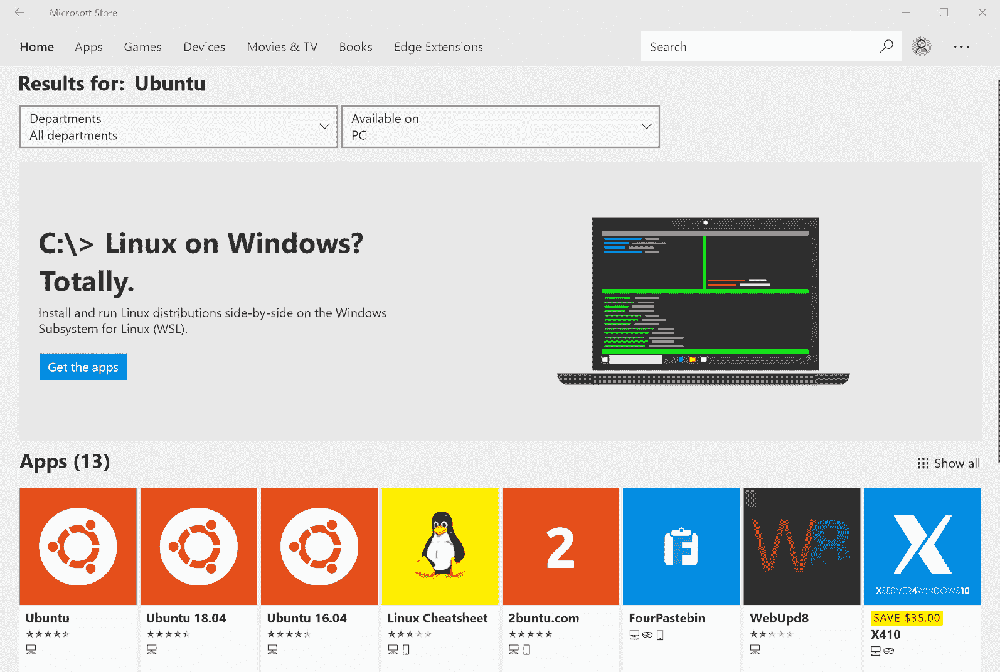
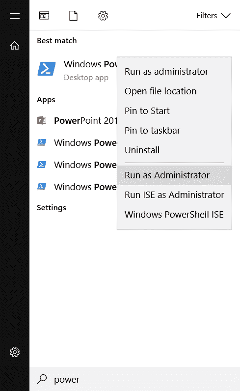
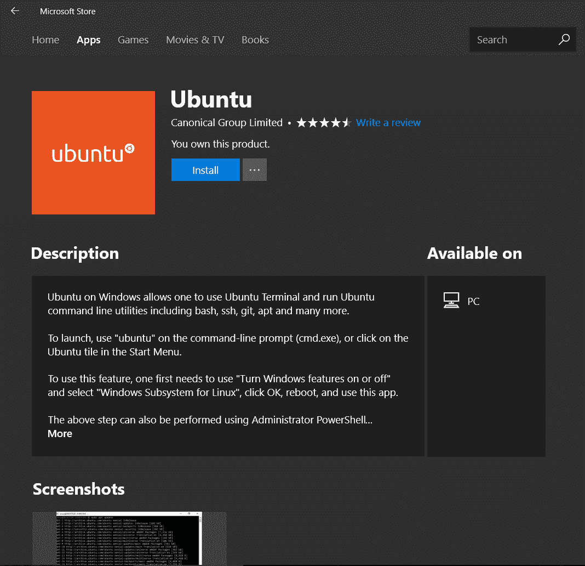
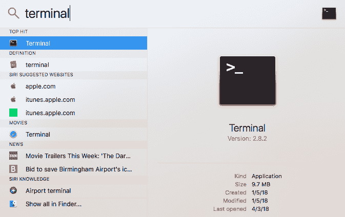
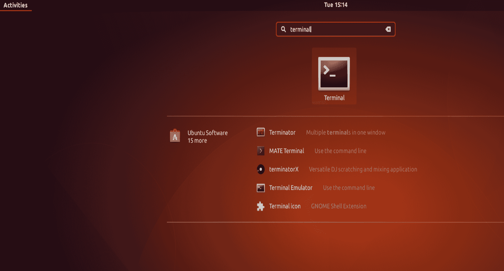
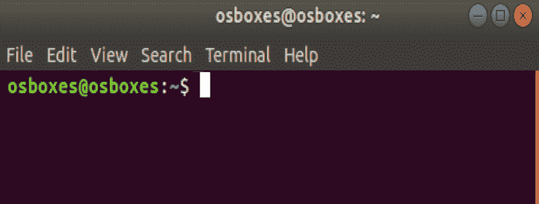

# 命令行中的数据科学与其设置

“一开始……就是命令行” 多年前，我们没有处理分布式计算的高级框架，也没有能够智能地读取文件并给出准确结果的应用程序。如果我们有这些，通常代价非常昂贵，或者只适用于小范围的问题集，极少数人能接触到这项技术，而且它通常是专有的。

对于数据科学新手来说，你可能仅使用命令行做过少量操作。也许你使用`mv`命令将文件从一个地方移动到另一个地方，或使用`cat`命令读取文件。或者，你可能从未使用过命令行，至少没有用于数据科学。在本书中，我们希望向你展示一些工具和方法，让你能够在本地执行一些日常任务，而无需使用当前流行的框架。

我们编写这本书是为了那些几乎没有命令行经验的人，或者那些从事大量数据提取、建模、解析和分析工作的人。这并不意味着，如果你已经有很多命令行经验（很多 DevOps 和系统工程师都有），你就不应该阅读本书。事实上，你可能会学到一些之前没有使用过的命令和技巧。

本章我们将涵盖以下主题：

+   命令行的历史

+   以语言为中心的外壳

+   为什么要使用命令行？

我们还将逐步讲解命令行的设置和配置，涵盖以下操作系统：

+   Windows 10

+   Mac OS X

+   Ubuntu Linux

如果你正在使用不同的操作系统，我们建议从云服务提供商那里获得一个实例，或使用本书中提供的 Docker 容器。

# 命令行的历史

从最早的电子机器开始，人们就一直在努力以与人类之间相同的方式与其进行交流。但由于早期计算机系统的自然语言处理技术尚未成熟，工程师们很快就用电传打字机替代了早期计算机的打孔卡片、旋钮和拨盘：这种类似打字机的机器使得键入输入和将文本输出到显示器成为可能。电传打字机很快被视频显示器所取代，使得图形显示的世界成为可能。作为当时的一个新奇事物，电传打字机填补了图形环境中缺失的功能，因此，终端仿真器应运而生，成为现代命令行的接口。这些终端背后的程序最初是计算机的一部分：居民监控程序，能够启动任务、检测任务完成并进行清理。

随着计算机复杂性的增加，控制它们的程序也变得更加复杂。居民监控程序让位于能够在多个任务之间分配时间的操作系统。在 1960 年代初期，路易·普兹因灵感启发，提出了一个出色的想法——使用输入到计算机的命令作为一种程序，作为操作系统的*外壳*。

"在为 CTSS 编写了几十个命令之后，我到达了一个阶段，我觉得命令应该可以作为构建更多命令的构件，就像子程序库一样。因此，我编写了 RUNCOM，一种类似于 shell 的工具，驱动命令脚本的执行，并进行参数替换。这个工具立即受到了欢迎，因为它使得人们可以在晚上回家时，将长时间运行的 runcoms 留给它执行，直到第二天早上。"

以这种方式进行脚本编写和工具的重用，将成为编程计算新世界中根深蒂固的一个主题。Pouzin 为可编程 shell 提出的概念，进入了 1960 年代 Multics 的设计和理念，并传承到 Bell Labs 的继任者 Unix 中。

在 1978 年的《Bell System Technical Journal》中，Doug McIlroy 写了以下关于 Unix 系统的内容：

"在 UNIX 系统的构建者和用户中，有许多格言广泛流传，用以解释和促进其独特的风格：让每个程序只做好一件事。要做一个新任务，不要通过增加新功能来使旧程序复杂化，而是重新构建新的程序。"

+   期望每个程序的输出成为另一个尚未知的程序的输入。不要让输出充满无关的信息。避免严格的列格式或二进制输入格式。不要坚持交互式输入。

+   设计并构建软件，甚至是操作系统，应该尽早进行测试，理想情况下是在几周内完成。不要犹豫，丢弃笨拙的部分并重新构建它们。

+   在编程任务中，优先使用工具而非没有技能的帮助，即使你必须绕道去构建这些工具，并且预期在使用完之后会抛弃其中一些工具。

这就是 Unix 哲学的核心，也是使命令行不仅仅是启动程序或列出文件的方式，而是一个强大的社区构建工具集合，可以以简洁的方式共同处理数据的关键理念。实际上，McIlroy 接着举了一个极好的例子，说明这一理念如何在数据处理方面带来成功，甚至是在 1978 年：

"文件的意外用途比比皆是：程序可以编译成可运行的文件，也可以排版以便出版，且无需人工干预；为出版而准备的文本可以作为统计英语研究的素材，帮助数据压缩或密码学研究；邮件列表变成了地图。自由格式的文本的普遍存在，即便是在'数据'文件中，也使得文本处理工具在许多严格的数据处理功能中发挥了重要作用，比如字段重排、计数或汇总。"

程序员需要访问简单而强大的组件，因此他们需要一种简单的方式来构建、重用和执行更复杂的命令和脚本，以完成特定的处理任务。这时，早期的全功能命令行 shell —— Bourne shell 就应运而生了。Bourne shell 是由 Stephen Bourne（也在贝尔实验室工作）于 1970 年代末为 Unix 的 System 7 开发的，它从一开始就为像我们这样的程序员设计：它拥有所有脚本工具，可以很好地利用社区开发的单一功能工具。它是一个恰到好处的工具，在恰当的时间和地点；几乎所有的 Unix 系统今天都基于 System 7，且几乎所有的系统仍然将原始的 Bourne shell 作为一个选项。在本书中，我们将使用 Bourne shell 的后裔 —— Bash，它是 1989 年为 GNU 项目重写的 Bourne shell，结合了 Bourne shell 本身的最佳特性以及它的若干早期衍生版本的功能。

# 我们并不想去贬低其他的 shell，但是...

在本书中，我们决定专注于使用 **Bourne 再次 shell**（**bash**），有多个原因。首先，它是最流行的 shell，你可以在任何地方找到它。事实上，对于大多数 Linux 发行版来说，bash 是默认 shell。它是学习 shell 的绝佳选择，且非常易于使用。如果你遇到困难，bash 有大量的示例和资源可供参考。可以肯定地说，由于其极高的普及度，几乎可以在当今的任何系统上找到它。从数据中心的裸机安装到云端实例，bash 都在那儿，已安装并等待输入。

你可以选择许多其他的 shell，例如 *Z* shell（`zsh`）。*Z* shell 相对较新（“新”指的是 1990 年发布，在 shell 世界里已经算新了），并提供了许多强大的功能。其他 notable 的 shell 包括 `tcsh`、`ksh` 和 `fish`。*C* shell（`tcsh`）、Korn shell（`ksh`）和 **友好的交互式 shell**（**fish**）至今仍被广泛使用。FreeBSD 将 `tcsh` 设置为 root 用户的默认 shell，而 `ksh` 在许多 Solaris 操作系统中仍被使用。Fish 也是一个很好的入门 shell，拥有许多功能，帮助用户在使用 shell 时不至于迷失方向。

虽然这些 shell 仍然非常强大和稳定，但我们将重点使用 bash，因为我们希望在多个平台之间保持一致性，并帮助你学习一个已经存在了 30 年的、非常活跃且流行的 shell。

# 面向语言的 shell

作为一名数据科学家，我相信你在 Python 和 Scala 上做了很多工作，或者至少听说过这两种语言。我们两个最喜欢的 Shell 替代品是 Xonsh 和 Ammonite。Xonsh（[`xon.sh/`](https://xon.sh/)）是一个由 Python 3.4 支持的 Python 驱动 Shell，而 Ammonite（[`ammonite.io/`](http://ammonite.io/)）是一个由 Scala 2.11.7 支持的 Scala 驱动 Shell（截至撰写本文时）。如果你在日常工作中经常使用 Python 或 Scala，我们建议你在掌握了 bash 命令行之后，也查看这些 Shell 替代品。

# 那么，为什么要使用命令行呢？

由于数据科学领域仍然相对较新（以前被称为**运营研究**），工具和框架也是相对较新的。话虽如此，命令行已经存在了将近 50 年，至今仍然是最强大的工具之一。如果你熟悉解释器，命令行将变得很容易。把它看作是一个实时实验和查看结果的地方。你输入的每个命令都是交互执行的，当你调用一个 bash 脚本运行时，它是顺序执行的（除非你决定不这样做，在后面的章节中会详细介绍）。正如我们所知，实验和探索是数据科学试图实现的大部分内容（而且这是最有趣的部分！）。

我正在与一位新毕业的数据科学学生讨论解析文本，并问道，“你会如何处理一个小文件，并统计单词出现的次数？”现在每个人都熟悉臭名昭著的 Hadoop 单词计数示例。它被认为是数据科学的“Hello, World”。

我收到的答案有点震惊但是意料之中。学生立即回答说他们会使用 Hadoop 来读取文件，将单词标记化以形成键/值对，减少所有分组在一起的键和值，并累加出现次数。学生并没有错，事实上，这是一个完全可以接受的答案。特别是如果文件太大无法在单一系统上处理（大数据），你已经有了扩展代码。

话虽如此，如果我告诉你有一种更快的方法可以获得结果，而不需要在 Java 中编程并设置集群或者在本地运行 Hadoop，你会怎么想？事实上，只需要一行代码就能完成任务？看看下面的代码：

```py
cat file.txt | tr '[:space:]' '[\n*]' | grep -v "^$" | sort | uniq -c | sort -bnr
(tr '[:space:]' '[\n*]' | grep -v "^$" | sort | uniq -c | sort -bnr )<file.txt
```

这看起来可能有点多，尤其是如果你之前从未使用过命令行，别急，我们可以一步步来。`cat` 命令按顺序读取文件并将内容输出到标准输出。`|`，也叫管道符或管道操作符，将一系列命令通过标准流连接起来，使每个进程的输出（`stdout`）直接作为下一个进程的输入（`stdin`）。`tr`（翻译）命令从 `cat` 中读取输入（通过 `|`），并将结果输出到标准输出，作用是将空格替换为换行符。`grep` 命令非常强大，是用于数据解析时最常用的命令。`grep` 用于搜索纯文本数据中与正则表达式匹配的行。在本例中，`grep` 用于去除空行。`sort` 命令用于排序！你会注意到，很多命令的命名都直接反映了它们的功能。`sort` 命令会将其输入的行或其参数列表中列出的文件按排序顺序打印出来。`uniq` 命令用于将文件中相邻的相同内容的行合并为一行。它通常与 `sort` 命令一起使用。在本例中，使用了 `uniq -c` 来统计每个元素的出现次数。最后，`sort -bnr` 会以数值逆序排序，并忽略空格。

如果你对示例中的命令感到陌生，别担心。命令行还附带了每个命令的手册页面。你只需输入 `man` 加上命令名来查看手册页面。你甚至可以输入 `man man` 来了解 `man` 命令的作用！试试看，输入 `man tr` 或 `man sort`。哦，你还没设置好命令行？其实比你想象的简单，我们可以在几分钟内帮你配置好，所以我们现在开始吧。

# 设置 Windows 10 环境

我们希望读者注意，PowerShell 无法运行本书中列出的示例。然而，微软已经在 Windows 10 1607 版本及更高版本中推出了 Windows 子系统 Linux。安装也很简单：打开 Microsoft Store，搜索 `Ubuntu`（一个 Linux 发行版），然后安装它：



在 Windows 10 1607 版本及更高版本中，你可以选择 Linux 发行版并在 Windows 上原生运行 Linux。在本例中，我们将使用 Ubuntu 作为 Windows 10 的子系统来设置我们的工作环境。确保你安装了最新版本的 Windows 以便利用 WSL（Windows Subsystem for Linux）；至少，你需要安装 Windows 10 秋季创作者更新才能继续。另外，请注意，WSL 在编写本文时仍处于测试阶段。如果你不想安装测试版软件，建议选择其他替代方案，如 AWS 上的 EC2 实例，或者直接跳到本书的 *Docker* 部分：

1.  转到开始菜单并搜索 PowerShell：



1.  双击 Windows PowerShell 并点击“以管理员身份运行”。

1.  输入以下命令以启用 WSL：

```py
Enable-WindowsOptionalFeature -Online -FeatureName Microsoft-Windows-Subsystem-Linux
```

以下内容应显示：


1.  系统会要求你确认选择。请使用 *Y* 或按 *Enter* 键：


1.  按 *Y* 重新启动。

系统重启后，请执行以下操作：

1.  打开“开始”菜单并搜索“Store”。

1.  搜索 Ubuntu：


1.  点击安装：



1.  点击启动。

1.  系统会要求你创建用户名和密码，请创建一个并确保记住这些信息，因为你将在本书中多次用到：


1.  恭喜！你现在已经完成了 Linux 在 Windows 10 上的安装和设置。

安装以下工具，因为我们将在本书中使用它们：

```py
sudo apt update
sudo apt install jq python-pip gnuplot sqlite3 libsqlite3-dev curl netcat bc
pip install pandas
```

# 在 OS X 上设置

OS X 已经预装了完整的命令行系统，默认 shell 为 bash。要访问该 shell，请点击右上角的放大镜图标，并在对话框中输入 `terminal`：



这将打开一个 bash 终端：


和其他 bash shell 一样，这个终端并没有安装所有内容，因此键入以下命令来安装本书中使用的必要安装工具和命令行工具：

```py
/usr/bin/ruby -e "$(curl -fsSL https://raw.githubusercontent.com/Homebrew/install/master/install)"
brew install jq sqlite gnuplot python netcat bc
pip3 install pandas
```

在 OS X 中，该脚本会安装一些安装工具，包括 `pip` 和 `homebrew`。然后，利用这些工具来安装本书中使用但没有默认安装的命令，包括 `jq`、`gnuplot`、`sqlite` 和 `pandas`。

在 OS X 中需要注意的一点是，某些标准工具的构建方式与其他基于 Debian 系统的工具（例如本章中讨论的系统）有所不同。在某些情况下，OS X 工具的工作方式略有不同或提供不同的选项。如果是这种情况，我们已经在文中进行了说明。

# 在 Ubuntu Linux 上设置

Ubuntu 配有完整的内建命令行 shell，通常使用 bash 作为默认 shell。不同的窗口管理器有略微不同的打开终端窗口的方式。例如，在 Ubuntu 17.10 Artful（位于 [`www.osboxes.org/ubuntu/`](https://www.osboxes.org/ubuntu/)）的图像中，可以通过点击左上角的“Activities”并在对话框中输入 `terminal` 来打开终端：



这将弹出命令行提示符：



和其他 bash shell 一样，这个 shell 并没有安装所有内容，因此请键入以下命令来安装我们将在本书中使用的安装程序和命令行工具：

```py
sudo apt update
sudo apt install jq python-pip gnuplot sqlite3 libsqlite3-dev curl netcat bc
pip install pandas
```

在 Ubuntu 中，该脚本会安装一些安装工具，包括 pip。然后，利用这些工具来安装本书中使用但没有默认安装的命令，包括 `jq`、`gnuplot`、`sqlite`、`curl` 和 `pandas`。

# 设置 Docker

如果有一种方法可以获取预安装了所有命令的镜像，并且您可以在大多数主要操作系统上运行它而无需任何问题，那将会怎样？这正是 Docker 提供的功能，您可以在几分钟内快速启动和运行：

1.  访问 [`www.docker.com/community-edition`](https://www.docker.com/community-edition)，并安装适合您操作系统的 Docker 版本。

1.  运行以下命令以获取 Docker 镜像：

```py
docker run -ivt nextrevtech/commandline-book /bin/bash
```

# 摘要

命令行有着悠久的历史，对新手来说可能会感到非常陌生。在本章中，我们介绍了环境设置步骤，以便您能够跟随本书中的示例。基本命令将介绍您成功所需的内容，接着是获取我们可以使用的数据集。我们将涵盖所有的 shell 魔法，如后台进程、编写 shell 函数、基本的 shell 控制流构造、可视化结果、处理字符串、模拟数据库功能、简单的数学构造，最终在倒数第二章中将所有这些内容综合起来，以奇妙的魔力吸引人。

您现在已经安装和配置了探索本书其余部分所需的一切。正如您所见，命令行可以在几乎任何地方运行，这使它成为您工具箱中必不可少的工具。

在接下来的章节中，我们将使用新安装的命令行环境运行一些基本命令，学习如何自定义 shell，并学习在遇到困难时如何使用内置帮助。
