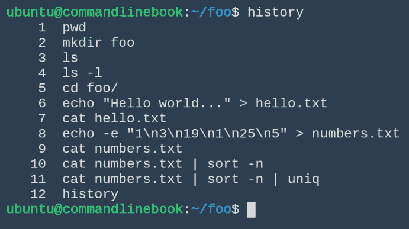
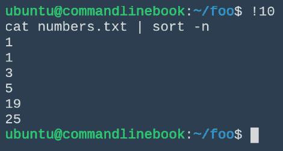
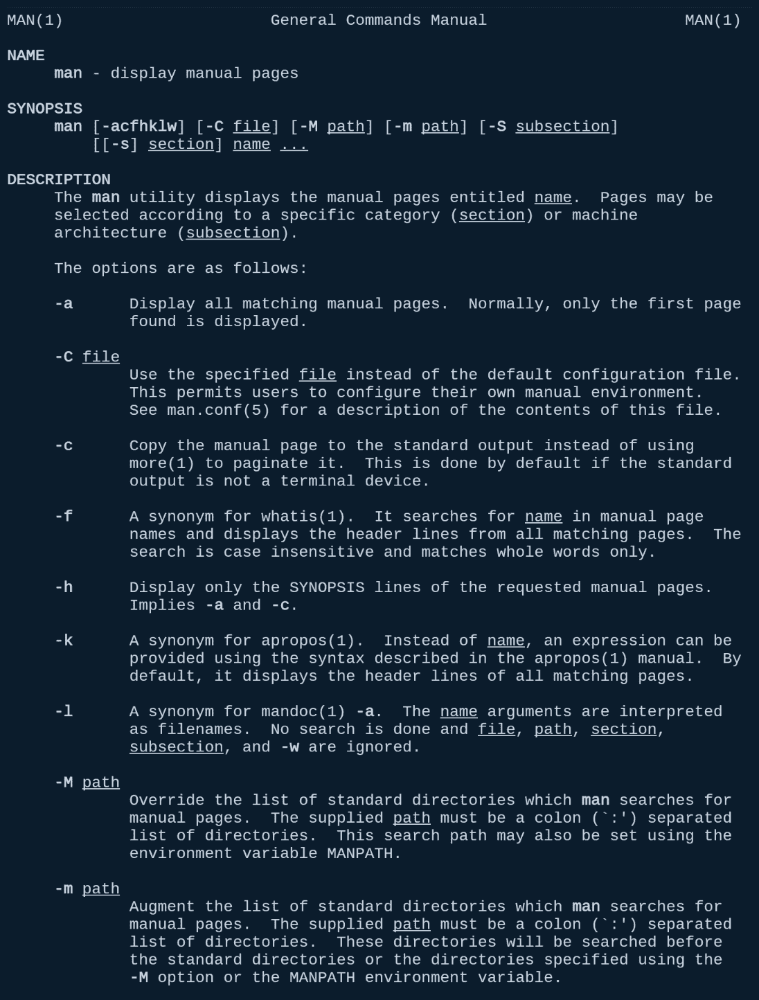
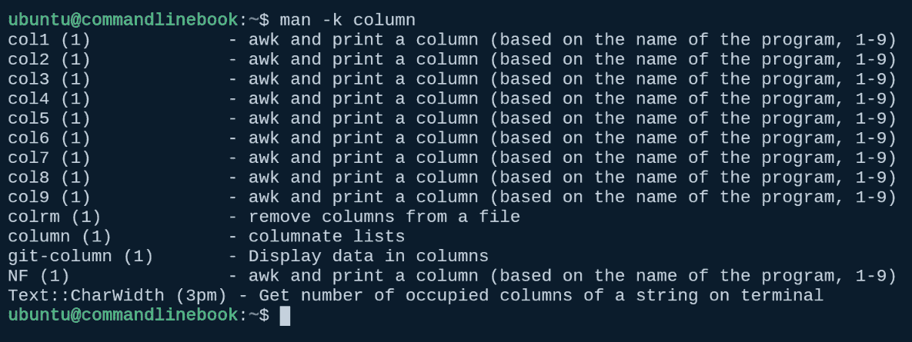
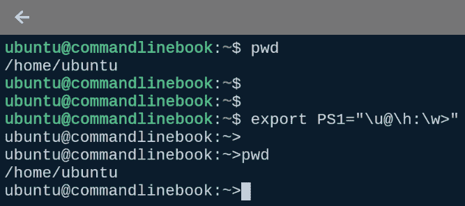

# 必备命令

现在我们已经设置并安装了命令行，接下来我们将介绍一些被认为是基础的日常命令。对这些基本命令的理解将是我们学习后面本书中高级命令的基础。

本章我们将涵盖以下主题：

+   基本命令行导航

+   重定向输入和输出

+   如果卡住了，哪里可以寻求帮助

+   如何根据个人喜好自定义 Shell

# 必备命令

哇...等一下，我们需要先讲解一些关于命令的基础知识。命令是由**POSIX**（**可移植操作系统接口**）兼容的**操作系统**（**OS**）运行的一个进程。OpenGroup 维护这一标准，并且它已被作为 IEEE 标准正式批准（[`pubs.opengroup.org/onlinepubs/9699919799/`](http://pubs.opengroup.org/onlinepubs/9699919799/)）。在 POSIX 环境中，运行的进程将拥有一个环境、当前工作目录、命令行（调用该命令的路径名称以及任何参数），并且会在交给您的命令之前，连接一系列文件描述符，包括`stdin`、`stdout`和`stderr`（分别通过整数 0、1 和 2 来表示）。

现在，了解了一些背景知识并安装了命令行，你准备好了，我们实际上可以开始执行命令了。接下来我们将介绍一些基础的日常命令。对于那些准备深入了解的人，让我们讨论一下如何定位我们可以执行的命令。

定位命令就像是在一个文件柜中查找文件，我们称之为文件系统。命令实际上是存储在文件柜中的文件，文件夹或目录则用于将文件组织成层次结构。每个目录可能包含多个文件或其他目录，并且有一个父目录。要打开我们的文件柜，我们需要从层次结构的顶部开始，即根目录`/`。你需要了解的第一批命令涉及遍历文件系统并确定位置的命令。

当你登录到命令行时，你很可能会进入你的主目录。这个目录因系统而异。要查看你所在的位置，可以尝试`pwd`（当前工作目录）命令：

```py
pwd
```

执行前面命令后，您应该看到如下内容：


这里，`ubuntu`是你的用户名。这意味着你当前在`ubuntu`目录中，该目录位于主目录`/`下。从这里，如果你尝试使用相对路径名打开文件，即不以`/`开头的路径，命令行将会在你当前的目录中查找该文件（你可以在不改变当前目录的情况下操作其他目录中的文件，我们稍后会讨论这个）。

你可能想创建自己的目录。为此，我们可以尝试以下命令：

```py
mkdir foo
```

执行前面命令后，您应该看到如下内容：


这将使目录`foo`在你当前的目录内创建。如果该命令成功完成，它将不会打印任何内容。要查看我们刚刚创建的目录，可以使用列出命令：

```py
 ls
```

运行上面命令后，你应该看到以下内容：


它应该单独占一行。我们可能想打印更多关于目录的信息。在这种情况下，我们可以向`ls`命令传递一些标志，以改变它的操作。例如，输入以下内容：

```py
ls -l
```

运行上面命令后，你应该看到以下内容：


现在理解这里打印的所有内容并不太重要，但我们可以看到`foo`是一个目录，而不是数据文件（从前面的`d`代码可以看出），还显示了它的创建日期和时间。这是 UNIX 命令中的常见模式。命令的默认版本执行一个操作，而通过传递如`-l`这样的标志，可以修改它的行为。

有时候，命令会带有参数，命令的标志也可能带有参数。命令的一般形式可能如下所示：

```py
<command> -a <argument> -b -c -d <argument> <command arguments>
```

这里，`a`、`b`、`c`和`d`是命令的标志。这些命令具体是什么，以及它们的作用，取决于具体的命令。

让我们进入我们刚刚创建的目录，尝试操作一些数据文件：

```py
cd foo
```

运行上面命令后，你应该看到以下内容：


`cd`（或更改目录）命令可以更改你当前的工作目录。现在，让我们将两个命令组合起来，创建一个数据文件。稍后我们会详细讨论这个，但现在我们只需要一个可以操作的文件：

```py
echo “Hello world...” > hello.txt
```

运行上面命令后，你应该看到以下内容：


这不会产生任何输出，但它会创建一个名为`hello.txt`的文件（因为我们告诉 Shell 使用`>`将`stdout`重定向到文件），该文件包含单行文本：Hello world…。要查看该文件内容，我们可以使用连接命令：

```py
cat hello.txt
```

运行上面命令后，你应该看到以下内容：


这将打印出任何文件的内容。如果我们只想查看文件的前几行或后几行，可以使用`head`和`tail`命令，而不是`cat`。

如果这些内容听起来很简单，原因很简单：UNIX 中的每个命令都旨在执行一项任务，并且做到最好。通常可以使用选项来调整命令的行为。当我们开始使用管道和重定向将多个命令组合在一起时，真正有趣的事情就开始发生了。

你看，几乎每个 UNIX 命令都有某种方式来输入数据。然后，命令会接收输入，并根据其参数和标志，将输入转化为其他内容并输出。我们可以使用管道符号`|`，将一个命令的输出传递给另一个命令的输入。这种简单但极其强大的想法能让我们通过少量的命令做很多事情。

让我们试一个简单的例子：使用`echo`命令，并加上`-e`标志，告诉它注意控制字符，创建一个多行文件（通过使用`\n`），每行上有一些数字。

```py
echo -e "1\n3\n19\n1\n25\n5" > numbers.txt
cat numbers.txt
```

执行上述命令后，你应该看到以下内容：


现在，假设我们想查看这些数字按顺序排序。`sort`命令正是完成这项工作的。通过使用一个标志来排序，将行视为数字而不是字符串，我们可以将`cat`命令的输出通过管道传递给`sort`函数：

```py
cat numbers.txt | sort -n
```

执行上述命令后，你应该看到以下内容：


如果我们想查看按顺序排列的唯一数字，我们可以将输出重新通过管道传递给`uniq`命令，`uniq`会返回给定输入中的唯一行：

```py
cat numbers.txt | sort -n | uniq
```

执行上述命令后，你应该看到以下内容：


依此类推，我们可以一点点地构建我们想要的管道，并在过程中进行调试。你将在本书中看到这种技巧。

最后再提一点：在这些命令中，我们看到过`>`符号，也就是重定向。重定向可以用于很多事情，但大多数时候它是用来将命令的输出重定向到文件：

```py
<some pipeline of commands>  > <filename>
```

这将用管道的输出替换名为 filename 的文件内容。

使用这些简单的工具，你就可以开始用 bash 进行数据处理了。

# 导航命令行

这里有几个有用的命令行导航技巧，虽然它们是可选的，但会提高你的生活质量。本节内容包含了一些这样的技巧。

Bash 默认会保存你的命令历史记录，甚至跨会话保存。这非常有用，因为有时我们会犯一些小错误，不想重新输入整个命令，或者我们希望重复执行相同的命令。要查看历史记录，可以输入以下命令：

```py
history
```

执行上述命令后，你应该看到以下内容：



你可以看到输出命令的编号列表。要重复一个编号命令，你可以使用叹号符号`!`。`!<number>`将逐字重复该编号命令：

```py
!10
```

执行上述命令后，你应该看到以下内容：



双叹号`!!`将重复执行最后一条命令。

你还可以通过键盘上的上下箭头键循环浏览命令列表。

您可以通过在空命令行中输入*Ctrl* + *R* 来执行反向命令搜索。然后开始输入您想要搜索的命令的某个子串。Bash 会尝试在您的历史记录中找到匹配的命令。如果有多个匹配的命令，最后一个将被选中，但您可以通过反复按 *Ctrl* + *R* 来循环浏览其他命令。

`cd -` 会带您回到上一个目录，即使它在系统的另一端。

一些人可能会困惑于按下*Ctrl* + *S*。这将停止所有输出到终端会话，看起来好像会话被冻结了。要解冻会话，只需按*Ctrl* + Q。

# 获取帮助

有许多资源可供使用，既包括命令行内置的资源，也包括外部资源。您总会使用到的一个命令是 `man` 命令（即手册页的缩写）。例如，输入 `man man` 来查看 man 命令能做什么。您应该会看到类似下面的内容：



让我们来看两个我们几乎每天都会用到的选项，`man -a` 和 `man -k`，因为您将经常使用它们在命令行上查找手册页。请在命令行中输入`man -k .`，以查看系统中安装的所有手册页。如果您和我们使用的是相同的 Linux 发行版，大约有 2,000 个手册页面刚刚滚动过去，真的是很多内容要读！我们不指望您从头开始阅读每一篇（如果您睡不着，随时可以阅读），所以我们来找找更智能的方式来浏览这些手册。

如果您想慢慢浏览整个手册列表，可以运行 `man -k . | more`，然后不断按空格键来查看整个列表。然而，这样效率不高。请注意，在前面的示例中，我们使用的是一个点（.）来搜索，而不是字符串。让我们再试一次，这次去掉点，输入一个单词：

```py
man -k column
```

运行前述命令后，您应该看到以下内容：



好多了！现在我可以快速查看 `column` 命令是否有手册页，而不用翻阅成千上万的页面了。

手册非常棒，但有时它并不完全够用。这时，互联网就派上用场了。像 Stack Overflow 和 Stack Exchange 这样的网站，在尝试解决命令的难题时非常有价值，或者它们能提供很好的示例。互联网是一个大地方：总会有人在做您正在做的事情，而且他们可能遇到过和您一样的问题。已经有的回答可能正好解决了您的问题，或者您可以提交一个新问题。

# 自定义 shell

你可能注意到每次输入命令时，左侧都会出现一个提示符。根据你的系统，提示符可能看起来与我的略有不同。我们来解决这个问题！比如，难道不是很好，如果你不需要每次都输入`pwd`来查看当前所在的目录吗？现在，输入以下命令试试看：

```py
export PS1="\u@\h:\w>"
```

你应该会看到类似这样的输出：



很酷，对吧？你可以将这个命令添加到你的`~/.bash_profile`文件中，以保持它的永久性。你可以使用任何你喜欢的编辑器（`vim`、`nano`、`emacs`）来打开这个文件。例如，我们使用了`vim`：

```py
vim ~/.bash_profile
```

还有一个非常简单的生成器，位于[`ezprompt.net/`](http://ezprompt.net/)，你可以使用它进一步自定义你的 Bash 提示符。快去看看吧！

现在你已经理解了基本概念，并且完全自定义了你的 Bash 提示符，我们接下来就可以开始处理实际数据集了！

# 概述

如你所见，命令行对于日常任务来说非常强大。我们学习了如何做一些基础的操作，比如创建文件和目录，如何通过命令行浏览系统。我们还学习了如何查阅手册页、获取帮助，以及如何自定义 Shell。

在下一章，我们将把你在这一章学到的知识应用到一个真实的数据集中。随时可以回到这一章，它会在本书的其余部分中非常有帮助。
