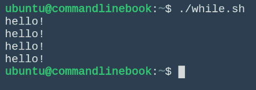
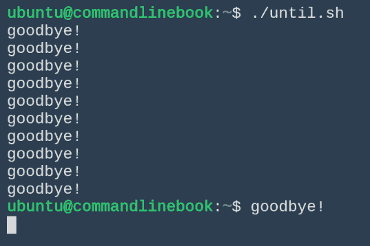

# 循环、函数和字符串处理

有时，魔法般的单行代码不足以处理数据。循环和条件语句使我们能够以有趣的方式遍历数据，而无需坚持默认行为。

Bash 将非二进制文件和流视为字符的集合。我们通常认为这些字符是由某种空白字符分隔的字符串组。可以理解，命令行世界中一些最有用和最常见的工具正是那些用来搜索和操作这些字符串的工具。

本章将涵盖以下主题：

+   `for`循环

+   `while`循环

+   文件测试条件

+   数字比较

+   字符串案例语句

+   使用正则表达式和`grep`进行搜索和过滤

+   使用`awk`、`sed`和`tr`进行字符串转换

+   使用`sort`和`uniq`对字符串列表进行排序

在此过程中，我们将看到如何将一个程序的结果通过管道传递给另一个程序，从而获得我们想要的结果。

# 一次，两次，三次女士循环

很少有命令行工具内置了隐式的循环和条件判断。通常，任务只会在输入流的每一行上操作，然后终止。Shell 提供了足够的控制流和条件语句来解决许多复杂问题，弥补了命令行工具在数据操作上的不足。

万能的`for`循环是一种常见的循环惯用法，然而，Bash 的`for`循环对于习惯传统语言的用户来说可能有些陌生。`for`循环允许你遍历一个单词列表，并将每个单词赋值给一个变量进行处理。例如，（言外之意）：


通常，我们希望在`for`循环中使用更传统的数字范围。生成数字范围的`POSIX`方法是使用`seq`命令，像这样`seq -- $(seq 1 1 5)`，它将生成从 1（第一个参数）到 5（第三个参数）的数字，步长为 1（第二个参数）。

在以下示例中，您会注意到我们使用了括号扩展`{}`和圆括号`()`。有关更多信息，请查看[`ss64.com/bash/syntax-brackets.html`](https://ss64.com/bash/syntax-brackets.html)。

现代版本的`bash`提供了一个简便的缩写：


我们还可以设置序列递增的步长：


或者，我们可以使用 Bash 支持的类似 C 语言的语法：


可能我们需要进行指定次数的循环，但我们也可以传递一个子命令的结果来生成要循环的列表。例如，我们可能想对当前目录中的每个文件执行某些操作：


通常，我们可能需要测试一个或多个条件，特别是在循环中。Bash 有一个`if-then`结构，像大多数语言一样：


括号中的语句是一个测试，bash 包含一组特殊测试，例如`-f`用于常见任务。以下是一些最常见的测试：

| **测试类型** | **参数** | **描述** |
| --- | --- | --- |
| 文件系统 | `-O` | 如果文件存在并且由有效的用户 ID 所有，则为`True` |
| 文件系统 | `-f` | 如果文件存在并且是常规文件，则为`True` |
| 文件系统 | `-G` | 如果文件存在并且由有效的组 ID 所有，则为`True` |
| 文件系统 | `-r` | 如果文件存在并且可读，则为`True` |
| 文件系统 | `-w` | 如果文件存在并且可写，则为`True` |
| 文件系统 | `-x` | 如果文件存在并且可执行，则为`True` |
| 文件系统 | `-s` | 如果文件存在并且大小大于零，则为`True` |
| 文件系统 | `-h` | 如果文件存在并且是符号链接，则为`True` |
| 算术 | `<=` | 小于等于 |
| 算术 | `>=` | 大于等于 |
| 算术 | `<` | 小于 |
| 算术 | `>` | 大于 |
| 算术 | `!=` | 不等于 |
| 算术 | `=` | 等于 |

像其他语言一样，我们也可以包括`else-if`测试，最后是`else`，当没有其他条件匹配时：


尽管存在`if-else`构造，大多数 Shell 脚本使用`&& (AND)`和`|| (OR)`的管道语义。我们在第三章中简要提到过这个内容，*获取和处理数据以及分离处理和终端复用器*，但这里有一个更详细的例子：

```py
[ 0 = 1 ] && echo "a" || ([0==2] && echo b || echo c)
[ -f /myconfig ] && read_params /myconfig
```

# 这是我们所知的世界末日，使用`while`和`until`。

让我们探索另外两种帮助迭代的选项。`while`构造允许在控制`while`循环的命令成功退出的前提下，反复执行一个命令列表或一组命令。来看一个例子：

假设我想在脚本中打印`"hello!"`字符串四次——既不多也不少。我们可以通过以下方式做到：


让我们保存并运行这个脚本，看看会发生什么。

别忘了用`chmod -x`让这些脚本可执行。

执行脚本后会产生以下输出：



注意，在脚本中，我们创建了一个名为`i="0"`的变量。这将`i`变量设置为零。你看到了`while [ $i -lt 4 ]`块吗？这使得我们可以在`i`变量小于整数`4`时执行循环。试着玩一下这个代码，帮助你更好地理解。还有，你可以通过`man `获取更多信息。

在我们的`while`脚本中，我们将输出计数到四。现在让我们使用`until`构造倒计时并提供`goodbye!`输出：



# 简单的情况

字符串比较通常使用测试操作符``。在 bash 中不推荐这样做，因为有更方便的字符串比较格式，使用`case`语句。下面是一个简单的例子：

```py

 testcase() {
 for VAR; do
 case “${VAR}” in
         '') echo “empty”;;
         a) echo “a”;;
        b) echo “b”;;
        c) echo “c”;;
        *) echo “not a, b, c”;;
 esac
 done
 }
 testcase '' foo a bar b c d
```

`testcase`函数允许我们通过将其包装在`for`循环中，测试`case`语句。该循环将每个函数参数分配给`VAR`变量，然后执行`case`语句。对于`foo a bar b c d`这些参数，我们可以预期以下输出：

```py
 empty
 not a, b, c
 a
 not a, b, c
 b
 c
 d

```

# 不必理会那个将你注意力引开的魔术师

循环对于按迭代方式处理数据序列非常有用，但有时在做这些工作的同时，会得到大量无关的输出。这时，轮到我们的魔术师登场：输出重定向操作符`*>*`。该操作符将输出定向到指定的文件或文件描述符。我们之前谈过文件描述符，它们是操作系统用来标识已打开文件句柄的整数，默认情况下，每个进程都有三个已打开的文件描述符：`stdin`、`stdout` 和 `stderr`。默认的文件描述符，通常用`fd#`表示，`fd0`是标准输入，`fd1`是标准输出，`fd2`是标准错误。`*>*`操作符默认将`stdout`重定向，相当于`1>`，除非它前面跟着一个整数文件描述符。让我们看一些输出重定向的例子，避免在理解我们所说的内容时迷失：

```py
ls /
ls / >/dev/null
ls /foobar 2>/dev/null
ls / /foobar >stdout_and_stderr.log 2>&1
ls / /foobar >stdout.log 2>stderr.log
ls / /foobar 2>&1 >/dev/null
```

普通消息会发送到标准输出，并在终端窗口中以文本形式呈现。比如，`ls /`会将根文件系统的内容显示在终端中。在第二次调用时，我们使用`>`表示`stdout`应被重定向到`/dev/null`，这样就会丢弃输出。第三个示例将错误消息发送到`dev/null`，使它们不会显示在终端中。第四个示例将`stdout`重定向到名为`stdout_and_stderr.log`的文件，然后使用`&1`将`stderr`复制到与`stdout`相同的位置。第五个示例将`stdout`重定向到`stdout.log`，并将`stderr`重定向到`stderr.log`。第六个示例没有将`stderr`重定向到`/dev/null`，而是将`stderr`重定向到`stdout`当时所指向的位置——终端，然后`stdout`被重定向到`/dev/null`。这表明操作符的顺序非常重要，在定义顺序中要小心确保赋值操作的顺序正确。最后要提到的一点是，因为`stdout`是文件描述符，而不是终端，所以可以将其他输出定向到终端，并将`stdout`定向到另一个文件描述符，这样就不会导致终端输出。

有三个不常用的重定向操作符：`<`用于输入重定向，`>>`用于输出追加重定向，`<<`用于`HEREDOC`。输入重定向用于将数据输入到管道中，示例如下：

```py
cat <stdout.log | grep lines

```

这将把`stdout.log`读入`cat`命令的标准输入，`cat`命令会将其输出写入管道操作符。输入重定向实际上没有太多复杂的内容，因为管道操作符会隐式地将前一个命令的`stdout`设置为下一个命令的标准输入。我们也提到了追加操作符`>>`，需要指出的是，`>`重定向操作符会将文件内容截断为零再写入。如果数据需要在多次运行间保留，这种行为是不希望出现的。为了明确，`>`会将`keys.log`中的数据截断：

```py
grep keyword > keys.log
```

另一种选择是追加以下内容：

```py
grep keyword >> keys.log
```

最后，`heredoc`操作符`<<`，它通过一个关键字`<< KEYWORD`来替换标准输入，输入流是由预定义的文本流组成的。这种方式可以用来截断一个`options.conf`文件，并将三个选项值写入文件：

```py
cat <<EOF >options.conf
option=true
option2=false
option3=cat
EOF
```

# 正则表达式与 grep

你将反复面对的一个关键任务是匹配特定的文本模式。匹配可能像在文本中找到特定字符串的一个实例那样简单，或者可能复杂得多。一个非常适合匹配文本的工具就是正则表达式语言。正则表达式是一种抽象的方式，用来表达某些类型的字符串匹配模式。

与人们普遍的看法相反，正则表达式不能匹配你可能想匹配的所有内容。它们仅限于某些类型的匹配，并且根据正则表达式实现的具体版本，它们的功能可能会稍多或稍少。作为一个学术练习，人们可以尝试精确地描述你可以匹配的内容和不能匹配的内容。这是一个非常有趣的课题，涉及计算机科学的核心理论。但我们在这里不讨论这些：我们是来做实际操作的！

首先，你需要找到一种测试正则表达式的方法。网络上有几种工具可以让你互动式地测试匹配结果。本节末尾列出了几个不错的工具。当然，这是一本命令行书籍，你也可以自己通过将测试文本放入文件并使用`grep`来测试匹配结果。Grep 是一个程序，它接受正则表达式并输出与该正则表达式匹配的输入流中的行（默认情况下，它会输出任何子字符串与正则表达式匹配的行）。

# 精确匹配

正则表达式本身就是一个字符串。某些字符是保留的，也就是说，当它们出现在字符串中时，它们具有特殊含义。在`regex`中，任何非保留字符必须精确匹配，且顺序必须与出现的顺序完全一致。值得注意的是，一个仅由普通字符组成的`regex`必须与整个字符串进行精确匹配。

使用`regex`你可以做很多事情。有时，你可能需要整个目标字符串完全匹配。其他时候，你可能只想找出目标字符串的某个子字符串是否以及在哪里匹配。

这是一个`regex`模式匹配的表格：

| **正则表达式** | **字符串** | **匹配？** | **匹配子串？** |
| --- | --- | --- | --- |
| abc | abc | 是 | 是 |
| abc | abcd | 否 | 是（abcd） |
| abc | def | 否 | 否 |

让我们查找一下在测试数据集的回顾标题中是否有精确匹配的`aardvark`字符串：

```py
 zcat amazon_reviews_us_Digital_Ebook_Purchase_v1_01.tsv.gz | cut -f13 | grep aardvark 
```

红色高亮的内容是匹配的内容：

![

# 字符集

在精确匹配一个字符串后，您可能想要匹配几个字符中的一个，而不是一个精确的字符。为此，我们使用`字符[]`方括号将可能匹配的字符列表括起来。我们只能匹配方括号内的其中一个字符。

这是一个`regex`模式匹配的表格：

| **正则表达式** | **字符串** | **匹配？** | **匹配子串？** |
| --- | --- | --- | --- |
| `ab[cd]` | `abc` | 是 | 是 |
| `ab[cd]` | `abcd` | 否 | 是（abcd） |
| `ab[cd]` | `abe` | 否 | 否 |

让我们查看一下回顾数据中是否有大写的`aardvark`实例：

```py
zcat amazon_reviews_us_Digital_Ebook_Purchase_v1_01.tsv.gz | cut -f13 | grep [Aa]ardvark
```

红色高亮的内容是匹配的内容：


# 点中 i（或任何其他字符）

点字符，`.`，是一个单字符的通配符。它可以匹配任何字符。也有一些限制性的通配符，只匹配某些类型的字符：`\d` 匹配数字，`\w` 匹配任何字母数字字符或下划线，`\s` 匹配空白字符。

这是一个`regex`模式匹配的表格：

| **正则表达式** | **字符串** | **匹配？** | **匹配子串？** |
| --- | --- | --- | --- |
| `\s..ick` | 这个技巧 | 是 | 是 |
| `...` | `abcd` | 否 | 是（abcd） |
| `abc\ddef` | `abc_def` | 否 | 否 |

我们也可以通过使用点字符，来查找以大写 A（或任何其他字符）开头的`ardvark`字符串的匹配：

```py
zcat amazon_reviews_us_Digital_Ebook_Purchase_v1_01.tsv.gz | cut -f13 | grep .ardvark
```

红色高亮的内容是匹配的内容：


# 捕获组

我们可以通过圆括号将字符组隔开。尽管这些组本身并不非常有用，但它们可以与其他操作符结合使用，执行非常有用的操作。我们称这些组为捕获组，因为`regex`引擎会捕获组内匹配到的内容。稍后，您可以使用捕获的内容来匹配其他内容。

我们将在后面的`awk`章节中展示一些使用捕获组的例子。

# 或者都不，既不也不

管道字符，`|`，允许我们匹配其中一个或另一个。我们可以通过使用捕获组来划定成对内容的起始位置。调用以下内容：

```py
zcat amazon_reviews_us_Digital_Ebook_Purchase_v1_01.tsv.gz | cut -f13 | grep -E '(aardvark|giraffe)'
```

红色高亮的内容是匹配的内容：


# 重复

有三个常用的操作符，可以让我们匹配重复。这些操作符是问号，`?`，加号，`+`，和星号，`*`。

问号，`?`，精确匹配`0`次或`1`次其应用的内容（字符、字符集或组）。调用以下内容：

```py
zcat amazon_reviews_us_Digital_Ebook_Purchase_v1_01.tsv.gz | cut -f13 | grep -E '(a)?ardvark' 
```

红色高亮的内容是匹配的内容：


加号操作符`+`匹配一次或多次，星号操作符`*`匹配`0`次或多次。调用以下内容：

```py
zcat amazon_reviews_us_Digital_Ebook_Purchase_v1_01.tsv.gz | cut -f13 | grep -E 'aaaaaaa(a)*' | head -n 3
```

它生成以下输出：


# 其他操作符

你可以使用`regex`匹配许多内容，而每种`regex`的实现略有不同。我建议查看这些资源，以全面了解每种类型的`regex`及其功能：

+   一个很棒、综合性的站点，提供许多例子：[`www.regular-expressions.info/`](https://www.regular-expressions.info/)

+   一个用于测试和调试不同类型`regex`的站点：[`regex101.com/`](https://regex101.com/)

+   另一个`regex`测试站点：[`www.regexpal.com/`](https://www.regexpal.com/)

+   一个`regex`库，其他人创建的实例：[`www.regexlib.com`](http://www.regexlib.com)

# 将它们组合起来

总结一下，我们有以下操作符：

| **操作符** | **用途** |
| --- | --- |
| `方括号 []` | 指定要匹配的字符集 |
| `捕获组 ()` | 组合字符，并在稍后提取匹配内容 |
| 或者`&#124;` | 匹配两个选项中的一个 |
| `?` | 匹配零次或一次 |
| `+` | 匹配一次或多次 |
| `*` | 匹配零次或多次 |

# awk、sed 和 tr

在本节中，我们将看一下`awk`、`sed`和`tr`。

# awk

`awk`（包括`gnu`实现的`gawk`）专为流式文本处理、数据提取和报告设计。一个`awk`程序结构化为一组匹配模式和这些模式匹配时的操作：

```py
pattern {action}
pattern {action}
pattern {action}
…
```

对于每个记录（通常是传递给`awk`的每一行文本），会测试每个模式以查看记录是否匹配，如果匹配，则执行相应的操作。此外，每个记录会自动通过分隔符（默认为任何连续的空白）分割为字段列表。如果没有给出默认操作，则默认操作是打印记录。默认模式是匹配所有内容。还有两个特殊模式，`BEGIN`和`END`，它们只在处理任何记录之前或之后匹配。

`awk`非常擅长对输入流进行某些类型的数学运算，这将在本书后面讨论。对于字符串，`awk`在复杂条件下过滤输入流、对输入数据进行转换以及这些操作的组合方面表现出色。

通过在模式中提供过滤条件作为模式以及默认操作（即不做任何操作），以复杂条件进行过滤就像是提供过滤条件。`awk`然后会默认打印整行。例如，我们可能想通过匹配正则表达式来模拟 grep：

```py
zcat amazon_reviews_us_Digital_Ebook_Purchase_v1_01.tsv.gz | cut -f13 | awk '/aardvark/'
```

前面的代码生成了这个：


在这里，斜杠表示内部字符串是一个`regex`。我们甚至可以在这里去掉`cut`，因为`awk`本身可以查找制表符字段分隔符。如果我们这样做，我们需要告诉`awk`我们正在查找适当字段的子字符串。特殊变量`$1`、`$2`等表示每个记录的字段。`$0`是整个记录。调用以下内容：

```py
zcat amazon_reviews_us_Digital_Ebook_Purchase_v1_01.tsv.gz | awk -F"\t" '$13 ~ /aardvark/'
```

前面的代码产生了这个：


我们在这里打印了整个记录，因为我们没有提前切割它，并且我们告诉`awk`执行默认操作，即打印整个记录。也许我们只想在匹配评论描述中的`aardvark`时打印出标题，即第`6`字段。我们必须向我们的过滤器添加一个非默认操作：

```py
> zcat amazon_reviews_us_Digital_Ebook_Purchase_v1_01.tsv.gz | awk -F"\t" '$13 ~ /aardvark/ {print $6}'
```

前面的代码生成了这个输出：


我们还可以做一些事情，比如挑选我们想要的字段，重新排序它们，并使用我们在`BEGIN`模式中定义的不同字段分隔符打印它们：

```py
> zcat amazon_reviews_us_Digital_Ebook_Purchase_v1_01.tsv.gz | awk -F"\t" 'BEGIN {OFS=";"} ; $13 ~ /aardvark/ {print $6, $2, $3}'
```

前面的代码在终端中看起来是这样的：


更多关于`awk`的信息可以在[`www.gnu.org/software/gawk/manual/gawk.html`](https://www.gnu.org/software/gawk/manual/gawk.html)找到。

# sed

`sed`是逐行流编辑的替代品。`sed`最常见的用途之一是进行简单的`regex`替换。例如，我们可以将包含在评论描述中的包含`aardvark`的字符串管道化，并用`giraffe`替换它们：

```py
zcat amazon_reviews_us_Digital_Ebook_Purchase_v1_01.tsv.gz | cut -f13 | awk '/aardvark/' | sed 's/aardvark/giraffe/g' 
```

前面的代码应该输出以下内容：


`sed`还可以删除匹配模式的行：

```py
zcat amazon_reviews_us_Digital_Ebook_Purchase_v1_01.tsv.gz | cut -f13 | awk '/aardvark/' | sed '/ant/d'
```

前面的代码产生了以下输出：


除了更复杂的流处理外，`sed`还有近 30 个命令。

更多关于`sed`的信息可以在[`www.gnu.org/software/sed/manual/sed.html`](https://www.gnu.org/software/sed/manual/sed.html)找到。

# tr

`tr`命令比`awk`或`sed`稍微简单一些，但有时候它正是所需的：`tr`从流中翻译或删除字符。

假设我们真的讨厌字母`a`，我们想用`b`替换所有的`a`。用`tr`来做这件事很简单：

```py
zcat amazon_reviews_us_Digital_Ebook_Purchase_v1_01.tsv.gz | cut -f13 | awk '/aardvark/' | tr 'a' 'b' 
```

前面的代码产生了这个输出：


# sort 和 uniq

在`awk`、`sed`和`tr`之后，`sort`和`uniq`会变得很容易。

# sort

`sort`可以对字符串（或数字）流进行排序。它不会删除重复项，而是保留它们。默认情况下，`sort`按字母顺序排列事物。

我们可以通过从我们的示例数据中使用`head`来从数据的一个列（使用`cut`）传递管道来看`sort`的操作：

```py
zcat amazon_reviews_us_Digital_Ebook_Purchase_v1_01.tsv.gz | head -n 10 | cut -f13 | sort
```

前面的代码产生了以下输出：


如果给`sort`传递`-n`标志，它将按数字顺序进行排序：

```py
zcat amazon_reviews_us_Digital_Ebook_Purchase_v1_01.tsv.gz | head -n 10 | tail -n +2 | cut -f13,8 | sort -n
```

前面的代码产生了以下输出：


有时，你可能只想对部分数据进行排序。通过这种方式，你可以开始把这些数据流当作数据库来处理。如果你的数据使用了除了制表符以外的其他分隔符，你可以使用`-t`选项，并结合`-k`选项按列排序。例如，我们可以用这个来查找获得最多有用投票的评论：

```py
zcat amazon_reviews_us_Digital_Ebook_Purchase_v1_01.tsv.gz | head -n 50000 | tail -n +2 | sort -t$'\t' -k9n,9  | tail -n 1
```

上面的代码产生了大量的输出：


在这里，我们传递了`-k9n`，即从第`9`列排序到第`9`列（只有这一列），并传递了`n`选项来按数字排序。

你还可以对多个列进行排序。假设我们首先按列`9`降序排序，然后按列`10`升序排序：

```py
zcat amazon_reviews_us_Digital_Ebook_Purchase_v1_01.tsv.gz | head -n 50000 | tail -n +2 | sort -t$'\t' -k9nr,9 -k10n,10  | tail -n 1
```

上面的代码会产生以下输出：


在这个例子中，我们找到了获得最少有用投票但总投票最多的评论，作为平局打破者。

# uniq

`uniq`是一个有趣的小程序，通常用来删除数据流中相邻的相同行。我们将它与`sort`一起使用，因为通常你会看到它与来自`sort`的数据一起使用，以计算数据流中的唯一值：

```py
zcat amazon_reviews_us_Digital_Ebook_Purchase_v1_01.tsv.gz | head -n 50000 | tail -n +2 | cut -f8 | sort | uniq
```

它会产生这个计数序列：


我们可以看到唯一可能的评分是`1`到`5`。

`uniq`还有其他一些用途，但这无疑是`uniq`的主要用途。

# 总结

在这一章中，我们介绍了 bash 控制结构的广度，并深入探讨了输入/输出重定向。这些功能可以被用来增强你的命令行功能，并使得一些小脚本能够在不依赖完整编程语言的情况下，使用循环处理数据，完成简单的数据处理任务。

我们还研究了许多处理字符和字符串的方式。虽然许多使用案例可以仅通过字符串操作来解决，但通常我们希望深入探索这些数据流所表示的数据，以提取有用的信息。

在下一章中，我们将探讨如何使用命令行和数据流将这些操作当作一个数据库来处理。
