# 数据科学与市场营销

欢迎来到《*营销数据科学实战*》的第一章！如你所知，数据科学在营销行业中的重要性和应用在过去几年中显著上升。然而，市场营销数据科学仍然是一个相对较新的领域，现有的教育和参考资料远远落后于其发展势头。然而，每年收集到的数据量呈指数级增长，这为从数据中学习并获得洞察力提供了更多机会。

随着数据量的不断增长以及数据科学在市场营销中的应用，我们可以轻松找到数据科学在营销工作中应用的实例。公司开始利用数据科学更好地理解客户行为，并根据客户的活动模式识别不同的客户群体。许多组织还使用机器学习来预测未来的客户行为，例如客户可能购买哪些商品、可能访问哪些网站，以及哪些客户可能流失。数据科学在市场营销中的应用案例几乎无穷无尽，任何规模的公司都可以通过运用数据科学和机器学习来促进其市场营销工作。在本章节的简短介绍之后，我们将学习如何将数据科学和机器学习应用于具体的市场营销任务。

在本章节中，我们将涵盖以下内容：

+   市场营销趋势

+   数据科学在市场营销中的应用

+   设置 Python 环境

+   设置 R 环境

# 技术要求

你需要安装 Python 和 R 才能运行本书中的大多数代码，安装代码可以在以下链接找到：[`github.com/PacktPublishing/Hands-On-Data-Science-for-Marketing/tree/master/Chapter01`](https://github.com/PacktPublishing/Hands-On-Data-Science-for-Marketing/tree/master/Chapter01)。

# 市场营销趋势

随着每年数据量的指数级增长以及获取这些宝贵数据集的便利性增加，数据科学和机器学习已成为市场营销中不可或缺的一部分。数据科学在市场营销中的应用从构建有价值的报告和仪表板，到利用复杂的机器学习算法预测客户行为或通过产品和内容与客户互动。近年来，市场营销趋势趋向于更加数据驱动的目标营销。我们将在以下内容中讨论一些我们在营销行业中看到的趋势：

+   **数字营销的重要性日益提升**：随着人们在线时间的增加，数字营销的重视程度和效果也随着时间不断上升。许多营销活动现在都发生在数字渠道上，如搜索引擎、社交网络、电子邮件和网站。例如，Google Ads 帮助你的品牌通过其搜索引擎、Gmail 或 YouTube 接触到更多潜在客户。你可以轻松自定义目标受众，选择你希望广告展示的对象。Facebook 和 Instagram 是两个知名的社交网络，你可以在这些平台上发布广告，以触及目标客户。在互联网时代，这些营销渠道比传统的营销渠道（如电视广告）更具成本效益。以下是 Google 提供的不同数字营销渠道的示例 ([`ads.google.com/start/how-it-works/?subid=us-en-ha-g-aw-c-dr_df_1-b_ex_pl!o2~-1072012490-284305340539-kwd-94527731`](https://ads.google.com/start/how-it-works/?subid=us-en-ha-g-aw-c-dr_df_1-b_ex_pl!o2~-1072012490-284305340539-kwd-94527731)):


+   **市场分析**：市场分析是一种监控和分析营销效果的方法。它不仅帮助你了解通过营销获得了多少销售或曝光，还可以帮助你深入了解更多个体层面的模式和趋势。在电子商务企业中，你可以通过市场分析分析和可视化不同类型和细分的客户，以及哪种类型的客户为你的业务带来最多的收入。在媒体行业，通过市场分析，你可以分析哪些内容最能吸引用户，以及关键词搜索的趋势是什么。市场分析还帮助你了解营销活动的成本效益。通过查看**投资回报率**（**ROI**），你可以进一步优化未来的营销活动。随着市场分析的应用和使用日益增加，现如今很容易找到各种市场分析软件产品。

+   **个性化和目标营销**：随着数据科学和机器学习在营销中应用的增加，另一个营销趋势是个体层面的目标营销。各种不同规模的组织利用机器学习算法从用户历史数据中学习，并对其用户基础的更小和更特定的子群体应用不同和专业的营销策略，从而降低每次获取成本，提高投资回报率。在零售业务中，许多公司实施人工智能和机器学习来预测哪些客户更有可能购买以及他们将从他们的店铺购买哪些商品。利用这些预测，他们定制每位客户的营销信息。许多媒体企业也利用人工智能和机器学习来提升个体用户的参与度，以增长其用户基础。由于这些定制和目标营销带来了更高的投资回报率，许多 SaaS 公司，如 Sailthru 和 Oracle，提供了个性化营销的平台。Sailthru 最近发布了一份《零售个性化指数》报告，分析了各种零售公司如何在不同营销渠道中使用个性化营销。在这份报告中，我们可以发现零售公司，如 Sephora、JustFab 和 Walmart，在其网站、电子邮件和其他营销渠道中大量使用个性化营销。您可以在以下链接找到这份报告：[`www.sailthru.com/personalization-index/sailthru100/`](https://www.sailthru.com/personalization-index/sailthru100/)。

在营销方面的总体趋势已经向更加数据驱动和量化方法发展。各大小公司都在越来越多地投资于营销分析和技术。根据 2018 年 2 月的 CMO 调查，过去 5 年中对营销分析的依赖从 30%增加到了 42%。B2C 公司对营销分析的依赖增加了 55%。此外，过去 5 年中使用量化工具来展示营销影响的公司数量增加了 28%。最后，CMO 调查表明，预计在接下来的 3 年内利用人工智能和机器学习的公司比例将增加到 39%。您可以在以下链接找到更多有关这份 2018 年 2 月 CMO 调查报告的详细信息：[`www.forbes.com/sites/christinemoorman/2018/02/27/marketing-analytics-and-marketing-technology-trends-to-watch/#4ec8a8431b8a`](https://www.forbes.com/sites/christinemoorman/2018/02/27/marketing-analytics-and-marketing-technology-trends-to-watch/#4ec8a8431b8a)。

# 数据科学在营销中的应用

我们已经讨论了营销趋势，以及趋势如何朝着更多数据驱动和量化营销的方向发展，通常使用数据科学和机器学习。在营销行业应用数据科学和机器学习有多种方法，讨论数据科学和机器学习的典型任务和用法将对我们有益。

在本节中，我们将涵盖机器学习的基础知识、不同类型的学习算法以及典型的数据科学工作流程和流程。

# 描述性分析与解释性分析与预测性分析的比较

当我们在接下来的章节中进行练习和项目时，我们将主要进行本书中的三种不同类型的分析：描述性、解释性和预测性分析。

+   **描述性分析**：这种分析旨在更好地理解和描述给定的数据集。分析的目的是通过数量化和统计总结数据所包含的信息。例如，如果你对用户购买历史数据进行描述性分析，你将回答诸如“什么是畅销商品？”、“过去一年的月销量如何？”、“售出商品的平均价格是多少？”在本书中，每当我们介绍新数据集时，我们都将进行描述性分析。特别是在第二章，“关键绩效指标和可视化”，我们将更详细地讨论如何使用描述性分析来分析和计算关键摘要统计数据，并可视化分析结果。

+   **解释性分析**：当描述性分析的目的是从数据中回答*什么*和*如何*时，解释性分析则是利用数据来回答*为什么*。这种类型的分析通常在你有一个特定问题需要回答时进行。例如，对于电子商务企业，如果你想分析是什么促使用户进行购买，你会进行解释性分析，而不是描述性分析。我们将在第三章中详细讨论这种类型的分析及其示例，“驱动市场参与背后”；和第四章，“从参与到转化”，在这些章节中，我们将使用解释性分析来回答诸如“是什么促使用户更多参与我们的营销活动？”和“是什么让用户从我们的零售店购买商品？”等问题。

+   **预测分析：** 当你希望预测某个特定的未来事件时，进行此分析。此分析的目的是构建机器学习模型，从历史数据中学习并对未来将要发生的事件进行预测。类似于之前的电子商务和购买历史数据，你可以通过这种分析回答的问题之一可能是，*哪位用户最有可能在接下来的七天内进行购买？* 通常，为了进行预测分析，你需要首先进行描述性和解释性分析，以更好地理解数据，并生成关于该项目使用哪种类型的学习算法和方法的想法。我们将在第六章 *推荐合适的产品*、第八章 *预测营销参与的可能性*、以及第十一章 *保持客户*中更详细地讨论预测分析及其在营销中的应用。

# 学习算法的类型

现在，让我们讨论更多关于机器学习和机器学习算法的内容。广义上说，机器学习算法分为三种类型：监督学习、无监督学习和强化学习。我们首先来了解这三种不同类型的机器学习算法是如何相互区分的：

+   **监督学习算法：** 当预测目标或结果已知时，使用这些算法。例如，如果我们想使用机器学习预测未来几天谁会进行购买，那么我们将使用监督学习算法。在这里，预测目标或结果是此人在给定时间窗口内是否进行了购买。基于历史购买数据，我们需要构建特征来描述每个数据点，如用户的年龄、地址、最后一次购买日期等，然后监督学习算法将从这些数据中学习如何将这些特征映射到预测目标或结果。我们将在第三章 *营销参与驱动因素*、第四章 *从参与到转化*、第八章 *预测营销参与的可能性*，以及最后的第十一章 *保持客户*中探讨如何在营销中使用这些算法。

+   **无监督学习算法：**与监督学习算法不同，无监督学习算法在我们没有特定预测目标或结果时使用。这类机器学习算法常用于聚类和推荐系统。例如，你可以使用无监督学习算法将客户群体根据行为划分为不同的子组或细分市场。在这种情况下，我们没有具体的目标或结果想要预测，我们只是将相似的客户分到不同的细分群体中。在第六章《推荐合适的产品》和第十章《数据驱动的客户细分》中，我们将探讨如何在市场营销中使用无监督学习算法。

+   **强化学习算法：**这些算法在我们希望模型在没有先验知识或经验的情况下不断学习和自我训练时使用。在强化学习的情况下，模型通过大量的试错来学习如何进行预测。一个应用强化学习的市场营销例子是，当你有多种营销策略想要测试并选择效果最好的策略时。此时，你可以运行一个强化学习算法，让它每次随机选择一个策略，当出现积极结果时给予奖励。经过多次的试错迭代后，强化学习模型将学会根据每种营销策略所获得的总奖励来选择最佳策略。

# 数据科学工作流程

现在我们已经涵盖了机器学习算法的基础知识和不同类型，接下来我们讨论数据科学的工作流程。一个典型的工作流程如下所示：

1.  **问题定义：**通常，任何数据科学和机器学习项目都从问题定义开始。在第一步中，你需要定义你希望通过数据科学解决的问题、项目的范围以及解决该问题的方法。当你思考解决问题的方法时，你需要头脑风暴，思考之前讨论过的分析类型（描述性分析、解释性分析、预测性分析）和学习算法类型（监督学习、无监督学习、强化学习）中哪些适合解决给定的问题。

1.  **数据收集**：一旦你清楚地定义了项目的目标，就可以进入数据收集阶段。这是你收集所有需要的数据以继续进行数据科学项目的阶段。你可能需要从第三方供应商购买数据、从网上抓取和提取数据，或者使用公开的数据。在某些情况下，你还需要从内部系统中收集数据。根据不同的情况，数据收集阶段可能很简单，也可能很繁琐。

1.  **数据准备**：当你从数据收集阶段收集到所有需要的数据后，接下来的步骤就是数据准备。这个步骤的目标是将数据转化并为未来的步骤做准备。如果数据源的格式不同，那么你需要转换并统一数据。如果数据没有特定的结构，那么你需要将数据结构化，通常是以表格格式，以便于你能够轻松进行不同的分析并构建机器学习模型。

1.  **数据分析**：完成数据准备步骤后，你就需要开始查看数据。在数据分析阶段，通常会进行描述性分析，计算一些描述性统计数据，并构建可视化图表以更好地理解数据。在这一阶段，你很可能能够发现一些可识别的模式，并从数据中获得一些洞察。你也可能会发现数据中的异常情况，例如缺失值、损坏的数据或重复记录。

1.  **特征工程**：特征工程是数据科学和机器学习中最重要的部分，因为它直接影响预测模型的表现。特征工程需要专业知识和良好的领域知识，因为它要求你将原始数据转化为更加信息丰富的数据，以便算法从中学习。特征工程的一个好例子是将文本数据转换为数值数据。由于机器学习算法只能从数值数据中学习，因此你需要提出一个想法和策略，将文本数据转化为数值数据。随着本书的进展以及我们构建机器学习模型的过程中，我们将讨论并实验各种特征工程技术。

1.  **模型构建**：一旦完成特征工程步骤，你就可以开始训练和测试机器学习模型了。在这一步，你可以尝试不同的学习算法，找出最适合你使用案例的算法。在这一步，值得注意的一点是验证指标。拥有一个好的模型性能衡量标准很重要，因为机器学习算法会尝试在给定的性能度量上进行优化。随着我们在接下来的章节中开始构建机器学习模型，我们将详细讨论根据我们所处理问题的类型使用哪些指标。

以下图表展示了典型数据科学项目的整体工作流程：

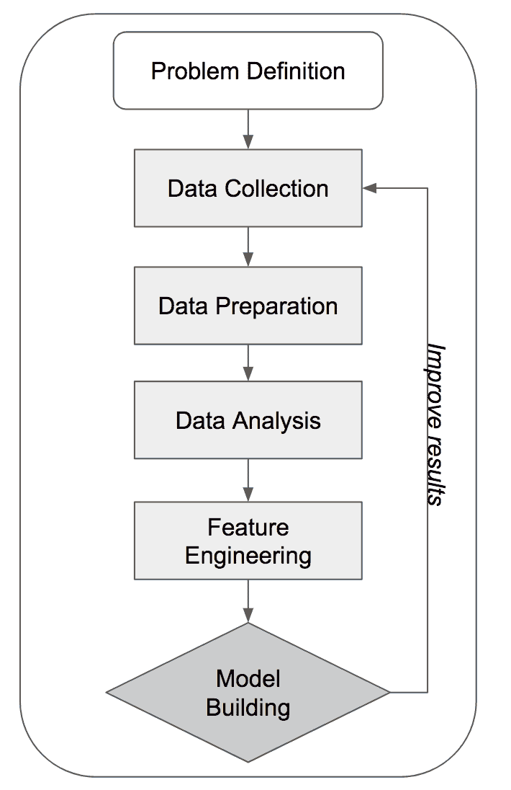

从这个图表中可以看出，数据科学工作通常不是一次性完成的。当你发现模型表现不佳，或者注意到可以改进输入数据的质量时，你可能需要重复数据收集步骤。当你有了更好的思路和策略来从原始数据集构建特征时，可能还需要重新审视特征工程步骤。如果你认为通过调整学习算法的超参数可以改进模型结果，模型构建步骤可能需要多次重复。在接下来的章节中，当我们进行实际项目和练习时，我们将更详细地讨论某些步骤以及我们可以使用的不同技术。

# 设置 Python 环境

现在我们已经讨论了数据科学的一些基础知识及其在营销中的应用，让我们开始为接下来的章节和项目准备开发环境。如果你打算使用 R 语言进行练习，可以跳过这一部分，直接进入*设置 R 环境*部分。对于打算使用 Python 语言进行练习的同学，即使你已经熟悉 Python，按照这些步骤安装所有所需的 Python 包并准备好 Python 环境仍然会对你有所帮助。

# 安装 Anaconda 发行版

在本书的数据科学和机器学习任务中，我们将使用许多不同的 Python 包。举例来说，我们将使用 `pandas` 包进行数据清理和数据分析。您可以在以下链接找到有关此包的更多信息：[`pandas.pydata.org/`](https://pandas.pydata.org/)。我们还将使用 `scikit-learn` 包来构建机器学习模型。有关此包的更多信息，请访问以下页面：[`scikit-learn.org/stable/`](http://scikit-learn.org/stable/)。我们还会经常使用 `numpy` 这个 Python 包。当我们需要对多维数据进行数学和科学操作时，此包将非常有用。您可以在此页面找到有关此包的更多信息：[`www.numpy.org/`](http://www.numpy.org/)。除了我们刚刚提到的这三个包之外，我们还将使用一些其他 Python 库，并在使用它们时逐个进行详细讨论。

由于我们在数据科学和机器学习任务中需要各种 Python 库，有时单独安装它们可能会有些麻烦。幸运的是，Anaconda 发行版可以一次性安装所有所需的包。为了下载 Anaconda 发行版，请访问 [`www.anaconda.com/download/`](https://www.anaconda.com/download/) 进行安装。当您访问此链接时，网页应如下所示：

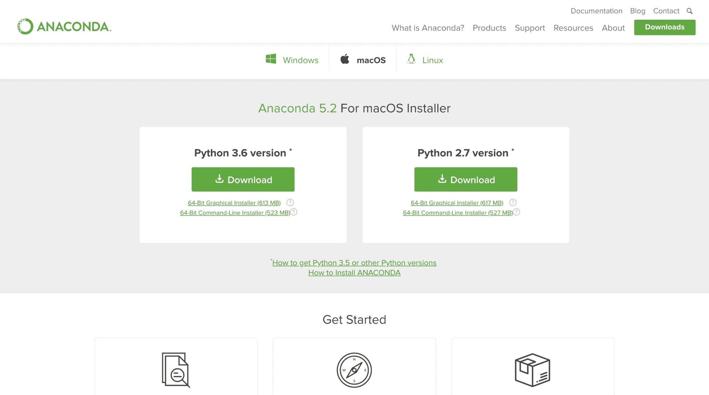

在本书中，我们将在 Python 3 中使用 Anaconda 5.2。一旦您下载了 Anaconda 发行版，可以使用安装程序安装所有包。在 macOS 上，安装程序如下所示：

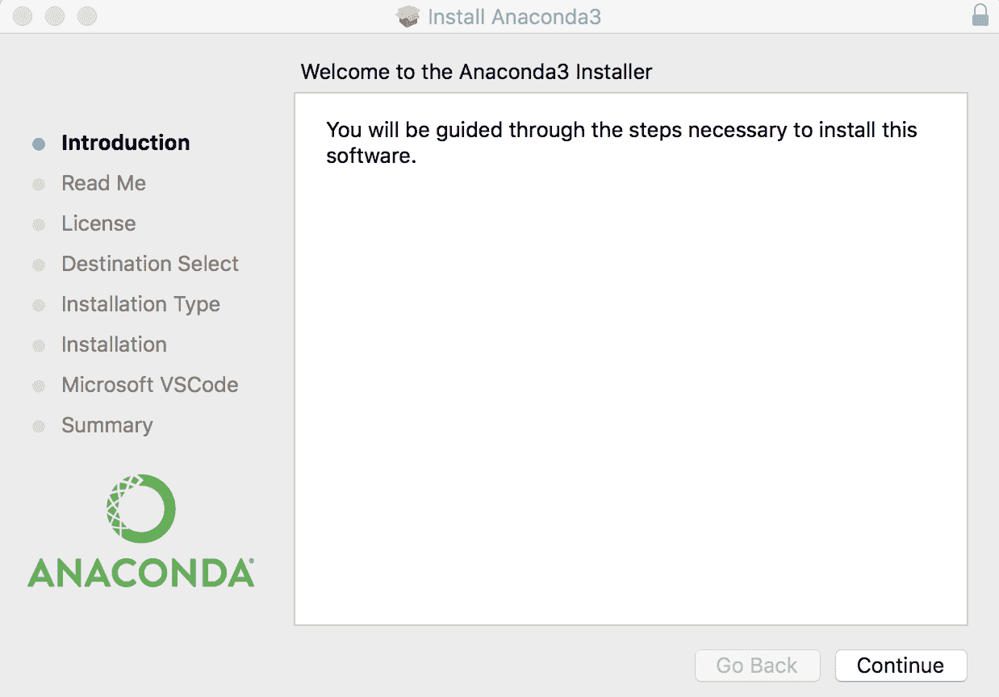

一旦您按照安装程序的步骤完成 Anaconda 发行版的安装，我们现在已经准备好开始运行数据科学和机器学习任务。在接下来的部分，我们将构建一个简单的逻辑回归模型，以了解如何使用我们刚刚安装的关键 Python 库进行未来的练习。

# Python 中的简单逻辑回归模型

现在我们已经安装了所有的包，让我们测试一下是否可以使用它们。我们将来会使用 Jupyter Notebook 来进行所有的数据分析、数据可视化和机器学习任务。Jupyter Notebook 是一个开源的 web 应用程序，您可以轻松编写代码、显示图表，并与他人分享笔记本。您可以在此链接找到更多关于 Jupyter Notebook 的信息：[`jupyter.org/`](http://jupyter.org/)。

由于 Jupyter Notebook 是前一节中刚刚安装的 Anaconda 发行版的一部分，您的计算机上应该已经安装了它。

要启动 Jupyter Notebook，您可以打开终端窗口并输入以下命令：

```py
jupyter notebook
```

当您输入此命令时，应该会看到类似以下截图的输出：


最后，它应该会在你的浏览器中打开一个网页应用程序。网页界面应该如下所示：

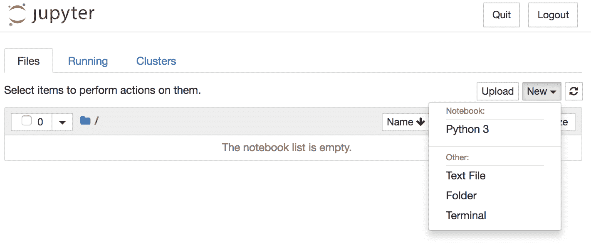

从这张截图可以看到，你可以通过点击右上角的 New 按钮，然后选择 Python 3 来创建一个新的 Jupyter Notebook。这将创建一个新的空白笔记本，选择 Python 3 作为编程语言。新创建的笔记本应该如下所示：


为了更改这个笔记本的名称，你只需点击顶部栏，那里写着`Untitled`，然后输入一个新的名称。

现在我们已经创建了一个笔记本，接下来让我们使用一些 Python 库来构建一个简单的逻辑回归模型。在第一个单元格中，我们将导入`numpy`和`scikit-learn`库。代码如下所示：

```py
import numpy as np
from sklearn.linear_model import LogisticRegression
```

从这段代码示例中可以看到，我们已经导入了`numpy`库并将其别名为`np`。这是`numpy`库的标准别名。同时，我们只导入了`scikit-learn`库中`linear_model`模块下的`LogisticRegression`模块（`sklearn.linear_model`）。

为了构建一个模型，我们需要数据。在本章的演示和测试中，我们将创建二维输入数据和二元输出。以下代码展示了我们是如何创建输入和输出数据的：

```py
input_data = np.array([
    [0, 0],
    [0.25, 0.25],
    [0.5, 0.5],
   [1, 1],
])

output_data = [
    0,
    0,
    1,
    1
]
```

从这段代码示例中可以看出，我们使用`numpy`数组数据类型创建了 4 行 2 列的输入数据。输出是二元的，只能取`0`或`1`。

使用这些数据，我们可以训练一个逻辑回归模型，代码如下所示：

```py
logit_model = LogisticRegression()
logit_model.fit(input_data, output_data)
```

从这段代码中可以看到，我们使用`LogisticRegression`实例化了一个模型对象。然后，我们使用了`fit`函数，输入和输出数据作为参数，用于训练逻辑回归模型。你可以通过以下代码来获取这个逻辑回归模型的系数和截距：

```py
logit_model.coef_    # output: array([[0.43001235, 0.43001235]])
logit_model.intercept_    # output: array([-0.18498028])
```

到目前为止，我们的 Jupyter Notebook 如下所示：

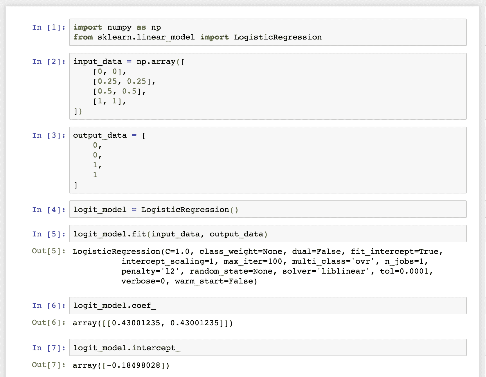

为了对新数据进行预测，你可以使用逻辑回归模型对象`logit_model`的`predict`函数。此函数将返回每个输入的预测输出类别。代码如下所示：

```py
predicted_output = logit_model.predict(input_data)
```

到目前为止，我们已经尝试了如何使用`numpy`和`scikit-learn`库来构建机器学习模型。接下来，我们将熟悉另一个用于数据可视化的库。在本书的各章节中，我们将大量使用`matplotlib`库来可视化任何数据分析结果。欲了解更多信息，你可以访问这个页面：[`matplotlib.org/`](https://matplotlib.org/)。

让我们首先看一下以下代码：

```py
import matplotlib.pyplot as plt

plt.scatter(
    x=input_data[:,0], 
    y=input_data[:,1], 
    color=[('red' if x == 1 else 'blue') for x in output_data]
)
plt.xlabel('X')
plt.ylabel('Y')
plt.title('Actual')
plt.grid()
plt.show()
```

正如你从这个代码片段中看到的，你可以像在代码的第一行那样轻松导入`matplotlib`库。为了构建一个散点图，我们使用了`scatter`函数，它接受`x`和`y`的值，以及每个点的`color`。你可以使用`xlabel`函数来修改* x *轴的标签，使用`ylabel`函数来修改* y *轴的标签。通过`title`函数，你可以修改图表的标题。`grid`函数会在图表中显示网格，而你需要调用`show`函数来实际显示图表。

Jupyter Notebook 应该如下所示：

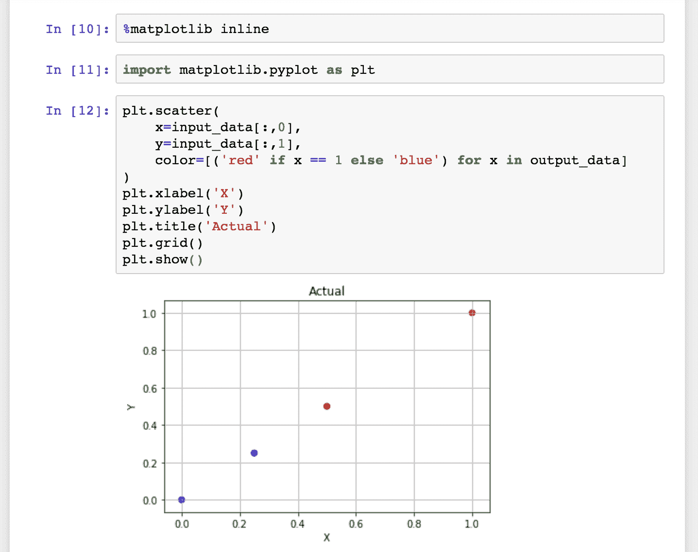

需要注意的一点是以下代码：

```py
%matplotlib inline
```

这是为了在 Web 应用程序中显示图表。如果没有这一行代码，图表将不会显示在 Web 界面中。为了将实际输出与模型的预测进行比较，我们使用预测值构建了另一个散点图。

代码和图表如下所示：

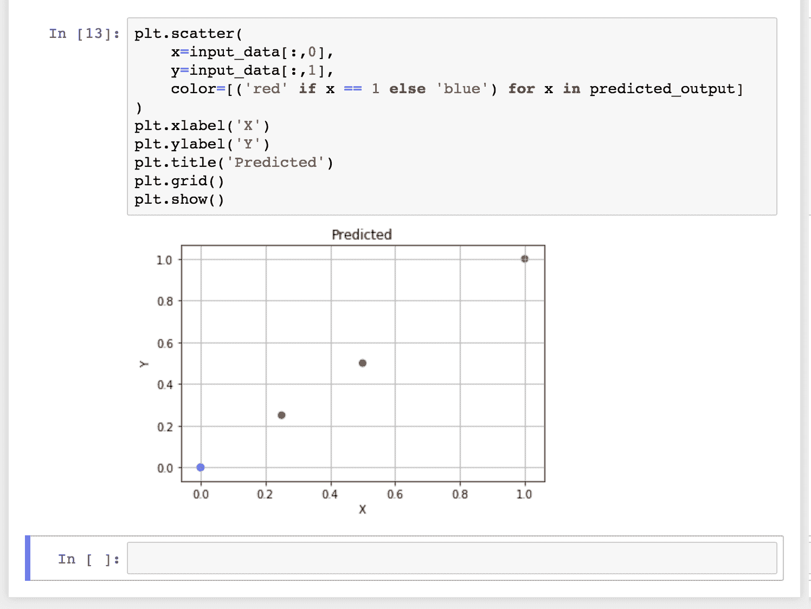

如果将这张图与前一张图进行比较，你会发现模型正确预测了四分之三的输出，并且错误预测了一个点。

你可以从以下链接下载我们在本节中使用的完整 Jupyter Notebook：[`github.com/yoonhwang/hands-on-data-science-for-marketing/blob/master/ch.1/python/Setting%20Up%20Python%20Environment.ipynb`](https://github.com/yoonhwang/hands-on-data-science-for-marketing/blob/master/ch.1/python/Setting%20Up%20Python%20Environment.ipynb)。

在本书中，我们将频繁使用这三个 Python 库，这些库是我们刚刚实验过的。随着章节的推进，我们将介绍这些 Python 库的更多高级特性和功能，以及如何充分利用它们进行数据科学和机器学习任务。

# 设置 R 环境

对于那些打算在接下来的练习和项目中使用 R 语言的朋友，我们将在本书中讨论如何为数据科学和机器学习任务准备 R 环境。我们将从安装 R 和 RStudio 开始，然后使用 R 构建一个简单的逻辑回归模型，帮助自己熟悉 R 语言在数据科学中的应用。

# 安装 R 和 RStudio

除了 Python，R 也是数据科学和机器学习中最常用的语言之一。它非常容易使用，而且有大量用于机器学习的 R 库，吸引了许多数据科学家。为了使用这门语言，你需要从以下链接下载： [`www.r-project.org/`](https://www.r-project.org/)。如果你访问该网页，它的界面会类似于以下截图：

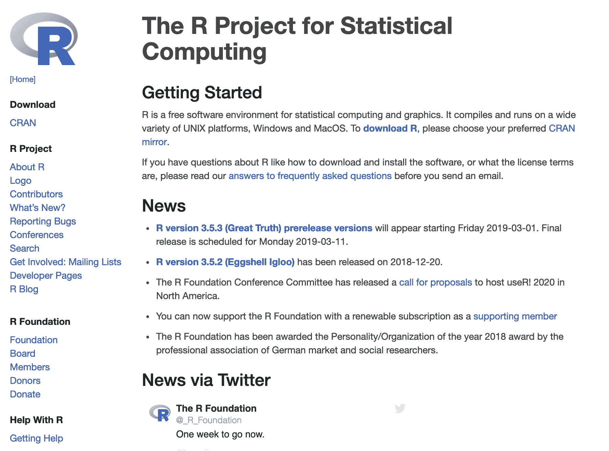

你可以在此网页找到有关 R 的更多信息。为了让你下载，请点击页面中的下载 R 链接。它会要求你选择一个 CRAN 镜像。你可以选择距离你最近的镜像位置来下载 R。下载完成后，按照安装程序中的步骤进行安装。在 macOS 上的安装程序如下图所示：

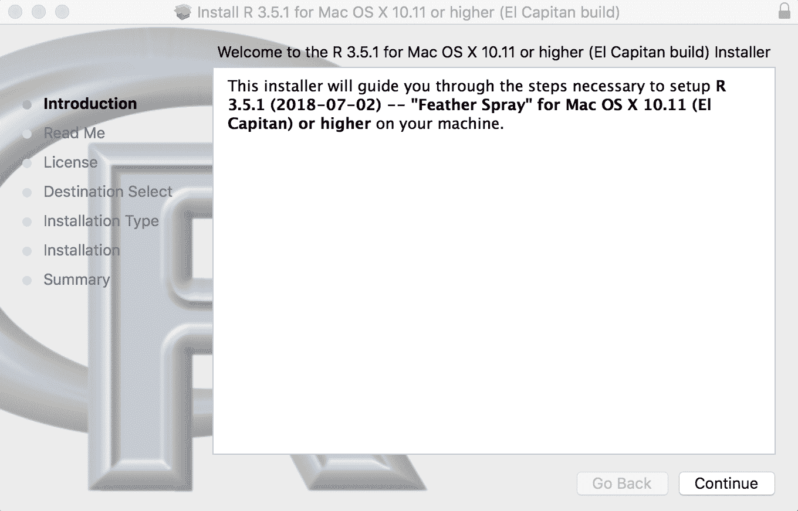

安装完 R 后，我们还需要为我们的 R 开发环境安装一个工具。在本书中，我们将使用 RStudio，这是一个流行的 R 编程语言 IDE。你可以通过以下链接下载 RStudio：[`www.rstudio.com/products/rstudio/download/`](https://www.rstudio.com/products/rstudio/download/)。当你访问这个 RStudio 下载页面时，页面应显示如下截图：


本书中将使用 RStudio Desktop Open Source License 版本，但如果你已经拥有其他版本的许可证，也可以随意使用。下载并安装 RStudio 后，打开 RStudio 时你将看到类似下面的截图：

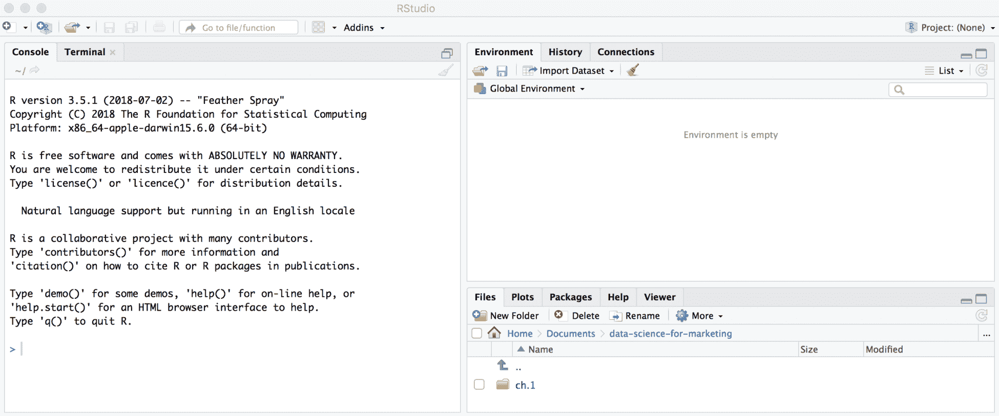

现在我们已经准备好了 R 环境，接下来让我们构建一个简单的逻辑回归模型，以便更好地熟悉 R。

# R 中的一个简单逻辑回归模型

让我们通过在 R 中构建一个简单的逻辑回归模型来测试我们的环境设置。打开 RStudio 并创建一个新的 R 脚本文件。你可以使用以下代码在 R 中创建一个数据框：

```py
# Input Data
data <- data.frame(
  "X"=c(0, 0.25, 0.5, 1), 
  "Y"=c(0, 0.5, 0.5, 1), 
  "output"=c(0, 0, 1, 1)
)
```

如代码片段所示，我们构建了一个包含`X`、`Y`和`output`列的数据框。`X`列的取值为`0`、`0.25`、`0.5`和`1`，`Y`列的取值为`0`、`0.5`、`0.5`和`1`，`output`是一个二元分类，取值为`0`或`1`。`data`如下所示：

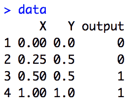

现在我们有了训练逻辑回归模型的数据，接下来让我们看一下以下代码：

```py
# Train logistic regression
logit.fit <- glm(
  output ~ X + Y, 
  data = data, 
  family = binomial
)
```

如代码片段所示，我们在 R 中使用`glm`函数来拟合逻辑回归模型。由于`glm`函数用于拟合任何线性模型，我们需要定义模型的`family`变量，以便指定我们要训练的模型类型。为了训练逻辑回归模型，我们在`glm`函数中使用`binomial`作为`family`参数。第一个参数`output ~ X + Y`定义了该模型的公式，而`data`参数则用于定义训练模型所使用的数据框。

在 R 中，你可以使用`summary`函数来获取拟合的逻辑回归模型的详细信息，如下代码所示：

```py
# Show Fitted Results
summary(logit.fit)
```

这将输出如下截图所示的内容：


如你所见，从这个输出中，我们可以轻松找到模型的系数和截距。我们将在本书中频繁使用这个`summary`函数，以更好地理解训练好的模型。

有了训练好的模型，我们可以使用以下代码对新数据进行预测：

```py
# Predict Class Probabilities
logit.probs <- predict(
  logit.fit, 
  newdata=data, 
  type="response"
)

# Predict Classes
logit.pred <- ifelse(logit.probs > 0.5, 1, 0)    
logit.pred    # output: 0 0 1 1
```

如你从这个代码片段中看到的，我们使用`predict`函数通过训练好的模型`logit.fit`和在参数`newdata`中定义的新数据进行预测。这个`predict`函数将输出新数据中每个示例的概率或可能性；为了将这个输出转换成二进制类别，我们可以使用`ifelse`函数将高于某一阈值（在此例中为`0.5`）的输出编码为`1`，其余部分编码为`0`。

最后，让我们快速看一下如何在 R 中构建图表。我们将在本书中使用 R 包`ggplot2`进行绘图。因此，了解如何导入这个绘图库并使用它进行数据可视化将对你有帮助。如果这是你第一次使用这个包，你很可能在尝试导入`ggplot2`包时会看到以下错误信息：


如消息所示，`ggplot2`包尚未安装在你的计算机上。要安装任何 R 包，你只需运行以下命令：

```py
install.packages('ggplot2')
```

如果你运行这个命令，你会看到类似以下的输出：


一旦这个库的安装完成，你就可以导入并使用这个库了。我们将使用`ggplot2`库构建一个简单的散点图，如下所示的代码片段：

```py
# Plotting Library
library(ggplot2)

# Simple Scatterplot
ggplot(data, aes(x=X, y=Y, color=output)) +
  geom_point(size=3, shape=19) +
  ggtitle('Actual') +
  theme(plot.title = element_text(hjust = 0.5))
```

如你从这个代码片段中看到的，你可以使用`ggplot2`包中的`ggplot`函数构建一个基于`data`的散点图。为了改变散点图中点的形状和大小，你可以使用`geom_point`函数。你还可以使用`ggtitle`函数来更改图表的标题。当你运行这段代码时，你将看到以下图表：

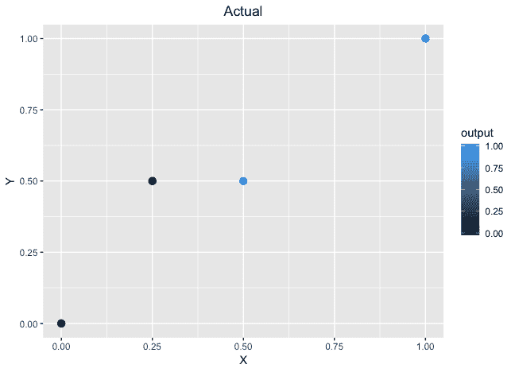

我们将对预测结果执行相同的操作。代码如下：

```py
ggplot(data, aes(x=X, y=Y, color=logit.pred)) + 
  geom_point(size=3, shape=19) +
  ggtitle('Predicted') +
  theme(plot.title = element_text(hjust = 0.5))
```

输出如下所示：

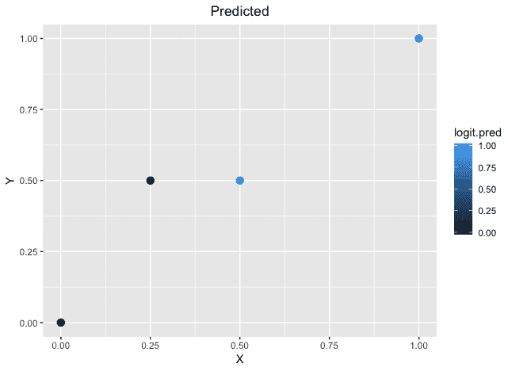

在本书中，我们将大量使用这些函数和绘图库`ggplot2`，因此随着章节和练习的进行，你将越来越习惯于用 R 编程，并且能够熟练使用这些其他库。

你可以从以下链接查看并下载用于本节的完整 R 代码：[`github.com/yoonhwang/hands-on-data-science-for-marketing/blob/master/ch.1/R/SettingUpREnvironment.R`](https://github.com/yoonhwang/hands-on-data-science-for-marketing/blob/master/ch.1/R/SettingUpREnvironment.R)[.](https://github.com/yoonhwang/hands-on-data-science-for-marketing/blob/master/ch.1/R/SettingUpREnvironment.R)

# 总结

在这一章中，我们讨论了市场营销中的整体趋势，并了解了数据科学和机器学习在营销行业中日益重要的作用。随着数据量的增加，以及我们观察到利用数据科学和机器学习进行营销的好处，各种规模的公司都在投资构建更多以数据为驱动的定量营销策略。

我们还学习了不同类型的分析方法，特别是本书中我们将频繁使用的三种分析方法——描述性分析、解释性分析和预测性分析——以及这些分析的不同使用案例。在这一章中，我们介绍了不同类型的机器学习算法，以及数据科学中的典型工作流程。最后，我们花了一些时间在 Python 和 R 中设置我们的开发环境，并通过构建一个简单的逻辑回归模型来测试我们的环境设置。

在下一章中，我们将介绍一些**关键绩效指标**（**KPIs**）以及如何可视化这些关键指标。我们将学习如何在 Python 中计算并构建这些 KPIs 的可视化图表，使用不同的包，如`pandas`、`numpy`和`matplotlib`。对于那些使用 R 语言跟随本书练习的读者，我们还将讨论如何使用 R 来计算并绘制这些 KPIs，利用 R 中的各种统计和数学函数，以及用于可视化的`ggplot2`包。
