# 产品分析

从本章开始，我们将转变方向，从对客户行为的分析转向讨论如何利用数据科学进行更细粒度的产品层级分析。各家公司，特别是电子商务企业，日益关注和需求利用数据了解客户如何与不同的产品互动和参与。研究也证明，严格的产品分析可以帮助企业提升用户参与度和转化率，最终带来更高的利润。在本章中，我们将讨论什么是产品分析，以及它如何用于不同的应用场景。

一旦我们熟悉了产品分析的概念，我们将使用来自 UCI 机器学习库的*在线零售数据集*进行编程练习。我们将从分析数据集中可以观察到的整体时间序列趋势开始。然后，我们将研究客户与单个产品的互动和参与如何随时间变化，目标是最终能够构建一个简单的产品推荐逻辑或算法。对于 Python 练习，我们将主要利用`pandas`和`matplotlib`库进行数据分析和可视化。对于 R 练习，我们将主要使用`dplyr`和`ggplot2`库，并介绍另外两个 R 库，`readxl`和`lubridate`。

在本章中，我们将涵盖以下主题：

+   产品分析的重要性

+   使用 Python 进行产品分析

+   使用 R 进行产品分析

# 产品分析的重要性

**产品分析**是一种从数据中提取见解的方法，帮助了解客户如何与所提供的产品互动和参与，不同产品的表现如何，以及业务中的一些可观察到的弱点和优势。然而，产品分析不仅仅停留在分析数据上。产品分析的最终目标是构建可操作的见解和报告，进一步帮助优化和改善产品表现，并根据产品分析的发现生成新的营销或产品创意。

产品分析从跟踪事件开始。这些事件可以是客户的网站访问、页面浏览、浏览器历史记录、购买行为或客户对你所提供产品采取的任何其他操作。然后，你可以开始分析和可视化这些事件中的任何可观察到的模式，目标是创建可操作的见解或报告。产品分析的常见目标如下：

+   **提高客户和产品的留存率**：通过分析客户浏览和购买的商品，您可以识别出客户反复购买的商品以及这些回头客是谁。另一方面，您还可以识别出客户未购买的商品以及可能流失的客户。分析并理解反复购买商品和回头客的共同属性可以帮助您改善留存策略。

+   **识别热门和流行的产品**：作为零售企业的营销人员，了解热门和流行产品非常重要。这些畅销产品是企业的主要收入来源，并提供新的销售机会，如交叉销售或捆绑销售。通过产品分析，您应该能够轻松识别和追踪这些热门和流行产品，并基于这些畅销产品制定新的策略，挖掘不同的机会。

+   **根据关键属性对客户和产品进行细分**：通过客户画像和产品数据，您可以使用产品分析根据客户和产品的属性对其进行细分。细分产品数据的一些方式包括基于其盈利能力、销售量、重复订购量以及退款数量。通过这些细分，您可以获得可操作的洞察，确定下一个目标的产品或客户细分。

+   **制定更高投资回报率的营销策略**：产品分析还可以用来分析您的营销策略的**投资回报率**（**ROI**）。通过分析用于推广某些商品的营销费用以及这些商品所产生的收入，您可以了解哪些方法有效，哪些无效。使用产品分析来进行营销投资回报率分析可以帮助您制定更高效的营销策略。

在这里讨论的产品分析基础上，我们将在以下编程练习中探讨如何利用零售业务数据实现这些产品分析目标。我们将讨论如何使用数据分析回头客的模式及其对整体收入的贡献。此外，我们还将介绍如何使用产品分析来分析畅销产品的行为。更具体地说，我们将讨论如何追踪热门商品的趋势，并简要讨论如何利用这些趋势数据为您的营销策略中的产品推荐提供支持。

# 使用 Python 进行产品分析

在这一部分，我们将讨论如何使用 Python 中的`pandas`和`matplotlib`包进行产品分析。对于那些想使用 R 而非 Python 进行练习的读者，你可以跳到下一部分。我们将从分析收入和购买数量的总体时间序列趋势，以及重复购买客户的购买模式开始，接着分析销售产品的趋势。

对于这个练习，我们将使用来自 UCI 机器学习库的一个公开可用数据集，可以通过以下链接找到：[`archive.ics.uci.edu/ml/datasets/online+retail#`](http://archive.ics.uci.edu/ml/datasets/online+retail#)。从这个链接中，你可以下载名为`Online Retail.xlsx`的 Excel 格式数据。一旦下载了数据，你可以通过运行以下命令将其加载到你的 Jupyter Notebook 中：

```py
%matplotlib inline

import matplotlib.pyplot as plt
import pandas as pd

df = pd.read_excel(io='../data/Online Retail.xlsx', sheet_name='Online Retail')
```

与前面章节中的其他 Python 练习类似，我们使用`%matplotlib inline`命令来显示 Jupyter Notebook 中的图表。然后，我们可以导入用于进一步产品分析的`matplotlib`和`pandas`包。值得注意的是，在这段代码中，我们使用了`pandas`包中的新函数`read_excel`。这个函数允许你将任何 Excel 文件加载到`pandas`的`DataFrame`中。从这段代码可以看出，我们向`read_excel`函数传递了两个参数——`io`，用于指定数据文件的路径，以及`sheet_name`，用于指定要加载的 Excel 工作表的名称。

一旦你将数据加载到`pandas`的`DataFrame`中，它应当如下所示：


在我们继续进行下一步之前，有一个数据清理的步骤需要完成。我们快速查看一下`Quantity`（数量）列的分布情况。我们将使用以下代码可视化`Quantity`的分布：

```py
ax = df['Quantity'].plot.box(
    showfliers=False,
    grid=True,
    figsize=(10, 7)
)

ax.set_ylabel('Order Quantity')
ax.set_title('Quantity Distribution')

plt.suptitle("")
plt.show()
```

从这段代码可以看到，我们使用`pandas`的`DataFrame`的`plot.box`函数，在箱线图中可视化`Quantity`列的分布。生成的箱线图如下所示：

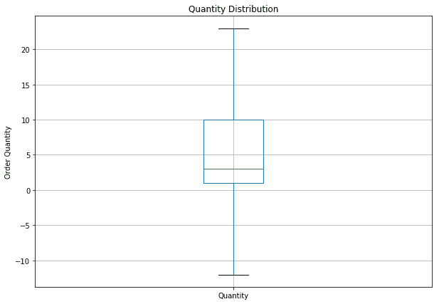

从这个图表中可以看到，一些订单的数量是负数。这是因为被取消或退款的订单在我们的数据集中的`Quantity`列中记录了负值。为了说明本练习中的问题，我们将忽略被取消的订单。我们可以使用以下代码在`DataFrame`中过滤掉所有被取消的订单：

```py
df = df.loc[df['Quantity'] > 0]
```

现在，我们可以进行进一步的分析，深入探索我们的数据。

# 时间序列趋势

在查看产品级别的数据之前，作为一名电商行业的营销人员，了解整体收入和订单或购买数量的时间序列趋势会是非常有益的。这将帮助我们了解业务在收入和订单数量上是增长还是收缩。

首先，我们将查看随着时间推移接收的订单数量。请查看以下代码：

```py
monthly_orders_df = df.set_index('InvoiceDate')['InvoiceNo'].resample('M').nunique()
```

从这段代码中你可以看到，我们使用了在前几章中没有用到的`resample`和`nunique`函数。`resample`函数重新采样并将时间序列数据转换为我们所需的频率。在我们的示例中，我们通过使用`'M'`作为目标频率，将时间序列数据重新采样为按月划分的时间序列数据，并计算不同的发票号的数量。这样，我们就可以得到每月独特购买或订单的数量。结果的 DataFrame 如下所示：

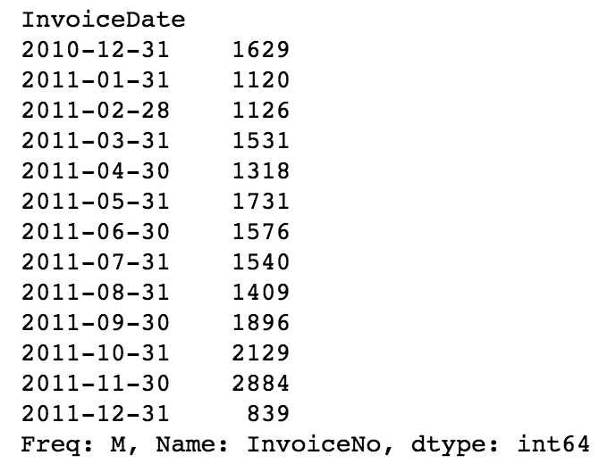

通常，时间序列数据通过折线图可视化效果更好。让我们查看以下代码，看看如何将这些月度数据在折线图中进行可视化：

```py
ax = pd.DataFrame(monthly_orders_df.values).plot(
    grid=True,
    figsize=(10,7),
    legend=False
)

ax.set_xlabel('date')
ax.set_ylabel('number of orders/invoices')
ax.set_title('Total Number of Orders Over Time')

plt.xticks(
    range(len(monthly_orders_df.index)), 
    [x.strftime('%m.%Y') for x in monthly_orders_df.index], 
    rotation=45
)

plt.show()
```

从这段代码中你可以看到，我们正在使用`pandas` `DataFrame`的`plot`函数。通过使用`matplotlib`包的`xticks`函数，我们可以自定义*x*轴刻度的标签。让我们先看一下以下的图表：

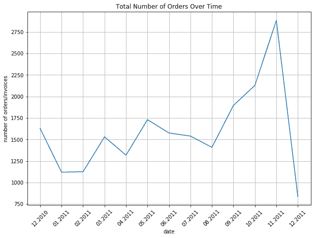

正如你从这张图表中看到的那样，*x*轴的刻度标签按月和年格式化。如果你回顾之前的代码，我们使用`x.strftime('%m.%Y')`来格式化，其中`x`是`Python`的`date`对象，`%m`是月份值的占位符，`%Y`是年份值的占位符。`Python`的`date`对象的`strftime`函数将日期格式化为给定的格式。

从这张图表中可以明显看到，2011 年 12 月的订单数量出现了突然而剧烈的下降。如果你仔细查看数据，会发现这只是因为我们没有完整的 2011 年 12 月的数据。我们可以使用以下代码来验证这一点：

```py
invoice_dates = df.loc[
    df['InvoiceDate'] >= '2011-12-01',
    'InvoiceDate'
]

print('Min date: %s\nMax date: %s' % (invoice_dates.min(), invoice_dates.max()))
```

在这段代码中，我们获取了从 2011 年 12 月 1 日开始的所有发票日期的序列。然后，我们打印出最小和最大日期。当你运行这段代码时，你将得到以下输出：


从这个输出中你可以看到，我们只有 2011 年 12 月 1 日到 12 月 9 日的数据。如果我们用这些数据来分析 12 月的销售和收入，那将是误导性的。为了进一步分析，我们将忽略 2011 年 12 月 1 日的数据。你可以使用以下代码来删除这些数据点：

```py
df = df.loc[df['InvoiceDate'] < '2011-12-01']
```

现在我们已经排除了 2011 年 12 月的不完整数据，可以使用之前的代码重新绘制折线图。去除 2011 年 12 月的数据点后，折线图如下所示：

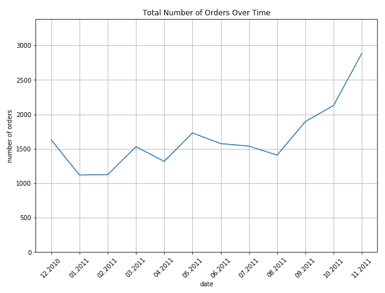

让我们仔细看一下这个图表。从 2010 年 12 月到 2011 年 8 月，每月订单数量大约在 1500 左右波动，然后从 2011 年 9 月开始显著增加，到 2011 年 11 月几乎翻倍。对此的一个解释可能是从 2011 年 9 月起，业务实际上在显著增长。另一个解释可能是季节性效应。在电子商务行业，接近年末时销售量激增并不罕见。通常，很多电商企业的销售在 10 月到 1 月间会显著上升，如果没有前一年的数据，很难判断这次销售的激增是由于业务增长还是季节性因素。我们建议在分析数据时，将今年的数据与去年进行比较。

让我们快速看一下月度收入数据，通过以下代码：

```py
df['Sales'] = df['Quantity'] * df['UnitPrice']

monthly_revenue_df = df.set_index('InvoiceDate')['Sales'].resample('M').sum()
```

从这段代码中可以看到，我们首先要做的是计算每个订单的总销售额，简单来说，就是`UnitPrice`乘以`Quantity`。计算并创建了这个`Sales`列后，我们可以使用带`'M'`标志的`resample`函数对我们的时间序列数据进行重采样，将其转换为按月的数据。然后，使用`sum`作为聚合函数，我们就可以获得每月的销售收入数据。得到的数据如下所示：

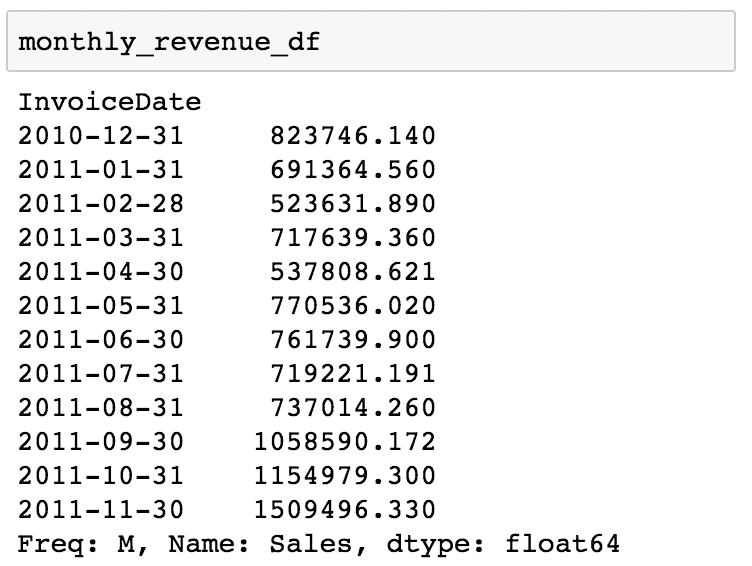

我们可以使用以下代码将这些数据可视化为折线图：

```py
ax = pd.DataFrame(monthly_revenue_df.values).plot(
    grid=True,
    figsize=(10,7),
    legend=False
)

ax.set_xlabel('date')
ax.set_ylabel('sales')
ax.set_title('Total Revenue Over Time')

ax.set_ylim([0, max(monthly_revenue_df.values)+100000])

plt.xticks(
    range(len(monthly_revenue_df.index)), 
    [x.strftime('%m.%Y') for x in monthly_revenue_df.index], 
    rotation=45
)

plt.show()
```

如前所述，我们可以使用`pandas`的`DataFrame`绘图函数来构建折线图，并使用`matplotlib`包的`xticks`函数来重新命名*X 轴*上的刻度标签。该折线图如下所示：

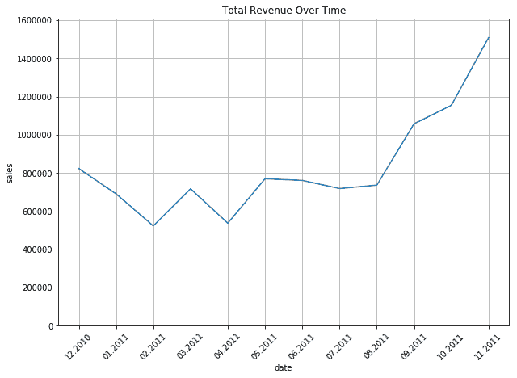

我们在这个月度收入图表中看到的模式与之前的月度订单总数随时间变化图表类似。从 2010 年 12 月到 2011 年 8 月，月收入大约在 70 万左右波动，然后从 2011 年 9 月开始显著增加。如前所述，为了验证这次销售和收入的显著增长是由于业务增长还是季节性因素，我们需要进一步回顾销售历史，并将今年的销售与去年的销售进行比较。

这种广泛的时间序列分析可以帮助营销人员更好地了解业务的整体表现，并识别可能在业务中发生的潜在问题。一般来说，最好先进行较为广泛的分析，然后再深入到业务的具体和细节部分，进行进一步的产品分析。

# 重复购买客户

另一个成功业务的重要因素是它如何保持客户忠诚度以及其重复购买和客户的数量。在本节中，我们将分析每月的重复购买次数，以及每月收入中有多少来自这些重复购买和客户。一个典型的强大而稳定的企业，往往会有源源不断的来自现有客户的销售。让我们看看在本章中我们正在分析的在线零售业务，重复购买和现有客户的销售占比有多少。

我们将分析每月的重复购买次数。这意味着一个客户在给定的月份内下了多个订单。让我们快速看一下我们拥有的数据：


正如你从这张数据快照中可能注意到的，针对一个购买订单（`InvoiceNo`）有多个记录。然而，我们需要的是每个订单的汇总数据，以便`DataFrame`中的一条记录代表一个购买订单。我们可以通过以下代码按`InvoiceNo`对这些原始数据进行汇总：

```py
invoice_customer_df = df.groupby(
    by=['InvoiceNo', 'InvoiceDate']
).agg({
    'Sales': sum,
    'CustomerID': max,
    'Country': max,
}).reset_index()
```

如你所见，在这段代码中，我们将`DataFrame`（`df`）按`InvoiceNo`和`InvoiceDate`进行分组，并对所有`Sales`进行求和。这样，我们得到的新`DataFrame`（`invoice_customer_df`）中，每个购买订单都有一条记录。结果的`DataFrame`如下所示：

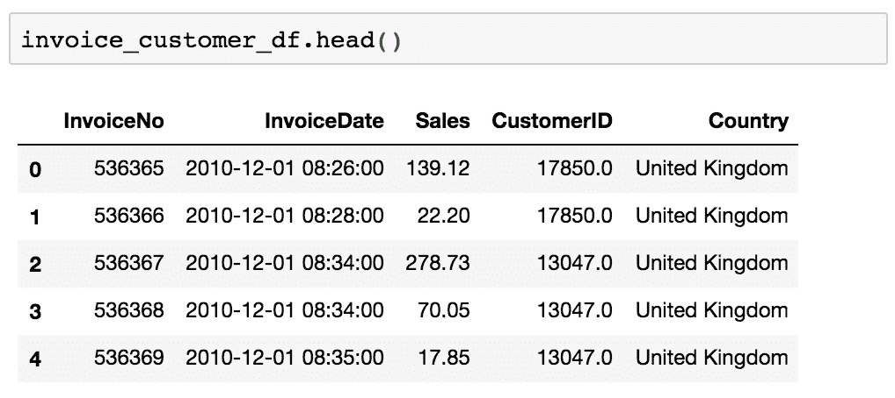

如你所见，这里`DataFrame`中的每一条记录现在都包含了我们每个订单所需的所有信息。现在，我们需要按月汇总这些数据，并计算在给定月份内购买超过一次的客户数量。请查看以下代码：

```py
monthly_repeat_customers_df = invoice_customer_df.set_index('InvoiceDate').groupby([
    pd.Grouper(freq='M'), 'CustomerID'
]).filter(lambda x: len(x) > 1).resample('M').nunique()['CustomerID']
```

让我们仔细看看这段代码中的`groupby`函数。这里，我们按两个条件进行分组——`pd.Grouper(freq='M')`和`CustomerID`。第一个`groupby`条件，`pd.Grouper(freq='M')`，是按索引`InvoiceDate`将数据分组到每个月。接着，我们按每个`CustomerID`对数据进行分组。通过使用`filter`函数，我们可以按自定义规则筛选数据。这里，筛选规则`lambda x: len(x) > 1`表示我们想要检索那些在组内有多条记录的数据。换句话说，我们只想检索那些在某个月内下了多个订单的客户。最后，我们通过`resample('M')`和`nunique`按月重新采样并汇总，统计每个月内的独立客户数。

结果数据如下所示：

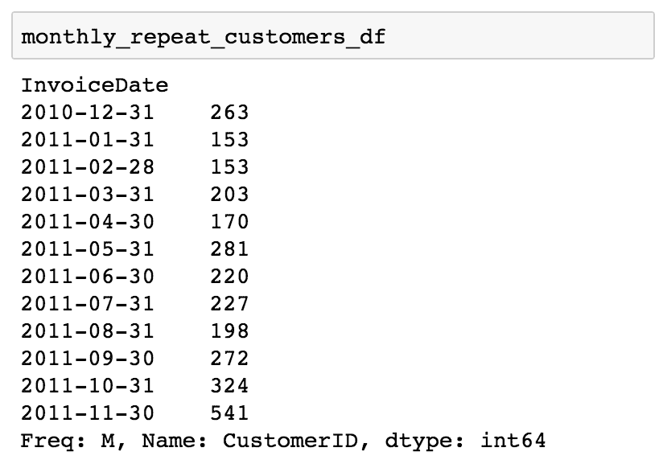

现在让我们将这些数字与每月顾客的总数进行比较。你可以使用以下代码计算每月顾客的总数：

```py
monthly_unique_customers_df = df.set_index('InvoiceDate')['CustomerID'].resample('M').nunique()
```

结果数据如下所示：

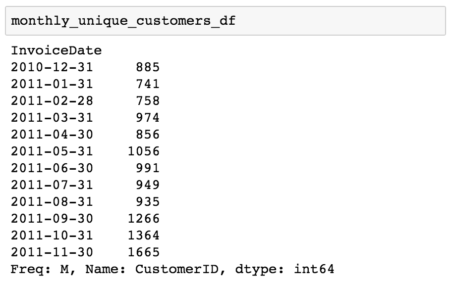

如果你比较这两组数字，大约有 20%到 30%的顾客是回头客。你可以使用以下代码计算每个月回头客的百分比：

```py
monthly_repeat_percentage = monthly_repeat_customers_df/monthly_unique_customers_df*100.0
```

让我们将所有这些数据绘制到一个图表中：

```py
ax = pd.DataFrame(monthly_repeat_customers_df.values).plot(
    figsize=(10,7)
)

pd.DataFrame(monthly_unique_customers_df.values).plot(
    ax=ax,
    grid=True
)

ax2 = pd.DataFrame(monthly_repeat_percentage.values).plot.bar(
    ax=ax,
    grid=True,
    secondary_y=True,
    color='green',
    alpha=0.2
)

ax.set_xlabel('date')
ax.set_ylabel('number of customers')
ax.set_title('Number of All vs. Repeat Customers Over Time')

ax2.set_ylabel('percentage (%)')

ax.legend(['Repeat Customers', 'All Customers'])
ax2.legend(['Percentage of Repeat'], loc='upper right')

ax.set_ylim([0, monthly_unique_customers_df.values.max()+100])
ax2.set_ylim([0, 100])

plt.xticks(
    range(len(monthly_repeat_customers_df.index)), 
    [x.strftime('%m.%Y') for x in monthly_repeat_customers_df.index], 
    rotation=45
)

plt.show()
```

在这段代码中，你会注意到在`plot`函数中新增了一个标志`secondary_y=True`。顾名思义，如果你将`secondary_y`标志设置为`True`，它将会在图表的右侧创建一个新的*Y 轴*。这对于你想要可视化两个不同尺度的数据集非常有用。在我们的案例中，一个数据集的尺度是用户数量，另一个数据集的尺度是百分比。使用这个`secondary_y`标志，我们可以轻松地在一个图表中可视化不同尺度的数据。

一旦你运行这段代码，你会看到以下图表：

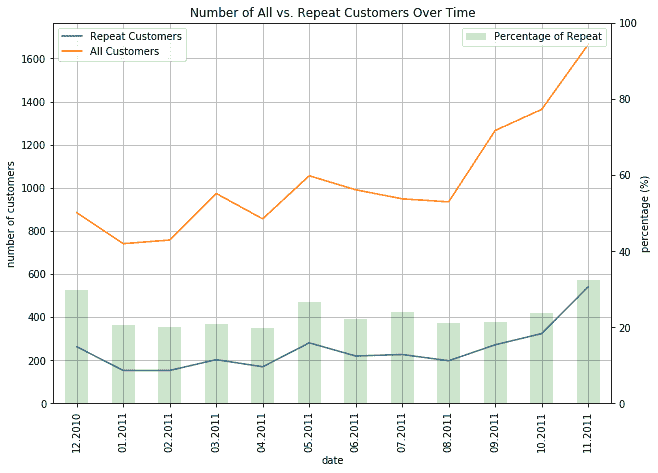

从这张图表中可以看到，回头客和所有顾客的数量从 2011 年 9 月开始显著上升。回头客的百分比似乎保持在大约 20%到 30%之间。这家在线零售业务将从这稳定的回头客流中受益，因为它们将帮助企业产生稳定的销售流。现在让我们分析这些回头客贡献的月收入。

以下代码展示了如何计算回头客的月收入：

```py
monthly_rev_repeat_customers_df = invoice_customer_df.set_index('InvoiceDate').groupby([
    pd.Grouper(freq='M'), 'CustomerID'
]).filter(lambda x: len(x) > 1).resample('M').sum()['Sales']

monthly_rev_perc_repeat_customers_df = monthly_rev_repeat_customers_df/monthly_revenue_df * 100.0
```

这段代码和之前的代码唯一的不同点是`resample('M')`后面的聚合函数`sum`。在之前的情况中，当我们计算每月回头客数量时，我们使用了`nunique`函数。然而，这次我们使用了`sum`函数来计算每个月回头客的所有销售总和。为了可视化，你可以使用以下代码：

```py
ax = pd.DataFrame(monthly_revenue_df.values).plot(figsize=(12,9))

pd.DataFrame(monthly_rev_repeat_customers_df.values).plot(
    ax=ax,
    grid=True,
)

ax.set_xlabel('date')
ax.set_ylabel('sales')
ax.set_title('Total Revenue vs. Revenue from Repeat Customers')

ax.legend(['Total Revenue', 'Repeat Customer Revenue'])

ax.set_ylim([0, max(monthly_revenue_df.values)+100000])

ax2 = ax.twinx()

pd.DataFrame(monthly_rev_perc_repeat_customers_df.values).plot(
    ax=ax2,
    kind='bar',
    color='g',
    alpha=0.2
)

ax2.set_ylim([0, max(monthly_rev_perc_repeat_customers_df.values)+30])
ax2.set_ylabel('percentage (%)')
ax2.legend(['Repeat Revenue Percentage'])

ax2.set_xticklabels([
    x.strftime('%m.%Y') for x in monthly_rev_perc_repeat_customers_df.index
])

plt.show()
```

需要注意的是，这段代码中的一行：`ax2 = ax.twinx()`。这实际上和我们之前讨论的`secondary_y`标志起到相同的作用。`twinx`函数只是创建了一个共享相同*x 轴*的双*Y 轴*，效果与`secondary_y`标志相同。生成的图表如下所示：

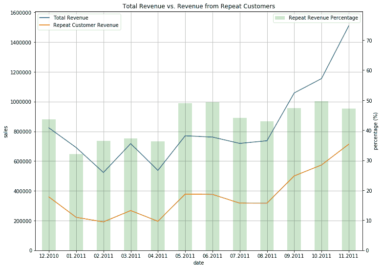

我们看到与之前类似的模式，2011 年 9 月开始收入有了显著增长。这里需要注意的一点是来自重复购买客户的月收入占比。我们看到大约 20-30%的购买客户是重复购买客户。然而，在这个图表中，我们可以看到大约 40-50%的总收入来自重复购买客户。换句话说，大约一半的收入是由这 20-30%的重复购买客户驱动的。这显示了留住现有客户的重要性。

# 随时间变化的畅销商品

到目前为止，我们分析了整体的时间序列模式，以及客户如何与整个业务进行互动，但我们还没有分析客户如何与单个产品进行互动。在本节中，我们将探索并分析客户如何与销售的单个产品互动。更具体地，我们将查看前五名畅销产品随时间变化的趋势。

对于时间序列趋势商品分析，我们来统计每个产品在每个时期销售的商品数量。请查看以下代码：

```py
date_item_df = df.set_index('InvoiceDate').groupby([
    pd.Grouper(freq='M'), 'StockCode'
])['Quantity'].sum()
```

从这段代码可以看出，我们正在按月对`DataFrame` `df`进行分组，按`StockCode`（每个产品的唯一编码）进行分组，然后对每个月和`StockCode`的销售数量进行求和。结果的前九条记录如下所示：

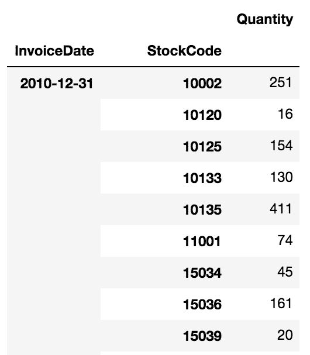

有了`data_item_df`中的这些数据，我们来看看 2011 年 11 月 30 日最畅销的商品。请查看以下代码：

```py
# Rank items by the last month sales
last_month_sorted_df = date_item_df.loc['2011-11-30'].sort_values(
    by='Quantity', ascending=False
).reset_index()
```

从这段代码可以看出，我们可以使用`sort_values`函数通过提供输入参数`by`中的列名来按任何我们想要的列对`pandas` `DataFrame`进行排序。在这里，我们通过将`ascending`标志设置为`False`，按照`Quantity`列对数据进行降序排序。结果如下所示：


从这个结果可以看出，代码为 23084、84826、22197、22086 和 85099B 的产品是 2011 年 11 月的前五名畅销产品。

现在我们知道了 2011 年 11 月的前五名畅销产品，让我们再次汇总这五个产品的月销售数据。请查看以下代码：

```py
date_item_df = df.loc[
    df['StockCode'].isin([23084, 84826, 22197, 22086, '85099B'])
].set_index('InvoiceDate').groupby([
    pd.Grouper(freq='M'), 'StockCode'
])['Quantity'].sum()
```

从这段代码可以看出，我们仍然是按月和`StockCode`对数据进行分组，并对销售数量进行求和。然而，这里需要注意的一点是`isin`操作符。`isin`操作符在`loc`操作符内检查每条记录是否与数组中的某个元素匹配。在我们的例子中，我们正在检查每条记录的`StockCode`是否与前五名畅销产品的商品代码匹配。使用这段代码，我们可以仅针对 2011 年 11 月的前五名畅销产品按月和产品汇总数据。结果的前几条记录如下所示：

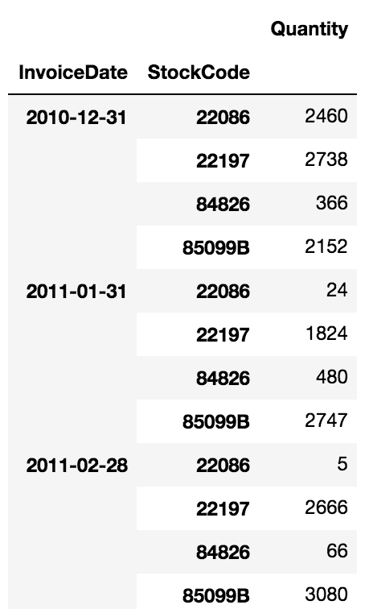

现在我们有了这五种产品的月度销售数据，我们需要将这些数据转换成表格格式，其中列是各个商品编号，行索引是发票日期，值是销售的商品数量，这样我们才能将数据可视化为时间序列图。以下代码展示了如何将这些数据转换成表格格式：

```py
trending_itmes_df = date_item_df.reset_index().pivot('InvoiceDate','StockCode').fillna(0)

trending_itmes_df = trending_itmes_df.reset_index()
trending_itmes_df = trending_itmes_df.set_index('InvoiceDate')
trending_itmes_df.columns = trending_itmes_df.columns.droplevel(0)
```

正如你在这段代码中看到的，我们正在使用`pivot`函数来对这个`DataFrame`进行`pivot`，其中索引是`InvoiceDate`，而列是`StockCode`列中的各个商品编号。结果如下所示：

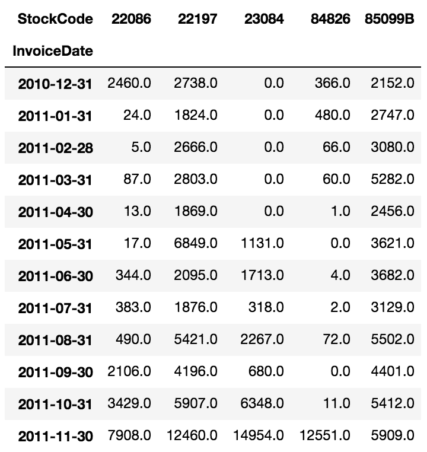

通过这些时间序列数据，我们现在可以可视化随时间变化的趋势。您可以使用以下代码来构建一个展示趋势商品的时间序列图：

```py
ax = pd.DataFrame(trending_itmes_df.values).plot(
    figsize=(10,7),
    grid=True,
)

ax.set_ylabel('number of purchases')
ax.set_xlabel('date')
ax.set_title('Item Trends over Time')

ax.legend(trending_itmes_df.columns, loc='upper left')

plt.xticks(
    range(len(trending_itmes_df.index)), 
    [x.strftime('%m.%Y') for x in trending_itmes_df.index], 
    rotation=45
)

plt.show()
```

当你运行这段代码时，你应该看到如下图表：


让我们仔细看看这个时间序列图。这五种产品的销量在 2011 年 11 月激增，尤其是产品编号为 85099B 的产品，其销量在 2011 年 2 月至 2011 年 10 月几乎为零。然后，它在 2011 年 11 月突然激增。或许值得深入探讨一下是什么原因导致了这次激增。这可能是一个季节性影响很大的产品，因此这个产品在 11 月变得非常受欢迎，或者也有可能是由于趋势的真实变化，导致该产品突然比以前更受欢迎。

其余四种最畅销产品 22086、22197、23084 和 84826 的销量似乎是在 2011 年 11 月之前的几个月内逐渐积累起来的。作为市场营销人员，值得深入探讨是什么因素导致这些商品的热度不断上升。你可以看看这些商品是否通常在寒冷季节更受欢迎，或者它们是否在市场上出现了逐渐上升的趋势。

分析产品受欢迎程度的趋势和变化，不仅有助于你了解客户最喜欢和最常购买的商品，还能帮助你调整营销信息。例如，你可以在营销邮件、电话或广告中推荐这些日益受欢迎的商品，从而提高客户的参与度。研究表明，当你的客户对这些商品更加感兴趣，并且更有可能购买时，通过更多地推广这些商品，你可能会获得更高的营销参与度，最终可能会获得更高的转化率。当你针对这些趋势商品进行营销时，使用这些受欢迎和热门商品是一种建立产品推荐引擎的方式，我们将在下一章深入展开并进行实验。

本节中 Python 练习的完整代码可以在以下链接找到：[`github.com/yoonhwang/hands-on-data-science-for-marketing/blob/master/ch.5/python/Product%20Analytics.ipynb`](https://github.com/yoonhwang/hands-on-data-science-for-marketing/blob/master/ch.5/python/Product%20Analytics.ipynb)。

# 使用 R 进行产品分析

在本节中，我们将讨论如何使用 R 中的`dplyr`和`ggplot2`库进行产品分析。对于那些想使用 Python 而非 R 的读者，可以跳过本节并进入下一节。我们将从分析收入、购买数量以及重复购买客户的购买模式的总体时间序列趋势开始，然后再分析销售产品的趋势。

对于这个练习，我们将使用 UCI 机器学习库中公开提供的一个数据集，数据集可以在以下链接找到：[`archive.ics.uci.edu/ml/datasets/online+retail#`](http://archive.ics.uci.edu/ml/datasets/online+retail#)。你可以点击这个链接并下载名为`Online Retail.xlsx`的 Microsoft Excel 格式数据。一旦你下载了这些数据，可以通过运行以下代码加载它：

```py
# install.packages("readxl")
library(readxl)

#### 1\. Load Data ####
df <- read_excel(
  path="~/Documents/research/data-science-marketing/ch.5/data/Online Retail.xlsx", 
  sheet="Online Retail"
)
```

如你从这段代码中可能注意到的，与前几章不同的地方是我们在使用`readxl`库和`read_excel`函数。由于我们的数据是 Excel 格式的，因此不能使用我们之前使用的`read.csv`函数。为了加载 Excel 格式的数据集，我们需要使用`readxl`库，可以通过在 RStudio 中运行`install.packages("readxl")`命令进行安装。在`readxl`库中，有一个名为`read_excel`的函数，帮助你轻松加载 Excel 文件。

当你将这些数据加载到`DataFrame`中后，它应该如下所示：


在进入下一步之前，我们需要进行一个数据清理步骤。让我们快速查看`Quantity`列的分布情况。我们将使用以下代码可视化`Quantity`的分布：

```py
ggplot(df, aes(x="", y=Quantity)) + 
  geom_boxplot(outlier.shape = NA) +
  ylim(c(-15, 25))+
  ylab("order quantity") +
  xlab("") +
  ggtitle("Quantity Distribution") +
  theme(plot.title=element_text(hjust=0.5))
```

如你所见，我们正在使用`geom_boxplot`可视化`Quantity`列的分布情况，呈现为箱型图。

生成的箱型图如下所示：

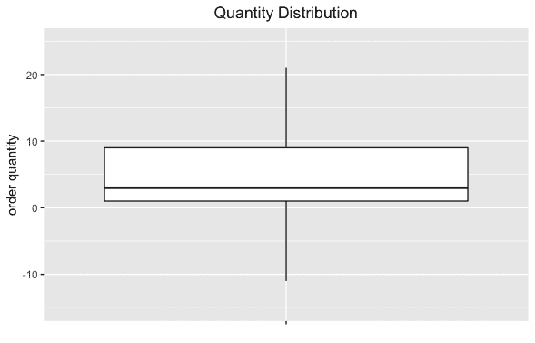

如你从该图中看到的那样，部分订单的数量为负。这是因为取消或退款的订单在数据集中的`Quantity`列里会以负值记录。为了本次练习的说明，我们将忽略这些取消的订单。我们可以通过以下代码过滤掉所有取消的订单：

```py
# filter out orders with negative quantity (cancel orders)
df <- df[which(df$Quantity > 0),]
```

现在，我们可以进行进一步的分析，深入探索数据。

# 时间序列趋势

在我们查看产品层级数据之前，作为一名电子商务企业的营销人员，了解整体收入和订单或购买数量的时间序列趋势会非常有帮助。这有助于我们了解企业在整体收入和订单数量方面是否在增长或缩小。

首先，我们将研究一段时间内的订单数量。请看以下代码：

```py
# install.packages("lubridate")
library(lubridate)

timeSeriesNumInvoices <- df %>%
  group_by(InvoiceDate=floor_date(InvoiceDate, "month")) %>%
  summarise(NumOrders=n_distinct(InvoiceNo))
```

在这段代码中，我们首先使用`group_by`函数按月对数据进行分组。为了按月分组，我们使用了`lubridate`库中的`floor_date`函数。如果你还没有安装这个库，可以使用`install.packages("lubridate")`命令进行安装。`floor_date`函数会将日期向下舍入到指定的单位。在我们的案例中，我们将`InvoiceDate`列的日期向下舍入到每个月的第一天。然后，对于每个月，我们通过对`InvoiceNo`列使用`n_distinct`函数来计算唯一购买订单的数量。最终得到的`DataFrame`如下所示：

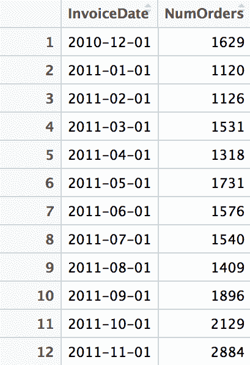

通常，时间序列数据使用折线图来展示效果更好。让我们看一下下面的代码，看看如何将这些按月的数据可视化为折线图：

```py
ggplot(timeSeriesNumInvoices, aes(x=InvoiceDate, y=NumOrders)) +
  geom_line() +
  ylim(c(0, max(timeSeriesNumInvoices$NumOrders) + 1000)) +
  ylab("number of orders") +
  xlab("date") +
  ggtitle("Number of Orders over Time") +
  theme(plot.title=element_text(hjust=0.5))
```

正如你从这段代码中看到的，我们使用了`ggplot`函数，它来自`ggplot2`库，并结合`geom_line`函数，通过折线图展示数据。首先让我们来看一下下面的图表：

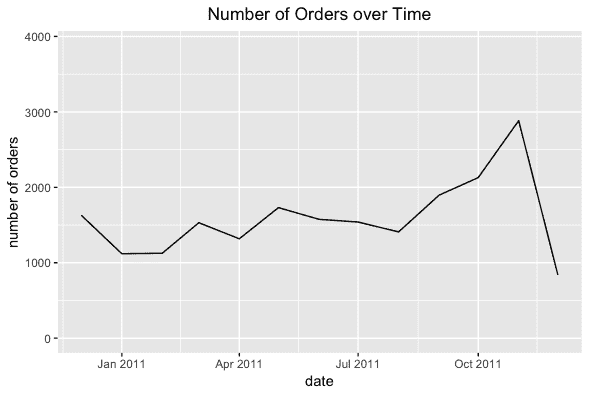

从这张图表中可以看出，有一个显著的、突然而剧烈的订单数量下降发生在 2011 年 12 月。如果仔细查看数据，实际上是因为我们没有 2011 年 12 月完整的数据。我们可以通过使用以下代码来验证这一点：

```py
summary(df[which(df$InvoiceDate >= as.Date("2011-12-01")),"InvoiceDate"])
```

在这段代码中，我们获得了从 2011 年 12 月 1 日开始的所有发票日期的摘要，结果如下所示：


正如你从输出中看到的，我们只拥有 2011 年 12 月 1 日至 12 月 9 日的数据。如果我们用这些数据来分析 12 月的销售和收入，会导致误导，因为我们无法从现有数据集中获得完整的 12 月情况。为了进一步分析，我们将忽略 2011 年 12 月 1 日的数据。你可以使用以下代码来去除这些数据点：

```py
df <- df[which(df$InvoiceDate < as.Date("2011-12-01")),]
```

现在我们已经筛选出了 2011 年 12 月的不完整数据，可以使用之前的代码重新绘制折线图。去掉 2011 年 12 月的数据点后，折线图看起来如下所示：

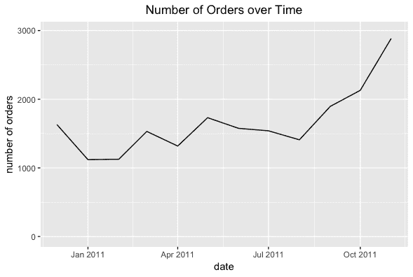

让我们更仔细地看看这个图表。每月订单数量似乎在 2010 年 12 月到 2011 年 8 月之间大约保持在 1,500 左右，然后从 2011 年 9 月开始显著增加，到 2011 年 11 月几乎翻倍。对此的一个解释可能是，业务自 2011 年 9 月开始确实显著增长。另一个解释可能是季节性因素。在电子商务业务中，接近年末时销售出现激增并不罕见。通常，很多电子商务企业的销售额在 10 月到 1 月之间会大幅上升，而没有前一年的数据，很难判断这次销售激增是由于业务增长还是季节性因素。当你分析数据时，我们建议将今年的数据与去年的数据进行对比。

类似于每月订单数量，我们快速看一下每月收入数据。请看下面的代码：

```py
df$Sales <- df$Quantity * df$UnitPrice

timeSeriesRevenue <- df %>%
  group_by(InvoiceDate=floor_date(InvoiceDate, "month")) %>%
  summarise(Sales=sum(Sales))
```

从这段代码中可以看出，我们首先要做的是计算每个订单的总销售额，计算方法是将`UnitPrice`与`Quantity`相乘。一旦我们计算并创建了这个`Sales`列，就可以使用`group_by`函数配合`floor_date`函数将数据按月进行分组。通过在`summarise`函数中使用`sum`作为聚合函数，我们可以得到每月的销售收入数据。最终得到的数据如下：

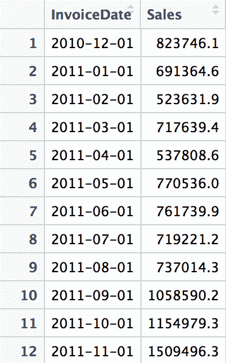

我们可以通过以下代码将这些数据可视化为折线图：

```py
ggplot(timeSeriesRevenue, aes(x=InvoiceDate, y=Sales)) +
  geom_line() +
  ylim(c(0, max(timeSeriesRevenue$Sales) + 10000)) +
  ylab("sales") +
  xlab("date") +
  ggtitle("Revenue over Time") +
  theme(plot.title=element_text(hjust=0.5))
```

正如我们在前面章节中看到的，我们可以使用`geom_line`函数来绘制折线图。每月收入数据的折线图如下所示：


我们可以在这个每月收入随时间变化的图表中看到与之前的每月订单数量随时间变化图表相似的模式。从 2010 年 12 月到 2011 年 8 月，每月收入大约保持在 700,000 左右，之后从 2011 年 9 月开始显著增加。如前所述，为了验证这种销售和收入的显著增长是由于业务增长还是季节性因素，我们需要回顾销售历史，并将今年的销售与去年做对比。

这类一般性和广泛的时间序列分析可以帮助营销人员更好地了解业务的整体表现，并识别出可能存在的潜在问题。通常，先进行广泛的分析再深入挖掘业务中的具体部分进行进一步的产品分析是一个不错的做法。

# 回头客

成功企业的另一个重要因素是它如何留住客户，以及有多少重复购买和客户。在本节中，我们将分析每月的重复购买数量，以及这些重复购买和客户对每月收入的贡献。一个典型的强大且稳定的企业，来自现有客户的销售额会保持稳定。让我们看看我们目前在本章中分析的在线零售业务中，来自重复和现有客户的销售额有多少。

我们将查看每月的重复购买数量。这意味着客户在一个月内下了超过一个订单。让我们快速查看一下我们拥有的数据：


从这段数据快照中可以看出，一个购买订单（`InvoiceNo`）可能会有多条记录。然而，我们需要的是每个订单的汇总数据，以便每条`DataFrame`记录代表一个购买订单。我们可以通过以下代码对每个`InvoiceNo`的原始数据进行汇总：

```py
invoiceCustomerDF <- df %>%
  group_by(InvoiceNo, InvoiceDate) %>%
  summarise(CustomerID=max(CustomerID), Sales=sum(Sales))
```

从这段代码可以看出，我们按`InvoiceNo`和`InvoiceDate`对`DataFrame`，`df`进行分组，并对所有`Sales`求和，同时取`CustomerID`的一个值。这样，新的`DataFrame`，`invoiceCustomerDf`，就有了每个购买订单的记录。结果`DataFrame`如下所示：

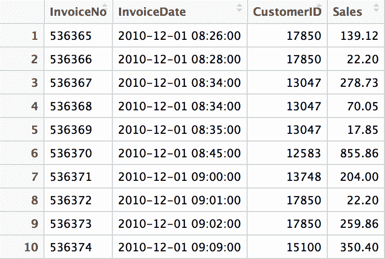

如你所见，`DataFrame`中的每条记录代表了我们所需的每个订单的所有信息。现在，我们需要将这些数据按月汇总，并计算每个月有多少客户进行了超过一次的购买。请查看以下代码：

```py
timeSeriesCustomerDF <- invoiceCustomerDF %>%
  group_by(InvoiceDate=floor_date(InvoiceDate, "month"), CustomerID) %>%
  summarise(Count=n_distinct(InvoiceNo), Sales=sum(Sales))
```

与前一部分类似，我们使用`group_by`和`floor_date`函数将数据汇总到每个月。我们还按`CustomerID`进行分组，这样我们就可以计算每个客户在每个月下了多少订单，产生了多少销售额。现在的数据如下所示：

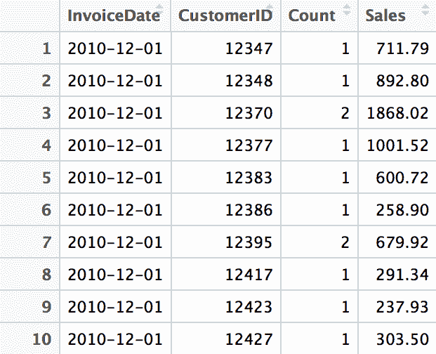

现在，为了得到重复客户的数量，我们需要做的就是筛选出在`Count`列中只有 1 的客户。执行此操作的代码如下所示：

```py
repeatCustomers <- na.omit(timeSeriesCustomerDF[which(timeSeriesCustomerDF$Count > 1),])
```

新创建的`DataFrame`，`reapeatCustomers`，现在包含了每个月内有超过一次购买的所有客户。为了得到每月的重复客户总数，我们将运行以下代码：

```py
timeSeriesRepeatCustomers <- repeatCustomers %>%
  group_by(InvoiceDate) %>%
  summarise(Count=n_distinct(CustomerID), Sales=sum(Sales))
```

从这段代码中可以看到，我们仅仅是按`InvoiceDate`进行分组，`InvoiceDate`是被舍入到每个月的第一天的日期，然后我们计算每个月内唯一或不同的客户数量，并求和总销售额。结果如下所示：

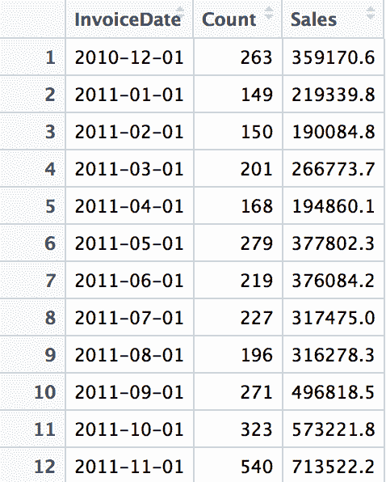

现在我们将这些重复客户的数量与每月总客户数进行比较。你可以使用以下代码来计算每月总客户数：

```py
# Unique Customers
timeSeriesUniqCustomers <- df %>%
  group_by(InvoiceDate=floor_date(InvoiceDate, "month")) %>%
  summarise(Count=n_distinct(CustomerID))
```

结果如下所示：

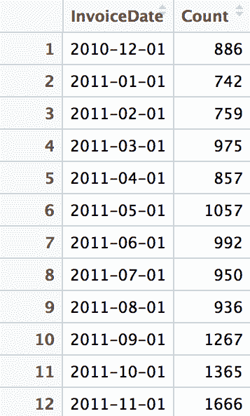

最后，我们将分析每月收入中可以归因于重复客户的百分比。请看以下代码：

```py
timeSeriesRepeatCustomers$Perc <- timeSeriesRepeatCustomers$Sales / timeSeriesRevenue$Sales*100.0
timeSeriesRepeatCustomers$Total <- timeSeriesUniqCustomers$Count
```

如代码所示，我们只是将`timeSeriesRepeatCustomers` `DataFrame`中的`Sales`列除以我们在前一节中创建的`timeSeriesRevenue` `DataFrame`中的`Sales`列。然后，我们将每月独立客户的数量附加到`timeSeriesRepeatCustomers` `DataFrame`中的新列`Total`。

让我们使用以下代码将所有这些数据可视化为一张图表：

```py
ggplot(timeSeriesRepeatCustomers) + 
  geom_line(aes(x=InvoiceDate, y=Total), stat="identity", color="navy") +
  geom_line(aes(x=InvoiceDate, y=Count), stat="identity", color="orange") +
  geom_bar(aes(x=InvoiceDate, y=Perc*20), stat="identity", fill='gray', alpha=0.5) +
  scale_y_continuous(sec.axis = sec_axis(~./20, name="Percentage (%)")) +
  ggtitle("Number of Unique vs. Repeat & Revenue from Repeat Customers") +
  theme(plot.title=element_text(hjust=0.5))
```

如代码所示，我们通过使用`ggplot2`库中的`geom_line`和`geom_bar`函数来绘制两条折线图和一条柱状图。第一条折线图表示每月总客户数`Total`，并将使用`navy`颜色绘制。第二条折线图表示每月重复客户数`Count`，将使用`orange`颜色绘制。最后，我们绘制了一条柱状图，表示来自重复客户的收入百分比`Perc`，并使用`gray`颜色绘制。这里需要注意的是，次要*y 轴*的缩放因子`20`。`sec_axis`函数定义了次要*y 轴*的缩放公式。这里我们使用的是`~./20`，意味着次要*y 轴*的范围从 0 到主轴最大值的 1/20。由于我们将次要*y 轴*按`20`缩放，因此我们将这个数字乘以`Perc`，并在`geom_bar`函数中进行计算，以便将数据的尺度与次要*y 轴*的范围匹配。结果如下所示：

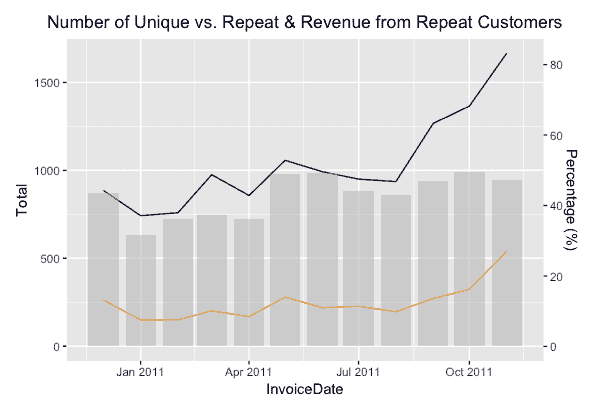

如代码所示，我们在这张图中看到三个图表：一条表示每月总客户数的海军蓝折线图、一条表示每月重复客户数的橙色折线图，以及表示重复客户收入百分比的灰色柱状图。从这张图可以看到，次要*y 轴*（标记为百分比（%））的范围从 0 到主*y 轴*最大值的 1/20，符合我们设置的缩放因子`20`。

现在让我们仔细看看图表。从 2011 年 9 月开始，月度客户数量和重复客户数量似乎都有上升趋势，且重复客户大约占月度客户总数的 20-30%。然而，如果你查看来自这些重复客户的收入百分比，你会发现大约 40-50%的总收入来自重复客户。换句话说，约一半的收入来自 20-30%的重复客户群体。由于该在线零售业务有着大量来自重复客户的收入，这意味着它将从这些稳定的重复客户收入中获益。这也表明了留住现有客户的重要性。作为一名营销人员，关键在于如何留住现有客户，并建立起稳定的重复客户群体。

# 随着时间变化的畅销产品

到目前为止，我们已经分析了整体的时间序列模式以及客户如何与整体业务互动，但还没有分析客户如何与单个产品互动。在本节中，我们将探讨并分析客户如何与单个销售的产品互动。更具体地说，我们将查看这些产品的前五大畅销品随时间变化的趋势。

分析时间序列趋势项的第一个任务是统计每个产品在每个周期内的销售数量。请看以下代码：

```py
popularItems <- df %>%
  group_by(InvoiceDate=floor_date(InvoiceDate, "month"), StockCode) %>%
  summarise(Quantity=sum(Quantity))
```

从这段代码中可以看出，我们按照月份和每个产品的唯一代码`StockCode`对数据进行了分组。然后，我们通过在`summarise`函数中使用`sum`函数，将给定月份和产品的所有销售数量`Quantity`加总起来。

由于我们只关注前五大畅销品，我们需要从`DataFrame` `popularItems`中选择这五个产品。请看以下代码：

```py
top5Items <- popularItems[
    which(popularItems$InvoiceDate == as.Date("2011-11-01")),
  ] %>%
  arrange(desc(Quantity)) %>%
  head(5)

timeSeriesTop5 <- popularItems[
  which(popularItems$StockCode %in% top5Items$StockCode),
]
```

在这里，我们首先按 2011 年 11 月销售的商品数量`Quantity`对商品进行降序排序。使用`which`函数，我们可以从`popularItems`中选择 2011 年 11 月的数据，然后使用`arrange`函数按我们想要的列`Quantity`对数据进行排序。通过在`arrange`函数中使用`desc`，我们可以按降序排列数据。最后，我们使用`head`函数选取前五名商品。新创建的变量`top5Items`现在包含了 2011 年 11 月的前五大畅销品。最后一步是提取这五个商品的时间序列数据。通过使用`which`函数和`%in%`操作符，我们可以从`top5Items`中选择那些`StockCode`在其中的商品数据。

为了可视化这五个产品的时间序列趋势，我们可以使用以下代码：

```py
ggplot(timeSeriesTop5, aes(x=InvoiceDate, y=Quantity, color=StockCode)) +
  geom_line() +
  ylab("number of purchases") +
  xlab("date") +
  ggtitle("Top 5 Popular Items over Time") +
  theme(plot.title=element_text(hjust=0.5))
```

图表如下所示：

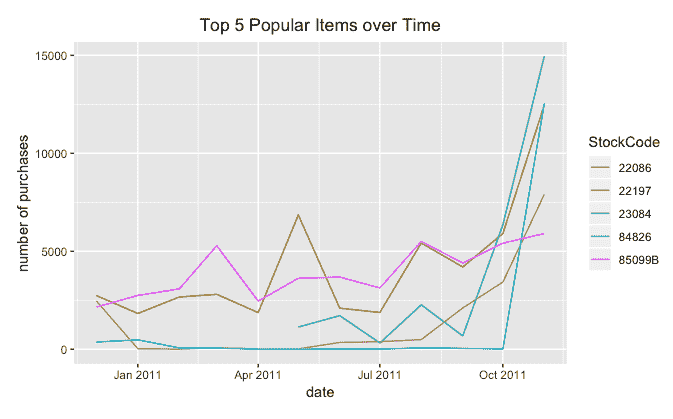

让我们仔细看看这个时间序列图。这五个产品的销售在 2011 年 11 月出现了激增，特别是股票代码为 85099B 的产品，其销售额从 2011 年 2 月到 2011 年 10 月几乎为零，直到 2011 年 11 月突然激增。值得深入探讨一下是什么原因导致了这个激增。这可能是一个对季节性变化高度敏感的商品，在 11 月变得非常流行，或者也可能是趋势发生了真正的变化，导致这个商品比之前更受欢迎。

其他五个热销产品 22086、22197、23084 和 84826 的流行度似乎在 2011 年 11 月之前的几个月里逐渐积累。作为营销人员，也值得仔细分析一下这种积累和这些商品流行度上升背后的潜在因素。你可以研究这些商品是否通常在寒冷季节更受欢迎，或者市场中这些特定商品的趋势是否正在增长。

分析产品的流行趋势和变化不仅帮助你了解客户最喜欢和最常购买的产品，还能帮助你定制营销信息。例如，你可以在营销邮件、电话或广告中推荐这些人气上升的商品，以提高客户的参与度。由于客户对这些商品更感兴趣，也更可能购买它们，因此在你增加这些商品的营销时，可能会获得更高的营销参与度，最终通过这些趋势商品吸引目标客户时，可能会得到更高的转化率。利用这些流行和趋势商品是一种构建产品推荐引擎的方式，我们将在下一章中进一步扩展并深入实验。

本节中 R 练习的完整代码可以在以下链接找到：[`github.com/yoonhwang/hands-on-data-science-for-marketing/blob/master/ch.5/R/ProductAnalytics.R`](https://github.com/yoonhwang/hands-on-data-science-for-marketing/blob/master/ch.5/R/ProductAnalytics.R)。

# 总结

在本章中，我们讨论了产品分析的概念和重要性。我们简要讨论了产品分析如何从追踪事件和客户行为开始，例如网站或应用访问、页面浏览和购买。接着，我们讨论了一些常见的产品分析目标，以及如何利用它来生成可操作的洞察和报告。通过这些关于产品分析的讨论，我们探索了如何在编程练习中利用产品分析来实现客户和产品的留存，使用的是电子商务业务数据。首先，我们分析了收入和购买订单数量的时间序列趋势。然后，我们深入分析了月度重复客户的模式。从数据中我们发现，尽管月度重复客户占整体客户群体的比例相对较小，但他们却贡献了大约一半的月度总收入。这表明了客户留存的重要性，以及如何认真制定留存策略。最后，我们讨论了如何分析随着时间推移而流行和趋势化的商品。在这一部分，我们讨论了季节性效应的潜在影响，以及如何通过分析流行商品来制定营销策略和产品推荐。

在下一章，我们将扩展并应用本章所学的知识，构建产品推荐引擎。我们将学习协同过滤算法以及它如何用于产品推荐。
