# 更好的营销策略的 A/B 测试

在构建不同的营销策略时，是否能够成功通常无法确定。通常，在提出新的营销想法时，涉及大量的猜测，而且常常缺乏工具、资源，甚至动机去测试你的营销创意是否可行。然而，这种直接将营销策略付诸实践的方式是有风险的，并且可能非常昂贵。假设你在新的营销活动上花费了大量资金，但它根本没有帮助你实现营销目标怎么办？如果你花费了数百小时来精炼你的营销信息，而这些信息却从未吸引到潜在客户与之互动呢？

在本章中，我们将讨论一种在完全投入营销创意之前对其进行测试的方法。更具体地说，我们将了解什么是 A/B 测试，为什么进行 A/B 测试很重要，以及它如何帮助你以更高效且成本更低的方式实现营销目标。

在本章中，我们将涵盖以下主题：

+   营销中的 A/B 测试

+   统计假设检验

+   使用 Python 评估 A/B 测试结果

+   使用 R 评估 A/B 测试结果

# 营销中的 A/B 测试

**A/B 测试**在各行业的决策过程中起着至关重要的作用。A/B 测试本质上是一种比较和测试两种不同商业策略效果与利益的方法。它可以被看作是一种实验，在实验中，两个或多个变体在一段时间内进行测试，然后评估实验结果，以找到最有效的策略。在完全选择某一方案之前进行 A/B 测试，帮助企业将决策过程中的猜测去除，节省宝贵的资源，如时间和资金，如果选定的策略没有奏效，这些资源本可能会被浪费。

在典型的 A/B 测试环境中，您会创建并测试两种或更多种营销策略版本，以评估它们在实现您的营销目标方面的效果。考虑一个情况，假设您的目标是提高营销邮件的打开率。如果您的假设是电子邮件主题行 B 的打开率会高于电子邮件主题行 A，那么您将进行一个 A/B 测试，使用这两个主题行。您将随机选择一半用户，向他们发送主题行 A 的营销邮件。另一半随机选择的用户将收到主题行 B 的邮件。您将运行这个测试，持续一个预定的时间段（例如一周、两周或一个月），或者直到有足够数量的用户（每个版本至少需要 1,000 个用户）收到这两个版本的邮件为止。一旦测试完成，您将分析并评估实验结果。在分析结果时，您需要检查两个版本之间的结果是否存在统计学上的显著差异。我们将在接下来的章节中详细讨论统计假设检验和统计显著性。如果实验结果显示两个版本的主题行中有明显的赢家，您可以在未来的营销邮件中使用获胜的主题行。

除了前面提到的电子邮件主题行场景，A/B 测试还可以应用于营销的许多不同领域。例如，您可以对社交媒体上的广告进行 A/B 测试。您可以制作两种或更多广告版本，并进行 A/B 测试，看看哪种版本在点击率或转化率方面效果更好。另一个例子是，您可以使用 A/B 测试来检验网站上的产品推荐是否能带来更高的购买率。如果您开发了不同版本的产品推荐算法，那么您可以将初始版本的产品推荐算法展示给一些随机选择的用户，而将第二个版本展示给其他随机选择的用户。您可以收集 A/B 测试结果，并评估哪一版本的产品推荐算法能为您带来更多收入。

从这些示例用例中可以看出，A/B 测试在决策中扮演着重要角色。在您完全投入某个方案之前，通过测试不同的情境，您可以节省精力、时间和资本，避免在完全投入后却因为失败而浪费这些资源。A/B 测试还可以帮助您消除猜测，并量化未来营销策略的表现提升（或下降）。每当您有新的营销创意想要进行迭代时，应该考虑首先进行 A/B 测试。

# 统计假设检验

当你进行 A/B 测试时，测试你的假设并寻找测试组之间的统计显著差异非常重要。学生 t 检验，简称 **t 检验**，常用于检验两个测试之间的差异是否具有统计显著性。t 检验比较两个平均值，并检查它们是否显著不同。

在 t 检验中有两个重要的统计量——**t 值**和 **p 值**。t 值衡量数据变异性相对于差异的程度。t 值越大，两个组之间的差异越大。另一方面，p 值衡量结果发生的概率是否由随机因素引起。p 值越小，两个组之间的统计显著差异就越大。计算 t 值的公式如下：

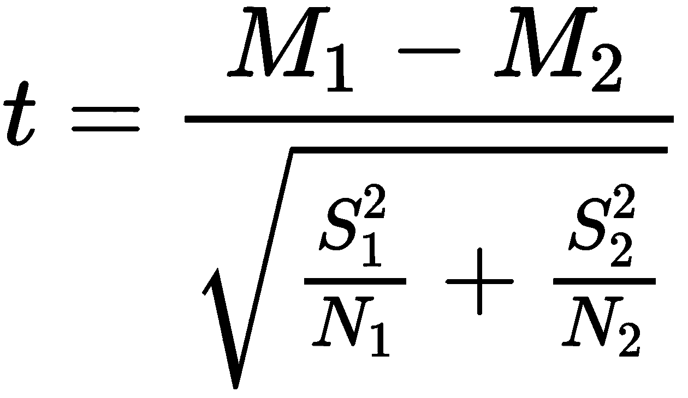

在这个公式中，*M[1]* 和 *M[2]* 分别是组 *1* 和组 *2* 的平均值。*S[1]* 和 *S[2]* 是组 *1* 和组 *2* 的标准差，*N[1]* 和 *N[2]* 分别是组 *1* 和组 *2* 的样本数。

有一个零假设和备择假设的概念，你应该对此有所了解。一般来说，零假设认为两个组之间没有统计学意义上的差异。而备择假设则认为两个组之间有统计学意义上的差异。当 t 值大于某个阈值且 p 值小于某个阈值时，我们说可以拒绝零假设，两个组之间存在统计学意义上的差异。通常，0.01 或 0.05 被用作测试统计显著性的 p 值阈值。如果 p 值小于 0.05，则表示两个组之间的差异发生的概率小于 5%，换句话说，这个差异不太可能是由偶然造成的。

# 使用 Python 评估 A/B 测试结果

在这一节中，我们将讨论如何评估 A/B 测试结果，以决定哪种营销策略最有效。到本节结束时，我们将覆盖如何进行统计假设检验并计算统计显著性。我们将主要使用 `pandas`、`matplotlib` 和 `scipy` 包来分析和可视化数据，并评估 A/B 测试结果。

对于那些希望使用 R 而非 Python 来进行本次练习的读者，可以跳到下一节。

在本次练习中，我们将使用 IBM Watson Analytics 社区中的一个公开数据集，数据集链接为：[`www.ibm.com/communities/analytics/watson-analytics-blog/marketing-campaign-eff-usec_-fastf/`](https://www.ibm.com/communities/analytics/watson-analytics-blog/marketing-campaign-eff-usec_-fastf/)。你可以访问该链接并下载数据，数据以 XLSX 格式提供，文件名为`WA_Fn-UseC_-Marketing-Campaign-Eff-UseC_-FastF.xlsx`。下载数据后，你可以通过运行以下命令将数据加载到你的 Jupyter Notebook 中：

```py
import pandas as pd

df = pd.read_excel('../data/WA_Fn-UseC_-Marketing-Campaign-Eff-UseC_-FastF.xlsx')
```

`df` 数据框如下所示：

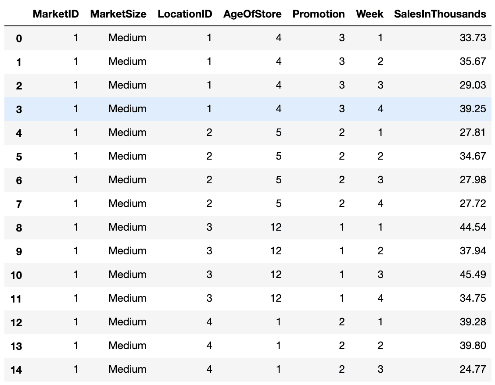

数据集中总共有七个变量。你可以在 IBM Watson Analytics Community 页面上找到这些变量的描述，但我们将在以下内容中再次强调：

+   `MarketID`：市场的唯一标识符

+   `MarketSize`：按销售额划分的市场区域大小

+   `LocationID`：店铺位置的唯一标识符

+   `AgeOfStore`：店铺的年龄（以年为单位）

+   `Promotion`：测试的三种促销中的一种

+   `week`：促销进行的四周中的一周

+   `SalesInThousands`：特定`LocationID`、`Promotion`和`week`的销售额

# 数据分析

让我们更深入地了解数据。在这一部分，我们将专注于理解用于测试不同促销的销售额、市场规模、店铺位置和店铺年龄的分布情况。分析的目的是确保每个促销组的控制和属性是对称分布的，以便不同组之间的促销效果可以进行比较。

不同促销下的总销售分布可以通过以下代码进行可视化：

```py
ax = df.groupby(
    'Promotion'
).sum()[
    'SalesInThousands'
].plot.pie(
    figsize=(7, 7),
    autopct='%1.0f%%'
)

ax.set_ylabel('')
ax.set_title('sales distribution across different promotions')

plt.show()
```

从这段代码可以看出，我们通过`Promotion`列对数据进行分组，并通过对`SalesInThousands`列求和来聚合总销售额。使用饼图，我们可以轻松地可视化每个组占整个销售额的比例。

结果饼图如下所示：

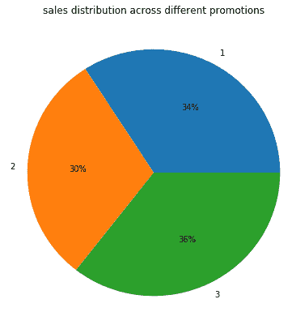

从这个饼图中可以清楚地看到，促销组**3**在三组中拥有最大的总销售额。然而，每个促销组在促销周期间的销售额大致占总销售额的三分之一。类似地，我们还可以可视化每个促销组中不同市场规模的构成。请看以下代码：

```py
ax = df.groupby([
    'Promotion', 'MarketSize'
]).count()[
    'MarketID'
].unstack(
    'MarketSize'
).plot(
    kind='bar',
    figsize=(12,10),
    grid=True,
)

ax.set_ylabel('count')
ax.set_title('breakdowns of market sizes across different promotions')

plt.show()
```

条形图如下所示：

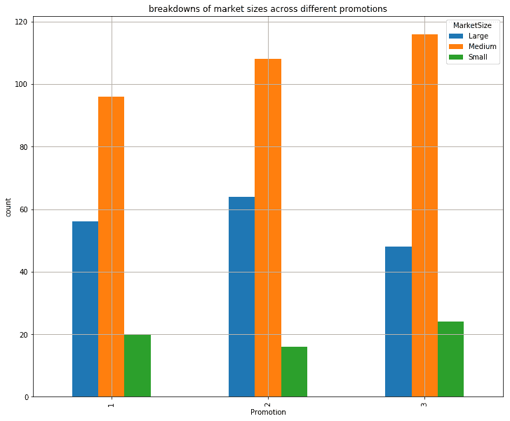

如果你认为堆叠条形图会更容易查看，你可以使用以下代码将这些数据以堆叠条形图的形式显示：

```py
ax = df.groupby([
    'Promotion', 'MarketSize'
]).sum()[
    'SalesInThousands'
].unstack(
    'MarketSize'
).plot(
    kind='bar',
    figsize=(12,10),
    grid=True,
    stacked=True
)

ax.set_ylabel('Sales (in Thousands)')
ax.set_title('breakdowns of market sizes across different promotions')

plt.show()
```

你可能会注意到，这段代码与之前的代码唯一的不同在于`stacked=True`标志。结果如下所示：

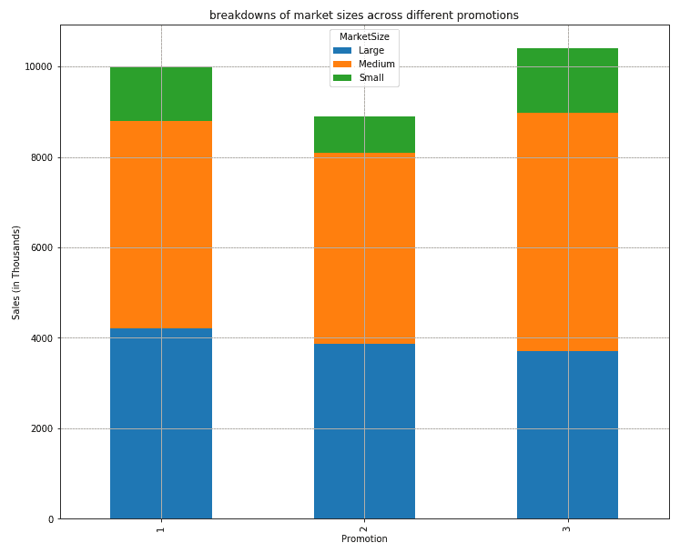

从这张柱状图中可以看到，中等市场规模在所有三个促销组中占据了最大比例，而小市场规模占据的比例最小。我们可以通过这张图验证三个促销组中不同市场规模的组成是相似的。

另一个属性，`AgeOfStore`，以及它在所有不同促销组中的总体分布，可以通过以下代码进行可视化：

```py
ax = df.groupby(
    'AgeOfStore'
).count()[
    'MarketID'
].plot(
    kind='bar', 
    color='skyblue',
    figsize=(10,7),
    grid=True
)

ax.set_xlabel('age')
ax.set_ylabel('count')
ax.set_title('overall distributions of age of store')

plt.show()
```

结果在下图中的柱状图中显示：

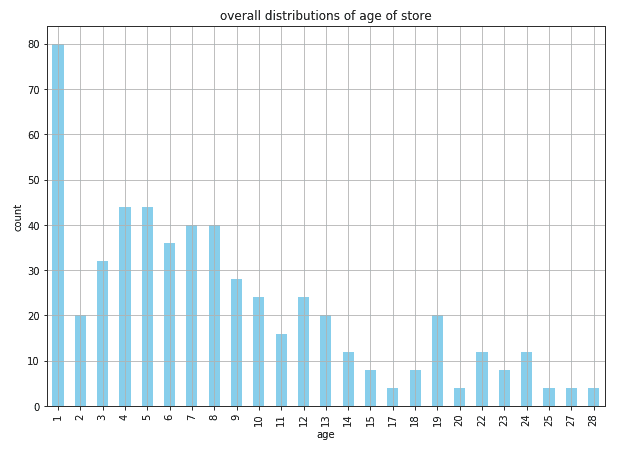

从这张图中你可以看到，大量商店的年龄为**1**岁，而大多数商店的年龄为**10**岁或更小。然而，我们更感兴趣的是三个不同促销组中的商店是否有相似的商店年龄分布。请查看以下代码：

```py
ax = df.groupby(
    ['AgeOfStore', 'Promotion']
).count()[
    'MarketID'
].unstack(
    'Promotion'
).iloc[::-1].plot(
    kind='barh', 
    figsize=(12,15),
    grid=True
)

ax.set_ylabel('age')
ax.set_xlabel('count')
ax.set_title('overall distributions of age of store')

plt.show()
```

使用此代码，你将得到以下输出：

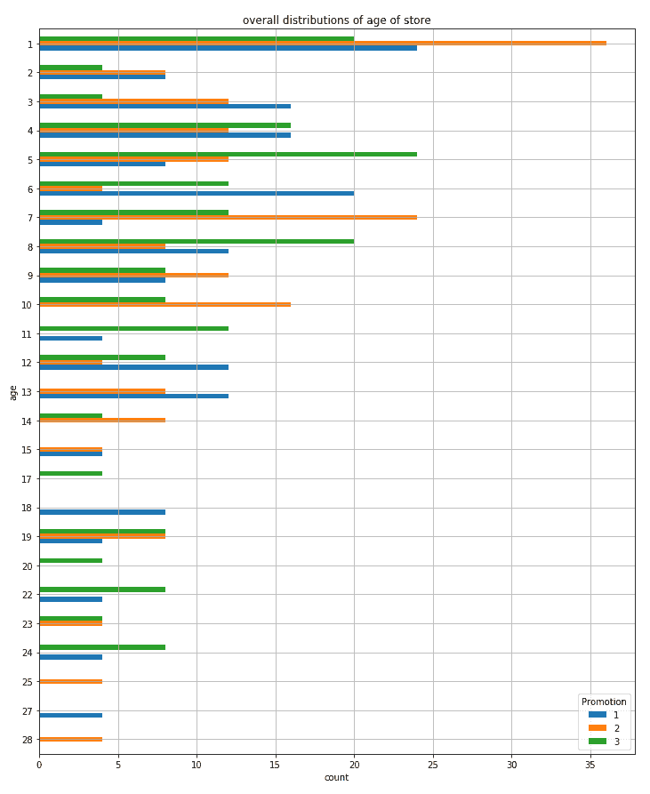

三个不同促销组中的商店年龄分布似乎彼此一致，但从这个图表中很难消化所呈现的信息。通过查看三组促销中商店年龄的汇总统计数据，会更容易理解这些信息。请看以下代码：

```py
df.groupby('Promotion').describe()['AgeOfStore']
```

这段代码的输出结果如下：


从这个输出中，你可以注意到，从这些汇总统计数据来看，商店年龄的总体分布更加容易理解。我们可以看到，所有三组测试组的商店年龄分布似乎相似。这三组的商店平均年龄在 8 至 9 年之间，大多数商店年龄为 10 到 12 年或更年轻。

通过分析每个促销或测试组的组成，我们可以验证商店档案之间的相似性。这表明样本组得到了很好的控制，A/B 测试结果将具有意义且值得信赖。

# 统计假设检验

不同营销策略的 A/B 测试的最终目标是找出哪种策略最有效，哪种策略在其他策略中表现最好。如前文简要讨论的那样，响应数量较高的策略并不一定代表它优于其他策略。我们将讨论如何使用 t 检验来评估不同营销策略的相对表现，并查看哪种策略在统计学上显著优于其他策略。

在 Python 中，计算 t 检验的 t 值和 p 值有两种方法。我们将在本节中演示这两种方法，你可以根据自己的需求选择最适合的方式。计算 t 检验的 t 值和 p 值的两种方法如下：

+   **通过公式计算 t 值和 p 值**：第一种方法是通过我们在上一节中学到的公式手动计算 t 值。你可能记得，我们需要计算三项内容才能得到 t 值——均值、标准差和样本数。看看以下代码：

```py
        means = df.groupby('Promotion').mean()['SalesInThousands']
        stds = df.groupby('Promotion').std()['SalesInThousands']
        ns = df.groupby('Promotion').count()['SalesInThousands']
```

如你所见，使用代码中的 `mean`、`std` 和 `count` 函数，你可以轻松计算每个测试组的均值、标准差和样本数。通过这些数据，我们可以利用之前讨论过的公式计算 t 值。看看以下代码：

```py
      import numpy as np

        t_1_vs_2 = (
            means.iloc[0] - means.iloc[1]
        )/ np.sqrt(
            (stds.iloc[0]**2/ns.iloc[0]) + (stds.iloc[1]**2/ns.iloc[1])
        )
```

使用这段代码，我们可以计算出促销 1 和促销 2 的性能比较的 t 值。运行代码后得到的 t 值是 `6.4275`。通过这个 t 值，我们可以使用以下代码计算 p 值：

```py
        from scipy import stats

        df_1_vs_1 = ns.iloc[0] + ns.iloc[1] - 2

        p_1_vs_2 = (1 - stats.t.cdf(t_1_vs_2, df=df_1_vs_1))*2
```

如你所见，代码中首先计算自由度，这是两个组样本数之和减去二。利用之前计算的 t 值，我们可以使用 `scipy` 包的 `stats` 模块中的 `t.cdf` 函数来计算 p 值。运行此代码得到的 p 值是 `4.143e-10`。这是一个极其小的数字，接近 `0`。如前所述，p 值越接近 0，意味着反对零假设的证据越强，且两组测试结果之间的差异具有显著性。

促销组 1 的平均销售额（千元）约为 `58.1`，而促销组 2 的平均销售额约为 `47.33`。通过我们的 t 检验，我们已经证明这两个组的营销表现存在显著差异，并且促销组 1 的表现优于促销组 2。然而，如果我们将促销组 1 和促销组 3 进行 t 检验，我们将看到不同的结果。

表面上，促销组 1 的平均销售额 (`58.1`) 看起来高于促销组 2 (`55.36`)。然而，当我们对这两个组进行 t 检验时，我们得到 t 值为 `1.556`，p 值为 `0.121`。计算出的 p 值远高于 `0.05`，这是一个普遍接受的临界值。这表明促销组 1 的营销表现与促销组 2 的营销表现没有统计学上的显著差异。因此，尽管促销组 1 的平均销售额高于促销组 2，但这种差异在统计上并不显著，我们不能得出促销组 1 的表现远好于促销组 2 的结论。从这些评估结果来看，我们可以得出结论，促销组 1 和促销组 3 的表现优于促销组 2，但促销组 1 和促销组 3 之间的差异在统计上并不显著。

+   **使用 scipy 计算 t 值和 p 值**：另一种计算 t 值和 p 值的方法是使用 `scipy` 包中的 `stats` 模块。看看以下代码：

```py
        t, p = stats.ttest_ind(
            df.loc[df['Promotion'] == 1, 'SalesInThousands'].values, 
            df.loc[df['Promotion'] == 2, 'SalesInThousands'].values, 
            equal_var=False
         )
```

如您所见，在这段代码中，`scipy`包中的`stats`模块有一个名为`ttest_ind`的函数。该函数根据数据计算 t 值和 p 值。使用这个函数，我们可以轻松计算 t 值和 p 值，以比较不同促销或测试组的营销表现。无论我们是使用之前手动计算 t 值和 p 值的方法，还是使用`scipy`包中的`ttest_ind`函数，得到的结果是一样的。我们用来比较促销组 1 与组 2、促销组 1 与组 3 的 t 值分别为`6.4275`和`1.556`，而得到的 p 值分别是`4.29e-10`和`0.121`。当然，这些 t 检验结果的解释与之前相同。

我们已经展示了两种计算 t 值和 p 值的方法。虽然使用`scipy`包的现成解决方案来计算这些值可能看起来更简单，但始终牢记方程是有帮助的。

该 Python 练习的完整代码可以通过以下链接查看：[`github.com/yoonhwang/hands-on-data-science-for-marketing/blob/master/ch.12/python/ABTesting.ipynb`](https://github.com/yoonhwang/hands-on-data-science-for-marketing/blob/master/ch.12/python/ABTesting.ipynb)。

# 使用 R 评估 A/B 测试结果

在本节中，我们将讨论如何评估 A/B 测试结果，以决定哪种营销策略最有效。到本节结束时，我们将涵盖如何进行统计假设检验并计算统计显著性。我们将主要使用`dplyr`和`ggplot2`来分析和可视化数据，并评估 A/B 测试结果。

对于那些希望使用 Python 而非 R 进行本次练习的读者，您可以参考前一节内容。

对于本次练习，我们将使用 IBM Watson Analytics 社区中公开可用的数据集，您可以通过以下链接找到该数据集：[`www.ibm.com/communities/analytics/watson-analytics-blog/marketing-campaign-eff-usec_-fastf/`](https://www.ibm.com/communities/analytics/watson-analytics-blog/marketing-campaign-eff-usec_-fastf/)。您可以通过该链接下载数据，该数据以 XLSX 格式提供，文件名为`WA_Fn-UseC_-Marketing-Campaign-Eff-UseC_-FastF.xlsx`。下载数据后，您可以通过运行以下命令将其加载到 RStudio 中：

```py
library(dplyr)
library(readxl)
library(ggplot2)

#### 1\. Load Data ####
df <- read_excel(
  path="~/Documents/data-science-for-marketing/ch.12/data/WA_Fn-UseC_-Marketing-Campaign-Eff-UseC_-FastF.xlsx"
)
```

`df`数据框如下所示：

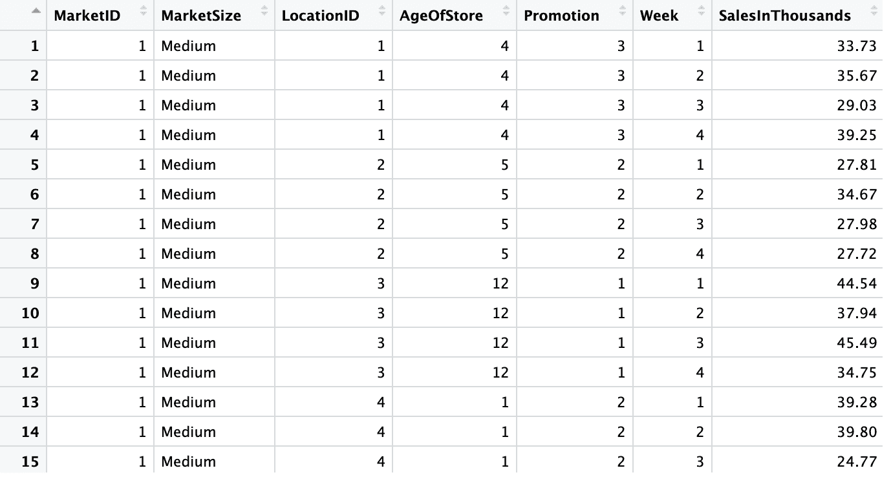

数据集中共有七个变量。您可以在 IBM Watson Analytics 社区页面找到这些变量的描述，我们将在以下内容中再次说明：

+   `MarketID`：市场的唯一标识符

+   `MarketSize`：市场区域的销售规模

+   `LocationID`：商店位置的唯一标识符

+   `AgeOfStore`：商店的年龄（以年为单位）

+   `Promotion`：测试的三种促销活动之一

+   `week`：促销活动进行的四个星期之一

+   `SalesInThousands`：特定`LocationID`、`Promotion`和`week`的销售额

# 数据分析

让我们深入看看数据。在这一部分，我们将专注于理解销售、市场规模、门店位置和门店年龄的分布，这些数据用于测试不同的促销活动。本分析的目标是确保每个促销组的控制变量和属性呈对称分布，以便不同组之间的促销效果可以进行可比性比较。

不同促销活动的总销售分布可以通过以下代码进行可视化：

```py
salesPerPromo <- df %>% 
  group_by(Promotion) %>%
  summarise(Sales=sum(SalesInThousands))

ggplot(salesPerPromo, aes(x="", y=Sales, fill=Promotion)) + 
  geom_bar(width=1, stat = "identity", position=position_fill()) +
  geom_text(aes(x=1.25, label=Sales), position=position_fill(vjust = 0.5), color='white') +
  coord_polar("y") +
  ggtitle('sales distribution across different promotions')
```

从这段代码中可以看出，我们通过`Promotion`列对数据进行了分组，并通过对`SalesInThousands`列求和来聚合总销售额。通过饼图，我们可以轻松地看到每个组所占的比例。

生成的饼图如下所示：

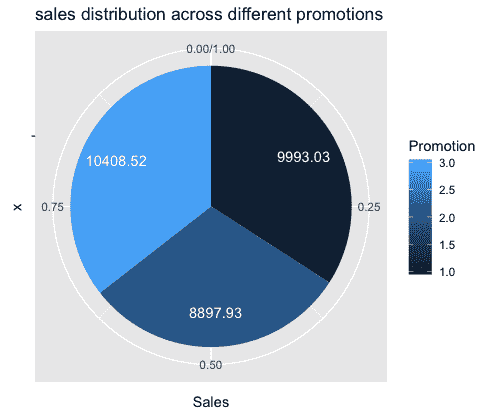

从这张饼图中可以清晰地看出，促销组 3 在三组中拥有最大的总销售额。然而，每个促销组大致占据了促销期间总销售额的三分之一。同样，我们也可以通过以下代码可视化每个促销组中不同市场规模的构成：

```py
marketSizePerPromo <- df %>% 
  group_by(Promotion, MarketSize) %>%
  summarise(Count=n())

ggplot(marketSizePerPromo, aes(x=Promotion, y=Count, fill=MarketSize)) + 
  geom_bar(width=0.5, stat="identity", position="dodge") +
  ylab("Count") +
  xlab("Promotion") +
  ggtitle("breakdowns of market sizes across different promotions") +
  theme(plot.title=element_text(hjust=0.5))
```

条形图如下所示：

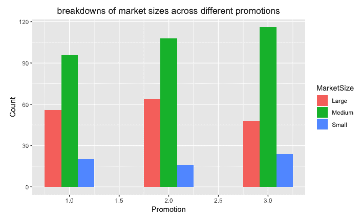

如果你认为堆叠条形图更容易查看，你可以使用以下代码将这些数据展示为堆叠条形图：

```py
ggplot(marketSizePerPromo, aes(x=Promotion, y=Count, fill=MarketSize)) + 
  geom_bar(width=0.5, stat="identity", position="stack") +
  ylab("Count") +
  xlab("Promotion") +
  ggtitle("breakdowns of market sizes across different promotions") +
  theme(plot.title=element_text(hjust=0.5))
```

你可能会注意到，这段代码和之前的代码之间唯一的区别是`position="stack"`标志在`geom_bar`函数中的使用。结果如下所示：

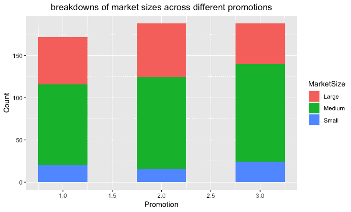

从这个条形图中可以看到，中等市场规模在三种促销组中占比最大，而小市场规模占比最小。我们可以通过这个图验证，不同市场规模的构成在三种促销组之间是相似的。

另一个属性`AgeOfStore`及其在所有不同促销组中的总体分布，可以通过以下代码可视化：

```py
overallAge <- df %>%
  group_by(AgeOfStore) %>%
  summarise(Count=n())

ggplot(overallAge, aes(x=AgeOfStore, y=Count)) + 
  geom_bar(width=0.5, stat="identity") +
  ylab("Count") +
  xlab("Store Age") +
  ggtitle("overall distributions of age of store") +
  theme(plot.title=element_text(hjust=0.5))
```

结果如下所示的条形图：

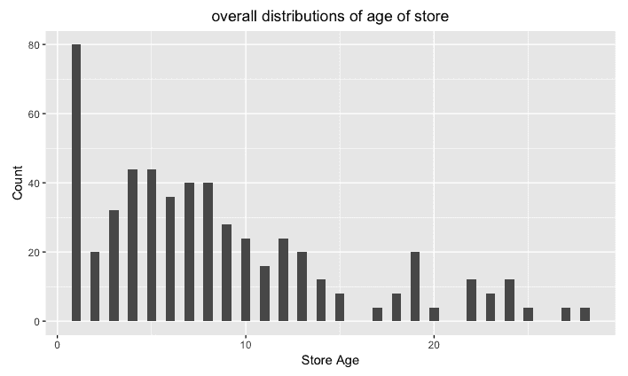

从这个图中可以看到，很多门店的年龄为**1**岁，并且大多数门店的年龄为**10**岁或以下。然而，我们更感兴趣的是三种不同促销组中的门店年龄分布是否相似。请看以下代码：

```py
AgePerPromo <- df %>% 
  group_by(Promotion, AgeOfStore) %>%
  summarise(Count=n())

ggplot(AgePerPromo, aes(x=AgeOfStore, y=Count, fill=Promotion)) + 
  geom_bar(width=0.5, stat="identity", position="dodge2") +
  ylab("Count") +
  xlab("Store Age") +
  ggtitle("distributions of age of store") +
  theme(plot.title=element_text(hjust=0.5))
```

使用这段代码，你将获得如下输出：

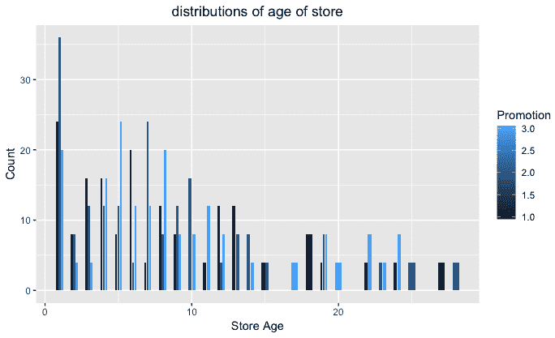

三个不同促销组的商店年龄分布似乎彼此对齐，但从这个图表中获取信息相当困难。查看三个促销组的商店年龄汇总统计数据会更加容易。请看以下代码：

```py
tapply(df$AgeOfStore, df$Promotion, summary)
```

这段代码的输出结果如下所示：

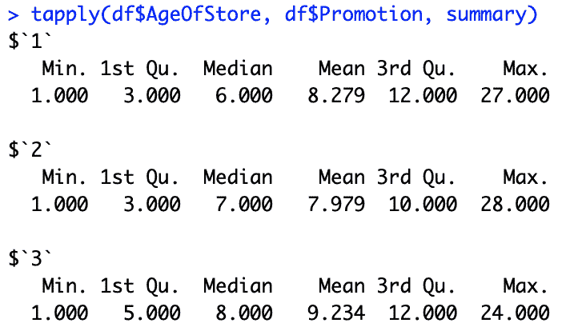

从这个输出结果中，你可能会注意到，通过这些汇总统计数据，理解整体商店年龄分布要容易得多。我们可以看到，三个测试组似乎有相似的商店年龄分布。三个组的商店平均年龄为 8-9 岁，大多数商店年龄在 10-12 岁或更年轻。

通过分析每个促销或测试组的组成方式，我们可以验证商店档案是否彼此相似。这表明样本组得到了良好的控制，A/B 测试结果将是有意义且可信的。

# 统计假设检验

不同营销策略的 A/B 测试的最终目标是找出哪种策略最有效，并在其他策略中表现最好。如前文简要讨论过的，响应数量较高的策略不一定意味着它优于其他策略。我们将讨论如何使用 t 检验来评估不同营销策略的相对表现，看看哪种策略在统计上显著优于其他策略。

在 R 中，计算 t 检验的 t 值和 p 值有两种方法。本节将演示这两种方法，具体使用哪一种，取决于你自己决定哪种方法更方便。计算 t 检验的 t 值和 p 值的两种方法如下：

+   **根据公式计算 t 值和 p 值**：第一种方法是手动计算 t 值，使用我们在前一节中学到的公式。如你所记得的，我们需要计算三项内容来得到 t 值：均值、标准差和样本数量。请看以下代码：

```py
        promo_1 <- df[which(df$Promotion == 1),]$SalesInThousands
        promo_2 <- df[which(df$Promotion == 2),]$SalesInThousands

        mean_1 <- mean(promo_1)
        mean_2 <- mean(promo_2)
        std_1 <- sd(promo_1)
        std_2 <- sd(promo_2)
        n_1 <- length(promo_1)
        n_2 <- length(promo_2)
```

正如你从这段代码中看到的，你可以通过分别使用`mean`、`sd`和`length`函数轻松计算每个测试组的均值、标准差和样本数。有了这些数据，我们就可以使用之前讨论过的公式来计算 t 值。请看以下代码：

```py
        t_val <- (
          mean_1 - mean_2
        ) / sqrt(
         (std_1**2/n_1 + std_2**2/n_2)
        )
```

使用这段代码，我们可以计算比较促销 1 和促销 2 表现的 t 值。运行代码得到的 t 值为`6.4275`。通过这个 t 值，我们可以使用以下代码来获取 p 值：

```py
        df_1_2 <- n_1 + n_2 - 2

        p_val <- 2 * pt(t_val, df_1_2, lower=FALSE)
```

如您从这段代码中可以看到，我们首先计算自由度，即两个组样本数量之和减去 2。使用之前计算的 t 值，我们可以通过`pt`函数计算 p 值。这个函数根据 t 值和自由度返回来自 t 分布的概率值。运行这段代码得到的 p 值是`4.143e-10`。这是一个非常小的数字，接近 0。正如之前讨论的，接近 0 的 p 值意味着我们有强有力的证据反对零假设，表明两个测试组之间的差异是显著的。

促销组 1 的平均销售额（单位：千）大约是`58.1`，而促销组 2 的平均销售额大约是`47.33`。通过我们的 t 检验，已经证明这两个组的市场表现有显著差异，且促销组 1 的表现优于促销组 2。然而，如果我们进行促销组 1 和促销组 3 之间的 t 检验，结果会有所不同。

表面上，促销组 1（`58.1`）的平均销售额看起来高于促销组 2（`55.36`）。然而，当我们对这两个组进行 t 检验时，得到的 t 值为`1.556`，p 值为`0.121`。计算得到的 p 值远高于`0.05`，这是一条通常接受的分界线。这表明促销组 1 的市场表现与促销组 2 的市场表现在统计学上没有显著差异。因此，尽管促销组 1 的平均销售额在 A/B 测试中高于促销组 2，但这一差异在统计上并不显著，我们不能得出促销组 1 明显优于促销组 2 的结论。从这些评估结果来看，我们可以得出结论：促销组 1 和促销组 3 的表现优于促销组 2，但促销组 1 和促销组 3 之间的差异在统计上并不显著。

+   **使用`t.test`计算 t 值和 p 值**：计算 t 值和 p 值的另一种方法是使用 R 中的`t.test`函数。请看以下代码：

```py
        # using t.test
        t.test(
          promo_1, 
          promo_2
        )
```

如您从这段代码中可以看到，R 具有一个`t.test`函数，给定数据后，它可以计算 t 值和 p 值。使用这个函数，我们可以轻松地计算 t 值和 p 值，以比较不同促销活动或测试组的市场表现。无论我们使用之前手动从公式中计算 t 值和 p 值的方法，还是使用`scipy`包中的`ttest_ind`函数，这两种方法得到的结果都是相同的。比较促销组 1 与促销组 2，以及促销组 1 与促销组 3 时，我们得到的 t 值分别是`6.4275`和`1.556`；而得到的 p 值分别是`4.29e-10`和`0.121`。当然，这些 t 检验结果的解释与之前相同。

我们展示了两种计算 t 值和 p 值的方法。使用 R 中的`t.test`函数看起来更简便，但始终记住公式是非常有帮助的。

本 R 练习的完整代码可以在以下链接找到：[`github.com/yoonhwang/hands-on-data-science-for-marketing/blob/master/ch.12/R/ABTesting.R`](https://github.com/yoonhwang/hands-on-data-science-for-marketing/blob/master/ch.12/R/ABTesting.R)。

# 总结

在本章中，我们学习了营销中最常用的测试方法之一，用于做出未来营销策略决策。我们讨论了什么是 A/B 测试，为什么在完全投入某一营销策略之前进行 A/B 测试很重要，以及它如何帮助你以更高效且成本更低的方式实现营销目标。通过一个示例案例，其中你的目标是选择最佳的邮件主题行，我们了解了 A/B 测试的典型流程。A/B 测试不必仅进行一次。当你不断通过实验测试新的想法与当前正在运行的策略或其他想法时，A/B 测试效果最佳。简单来说，每当有新的想法时，都应该进行 A/B 测试。利用我们在本章中学到的 t 检验以及 Python 和 R 工具，你应该能够轻松评估 A/B 测试结果，并识别出哪一策略是获胜的策略。

本章是最后一个包含案例研究和编程练习的技术章节。在下一章中，我们将总结和回顾本书中所有涉及的主题。然后，我们将讨论一些在营销中常见的数据科学和机器学习应用，以及一些未在本书中涉及的 Python 和 R 库，这些库将在你未来的项目中带来益处。
