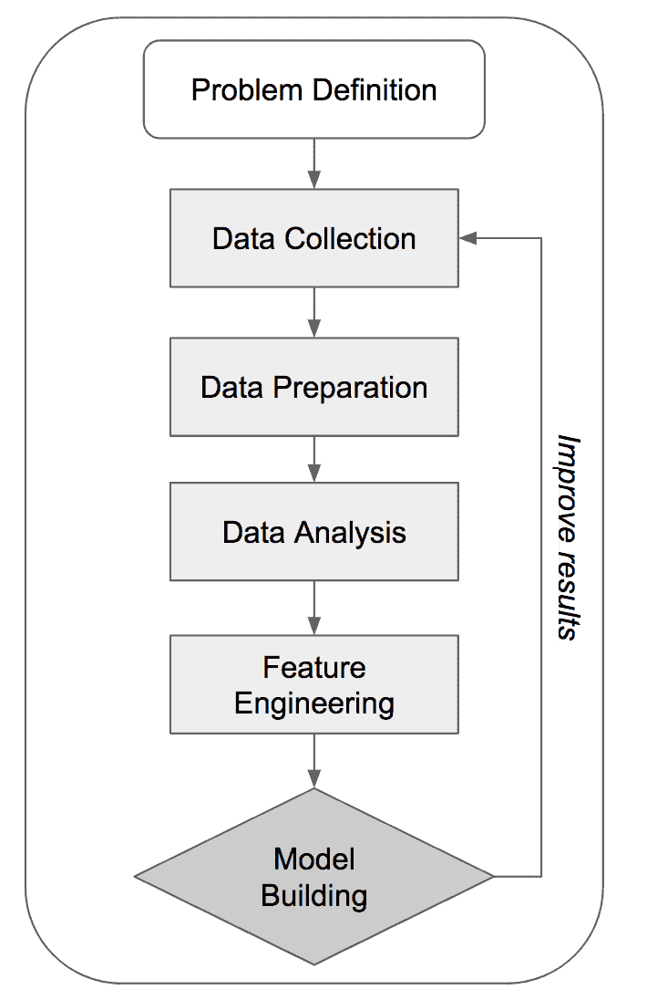

# 接下来会是什么？

我们已经走了很长一段路。我们从数据科学的基础知识及其在营销中的应用开始，逐步探讨了数据科学在营销中的众多使用案例。在此过程中，我们进行了描述性分析，利用数据科学技术分析和可视化数据，以识别模式。我们还进行了解释性分析，使用机器学习模型从数据中得出洞察，例如找出某些客户活动背后的驱动因素，以及客户属性与其行为之间的关联。最后，我们还探讨了预测性分析，通过训练各种机器学习算法，预测客户的某些行为。

本书中所涉及的主题并非琐碎，它们都针对数据科学在营销中的实际应用而设计。每一章的目的都是展示如何在实际的营销用例中运用数据科学和机器学习技术，并指导你如何将讨论过的概念应用到你特定的商业案例中。随着营销分析领域的不断发展和拓展，我们希望通过这一章让你了解一些可能面临的挑战，并介绍一些常用的技术，同时回顾我们在本书中讨论的内容。

在这一章中，我们将涵盖以下主题：

+   本书所涵盖主题的回顾

+   现实生活中的数据科学挑战

+   更多的机器学习模型和软件包

# 本书所涵盖主题的回顾

本书从一开始就涵盖了大量的内容，包括讨论营销趋势、数据科学和机器学习如何成为构建营销策略的关键组成部分，以及建立各种预测性机器学习模型以实现更高效的营销。在结束本书之前，回顾一下我们已经覆盖的内容并刷新记忆是很有价值的。

# 营销趋势

正如你可能还记得的那样，我们在第一章《数据科学与营销》中讨论的第一件事是营销的最新趋势。理解并跟上你所在行业中正在发生的趋势非常重要，尤其是在营销领域，对数据驱动的定量营销的需求非常大，而且还需要利用最新、最智能的技术来开发更具成本效益的营销策略。

根据 2018 年 2 月的首席营销官（CMO）调查（[`www.forbes.com/sites/christinemoorman/2018/02/27/marketing-analytics-and-marketing-technology-trends-to-watch/#4ec8a8431b8a`](https://www.forbes.com/sites/christinemoorman/2018/02/27/marketing-analytics-and-marketing-technology-trends-to-watch/#4ec8a8431b8a)），在过去的五年里，营销分析的依赖度从 30%上升到了 42%。可以很容易观察到的三个主要营销趋势如下：

+   **数字营销日益重要**：如今，许多营销活动更倾向于通过数字渠道进行，例如搜索引擎、社交媒体、电子邮件和网站，而不再局限于传统的大众媒体，如电视、广播和公交车站的广告牌。随着各种数字营销渠道作为营销选择越来越受欢迎，了解如何在社交网络上进行受众定向（例如 Facebook 和 Instagram），或如何在搜索引擎和视频流媒体服务（如 Google 和 YouTube）上投放广告变得尤为重要。

+   **营销分析**：营销分析是一种监控和量化过去营销活动结果和表现的方式。在第二章，*关键绩效指标和可视化*中，我们了解了各种**关键绩效指标**（**KPI**），可以用来跟踪和量化不同营销活动的回报。营销分析不仅仅局限于分析 KPI，它还可以应用于产品和客户分析，这些我们在第五章，*产品分析*，和第七章，*客户行为的探索性分析*中都有讨论。

+   **个性化和精准营销**：随着数据科学和机器学习的可访问性变得更加容易，另一个营销趋势应运而生：面向个人的精准营销。通过使用预测分析，我们现在可以预测出单个客户可能喜欢哪些类型的产品，这一点我们在第六章，*推荐合适的产品*中已经讨论过。我们还看到，如何通过构建预测机器学习模型来针对那些可能流失的客户，这一点在第十一章，*留住客户*中有详细阐述。由于精准营销能够带来更高的投资回报率（ROI），因此有许多**软件即服务**（**SaaS**）公司，例如 Sailthru 和 Oracle，提供个性化和精准营销的平台。

随着新策略和技术的发展，趋势注定会发生变化。我们在本书中讨论的趋势可能在 20-30 年后不再适用。作为一名营销专业人士，跟踪并了解同行的做法，以及正在开发和使用的其他方法或技术以实现更高的投资回报率（ROI）是至关重要的。

# 数据科学工作流

作为一名营销专业人士或有志于成为营销领域数据科学家的你，可能会发现很难知道从哪里开始进行数据科学项目。在第一章《数据科学与营销》中，我们讨论了一个典型的数据科学项目工作流。在开始未来的营销数据科学项目之前，回顾一下这些步骤是非常有意义的。你应该熟悉以下工作流图：



让我们更详细地讨论这六个步骤：

1.  **问题定义**：任何数据科学和机器学习项目都应该有一个明确的问题定义。你需要深入理解问题本身、项目的范围以及解决方案的思路。这时你需要集思广益，决定使用哪些分析方法和数据科学技术。

1.  **数据收集**：对于任何数据科学项目来说，拥有数据是成功的关键。在这个步骤中，你需要收集所有所需的数据以供数据科学项目使用。通常，你可能需要为内部数据实现数据收集流程，购买第三方数据，或者从不同的网站抓取数据。根据情况的不同，数据收集步骤可能是简单的，也可能是繁琐的。

1.  **数据准备**：在数据收集步骤获得数据后，下一步是清理和准备数据。正如我们在本书中所看到的，我们的编程练习总是从数据清理和准备开始。在数据准备步骤中，我们处理了缺失值、编码了类别变量，或者转换了其他变量，以便机器学习算法能够理解这些数据。

1.  **数据分析**：正如你可能记得的那样，我们在本书的编程练习中通过数据分析步骤发现了有价值的见解。通过分析数据，我们更好地理解了不同变量的总体分布，通常来说，通过不同的图表可视化数据，有助于识别出明显的模式。

1.  **特征工程**：正如我们在整本书中看到并讨论过的那样，针对机器学习模型进行特征工程有许多不同的方式。对于货币值，我们应用了对数变换。在某些情况下，我们对数据进行了归一化，使得变量处于相同的尺度上。我们还使用了独热编码（one-hot encoding）来编码类别变量。特征工程是构建机器学习模型中最重要的步骤之一，因为算法将尝试从这些特征中学习，以正确预测目标。

1.  **模型构建**：典型数据科学工作流程中的最后一步，当然是模型构建。利用前面步骤中清理过的数据和构建的特征，这里是训练机器学习模型的地方。在本书中，我们讨论了如何评估模型。对于分类模型，我们通常使用准确率、精确率、召回率、ROC 曲线和 AUC。对于回归模型，我们使用了 MSE、*R*²，或者是预测值与实际值的散点图来评估模型。

在我们的编程练习中，我们的工作流程几乎与我们刚才讨论的工作流程相同。当不确定下一步该做什么时，我们希望这个工作流程图能为你提供下一步的一些提示。

# 机器学习模型

如你所记得，我们在本书中构建了许多机器学习模型。例如，在第八章，《预测营销参与的可能性》中，我们训练了一个随机森林模型来预测每个客户参与营销电话的可能性。在第十一章，《客户保留》中，我们使用了**人工神经网络**（**ANN**）模型来识别哪些客户可能会流失。在本节中，我们将回顾本书中使用过的机器学习模型：

+   **逻辑回归**：在第三章，《营销参与背后的驱动因素》中，我们使用了逻辑回归模型来提取哪些因素使客户更可能参与营销活动。在 Python 中，我们使用了`statsmodels`包来构建逻辑回归模型，训练逻辑回归模型的代码如下所示：

```py
        import statsmodels.formula.api as sm

        logit = sm.Logit(
            target_variable, 
            features
        )

        logit = logit.fit()
```

从这个训练好的模型中，我们可以通过运行`logit_fit.summary()`查看特征与目标变量之间的细节和相关性。另一方面，在 R 中，我们使用了以下命令来训练逻辑回归模型：

```py
        logit.fit <- glm(Target ~ ., data = DF, family = binomial)
```

类似于我们在 Python 中使用`summary`函数的方式，我们可以运行`summary(logit.fit)`命令来获取逻辑回归拟合的细节以及特征与目标变量之间的相关性。

+   **随机森林**：如你所记得，我们在第八章《预测营销参与的可能性》中使用了随机森林算法来预测哪些客户可能会响应营销电话。在 Python 中，我们使用了`scikit-learn`包来构建随机森林模型。训练随机森林模型的代码如下所示：

```py
        from sklearn.ensemble import RandomForestClassifier

        rf_model = RandomForestClassifier()

        rf_model.fit(X=x_train, y=y_train)
```

如你所记得，随机森林算法有许多超参数可以调整。我们已经讨论了如何微调森林中的估计器数量`n_estimators`，树的最大深度`max_depth`，以及分支分割所需的最小样本数`min_samples_split`。另一方面，在 R 中，我们使用了`randomForest`库来构建随机森林模型。训练随机森林模型的 R 代码如下所示：

```py
        library(randomForest)

        rfModel <- randomForest(x=trainX, y=factor(trainY))
```

使用`randomForest`包，你可以微调超参数。你可以使用`ntree`来调整森林中树的数量，`sampsize`来调整训练每棵树时所需的样本大小，以及`maxnodes`来定义树中终端节点的最大数量。

+   **人工神经网络（ANN）**：如你所记得，在第十一章《保持客户》中，我们使用了 ANN 模型来预测可能会流失的客户。为了构建 ANN 模型，我们在 Python 和 R 中都使用了`keras`包。在 Python 中，训练 ANN 模型的代码如下所示：

```py
        from keras.models import Sequential
        from keras.layers import Dense

        model = Sequential()
        model.add(Dense(16, input_dim=
                        len(features), activation='relu'))
        model.add(Dense(8, activation='relu'))
        model.add(Dense(1, activation='sigmoid'))

        model.compile(loss='binary_crossentropy', 
                      optimizer='adam', metrics=['accuracy'])

        model.fit(X_train, y_train, epochs=50, batch_size=100)
```

如你已经知道的，我们首先需要向模型中添加输入层、隐藏层和输出层。然后，我们可以编译并训练 ANN 模型。在 R 中，概念是相同的，但语法稍有不同。使用`keras`包训练 ANN 模型的 R 代码如下所示：

```py
        library(keras)

        model <- keras_model_sequential() 
        model %>% 
          layer_dense(units = 16, kernel_initializer =
          "uniform", activation = 'relu', input_shape=ncol(train)-1) %>% 
          layer_dense(units = 8, kernel_initializer = 
          "uniform", activation = 'relu') %>%
          layer_dense(units = 1, kernel_initializer =
                      "uniform", activation = 'sigmoid') %>% 
          compile(optimizer = 'adam',
            loss = 'binary_crossentropy',
            metrics = c('accuracy')
          )

        history <- model %>% fit(
          trainX, 
          trainY, 
          epochs = 50, 
          batch_size = 100, 
          validation_split = 0.2
        )
```

+   **k-means 聚类**：在第十章《基于数据的客户细分》中，我们使用了 k-means 聚类算法来程序化地构建不同的客户细分群体。我们已经看到，分析这些不同客户细分群体的属性可以帮助我们理解客户的不同行为，并找到更好的方法来定位不同的客户群体。在 Python 中，我们可以使用`scikit-learn`包来构建 k-means 聚类算法。代码如下所示：

```py
        from sklearn.cluster import KMeans

        kmeans = KMeans(n_clusters=4)
        kmeans = kmeans.fit(data)
```

如你所记得，你需要定义你希望从数据中构建的聚类数量，使用`n_clusters`参数。为了获取每条记录的聚类标签和聚类中心，我们可以使用`kmeans.labels_`和`kmeans.cluster_centers_`。同样，在 R 中，我们使用了`kmeans`函数来构建聚类模型，R 代码如下所示：

```py
        cluster <- kmeans(data, 4)
```

为了获取标签和聚类中心，我们可以使用`cluster$cluster`和`cluster$centers`。

有了这些算法，我们能够轻松地为营销中的不同使用场景构建各种机器学习模型。希望这些简短的机器学习模型构建语法回顾能帮助你刷新记忆。

# 现实生活中的数据科学挑战

如果我们能够针对不同的营销场景构建并使用各种机器学习模型，那么应用数据科学和机器学习到营销中看起来会非常光鲜亮丽且完美无缺。然而，通常情况并非如此。实际上，端到端的机器学习模型构建过程往往是繁琐的，过程中会有许多障碍和瓶颈。接下来，我们将讨论一些在现实生活中最常见的数据科学挑战，包括以下内容：

+   数据方面的挑战

+   基础设施方面的挑战

+   选择合适模型的挑战

# 数据方面的挑战

在营销中使用数据科学和机器学习的一个最大挑战是获取正确的数据。虽然这听起来可能很显而易见，但没有数据，就没有数据科学或机器学习。而且，如果数据的质量不好，那么训练出来的机器学习模型质量也会很差。

在这一部分，我们将讨论一些许多数据科学家在获取正确数据时常遇到的挑战：

+   **数据的存在性**：有时候你可能会想出一个很好的点子，打算使用数据科学技术来解决你在营销中遇到的某个问题。然而，你需要的数据可能根本不存在。例如，假设你的点子是识别热门网页内容，比如哪些网页是用户浏览最多、点赞最多的。然而，如果没有在你的网站上实现网页浏览跟踪功能，那么你可能没有相关的页面浏览数据。在这种情况下，你需要在你的网站上实现跟踪功能，以便跟踪哪些用户浏览了或点赞了哪些内容。这样，你只能在一定时间之后，收集到足够的数据来进行分析，才能开展你的想法。类似的情况在现实中发生得比较频繁，因此，理解你如何追踪用户活动以及缺少了哪些部分是至关重要的。如果可能的话，当数据在内部不存在时，获取第三方数据也是一个选择。有很多数据供应商出售你可能需要的数据。如果使用第三方数据供应商是一个选择，那么当你的项目没有数据时，这可能是一个好的解决方案。另外，还有很多可以自由使用的公开数据。始终值得看看你需要的数据是否是公开的。

+   **数据的可访问性**：数据的可访问性可能会成为数据科学项目的障碍，尤其是在大型企业中，某些数据集的访问权限被严格限制，只开放给选定的小组。在这种情况下，即使所需的数据集存在，数据科学家或市场营销专业人士也可能很难甚至无法访问和使用这些数据。数据的来源也可能导致数据可访问性问题。例如，如果数据流入其他应用程序而没有被存储或归档，那么在数据流失之后，它可能会丢失。数据文件的位置也可能成为访问所需数据的障碍。如果数据无法通过网络共享，或者你无法访问数据存储的位置，那么这也可能妨碍你使用数据。这就是为什么数据工程和数据工程师的责任和重要性日益上升的原因。数据工程师与其他数据科学家或软件开发人员合作，专门构建数据管道，帮助有可访问性问题的数据流转到业务的其他部分。如果你遇到数据可访问性的问题，首先找出障碍所在并考虑与数据工程师合作，建立数据管道，以使数据在未来的项目中可访问，至关重要。

+   **杂乱的数据**：你可以假设，在实际的数据科学项目中，你将面对的大部分数据都是杂乱无章的。数据可能是你无法轻易理解的格式，可能被分割成更小的部分，难以轻松地将它们连接在一起。或者，数据中也可能有太多缺失值或重复记录。数据集的杂乱程度会显著增加你需要花费的时间，以清理原始数据并使其可用。在这些杂乱的数据上进行深入的数据分析，对于使数据在未来步骤中可用至关重要。有时，与数据工程师合作修复数据源中的杂乱问题，进而使未来的数据更加清洁，可能是值得的。

# 基础设施挑战

在应用数据科学技术并使用机器学习模型进行市场营销项目的过程中，使用的系统基础设施可能会遇到一些挑战。通常，数据集太大，无法容纳在你的笔记本电脑或计算机中。随着数据量的日益增长，将来你很可能会遇到在笔记本电脑上开发数据科学模型的问题，即使你现在没有这个问题。

在进行数据科学项目时，有两件事可能会拖慢你的进度：CPU 或处理能力不足，以及 RAM 或内存不足。如果没有足够的处理能力，你的分析可能会花费很长时间。尤其是在训练机器学习模型时，模型训练可能需要几天、几周甚至几个月。在另一方面，如果内存不足，你可能会在运行分析时遇到`Out of Memory`错误。例如，基于树的模型，如决策树或随机森林，可能需要大量内存，训练这些模型可能会因为内存不足而在几个小时的训练后失败。

随着云计算的兴起和发展，解决这些问题的方案也随之出现。通过使用如 AWS、Google 或 Microsoft Azure 等云计算服务提供商，你理论上可以获得无限的计算能力和内存。当然，一切都有代价。如果没有正确规划，在这些云平台上运行大型数据科学任务可能会花费一大笔钱。在处理大型数据集时，明智的做法是考虑你需要多少处理能力和内存，才能成功运行任务。

# 选择合适模型的挑战

为某个数据科学项目选择机器学习算法比听起来更复杂。有些算法更像一个黑箱，你无法知道一个算法是如何做出预测或决策的。例如，理解一个训练好的随机森林模型是如何根据输入做出预测的非常困难。决策是由数百棵不同的决策树做出的，每棵树根据不同的决策标准进行工作，这使得数据科学家很难完全理解输入与输出之间发生了什么。

另一方面，线性模型，如逻辑回归模型，能够准确地告诉我们它们是如何做出决策的。一旦逻辑回归模型被训练，我们就能知道每个特征的系数，并从这些系数中推断出预测的输出是什么。根据你的使用场景，你可能需要这种可解释性，你需要能够向业务合作伙伴解释每个特征如何作用以及如何影响预测输出。通常情况下，更高级的模型更像一个黑箱，你需要在预测准确性和可解释性之间做出权衡。

# 更多的机器学习模型和包

在本书中，我们主要使用了以下五种最适合我们营销应用场景的机器学习算法：逻辑回归、随机森林、人工神经网络（ANN）、k-means 聚类和协同过滤。然而，还有许多其他现成的机器学习算法，您可能会在未来的数据科学和机器学习项目中找到它们的应用。我们将介绍一些其他常用的机器学习算法，以及在 Python 和 R 中使用的包，另外，我们还会提供更多关于这些算法的资源链接。

在您未来的项目中，您可能需要考虑的其他机器学习算法如下：

+   **最近邻**：这是一个机器学习算法，用于找到与新数据点最接近的预定义数量的样本。尽管这个算法的概念听起来很简单，但最近邻算法在包括图像识别在内的多个领域已被成功应用。在 Python 的 `scikit-learn` 包中，您可以使用 `neighbors` 模块中的 `KNeighborsClassifier` 类来构建分类模型，或使用 `KNeighborsRegressor` 类来构建回归模型。有关使用的详细信息，我们建议您查看以下文档页面：[`scikit-learn.org/stable/modules/neighbors.html`](https://scikit-learn.org/stable/modules/neighbors.html)。另一方面，在 R 中，您可以使用 `class` 库中的 `knn` 函数。有关该函数的 R 文档，请参考此页面：[`www.rdocumentation.org/packages/class/versions/7.3-15/topics/knn`](https://www.rdocumentation.org/packages/class/versions/7.3-15/topics/knn)。

+   **支持向量机**（**SVM**）：SVM 是另一种您可能会用到的机器学习算法。SVM 算法试图找到一个超平面，将数据最佳地划分为不同的类别或组。它在高维空间中特别有效。在 Python 的 `scikit-learn` 包中，您可以使用 `SVC` 和 `SVR` 类来实现分类和回归模型。有关文档页面，请访问以下链接：[`scikit-learn.org/stable/modules/svm.html`](https://scikit-learn.org/stable/modules/svm.html)。在 R 中，`e1071` 库提供了 `svm` 函数，您可以用它来训练 SVM 模型。有关其用法的更多文档，请参考此页面：[`www.rdocumentation.org/packages/e1071/versions/1.7-0.1/topics/svm`](https://www.rdocumentation.org/packages/e1071/versions/1.7-0.1/topics/svm)。

+   **梯度提升树**（**GBT**）：GBT 是一种基于树的机器学习算法。与随机森林算法不同，GBT 算法按顺序学习和训练每一棵树，每棵树都从前一棵树的错误中学习。因其预测准确性和稳健性而广为人知并频繁使用。在 Python 中，你可以使用 `scikit-learn` 包中的 `GradientBoostingClassifier` 类来解决分类问题，使用 `GradientBoostingRegressor` 类来解决回归问题。关于 `scikit-learn` 中 GBT 的更多细节可以在这里找到：[`scikit-learn.org/stable/modules/ensemble.html#gradient-tree-boosting`](https://scikit-learn.org/stable/modules/ensemble.html#gradient-tree-boosting)。同样，在 R 中，`gbm` 包实现了适用于分类和回归问题的 GBT 算法。你可以使用 `gbm` 包中的 `gbm` 函数来训练 GBT 模型。更多信息可以在以下链接中找到：[`www.rdocumentation.org/packages/gbm/versions/2.1.5/topics/gbm`](https://www.rdocumentation.org/packages/gbm/versions/2.1.5/topics/gbm)

# 总结

在本章中，我们回顾了本书中讨论的主题。我们简要地概述了在营销行业中可以观察到的趋势，以及数据科学和机器学习在营销中的重要性日益增加。然后，我们回顾了一个典型的数据科学工作流，其中你从问题定义开始，然后进入数据收集、准备和分析，最后进行特征工程和模型构建。在未来的数据科学项目中，值得将我们所看到的工作流图放在脑海中，当你卡住不知道接下来做什么时，可以参考这个图来获取灵感。我们还分享了在处理真实世界数据集时可能遇到的一些挑战。我们讨论的三个主要挑战是数据问题、基础设施问题和选择合适的模型。更具体地说，我们讨论了可解释性与模型准确性之间的权衡。我们提出了一些解决这些挑战的替代方案和解决办法，希望它们能在你面对类似挑战时提供帮助。最后，我们讨论了在未来项目中可能有用的其他常用机器学习模型。我们简要展示了每个模型所需的 Python 和 R 包，以及你可以在哪里找到有关这些模型使用的更多信息。

在本书的 13 章中，我们涵盖了可以应用于营销的各种数据科学和机器学习技术，重点强调实用性。通过本书中多个不同营销场景的示例，我们希望你已经对应用数据科学技术和构建机器学习模型以开发更智能、更高效的营销策略充满信心。我们希望你在本书的学习旅程中收获满满，获得了许多新的、有用的技能。
