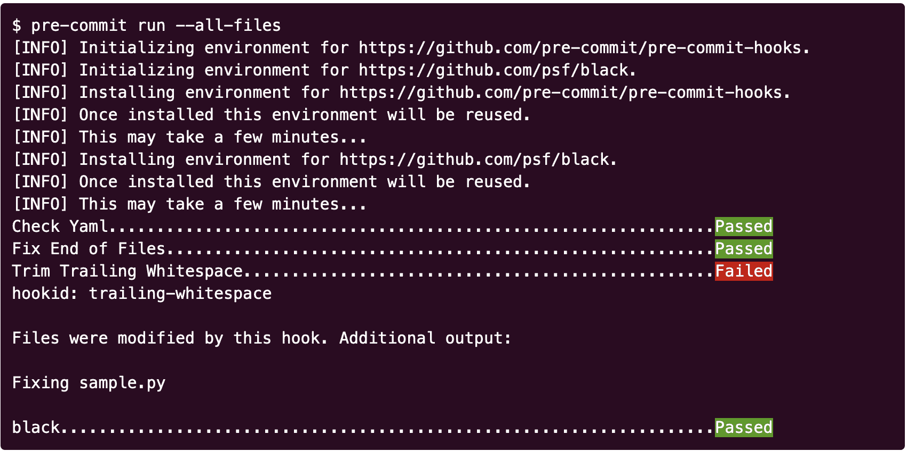
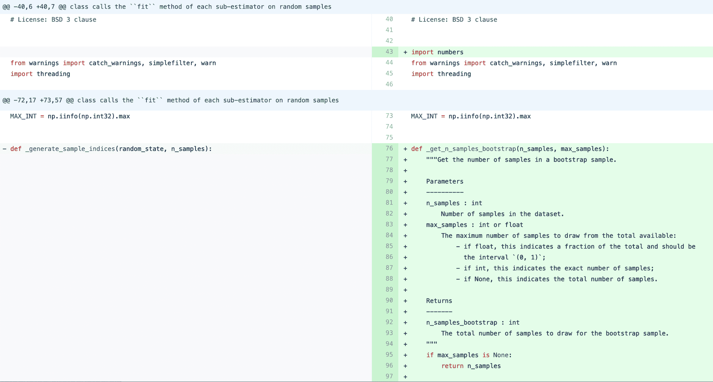
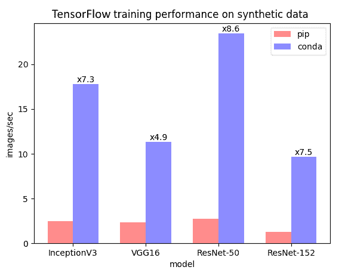
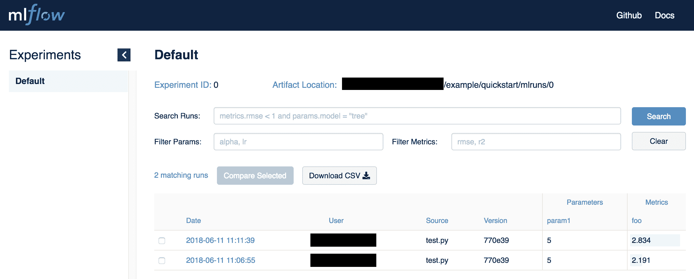

# 实现 ModelOps

在本章中，我们将探讨 ModelOps 及其最亲近的“表亲”——DevOps。我们将研究如何为数据科学构建开发管道，使项目更加可靠，实验可以复现，部署更加快速。为此，我们将熟悉一般的模型训练管道，看看数据科学项目与软件项目在开发基础设施方面的不同。我们还将看看哪些工具可以帮助版本控制数据、跟踪实验、自动化测试并管理 Python 环境。通过使用这些工具，你将能够创建一个完整的 ModelOps 管道，自动化新模型版本的交付，同时保证可复现性和代码质量。

本章将涵盖以下主题：

+   理解 ModelOps

+   探索 DevOps

+   管理代码版本和质量

+   将数据与代码一起存储

+   管理环境

+   跟踪实验

+   自动化测试的重要性

+   持续模型训练

+   为你的项目提供动力包

# 理解 ModelOps

ModelOps 是一组用于自动化数据科学项目中常见操作的实践，包括以下内容：

+   模型训练管道

+   数据管理

+   版本控制

+   实验跟踪

+   测试

+   部署

没有 ModelOps，团队将不得不在这些重复任务上浪费时间。每个任务本身相对容易处理，但项目可能会因为这些步骤中的错误而遭受影响。ModelOps 帮助我们创建像精密传送带一样运作的项目交付管道，并通过自动化测试程序来捕捉代码错误。

让我们从讨论 ModelOps 的最亲近“表亲”——DevOps 开始。

# 探索 DevOps

**DevOps** 代表 **开发运维**。软件开发过程包含许多重复且容易出错的任务，每次软件从源代码到达工作产品时，都需要执行这些任务。

让我们来看一下组成软件开发管道的一系列活动：

1.  执行检查，查找错误、拼写错误、不良的编码习惯和格式化问题。

1.  为一个或多个目标平台构建代码。许多应用程序应该在不同的操作系统上运行。

1.  运行一系列测试，检查代码是否按要求正常工作。

1.  打包代码。

1.  部署打包好的软件。

**持续集成与持续部署** (**CI/CD**) 表明所有这些步骤可以并且应该被自动化，并尽可能频繁地运行。经过充分测试的小更新更加可靠。如果一切出现问题，回退这样的更新要容易得多。在 CI/CD 之前，手动执行软件交付管道的软件工程师的吞吐量限制了部署周期的速度。

现在，高度可定制的 CI/CD 服务器使我们摆脱了手动操作，完全自动化了所有必要的活动。它们运行在源代码版本控制系统之上，并监控新的代码更改。一旦检测到新的代码更改，CI/CD 服务器就可以启动交付流水线。要实现 DevOps，您需要花时间编写自动化测试并定义软件流水线，但之后，流水线会每次都按需运行。

DevOps 在软件开发领域掀起了革命，推出了许多提高软件工程师生产力的技术。像任何技术生态系统一样，专家需要投入时间来学习并将所有工具整合在一起。随着时间的推移，CI/CD 服务器变得越来越复杂，功能越来越强大，许多公司意识到需要一位全职专家来管理他们项目的交付流水线。因此，出现了 DevOps 工程师这一角色。

来自 DevOps 世界的许多工具变得更加易于使用，只需要在用户界面中点击几下。一些 CI/CD 解决方案，如 GitLab，帮助您自动创建简单的 CI/CD 流水线。

CI/CD 基础设施的许多优势适用于数据科学项目；然而，许多领域仍然没有覆盖。在本章接下来的部分，我们将探讨数据科学项目如何使用 CI/CD 基础设施，以及您可以使用哪些工具来使数据科学项目交付的自动化更加完善。

# 探索数据科学项目基础设施的特殊需求

一个现代的软件项目可能会使用以下基础设施来实现 CI/CD：

+   版本控制——Git

+   代码协作平台——GitHub、GitLab

+   自动化测试框架——取决于实现语言

+   CI/CD 服务器——Jenkins、Travis CI、Circle CI 或 GitLab CI

所有这些技术都缺少一些对数据科学项目至关重要的核心功能：

+   数据管理——解决存储和版本控制大量数据文件问题的工具

+   实验追踪——用于跟踪实验结果的工具

+   自动化测试——测试数据密集型应用程序的工具和方法

在介绍解决前述问题的方案之前，我们将先了解数据科学交付流水线。

# 数据科学交付流水线

数据科学项目由多个相互依赖的数据处理流水线组成。以下图显示了数据科学项目的一般流水线：


我们快速总结一下前述图中的所有阶段：

1.  每个模型流水线都以**原始数据**开始，这些数据存储在某种数据源中。

1.  接着，数据科学家执行**探索性数据分析**（**EDA**），并创建**EDA 报告**，以加深对数据集的理解并发现数据中的潜在问题。

1.  **数据处理管道**将原始数据转换为一种中间格式，这种格式更适合创建用于训练、验证和测试模型的数据集。

1.  **模型数据集管道**创建了用于训练和测试模型的现成数据集。

1.  **模型训练管道**使用准备好的数据集来训练模型，通过离线测试评估其质量，并生成包含详细模型测试结果的**模型质量报告**。

1.  在管道的最后，您将获得最终的成果——一个**训练好的模型**，它被保存在硬盘或数据库中。

现在，我们可以开始讨论 ModelOps 的实施策略和示例工具。

# 管理代码版本和质量

数据科学项目涉及大量代码，因此数据科学家需要使用**源代码版本控制**（**SVC**）系统，例如 Git，作为必不可少的组件。使用 Git 最直接的方式是采用像 GitLab 或 GitHub 这样的代码协作平台。这些平台提供了现成的 Git 服务器，并配有用于代码审查和问题管理的有用协作工具，使得在共享项目上工作更加便捷。这些平台还与 CI/CD 解决方案集成，创建了一个完整且易于配置的软件交付管道。GitHub 和 GitLab 是免费使用的，而且 GitLab 支持本地安装，因此您的团队没有理由错过使用这些平台的好处。

许多团队将 Git 与流行的平台产品同义，但有时了解它并不是唯一的选择也很有用。有时，您无法访问互联网或在服务器上安装额外软件，但仍希望在共享仓库中存储代码。即便在这些受限环境中，您仍然可以使用 Git。Git 有一个非常有用的功能叫做**文件远程**，它允许您将代码推送到几乎任何地方。

例如，您可以使用 USB 闪存驱动器或共享文件夹作为远程仓库：

```py
git clone --bare /project/location/my-code /remote-location/my-code #copy your code history from a local git repo
git remote add usb file:///remote/location/my-code 
# add your remote as a file location
git remote add usb file:///remote/location/my-code 
# add your remote as a file location
git push usb master 
# push the code

# Done! Other developers can set up your remote and pull updates:
git remote add usb file:///remote/location/my-code # add your remote as a file location
git pull usb mater # pull the code
```

通过将`file:///`路径更改为`ssh:///`路径，您还可以将代码推送到本地网络上的远程 SSH 机器。

大多数数据科学项目都是用 Python 编写的，而静态代码分析和代码构建系统在其他编程语言中更为普及。这些工具可以在每次尝试构建项目时自动修整代码，并检查关键错误和潜在的漏洞。Python 也有这样的工具——例如 pre-commit（[`pre-commit.com`](https://pre-commit.com)）。

以下截图演示了在 Python 代码仓库上运行 pre-commit 的情况：



在介绍了处理代码的主要建议之后，接下来我们来看一下如何为数据实现相同的效果，数据是任何数据科学项目的核心部分。

# 将数据与代码一起存储

正如您先前所见，我们可以将数据科学项目中的代码结构化为一组生成各种工件（报告、模型和数据）的管道。不同版本的代码会产生不同的输出，数据科学家经常需要复现结果或使用过去版本管道的工件。

这将数据科学项目与软件项目区分开来，并创建了管理数据版本的需求，以及与代码一起使用的**数据版本控制**（**DVC**）。一般来说，可以仅通过源代码重构不同的软件版本，但对于数据科学项目来说，这是不够的。让我们看看当您尝试使用 Git 跟踪数据集时会遇到什么问题。

# 跟踪和版本控制数据

为了训练和切换您的数据科学管道的每个版本，您应该跟踪数据变化以及代码。有时，一个完整的项目管道可能需要几天的计算时间。您应该存储和记录项目的不仅是输入，还有中间数据集，以节省时间。从单个数据集创建多个模型训练管道而无需每次都等待数据集管道完成非常方便。

结构化管道和中间结果是一个值得特别关注的有趣话题。您项目的管道结构决定了可以用于使用的中间结果。每个中间结果都创建了一个分支点，从中可以启动几个其他管道。这创造了重复使用中间结果的灵活性，但以存储和时间为代价。具有许多中间步骤的项目可能会消耗大量磁盘空间，并且计算时间更长，因为磁盘输入/输出需要大量时间。

请注意，模型训练管道和生产管道应该是不同的。模型训练管道可能有很多中间步骤，以提供研究灵活性，但生产管道应高度优化以提高性能和可靠性。只有执行最终生产管道所需的严格必要的中间步骤才需要执行。

存储数据文件对于复现结果是必要的，但不足以理解结果。通过记录数据描述以及所有包含团队从数据中得出的总结和结论的报告，您可以节省大量时间。如果可能的话，将这些文档存储为简单的文本格式，以便它们可以与相应的代码一起轻松跟踪在您的版本控制系统中。

您可以使用以下文件夹结构存储项目中的数据：

+   项目根目录：

    +   数据：

        +   原始——来自您的客户的原始数据

        +   中间——处理管道生成的中间数据

        +   预处理——模型数据集或输出文件

    +   报告——项目的探索性数据分析报告，模型质量等

    +   引用——数据字典和数据源文档

# 存储实践中的数据

我们已经探讨了为什么将数据工件与代码一起存储和管理很重要，但并没有讨论如何在实践中实现这一点。像 Git 这样的代码版本控制系统并不适合这个用例。Git 是专门为存储源代码变更而开发的。在 Git 内部，每个变更都作为一个 `diff` 文件存储，表示源代码文件中发生变化的行。

你可以在以下截图中看到一个简单的 `diff` 文件示例：



高亮的以 + 标记的行表示添加的行，而以 – 标记的行表示删除的行。在 Git 中添加大型二进制或文本文件被认为是不好的做法，因为它会导致大量冗余的 `diff` 计算，从而使得仓库变得缓慢且体积庞大。

`diff` 文件解决了一个非常特定的问题：它们允许开发者浏览、讨论并在一组变更之间切换。`diff` 是一种基于行的格式，针对的是文本文件。相反，二进制数据文件中的小改动会导致完全不同的数据文件。在这种情况下，Git 会为每个小的数据修改生成庞大的 `diff` 文件。

通常，你不需要浏览或讨论数据文件中的行级变更，因此为每个新版本的数据计算并存储 `diff` 文件是没有必要的：每次数据文件发生变化时，存储整个数据文件要简单得多。

对数据版本控制系统的需求不断增长，产生了几种技术解决方案，其中最流行的是 GitLFS 和 DVC。GitLFS 允许你在 Git 中存储大文件而不会生成庞大的 `diff` 文件，而 DVC 则进一步扩展，允许你将数据存储在多个远程位置，例如 Amazon S3 存储或远程 SSH 服务器。DVC 不仅实现了数据版本控制，还允许你通过捕获代码及其输入数据、输出文件和指标来创建自动化的可复现流水线。DVC 还处理流水线的依赖图，从而可以自动查找并执行流水线的任何先前步骤，以生成你需要的输入文件来支持代码的执行。

现在我们已经配备了处理数据存储和版本控制的工具，接下来让我们看看如何管理 Python 环境，以便你的团队不会在服务器上浪费时间处理包冲突。

# 管理环境

数据科学项目依赖于许多开源库和工具来进行数据分析。这些工具中的许多都在不断更新新功能，而这些更新有时会破坏 API。固定所有依赖项并以共享格式存储非常重要，这样每个团队成员就能使用相同的版本并构建库。

Python 生态系统中有多个环境管理工具，用于解决不同的问题。这些工具的使用场景有重叠，因此在选择时常常让人困惑，我们将简要介绍每个工具：

+   **pyenv** ([`github.com/pyenv/pyenv`](https://github.com/pyenv/pyenv)) 是一个用于在单台机器上管理 Python 发行版的工具。不同的项目可能使用不同的 Python 版本，pyenv 允许你在项目之间切换不同的 Python 版本。

+   **virtualenv** ([`virtualenv.pypa.io`](https://virtualenv.pypa.io)) 是一个用于创建包含不同 Python 包集合的虚拟环境的工具。虚拟环境在不同项目之间切换时非常有用，因为这些项目可能需要使用不同版本的 Python 包，这些包可能存在冲突。

+   **pipenv** ([`pipenv-searchable.readthedocs.io`](https://pipenv-searchable.readthedocs.io)) 是虚拟环境的一个高级工具。Pipenv 的主要功能是自动为项目创建一个可共享的虚拟环境，其他开发人员可以轻松使用。

+   **Conda** ([`www.anaconda.com/distribution/`](https://www.anaconda.com/distribution/)) 是另一个像 pipenv 一样的环境管理工具。Conda 在数据科学社区中很受欢迎，原因有几个：

    +   它允许通过`environment.yml`文件与其他开发人员共享环境。

    +   它提供了 Anaconda Python 发行版，其中包含大量预安装的流行数据科学包。

    +   它提供了对流行的数据分析和机器学习库的高度优化版本。科学 Python 包通常需要从源代码构建依赖项。

    +   Conda 可以与您喜爱的深度学习框架一起安装 CUDA 框架。CUDA 是一个专用的计算库，优化深度神经网络在 GPU 上的性能时是必需的。

如果你还没有使用 conda 来管理数据科学项目环境，建议考虑使用它。它不仅可以解决环境管理问题，还能通过加速计算节省时间。以下图表显示了使用**pip**和**conda**安装 TensorFlow 库的性能差异（你可以通过以下链接找到原始文章：[`www.anaconda.com/tensorflow-in-anaconda/`](https://www.anaconda.com/tensorflow-in-anaconda/)）：



接下来，我们将讨论实验跟踪的话题。实验是每个数据科学项目中的自然组成部分。单个项目可能包含数百甚至数千个实验结果。记录实验结果非常重要，这样你才能得出正确的结论。

# 实验跟踪

实验是数据科学的核心。数据科学家进行许多实验，以找到解决手头任务的最佳方法。通常，实验是与数据处理管道步骤相关的一组操作。

例如，你的项目可能包括以下实验集：

+   特征工程实验

+   不同机器学习算法的实验

+   超参数优化实验

每个实验可能会影响其他实验的结果，因此能够在隔离环境中复现每个实验至关重要。跟踪所有结果也非常重要，这样你的团队可以比较管道的不同版本，并根据指标值选择最适合你项目的版本。

一个简单的电子表格文件，包含数据文件和代码版本的链接，可以用来跟踪所有实验，但复现实验将需要大量的手动工作，且不能保证按预期工作。尽管使用文件跟踪实验需要手动操作，但这种方法也有其优点：它非常容易上手，而且版本控制也很方便。例如，你可以将实验结果存储在一个简单的 CSV 文件中，并将其与代码一起在 Git 中进行版本控制。

一份推荐的指标跟踪文件的最小列集如下：

+   实验日期

+   代码版本（Git 提交哈希）

+   模型名称

+   模型参数

+   训练数据集大小

+   训练数据集链接

+   验证数据集大小（交叉验证的折数）

+   验证数据集链接（交叉验证没有）

+   测试数据集大小

+   测试数据集链接

+   指标结果（每个指标一列；每个数据集一列）

+   输出文件链接

+   实验描述

如果实验数量适中，文件处理起来相对简单，但如果你的项目使用了多个模型，并且每个模型都需要大量的实验，使用文件就变得非常繁琐。如果一组数据科学家同时进行实验，跟踪每个团队成员的文件就需要手动合并，而数据科学家更应该把时间花在进行更多实验上，而不是合并其他团队成员的结果。对于更复杂的研究项目，存在专门的实验结果跟踪框架。这些工具可以集成到模型训练管道中，允许你自动将实验结果跟踪到共享数据库中，这样每个团队成员都可以专注于实验工作，而所有的记录工作会自动完成。这些工具提供了丰富的用户界面，可以用来搜索实验结果、浏览指标图表，甚至存储和下载实验工件。使用实验跟踪工具的另一个好处是，它们能够跟踪许多可能会用得上的技术信息，但这些信息手动收集起来非常繁琐：服务器资源、服务器主机名、脚本路径，甚至实验运行时的环境变量。

数据科学社区使用三种主要的开源解决方案来跟踪实验结果。这些工具提供的功能远超实验跟踪，我们将简要介绍每一种：

+   **Sacred**：这是一个具有模块化架构的高级实验追踪服务器。它提供一个 Python 框架用于管理和追踪实验，可以轻松集成到现有的代码库中。Sacred 还提供多个用户界面，供您的团队浏览实验结果。在所有其他解决方案中，只有 Sacred 专注于实验追踪。它捕捉到最广泛的信息集，包括服务器信息、指标、工件、日志，甚至是实验源代码。Sacred 提供了最完整的实验追踪体验，但它的管理较为困难，因为它需要您设置一个单独的追踪服务器，并且该服务器必须始终在线。如果没有访问追踪服务器的权限，您的团队将无法追踪实验结果。

+   **MLflow**：这是一个实验框架，允许追踪实验、提供模型服务以及管理数据科学项目。MLflow 易于集成，可以在客户端-服务器架构或本地环境中使用。它的追踪功能稍微落后于 Sacred 的强大功能，但对于大多数数据科学项目来说已经足够。MLflow 还提供从模板启动项目的工具，并将训练好的模型作为 API 提供，这为发布实验结果作为生产就绪服务提供了一个快速的途径。

+   **DVC**：这是一个用于数据版本控制和管道管理的工具包。它还提供基本的基于文件的实验追踪功能，但在可用性方面，DVC 与 MLflow 和 Sacred 相比有所不足。DVC 的强大之处在于实验管理：它允许您创建完全版本化和可重现的模型训练管道。使用 DVC，每个团队成员都能从服务器拉取代码、数据和管道，并通过一个命令重现结果。DVC 有相当陡峭的学习曲线，但值得学习，因为它解决了数据科学项目协作中出现的许多技术问题。如果您的指标追踪需求较简单，可以依赖 DVC 的内建解决方案，但如果您需要更丰富和可视化的功能，可以将 DVC 与 MLflow 或 Sacred 追踪结合使用——这些工具并不互相排斥。

现在，您应该对可以在项目中将代码、数据和实验作为一个整体来追踪的工具有了完整的了解。接下来，我们将讨论数据科学项目中的自动化测试主题。

# 自动化测试的重要性

在软件工程项目中，自动化测试被认为是强制性的。软件代码的轻微变化可能会在其他部分引入无意的 bug，因此尽可能频繁地检查一切是否按预期工作非常重要。用编程语言编写的自动化测试允许你多次测试系统。CI（持续集成）原则建议在每次代码变更推送到版本控制系统时运行测试。所有主要编程语言都有多种测试框架。开发者可以利用它们为产品的后端和前端部分创建自动化测试。大型软件项目可能包含成千上万的自动化测试，每次有人修改代码时都会运行这些测试。测试可能会消耗大量资源，并且需要很长时间才能完成。为了解决这个问题，CI 服务器可以在多台机器上并行运行测试。

在软件工程中，我们可以将所有的测试分为一个层次结构：

1.  端到端测试对系统的一个主要功能进行全面检查。在数据科学项目中，端到端测试可以使用完整的数据集来训练模型，并检查度量值是否满足最低的模型质量要求。

1.  集成测试检查系统的每个组件是否按预期一起工作。在数据科学系统中，集成测试可能会检查模型测试管道的所有步骤是否都成功完成，并提供期望的结果。

1.  单元测试检查单个类和函数。在数据科学项目中，单元测试可以检查数据处理管道步骤中单个方法的正确性。

如果软件测试的世界如此技术先进，数据科学项目能从自动化测试中获益吗？数据科学代码与软件测试代码的主要区别在于数据的可靠性。对于大多数软件项目，测试运行前生成的固定测试数据集已足够。数据科学项目则不同。为了对模型训练管道进行完整测试，可能需要数 GB 的数据。一些管道可能需要运行几个小时甚至几天，并且需要分布式计算集群，因此对它们进行测试变得不切实际。因此，许多数据科学项目避免使用自动化测试。这样，它们就会遭遇意外的 bug、涟漪效应和缓慢的变更集成周期。

涟漪效应是软件工程中的常见问题，当系统的某一部分发生轻微变化时，可能会以意想不到的方式影响其他组件，从而引发 bug。自动化测试是一种高效的解决方案，可以在涟漪效应造成实际损害之前发现它们。

尽管存在困难，自动化测试的好处是不可忽视的。忽视测试的代价远比构建它们要高。这对于数据科学项目和软件项目都适用。自动化测试的好处随着项目规模、复杂性和团队人数的增加而增长。如果你领导一个复杂的数据科学项目，考虑将自动化测试作为项目的强制性要求。

让我们来看一下如何处理数据科学项目的测试。模型训练管道的端到端测试可能不切实际，但测试单个管道步骤如何？除了模型训练代码外，每个数据科学项目都会有一些业务逻辑代码和数据处理代码。这些代码大多数可以从分布式计算框架中抽象出来，放入易于测试的独立类和函数中。

如果你从一开始就将项目的代码架构与测试考虑在内，那么自动化测试将变得更加容易。团队中的软件架构师和首席工程师应将代码的可测试性作为代码审查的主要验收标准之一。如果代码得到了恰当的封装和抽象，测试就会变得更加简单。

尤其是，让我们看一下模型训练管道。如果我们将其分为一系列具有明确定义接口的步骤，那么我们就可以将数据预处理代码与模型训练代码分开进行测试。如果数据预处理需要大量时间并且需要昂贵的计算资源，至少可以测试管道的各个部分。即使是基本的函数级测试（单元测试）也能为你节省大量时间，而且从单元测试基础上过渡到完整的端到端测试会变得更加容易。

为了在项目中受益于自动化测试，请从以下准则开始：

+   为更好的可测试性构建你的代码架构。

+   从小做起；编写单元测试。

+   考虑构建集成测试和端到端测试。

+   坚持下去。记住，测试能节省时间——尤其是当你的团队需要修复新部署的代码中的意外漏洞时。

我们已经了解了如何管理、测试和维护数据科学项目中的代码质量。接下来，让我们看看如何打包代码以进行部署。

# 打包代码

在为数据科学项目部署 Python 代码时，你有几个选择：

+   **常规 Python 脚本**：你只是将一堆 Python 脚本部署到服务器并运行。这是最简单的部署方式，但需要大量的手动准备：你需要安装所有必需的包，填写配置文件，等等。虽然可以通过使用像 Ansible ([`www.ansible.com/)`](https://www.ansible.com/)) 这样的工具来自动化这些操作，但除非是最简单且没有长期维护需求的项目，否则不建议使用这种部署方式。

+   **Python 包**：使用`setup.py`文件创建 Python 包是一种更加便捷的打包 Python 代码的方式。像 PyScaffold 这样的工具提供了现成的 Python 包模板，因此你无需花费太多时间在项目结构的搭建上。在 Python 包的情况下，Ansible 仍然是自动化手动部署操作的可行选择。

+   **Docker 镜像**：Docker（[`www.docker.com/`](https://www.docker.com/)）基于一种名为 Linux 容器的技术。Docker 允许将你的代码打包成一个隔离的可移植环境，可以轻松地在任何 Linux 机器上进行部署和扩展。它就像是将你的应用程序连同所有依赖项（包括 Python 解释器、数据文件和操作系统分发版）一起打包、运输并运行，而无需进入重量级虚拟机的世界。Docker 通过从一组在**Dockerfile**中指定的命令构建**Docker 镜像**来工作。*Docker 镜像的运行实例称为**Docker 容器***。

现在，我们准备好将所有用于处理代码、数据、实验、环境、测试、打包和部署的工具，集成到一个单一、连贯的流程中，以交付机器学习模型。

# 持续模型训练

将 CI/CD 应用于数据科学项目的最终目标是拥有一个持续学习的流程，能够自动创建新的模型版本。这种自动化的程度将使团队能够在推送代码变更后，立即检查新的实验结果。如果一切如预期工作，自动化测试完成，并且模型质量报告显示良好的结果，则该模型可以部署到在线测试环境中。

让我们描述持续模型学习的步骤：

1.  CI：

    1.  执行静态代码分析。

    1.  启动自动化测试。

1.  持续模型学习：

    1.  获取新数据。

    1.  生成 EDA 报告。

    1.  启动数据质量测试。

    1.  执行数据处理并创建训练数据集。

    1.  训练新模型。

    1.  测试模型质量。

    1.  修复实验日志中的实验结果。

1.  CD：

    1.  打包新的模型版本。

    1.  打包源代码。

    1.  将模型和代码发布到目标服务器。

    1.  启动新版本的系统。

CI/CD 服务器可以自动化处理前述流程中的所有部分。CI/CD 步骤应当容易操作，因为它们正是 CI/CD 服务器创建的目的。持续模型学习也不应当困难，只要你结构化你的流程，以便可以从命令行自动启动。像 DVC 这样的工具可以帮助你创建可重现的流程，使其成为持续模型学习流程的一个有吸引力的解决方案。

现在，让我们看看如何在数据科学项目中构建一个 ModelOps 流程。

# 案例研究 – 为预测性维护系统构建 ModelOps

Oliver 是一家大型制造公司 MannCo 的数据科学项目团队负责人，MannCo 的工厂遍布全国多个城市。Oliver 的团队开发了一种预测性维护模型，帮助 MannCo 预测并防止昂贵的设备故障，这些故障会导致高额的维修费用和生产线长时间停工。该模型以多个传感器的测量值为输入，输出一个包概率，可以用来规划诊断和修复会话。

这个示例包含了一些技术细节。如果你不熟悉案例中提到的技术，可以点击链接以便更好地理解细节。

这些设备每一台都有其独特性，因为它们在 MannCo 各个工厂的不同环境下运行。这意味着 Oliver 的团队需要不断调整和重新训练针对不同工厂的独立模型。让我们来看一下他们是如何通过构建一个 ModelOps 流水线来解决这一任务的。

团队中有多位数据科学家，因此他们需要一个工具来共享代码。客户要求出于安全考虑，所有代码必须存储在公司本地服务器中，而不是云端。Oliver 决定使用 GitLab（[`about.gitlab.com/`](https://about.gitlab.com/)），因为这是公司的一般做法。在整体代码管理流程方面，Oliver 建议使用 GitFlow（[`danielkummer.github.io/git-flow-cheatsheet/`](https://danielkummer.github.io/git-flow-cheatsheet/)）。它为每个团队成员提供了一套统一的规则，用于创建新功能、发布版本和修复热修复。

Oliver 知道，一个可靠的项目结构将帮助他的团队妥善组织代码、笔记本、数据和文档，因此他建议团队使用 PyScaffold（[`pyscaffold.readthedocs.io/`](https://pyscaffold.readthedocs.io/)）以及数据科学项目插件（[`github.com/pyscaffold/pyscaffoldext-dsproject`](https://github.com/pyscaffold/pyscaffoldext-dsproject)）。PyScaffold 让他们能够引导一个项目模板，确保以统一的方式存储和版本化数据科学项目。PyScaffold 已经提供了`environment.yml`文件，用于定义一个模板 Anaconda（[`www.anaconda.com/distribution/`](https://www.anaconda.com/distribution/)）环境，因此团队从项目开始就没有忘记锁定包的依赖关系。Oliver 还决定使用 DVC（[`dvc.org/`](https://dvc.org/)）通过公司的内部 SFTP 服务器来版本化数据集。他们还使用了`--gitlab`标志来运行`pyscaffold`命令，这样当他们需要时就可以得到一个现成的 GitLab CI/CD 模板。

项目结构如下所示（摘自`pyscaffold-dsproject`文档）：

```py
├── AUTHORS.rst <- List of developers and maintainers.
├── CHANGELOG.rst <- Changelog to keep track of new features and fixes.
├── LICENSE.txt <- License as chosen on the command-line.
├── README.md <- The top-level README for developers.
├── configs <- Directory for configurations of model & application.
├── data
│ ├── external <- Data from third party sources.
│ ├── interim <- Intermediate data that has been transformed.
│ ├── processed <- The final, canonical data sets for modeling.
│ └── raw <- The original, immutable data dump.
├── docs <- Directory for Sphinx documentation in rst or md.
├── environment.yaml <- The conda environment file for reproducibility.
├── models <- Trained and serialized models, model predictions,
│ or model summaries.
├── notebooks <- Jupyter notebooks. Naming convention is a number (for
│ ordering), the creator's initials and a description,
│ e.g. `1.0-fw-initial-data-exploration`.
├── references <- Data dictionaries, manuals, and all other materials.
├── reports <- Generated analysis as HTML, PDF, LaTeX, etc.
│ └── figures <- Generated plots and figures for reports.
├── scripts <- Analysis and production scripts which import the
│ actual PYTHON_PKG, e.g. train_model.
├── setup.cfg <- Declarative configuration of your project.
├── setup.py <- Use `python setup.py develop` to install for development or
| or create a distribution with `python setup.py bdist_wheel`.
├── src
│ └── PYTHON_PKG <- Actual Python package where the main functionality goes.
├── tests <- Unit tests which can be run with `py.test`.
├── .coveragerc <- Configuration for coverage reports of unit tests.
├── .isort.cfg <- Configuration for git hook that sorts imports.
└── .pre-commit-config.yaml <- Configuration of pre-commit git hooks.
```

项目团队很快发现，他们需要执行并比较许多实验，以便为不同的制造工厂构建模型。他们评估了 DVC 的度量跟踪功能。该功能允许使用 Git 中的简单版本化文本文件跟踪所有度量。虽然这个功能对于简单的项目来说很方便，但在多个数据集和模型的项目中使用会变得很困难。最终，他们决定使用一个更先进的度量跟踪器——MLflow（[`mlflow.org`](https://mlflow.org)）。它提供了一个方便的 UI，用于浏览实验结果，并允许使用共享数据库，以便每个团队成员都能快速与团队分享他们的结果。MLflow 作为常规 Python 包安装和配置，因此它可以轻松集成到现有的技术栈中：



团队还决定利用 DVC 管道，使每个实验都能轻松重现。团队喜欢使用 Jupyter notebooks 来原型化模型，因此他们决定使用 papermill（[`papermill.readthedocs.io/en/latest/`](https://papermill.readthedocs.io/en/latest/)）来处理 notebooks，因为它们是参数化的 Python 脚本集。Papermill 允许从命令行执行 Jupyter notebooks，而无需启动 Jupyter 的 Web 界面。团队发现这个功能与 DVC 管道一起使用时非常方便，但运行单个 notebook 的命令行开始变得太长：

```py
dvc run -d ../data/interim/ -o ../data/interim/01_generate_dataset -o ../reports/01_generate_dataset.ipynb papermill --progress-bar --log-output --cwd ../notebooks ../notebooks/01_generate_dataset.ipynb ../reports/01_generate_dataset.ipynb
```

为了解决这个问题，他们编写了一个 Bash 脚本，将 DVC 与 papermill 集成，以便团队成员能够通过更少的终端输入来创建可重现的实验：

```py
#!/bin/bash
set -eu
​
if [ $# -eq 0 ]; then
 echo "Use:"
 echo "./dvc-run-notebook [data subdirectory] [notebook name] -d [your DVC dependencies]"
 echo "This script executes DVC on a notebook using papermill. Before running create ../data/[data subdirectory] if it does not exist and do not forget to specify your dependencies as multiple last arguments"
 echo "Example:"
 echo "./dvc-run-notebook interim ../notebooks/02_generate_dataset.ipynb -d ../data/interim/"
 exit 1
fi
​
NB_NAME=$(basename -- "$2")
​
CMD="dvc run ${*:3} -o ../data/$1 -o ../reports/$NB_NAME papermill --progress-bar --log-output --cwd ../notebooks ../notebooks/$NB_NAME ../reports/$NB_NAME"
​
echo "Executing the following DVC command:"
echo $CMD
$CMD 
```

在一个项目中使用多个开源 ModelOps 工具时，你的团队可能需要花一些时间将它们集成在一起。要做好准备，并合理规划。

随着时间的推移，代码的一些部分开始在 notebooks 中重复。PyScaffold 模板通过将重复的代码封装在项目的包目录 `src` 中，提供了解决此问题的方法。这样，项目团队可以快速在 notebooks 之间共享代码。为了在本地安装项目包，他们只需从项目的根目录使用以下命令：

```py
pip install -e .
```

临近项目发布日期时，所有稳定的代码库都迁移到了项目的 `src` 和 `scripts` 目录中。`scripts` 目录包含一个用于训练新模型版本的单一入口脚本，模型输出到 `models` 目录中，DVC 跟踪该目录。

为了确保新的更改没有破坏任何重要功能，团队编写了一套使用`pytest`（[`docs.pytest.org/`](https://docs.pytest.org/)）的自动化测试，针对稳定的代码库。测试还检查了团队创建的一个特殊测试数据集上的模型质量。Oliver 修改了由 PyScaffold 生成的 GitLab CI/CD 模板，以确保每次新的提交推送到 Git 仓库时都会运行测试。

客户要求一个简单的模型 API，因此团队决定使用 MLflow 服务器（[`mlflow.org/docs/latest/models.html`](https://mlflow.org/docs/latest/models.html)），因为 MLflow 已经集成到项目中。为了进一步自动化部署和打包过程，团队决定将 Docker 与 GitLab CI/CD 一起使用。为此，他们按照 GitLab 的指南来构建 Docker 镜像（[`docs.gitlab.com/ee/ci/docker/using_docker_build.html`](https://docs.gitlab.com/ee/ci/docker/using_docker_build.html)）。

项目整体的 ModelOps 流程包含以下步骤：

1.  在代码中创建新的更改。

1.  运行由 PyScaffold 提供的代码质量和风格检查的 pre-commit 测试。

1.  在 GitLab CI/CD 中运行 pytest 测试。

1.  在 GitLab CI/CD 中将代码和训练好的模型打包成 Docker 镜像。

1.  将 Docker 镜像推送到 GitLab CI/CD 中的 Docker 镜像库。

1.  在 GitLab UI 中手动确认后，运行`update`命令在客户的服务器上。这条命令将新版本的 Docker 镜像从镜像库推送到客户的服务器，并运行新版本的镜像来替代旧版本。如果你想了解如何在 GitLab CI/CD 中实现这一操作，可以查看这里：[`docs.gitlab.com/ee/ci/environments.html#configuring-manual-deployments`](https://docs.gitlab.com/ee/ci/environments.html#configuring-manual-deployments)。

请注意，在实际项目中，你可能希望将部署过程拆分成多个阶段，至少包括两个不同的环境：预发布环境和生产环境。

创建端到端的 ModelOps 流水线简化了部署过程，并且让团队能够在代码进入生产环境之前发现 BUG，这样团队就能专注于构建模型，而不是执行重复的测试和部署新版本模型的操作。

本章的结论部分，我们将查看一份可以帮助你构建 ModelOps 流水线的工具清单。

# 你的项目的强大工具包

数据科学社区有大量开源工具可以帮助你构建 ModelOps 流水线。有时，面对无尽的产品、工具和库清单会感到困惑，因此我认为这份工具清单会对你的项目有所帮助并且富有价值。

关于 Python 的静态代码分析，参见以下内容：

+   Flake8 ([`flake8.pycqa.org`](http://flake8.pycqa.org))—Python 代码的风格检查器

+   MyPy ([`www.mypy-lang.org`](http://www.mypy-lang.org))—Python 的静态类型检查工具

+   wemake ([`github.com/wemake-services/wemake-python-styleguide`](https://github.com/wemake-services/wemake-python-styleguide))—Flake8 的增强工具集

这里是一些有用的 Python 工具：

+   PyScaffold ([`pyscaffold.readthedocs.io/`](https://pyscaffold.readthedocs.io/))—一个项目模板引擎。PyScaffold 可以为你设置项目结构。`dsproject` 扩展（[`github.com/pyscaffold/pyscaffoldext-dsproject`](https://github.com/pyscaffold/pyscaffoldext-dsproject)）包含一个很好的数据科学项目模板。

+   pre-commit ([`pre-commit.com`](https://pre-commit.com))—一个允许你设置 Git 钩子的工具，每次提交代码时都会运行。自动格式化、风格检查、代码格式化以及其他工具可以在你决定使用 CI/CD 服务器之前集成到构建流水线中。

+   pytest ([`docs.pytest.org/`](https://docs.pytest.org/))—一个 Python 测试框架，允许你使用可重用的 fixture 组织测试。在测试有许多数据依赖关系的数据科学流水线时，它非常有用。

+   Hypothesis ([`hypothesis.works`](https://hypothesis.works))—一个 Python 的模糊测试框架，可以基于你的函数的元数据创建自动化测试。

对于 CI/CD 服务器，参考以下内容：

+   Jenkins ([`jenkins.io`](https://jenkins.io))—一个流行、稳定且历史悠久的 CI/CD 服务器解决方案。它包含许多功能，但与一些现代工具相比，使用起来有些笨重。

+   GitLab CI/CD ([`docs.gitlab.com/ee/ci/`](https://docs.gitlab.com/ee/ci/))—一个免费的 CI/CD 服务器，提供云端和本地部署选项。它易于设置和使用，但迫使你生活在 GitLab 的生态系统中，虽然这可能不是一个坏决定，因为 GitLab 是最好的协作平台之一。

+   Travis CI ([`travis-ci.org`](https://travis-ci.org)) 和 Circle CI ([`circleci.com`](https://circleci.com))—云 CI/CD 解决方案。如果你在云环境中开发，这些非常有用。

对于实验跟踪工具，参考以下内容：

+   MLflow ([`mlflow.org`](https://mlflow.org))—一个实验跟踪框架，可以在本地使用，也可以在共享的客户端-服务器环境中使用

+   Sacred ([`github.com/IDSIA/sacred`](https://github.com/IDSIA/sacred))—一个功能强大的实验跟踪框架

+   DVC ([`dvc.org/doc/get-started/metrics`](https://dvc.org/doc/get-started/metrics))—基于文件的度量追踪解决方案，使用 Git 进行管理

对于数据版本控制，参考以下内容：

+   DVC ([`dvc.org/`](https://dvc.org/))—用于数据科学项目的数据版本控制工具

+   GitLFS ([`git-lfs.github.com`](https://git-lfs.github.com))—一个通用的解决方案，用于在 Git 中存储大文件

对于流水线工具，参考以下内容：

+   可复现的数据科学项目流水线：

+   DVC ([`dvc.org/doc/get-started/pipeline`](https://dvc.org/doc/get-started/pipeline))

+   MLflow Projects ([`mlflow.org/docs/latest/projects.html`](https://mlflow.org/docs/latest/projects.html))

对于代码协作平台，参考以下内容：

+   GitHub ([`github.com/`](https://github.com/))—世界上最大的开源代码库，也是最好的代码协作平台之一

+   GitLab ([`about.gitlab.com`](https://about.gitlab.com))—功能丰富的代码协作平台，提供云端和本地部署选项

+   Atlassian Bitbucket ([`bitbucket.org/`](https://bitbucket.org/))—来自 Atlassian 的代码协作解决方案，能够与其其他产品如 Jira 问题追踪器和 Confluence Wiki 良好集成

关于部署代码，请参考以下内容：

+   Docker ([`www.docker.com/`](https://www.docker.com/))—一个用于管理容器并将代码打包到一个独立的可移植环境中的工具，这些环境可以轻松地在任何 Linux 机器上进行部署和扩展

+   Kubernetes ([`kubernetes.io/`](https://kubernetes.io/))—一个容器编排平台，自动化容器化应用程序的部署、扩展和管理

+   Ansible ([`www.ansible.com/`](https://www.ansible.com/))—一款配置管理和自动化工具，对于不使用容器的部署环境，部署自动化和配置管理非常实用

# 摘要

在本章中，我们介绍了 ModelOps —— 一套用于自动化数据科学项目中常见操作的实践方法。我们探讨了 ModelOps 与 DevOps 的关系，并描述了 ModelOps 流水线中的主要步骤。我们讨论了管理代码、版本控制数据以及在团队成员之间共享项目环境的策略。我们还研究了实验跟踪和自动化测试在数据科学项目中的重要性。最后，我们概述了完整的 CI/CD 流水线与持续模型训练，并探索了一套可用于构建此类流水线的工具。

在下一章中，我们将探讨如何构建和管理数据科学技术栈。
