# 机器学习概念简介

机器学习已经成为我们日常生活中的常见话题。该领域的进展非常迅速，今天，甚至连手机都集成了先进的机器学习和人工智能相关功能，能够根据人类指令作出响应并采取行动。

曾经仅限于大学课堂的一个学科，已经转变为一个成熟的行业，渗透到我们日常生活中的方方面面，甚至是我们几年前无法想象的方式。

本章的目标是介绍机器学习的基本原理，并用简单、清晰的术语解释这些概念，帮助读者熟悉该领域的核心思想。我们将从机器学习的高层概述开始，解释不同的分类及其区分方法。我们还将解释机器学习中的一些重要概念，如数据预处理、特征工程和变量重要性。下一章将深入探讨具体的算法和理论机器学习。

我们将通过利用真实世界的数据集来进行机器学习操作，使用 R 语言进行练习，最后作结。

本章将涵盖以下主题：

+   什么是机器学习？

+   流行的兴起

+   机器学习、统计学和人工智能（AI）

+   机器学习的分类

+   机器学习的核心概念

+   机器学习教程

# 什么是机器学习？

**机器学习** 不是一门新学科；它作为一门正式学科在学术界已存在超过 70 年，但以不同的名字出现过：统计学，更广泛地说是数学，然后是**人工智能**（**AI**），今天则称为机器学习。虽然其他相关领域，如统计学和人工智能，也同样普及，机器学习却开辟了一个独立的领域，成为了一门独立的学科。

简单来说，机器学习涉及基于历史数据预测未来事件。我们在日常生活中都能看到它的体现，实际上，我们每天都在无意识地或有意识地运用机器学习的原理。

当我们随便评论一部电影是否会在票房上成功，利用我们对主演人气的了解时，我们其实已经在应用机器学习，尽管这是潜意识的。我们对主演人物的了解，是通过多年来观看他们出演的电影逐渐形成的。而当我们判断一部未来上映的电影是否成功时，实际上是运用了历史信息来进行评估。

另一个例子是，如果我们有关于温度、湿度和降水量（雨量）的数据，假设这些数据涵盖了 12 个月的时间，我们是否可以利用这些信息预测今天是否会下雨，仅凭温度和湿度的数据？

这类似于统计学中的常见回归问题。然而，机器学习涉及在这一过程中应用更高层次的严谨性，通过不仅仅依赖理论计算，而且通过反复验证这些计算数百或数千次来得出结论，最终作出决定。

需要在此指出并澄清的是，*机器学习*这一术语与通常在计算设备上执行的算法或程序有关，其目的是预测结果。这些算法构建数学模型，随后可以用来做出预测。一个常见的误解是，机器学习字面上指的是*机器*在*学习*。正如刚才所解释的，实际含义远没有那么戏剧化。

# 机器学习的演变

机器学习的时间线，在维基百科上有提供（[`en.wikipedia.org/wiki/Timeline_of_machine_learning`](https://en.wikipedia.org/wiki/Timeline_of_machine_learning)），提供了该领域演变的简明而深刻的概述。其根源可以追溯到 18 世纪中期，当时托马斯·贝叶斯在伦敦皇家学会发表了关于*逆概率*的论文。逆概率，今天更常被称为概率分布，涉及到在给定一组先前事件的情况下，确定系统状态的问题。例如，如果一个盒子里有牛奶巧克力和白巧克力，你随机取出一些，结果得到了两块牛奶巧克力和三块白巧克力，那么我们能推测出盒子里各有多少块巧克力吗？

换句话说，给定一些数据点，我们可以推测出什么关于未知的内容，从而提出一个正式的理论？贝叶斯的工作进一步发展为贝叶斯定理，由皮埃尔-西蒙·拉普拉斯在他的著作《*概率论分析理论*》中完成。

在 20 世纪初，安德烈·马尔可夫对普希金的诗歌《叶甫盖尼·奥涅金》进行的分析，旨在确定俄语文学中辅音和元音的头韵现象，这导致了马尔可夫链技术的发展，今天被用来模拟涉及随机事件的复杂情况。谷歌的 PageRank 算法就是实现了一种形式的马尔可夫链。

机器学习的首次正式应用，或者更广泛地说，人工智能（AI）的出现及其作为一门学科的形成，应归功于艾伦·图灵。他开发了图灵测试——一种用来确定机器是否足够智能以模仿人类行为的方法。图灵在他的论文《*计算机器与智能*》中提出了这一点，文章开头写道：

我提议考虑这个问题：“机器能思考吗？”这应该从“机器”和“思考”这两个术语的定义开始。定义可以尽量反映这些词语的常规用法，但这种态度是危险的。如果通过考察这些词语的常用意义来理解“机器”和“思考”的含义，几乎难以避免得出结论，认为“机器能思考吗？”这个问题的答案应通过诸如盖洛普民意调查之类的统计调查来寻找。然而，这显然是荒谬的。在无法定义的情况下，我将用另一个与之密切相关且表达相对明确的问题来替代该问题。[...]

在文章的后面，图灵写道：

*“机器能思考吗？”这个原始问题，我认为过于没有意义，甚至不值得讨论。然而，我相信，在本世纪末，随着语言的使用和普遍的教育意见的变化，人们将能够谈论机器思考，而不必担心遭到反驳。我还相信，隐瞒这些信念并不会起到任何有用的作用。*

图灵在人工智能领域的工作之后，机器学习和人工智能领域发生了一系列具有开创性意义的事件。第一个神经网络由马文·明斯基于 1951 年开发，亚瑟·塞缪尔于 1952 年开始研究第一个能下跳棋的机器学习程序，而罗森布拉特在 1957 年发明了感知器——神经网络的基本单元。像李欧·布雷曼、杰罗姆·弗里德曼、弗拉基米尔·瓦普尼克、阿列克谢·切尔沃涅基斯、杰夫·辛顿和扬·勒昆等先驱者在 1990 年代末做出了重大贡献，使机器学习成为备受关注的研究领域。我们深感荣幸能借助他们的工作和贡献，使得机器学习如今成为一个独立且显著的研究领域。

1997 年，IBM 的深蓝战胜了卡斯帕罗夫，并立即成为全球轰动的新闻。机器能够击败世界顶级象棋冠军，这可不是一项普通的成就。这个事件为机器学习赢得了必要的信誉，使其成为图灵设想中的智能机器的强有力竞争者。

# 机器学习成功的因素

鉴于机器学习作为一个学科已经存在了数十年，这就引出了一个问题：为什么它没有像今天这样早早地变得流行起来呢？事实上，到 1990 年代末，神经网络等复杂机器学习算法的理论已经广为人知，而且其基础在此之前的理论领域已奠定。

有一些因素可以归因于机器学习的成功：

+   **互联网**：网络在信息民主化和人们连接方面发挥了至关重要的作用。它使信息交换变得简单，而这种简单是通过以前的印刷媒体交流方式无法实现的。网络不仅改变并彻底革新了信息传播方式，还开辟了新的机会。正如之前提到的，谷歌的 PageRank 是应用统计模型开发成功的第一个大规模且高度可见的例子，它为创建一个高度成功的网络企业提供了支持。

+   **社交媒体**：虽然网络提供了一个交流的平台，但它缺乏一种类似人们在现实世界中互动的灵活性。存在一个明显但被低估的、可以说是未被充分探索的空白。IRC 和 Usenet 等工具是社交网络网站的前身，例如 Myspace，它是最早旨在创建个人网络的基于网络的平台之一。到 2000 年代中期，Facebook 已经成为社交网络的领导者。这些平台为利用互联网收集个人层面的数据提供了独特的机会。每个用户都留下了一连串消息，适合通过自然语言处理等技术进行收集和分析。

+   **计算硬件**：用于计算机的硬件以指数级的速度发展。机器学习算法本质上需要大量的计算和资源，也就是说，它们根据数据的大小需要强大的 CPU、快速的硬盘和大量的内存。**固态硬盘**（**SSDs**）的发明是从传统的旋转硬盘存储过程的一次飞跃。更快的访问速度意味着数据可以以更快的速度传递给 CPU，从而减少了传统计算中一直是瓶颈的 I/O 问题。更快的 CPU 使得能够按时执行机器学习算法要求的成百上千次迭代。最后，需求推动了计算资源价格的降低，使得更多人能够负担得起以前价格过高的计算硬件。虽然算法早已存在，但资源终于能够在合理的时间和成本内执行这些算法。

+   **编程语言与包**：像 R 和 Python 这样的开发者社区抓住了机会，个人开始发布包，将他们的工作展现给更广泛的编程社区。特别是提供机器学习算法的包立即受到欢迎，并激励其他从业者发布他们的个人代码库，使得像 R 这样的平台成为一个真正的全球协作努力。今天，R 中已经有超过 10,000 个包，而在 2010 年只有 2000 个。

# 机器学习、统计学与人工智能

机器学习是一个具有多种同义词的术语——这些名字通常来源于企业的营销活动或只是被交替使用的术语。虽然有人可能认为它们有不同的含义，但它们最终都指向机器学习这一学科，它通过利用历史信息来预测未来事件。

常听到的与机器学习相关的术语包括预测分析、预测分析学、预测建模等。因此，除非发布材料的实体解释了他们对该术语的定义，并且更具体地说明其不同之处，否则通常可以假定它们指的是机器学习。这通常是那些初学者感到困惑的原因，主要是由于技术术语的误用和滥用。

另一方面，统计学是一个独立的学科领域，已有 200 多年历史。该词源自新拉丁语，*statisticum collegium*（在英语中为国家议会）和意大利语单词*statista*，意为政治家或国会议员。你可以访问[`en.wikipedia.org/wiki/History_of_statistics#Etymology`](https://en.wikipedia.org/wiki/History_of_statistics#Etymology)查看更多关于这一主题的详细信息。机器学习实现了各种统计模型，由于涉及的计算复杂性，它不同于经典统计学分支。

人工智能与机器学习密切相关，但它是一个更广泛的主题。它可以被宽泛地定义为在不确定性的情况下，能够以（通常）负责任且具有社会意识的方式做出具体决策的系统（软件/硬件），以实现预定的目标。换句话说，人工智能的目标是通过系统地处理既有已知因素又有未知（潜在）因素的情况来产生行动。

人工智能让人联想到科幻电影中那些聪明且有时叛逆的机器人，也让人想起像 IBM Watson 这样的智能系统，它们能够解析复杂问题并处理模糊陈述，找到具体答案。

机器学习具有一些相同的特征——通过训练数据逐步开发模型，并使用测试数据来衡量准确性。然而，人工智能已经存在了数十年，并且是家喻户晓的词汇。美国的机构，如卡内基梅隆大学，在建立人工智能的关键原则和指南方面处于领先地位。

关于人工智能与机器学习的在线资源/文章似乎无法提供如何区分它们的确切答案。然而，大学的人工智能课程大纲使这些差异非常明显。你可以在[`cs.brown.edu/courses/csci1410/lectures.html`](https://cs.brown.edu/courses/csci1410/lectures.html)学习更多关于人工智能的内容。

人工智能涉及广泛的研究领域，包括：

+   **约束优化**：在给定约束或限制的情况下，达到最佳结果

+   **博弈论**：例如零和博弈、均衡等——根据决策如何影响未来决策并影响期望的最终目标来做出衡量决策

+   **不确定性/贝叶斯规则**：在给定先验信息的情况下，已发生某些事件后，发生其他事件的可能性

+   **规划**：制定行动计划 = 一组路径（图形）来应对某种情况/实现最终目标

+   **机器学习**：通过使用设计来处理不确定性并模仿人类推理的算法实现前述目标。通常用于人工智能的机器学习算法包括：

    +   神经网络/深度学习（发现隐藏因素）

    +   自然语言处理（NLP）（使用语气、语言学等理解上下文）

    +   视觉物体识别

    +   概率模型（例如，贝叶斯分类器）

    +   马尔可夫决策过程（针对随机事件的决策，例如赌博）

    +   各种其他机器学习算法（聚类、支持向量机）

+   **社会学**：研究机器学习决策如何影响社会，并采取纠正措施来解决问题

# 机器学习的分类

亚瑟·塞缪尔（Arthur Samuel）在 1959 年于 IBM 时创造了**机器学习**这一术语。机器学习的一个流行定义来自亚瑟，他被认为将机器学习称为*一门让计算机无需明确编程便能学习的计算机科学领域*。

汤姆·米切尔（Tom Mitchell）在 1998 年为机器学习添加了一个更具体的定义，称其为：研究那些通过经验 E 改进在某个任务 T 上表现 P 的算法。

一个简单的解释有助于阐明这一概念。到目前为止，我们大多数人都熟悉电子邮件中的垃圾邮件概念。大多数电子邮件帐户中也包含一个名为**垃圾邮件**、**Spam**或相关术语的单独文件夹。简单检查这些文件夹通常会发现几封电子邮件，其中许多显然是未经请求的，并且包含无意义的信息。

单纯将电子邮件分类为垃圾邮件并将其移到文件夹的任务，涉及机器学习的应用。安德鲁·吴在他流行的机器学习 MOOC 课程中优雅地强调了这一点。

用米切尔的术语来说，垃圾邮件分类过程包括：

+   **任务 T**：将电子邮件分类为垃圾邮件/非垃圾邮件

+   **表现 P**：准确识别为垃圾邮件的电子邮件数量

+   **经验 E**：模型通过提供标记为垃圾邮件/非垃圾邮件的电子邮件，并利用这些信息来判断新电子邮件是否为垃圾邮件

广义上讲，机器学习有两种截然不同的类型：

+   有监督的机器学习

+   无监督机器学习

我们将在此依次讨论它们。

# 有监督与无监督机器学习

让我们首先从有监督机器学习开始。

# 有监督的机器学习

**监督学习**是指涉及通过标签数据来预测结果的机器学习练习。标签数据简单来说就是指我们用于进行预测的数据集（以及我们将要预测的结果）有一个明确的值（无论是什么）。例如，将电子邮件分类为垃圾邮件或非垃圾邮件、预测温度、识别图像中的人脸等，都是监督学习的例子。

# 车辆里程、数字识别和其他例子

给定一个包含每加仑英里数、气缸数等各种汽车信息的数据集，我们能否预测如果只知道其他值的情况下，每加仑英里数的值会是多少？

在这种情况下，我们的结果是`mpg`，而我们使用其他变量如`cyl`（气缸数）、`hp`（马力）、`gear`（档位数）等来构建一个模型，该模型可以应用于一个数据集，其中`mpg`的值被标记为`MISSING`。该模型读取数据中前五行的这些列的信息，并根据这些信息预测其他行中`mpg`的值，如下图所示：

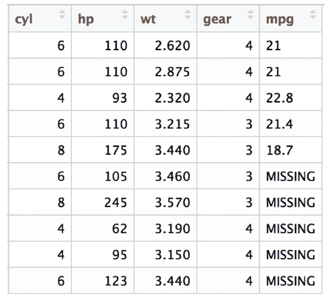

之所以将其视为监督学习，是因为在构建机器学习模型的过程中，我们为模型提供了关于结果的信息。其他的例子包括：

+   **识别字母和数字**：在这种情况下，模型的输入是字母和数字的图像，输出是图像上显示的字母数字值。一旦模型构建完成，就可以将其应用于图片，识别并预测图片中显示的数字。这是一个简单的例子，但非常强大。想象一下，如果你得到了 100,000 张带有房屋编号的房子图像，人工识别房号的方法就是逐个查看每张图像并写下房号。机器学习模型使我们能够完全自动化整个操作。你不需要逐个手动查看图像，而只需将模型应用于这些图像，就能在很短的时间内得到结果。

+   **自动驾驶汽车**：算法的输入是已经识别出图像中物体的图像，例如人、路标、汽车、树木、商店和其他元素。一旦展示了足够数量的图像，算法*学习*识别并区分不同的元素，之后即便给出一张未标记的图像（即物体没有被识别的图像），也能单独识别这些物体。公平地说，这是对一个非常复杂话题的高度简化的解释，但总体原理是一样的。

用于数字识别的 MNIST 数据集：

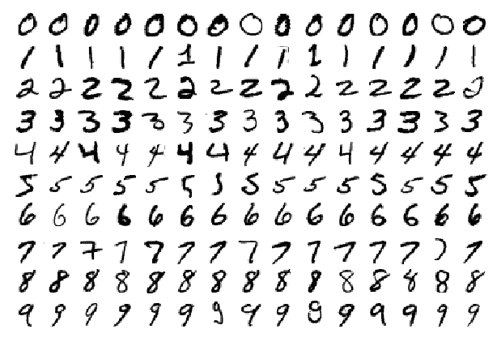

# 无监督学习

**无监督机器学习**涉及没有标签结果的数据集。以预测汽车的 mpg 值为例，在无监督的练习中，我们的数据集可能是这样的：

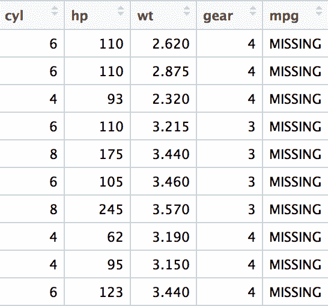

如果所有结果都是*缺失*的，那么就无法知道这些值可能是什么。回想一下，机器学习的基本前提是利用历史信息来对结果未知的数据集进行预测。但如果历史信息本身没有任何已标识的结果，那么就无法构建模型。没有其他信息可用的情况下，表格中的 mpg 值可能全是 0，也可能全是 100；我们无法判断，因为没有任何数据点能帮助我们得出这些值。

这就是*无监督*机器学习应用的地方。在这种类型的机器学习中，我们并不是试图预测结果，而是试图确定哪些项目彼此最为相似。

这种练习的常见名称是*聚类*，也就是说，我们试图找到*聚类*或最为相似的记录组。我们可以在什么地方使用这些信息，以及无监督学习的例子有哪些？

网上有各种新闻聚合器——这些网站本身不发布信息，而是收集来自其他新闻源的信息。一个这样的聚合器是谷歌新闻。如果我们需要搜索关于卫星卡西尼拍摄的最后一批土星图像的信息，我们可以在谷歌新闻上进行简单搜索，使用如下短语：[`news.google.com/news/?gl=US&amp;ned=us&amp;hl=en`](https://news.google.com/news/?gl=US&ned=us&hl=en)。这里展示了一个示例：


请注意，在新闻文章的底部有一个“查看全部”链接。点击该链接将带你到一个页面，列出所有相关的新闻文章。当然，谷歌并没有手动将这些文章分类为属于特定的搜索词。实际上，谷歌并不知道用户会搜索什么。搜索词可能是*来自太空的土星环图像*。

那么，谷歌是如何知道哪些文章属于特定搜索词的呢？答案在于聚类或无监督学习原理的应用。无监督学习通过检查特定数据集的属性，来确定哪些文章彼此最为相似。为了做到这一点，算法甚至不需要了解上下文背景。

假设你被给出了两套没有封面的书，一套是关于园艺的书，另一套是关于计算机编程的书。虽然你可能不知道书的标题，但要区分计算机书籍和园艺书籍却相当容易。一套书会有大量与计算机相关的术语，而另一套书则会有大量与植物相关的术语。通过书中的图片，就能很容易地区分这两类书籍，即使是一个假设不懂计算机或园艺的读者。

其他非监督学习的例子包括恶性肿瘤和良性肿瘤的检测，基因测序等。

# 细分监督学习

监督学习可以进一步细分为涉及以下任何一个的练习：

+   **分类**

+   **回归**

这些概念相当简单。

分类涉及一个具有离散结果的机器学习任务——一个**类别**结果。所有的**名词**都是类别变量，如水果、树木、颜色和真/假。

分类练习中的结果变量也被称为**离散变量或类别变量**。

一些例子包括：

+   根据大小、重量和形状识别水果

+   根据一组数字图像识别数字（如前章所示）

+   识别街道上的物体

+   识别扑克牌的花色，如方块、黑桃、红桃和梅花

+   根据学生的成绩识别学生的班级排名

+   最后一个可能看起来不太明显，但排名，即 1^(st)、2^(nd)、3^(rd)，表示一个固定的类别。一个学生可能排名第 1 或第 2，但不能有第 1.5 名！

一些典型分类例子的图片如下所示：

| 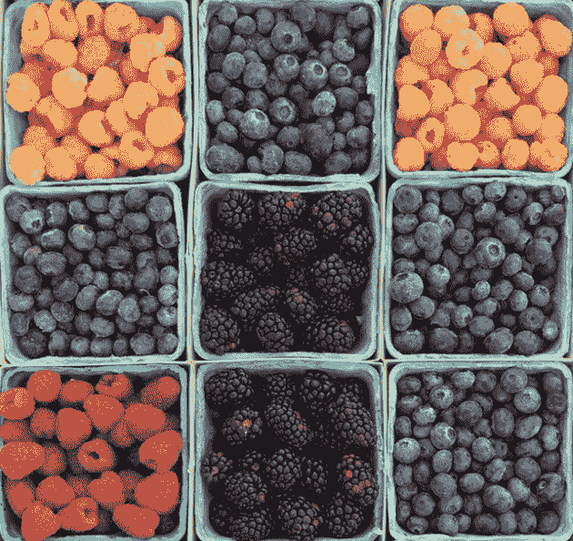不同类型水果的分类 | 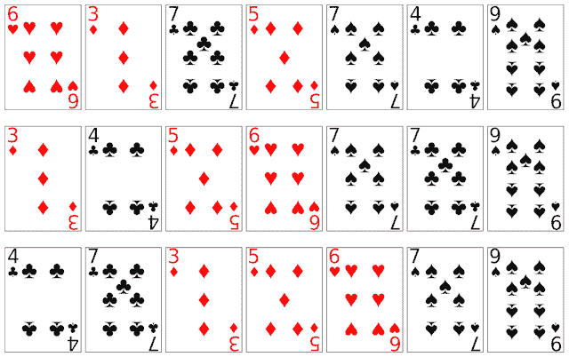扑克牌分类：方块、黑桃、红桃和梅花 |
| --- | --- |

**回归**，另一方面，涉及计算数值结果。任何可以进行数值运算（如加法、减法、乘法和除法）的结果都构成回归问题。

回归的例子包括：

+   预测每日温度

+   计算股票价格

+   预测住宅物业销售价格等

一些典型回归例子的图片如下所示。在这两种情况下，我们处理的是连续的定量数值数据。因此，回归的结果变量也被称为**定量变量或连续变量**。

| 计算房价 | 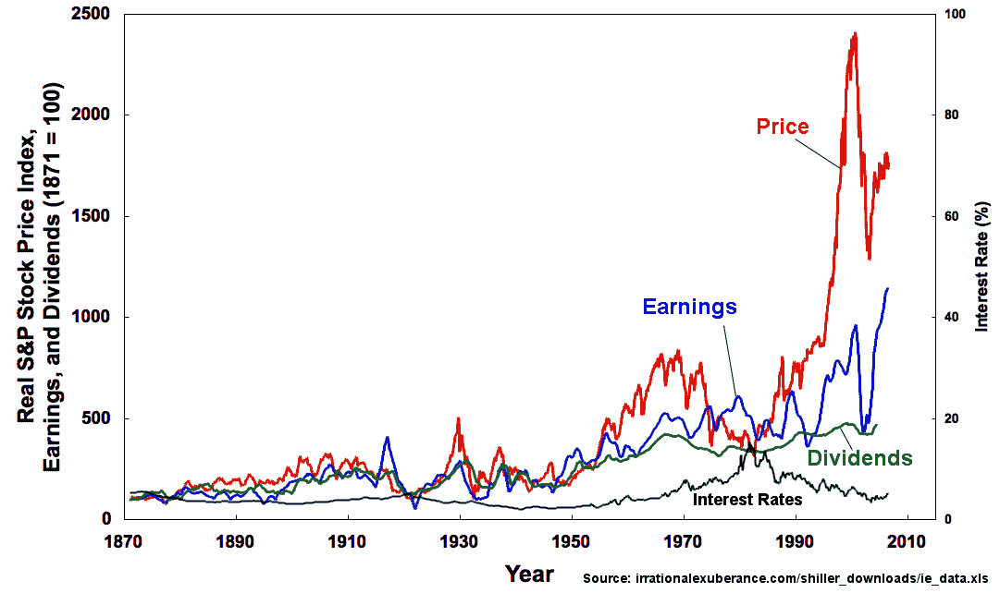使用其他市场数据计算股票价格 |
| --- | --- |

请注意，分类或回归的概念不适用于无监督学习。由于无监督学习没有标签，因此严格意义上没有离散的分类或回归。然而，由于无监督学习将数据分成多个簇，簇中的对象通常被认为属于同一类（与同一簇中的其他对象一样）。这类似于分类，只不过是事后创建的，而在对象被分类到各个簇之前并没有存在类。

# 机器学习中的常见术语

在机器学习中，你会经常听到特征、预测变量和因变量这些术语。它们其实是一样的，都指代用于预测结果的变量。在我们之前的汽车示例中，**cyl**（气缸数）、**hp**（马力）、**wt**（重量）和**gear**（齿轮数）是预测变量，而**mpg**（每加仑英里数）是结果变量。

更简单地说，拿电子表格的例子来说，列名本质上就是特征、预测变量和因变量。举个例子，如果我们得到一个收费亭费用的数据集，任务是根据时间和其他因素预测收费金额，一个假设的示例如下：

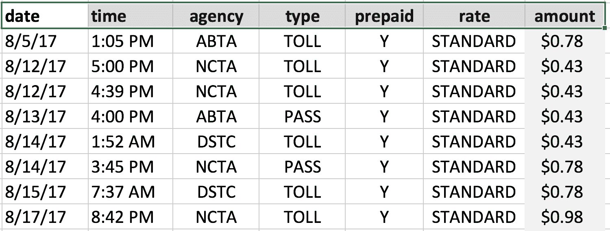

在这个电子表格中，列 **date**（日期）、**time**（时间）、**agency**（机构）、**type**（类型）、**prepaid**（预付）、**rate**（费率）是特征或预测变量，而列 **amount**（金额）是我们的结果或因变量（我们要预测的内容）。

数值的大小*依赖*于其他变量的值（因此这些变量被称为*独立变量*）。

简单的方程式也反映了显著的区别，例如在方程式 *y = a + b + c* 中，**左侧**（**LHS**）是因变量/结果变量，而 *a*、*b* 和 *c* 是特征/预测变量。

总结：

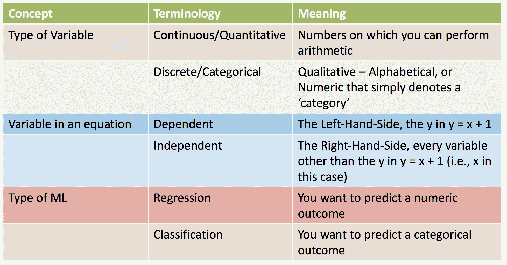

# 机器学习中的核心概念

机器学习中有许多重要的概念，我们将讨论一些常见的主题。机器学习涉及一个多步骤的过程，首先是数据采集、数据挖掘，最终建立预测模型。

构建模型的关键方面包括：

+   **数据预处理**：预处理和特征选择（例如，居中和缩放、类别不平衡以及变量重要性）

+   **训练集、测试集划分和交叉验证**：

    +   创建训练集（例如，80%的数据）

    +   创建测试集（大约占数据的 20%）

    +   执行交叉验证

+   **创建模型，获取预测结果**：

    +   你应该尝试哪些算法？

    +   你希望优化哪些准确性指标？

    +   你应该使用哪些调参参数？

# 机器学习中的数据管理步骤

预处理，或更广泛地说，数据处理，是大多数机器学习任务中不可或缺的一部分。你开始时的数据集很少会以你将要构建机器学习模型的精确格式存在；在大多数情况下，它不可避免地需要经过相当数量的清洗。事实上，数据清洗通常是整个过程最耗时的部分。在本节中，我们将简要介绍一些在实践中你可能遇到的主要数据处理步骤。

# 预处理和特征选择技术

**数据预处理**，顾名思义，涉及整理数据，使其适合机器学习任务。有多种预处理方法，以下展示了几种较常见的方法。

请注意，数据预处理应作为交叉验证步骤的一部分执行，也就是说，预处理不应在*事前*进行，而应在模型构建过程中进行。这将在后续详细解释。

# 中心化和缩放

对数值列应用中心化和缩放函数通常是为了标准化数据，并消除数值幅度或差异较大时的影响。你可能在大学或课程中遇到过这种情况，在这种情况下，学生的成绩会基于标准化或曲线来评分。

比如说，假设一张试卷异常难，10 名学生中有一半的成绩低于 60——课程设定的及格线。教授可以选择 a）决定 50%的学生需要重新修习这门课程，或者 b）将成绩标准化，查看学生之间的相对表现。

假设班级成绩为：

45,66,66,55,55,52,61,64,65,49

设定及格分数为 60，这意味着得分为 45、55、55、52 和 49 的学生将无法顺利完成课程。

然而，这可能并不能准确反映他们的相对优劣。教授可以选择使用一种中心化和缩放的方法，通常称为标准化，其过程如下：

+   计算所有成绩的均值

+   从成绩中减去均值

+   将结果除以所有成绩的标准差

下面是该操作的示意图，供参考。

成绩的均值为 57.8。因此，将 57.8 从每个数字中减去，得到第二行中的数字。但这还不是最终结果。我们需要将这些数字除以成绩的*标准差*，以获得最终的标准化值：


除以**标准差**（**SD**）后，显示只有两名学生的得分低于所有测试成绩范围内的一个标准差。因此，基于原始分数，原本应该有五名学生无法成功完成课程，但我们可以将范围缩小到只有两名学生。

虽然这只是一个非常简单的操作，但不难看出，它在平滑数据中大幅波动方面非常有效。

可以通过以下`scale`命令在 R 中轻松地执行居中和缩放操作：

```py
> scores <- c(45,66,66,55,55,52,61,64,65,68) 
> scale(scores) 
            [,1] 
 [1,] -1.9412062 
 [2,]  0.8319455 
 [3,]  0.8319455 
 [4,] -0.6206578 
 [5,] -0.6206578 
 [6,] -1.0168223 
 [7,]  0.1716713 
 [8,]  0.5678358 
 [9,]  0.6998907 
[10,]  1.0960552 
attr(,"scaled:center") 
[1] 59.7 
attr(,"scaled:scale") 
[1] 7.572611 
```

# 近零方差函数

`nearZeroVar`函数（位于`R`包`caret`中）用于识别方差几乎为零或完全没有方差的变量。考虑一个包含 10,000 个数字的集合，其中只有三个不同的值。这样的变量可能对算法的贡献非常小。为了使用`nearZeroVar`函数，首先在 RStudio 中安装`caret`包（我们在第三章中已进行设置，*分析工具包*）。使用`nearZeroVar`的效果的确切代码如下所示：

```py
> library(caret) 
Loading required package: lattice 
Loading required package: ggplot2 
Need help getting started? Try the cookbook for R: http://www.cookbook-r.com/Graphs/ 

> repeated <- c(rep(100,9999),10) # 9999 values are 100 and the last value is 10 

>random<- sample(100,10000,T) # 10,000 random values from 1 - 100 

>data<- data.frame(random = random, repeated = repeated) 

>nearZeroVar(data) 
[1] 2 

> names(data)[nearZeroVar(data)] 
[1] "repeated" 
```

如示例所示，该函数能够正确检测满足标准的变量。

# 移除相关变量

相关变量可能会产生过度强调变量贡献的结果。在回归分析中，这会导致 R² 值的增加，但并不能准确表示模型的实际表现。尽管许多类型的机器学习算法能够抵抗相关变量的影响，但它仍然值得提及，因为它是该学科中的一个常见话题。

移除这些变量的前提与冗余变量不会为模型增添增量价值的事实相关。例如，如果数据集中同时包含英寸和米为单位的身高，这些变量之间的相关性几乎为 1，使用其中一个变量和使用另一个变量一样好。涉及我们无法直观判断的变量的实践练习，通过使用移除相关变量的方法，可以大大帮助简化模型。

以下示例说明了移除相关变量的过程。数据集**皮马印第安糖尿病**包含关于皮马印第安人饮食的基本统计信息和一个名为`diabetes`的结果变量。

在接下来的章节示例中，我们将频繁引用此数据集。数据集不同列的高层次概述如下：

```py
pregnant Number of times pregnant 
glucose  Plasma glucose concentration (glucose tolerance test) 
pressure Diastolic blood pressure (mm Hg) 
triceps  Triceps skin fold thickness (mm) 
insulin  2-Hour serum insulin (mu U/ml) 
mass     Body mass index (weight in kg/(height in m)\²) 
pedigree Diabetes pedigree function 
age            Age (years) 
diabetes Class variable (test for diabetes) 
```

我们希望了解除了糖尿病（作为我们的结果变量）之外，是否有其他变量是相关的。如果是这样，移除冗余变量可能会很有帮助。

在 RStudio 中安装`mlbench`和`corrplot`包，并执行如下命令：

```py
install.packages("mlbench") 
install.packages("corrplot") 

library(corrplot) 
library(mlbench) 
data (PimaIndiansDiabetes)
diab <- PimaIndiansDiabetes # To produce a correlogram 
corrplot(cor(diab[,-ncol(diab)]), method="color", type="upper") # To get the actual numbers 
corrplot(cor(diab[,-ncol(diab)]), method="number", type="upper")
```

该命令将使用来自[`www.sthda.com/english/wiki/visualize-correlation-matrix-using-correlogram`](http://www.sthda.com/english/wiki/visualize-correlation-matrix-using-correlogram)的`corrplot`包生成如下图：

| 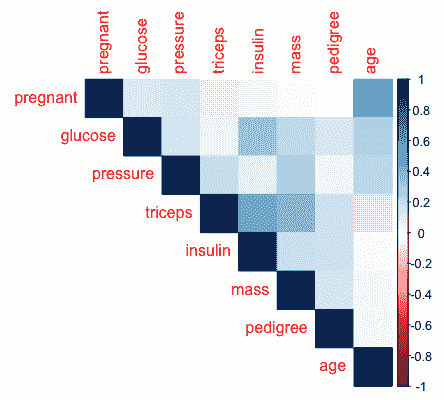 | >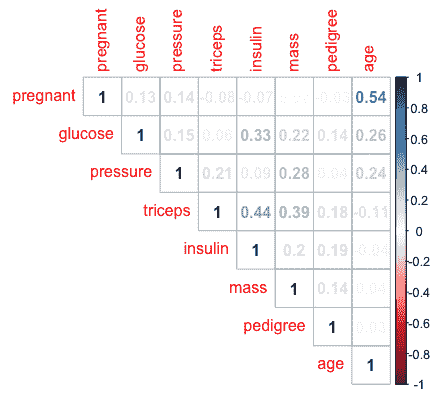 |
| --- | --- |

阴影越深，相关性越高。在这种情况下，它显示年龄和怀孕有较高的相关性。我们可以通过使用`method="number"`来查看具体数值，如所示。你还可以在[`www.sthda.com/english/wiki/visualize-correlation-matrix-using-correlogram`](http://www.sthda.com/english/wiki/visualize-correlation-matrix-using-correlogram)查看图形。

我们还可以使用以下函数直接找到相关的变量，而无需绘制相关图：

```py
correlated_columns<- findCorrelation(cor(diab[,-ncol(diab)]), cutoff = 0.5) 
correlated_columns 
```

# 其他常见的数据转换

还有其他几种数据转换方法适用于不同的情况。这些转换的总结可以在`caret`包的文档网站上找到，位置在**预处理**部分：[`topepo.github.io/caret/pre-processing.html`](https://topepo.github.io/caret/pre-processing.html)。

可以通过在 RStudio 中运行命令`?preProcess`来查看`caret`的预处理函数中提供的选项。它的代码如下：

```py
Method 

a character vector specifying the type of processing. 

Possible values are "BoxCox", "YeoJohnson", "expoTrans", "center", "scale", "range", "knnImpute", "bagImpute", "medianImpute", "pca", "ica", "spatialSign", "corr", "zv", "nzv", and "conditionalX" (see Details below) 
```

# 数据采样

你可能会遇到那些具有高度不平衡结果类别的数据集。例如，如果你在处理关于罕见疾病的数据集，且结果变量为“真”或“假”，由于疾病的罕见性，你可能会发现标记为“假”（即该人没有罕见疾病）的观察值远高于标记为“真”（即该人患有罕见疾病）的观察值。

机器学习算法试图最大化性能，在许多情况下，这可能是预测准确性。假设在 1000 条记录中，只有 10 条标记为真，剩余的`990`条观察值为假。

如果有人随机将*所有*观察值都标记为假，那么准确率将是：

```py
(990/1000) * 100 = 99% 
```

但是，这项工作的目标是找到*患有罕见疾病的个体*。我们已经很清楚，由于该疾病的性质，大多数个体将不属于这一类别。

数据采样本质上是*最大化机器学习度量指标，如特异性、敏感性、精确度、召回率和 kappa 值*的过程。稍后将讨论这些指标，但为了本节的目的，我们将展示一些方法，通过这些方法你可以*采样*数据，从而生成一个更加平衡的数据集。

R 包`caret`包括几个有用的函数，可以从不平衡数据集中创建类别的平衡分布。

在这些情况下，我们需要重新采样数据，以便获得更好的类别分布，从而构建一个更有效的模型。

一些常见的方法包括：

+   **上采样**：增加具有较少样本的类别的实例

+   **下采样**：减少具有较多样本的类别的实例

+   **创建合成样本**（例如，**SMOTE**（**合成少数类过采样技术**））

+   随机过采样（例如，(**ROSE**) **随机过采样示例**）

我们将使用之前示例中的相同数据来创建一个模拟数据集，其中 95%的行将被标记为负面：

```py
library(mlbench) 
library(caret) 
diab<- PimaIndiansDiabetes 

diabsim<- diab 
diabrows<- nrow(diabsim) 
negrows<- floor(.95 * diabrows) 
posrows<- (diabrows - negrows) 

negrows 
[1] 729 

posrows 
[1] 39 

diabsim$diabetes[1:729]     <- as.factor("neg")
diabsim$diabetes[-c(1:729)] <- as.factor("pos")
table(diabsim$diabetes) 

neg. pos 
729  39 

# We observe that in this simulated dataset, we have 729 occurrences of positive outcome and 39 occurrences of negative outcome

# Method 1: Upsampling, i.e., increasing the number of observations marked as 'pos' (i.e., positive) 

upsampled_simdata<- upSample(diabsim[,-ncol(diabsim)], diabsim$diabetes) 
table(upsampled_simdata$Class) 

negpos 
729 729 

# NOTE THAT THE OUTCOME IS CALLED AS 'Class' and not 'diabetes' 
# This is because of the use of the variable separately 
# We can always rename the column to revert to the original name 

# Method 2: Downsampling, i.e., reducing the number of observations marked as 'pos' (i.e., positive) 

downsampled_simdata<- downSample(diabsim[,-ncol(diabsim)], diabsim$diabetes) 
table(downsampled_simdata$Class) 

neg pos 
39  39 
```

+   **SMOTE**（**合成少数类过采样技术**）是第三种方法，它不同于简单的上采样/下采样，而是通过少数类的最近邻创建合成记录。在我们的模拟数据集中，显然`neg`是少数类，也就是出现次数最少的类别。

    SMOTE 函数的帮助文件简要地解释了这个概念：

不平衡的分类问题对许多学习算法造成了困扰。这些问题的特点是每个类别可用的样本比例不均。

SMOTE（Chawla 等人，2002）是一个著名的算法，用来解决这个问题。该方法的一般思想是通过使用这些案例的最近邻，人工生成少数类的新样本。此外，多数类样本也会被下采样，从而得到一个更加平衡的数据集：

```py
# Method 3: SMOTE 
# The function SMOTE is available in the R Package DMwR 
# In order to use it, we first need to install DmWR as follows 

install.packages ("DMwR") 

# Once the package has been installed, we will create a synthetic 
# Dataset in which we will increase the number of 'neg' records 
# Let us check once again the distribution of neg/pos in the dataset 

table(diabsim$diabetes) 

negpos 
729  39 

# Using SMOTE we can create synthetic cases of 'pos' as follows 

diabsyn<- SMOTE(diabetes ~ ., diabsim, perc.over = 500, perc.under = 150) 

# perc.over = 500 means, increase the occurrence of the minority 
# class by 500%, i.e., 39 + 5*39 = 39 + 195 = 234 

# perc.under = 150 means, that for each new record generated for the 
# Minority class, we will generate 1.5 cases of the majority class 
# In this case, we created 195 new records (500% of 39) and hence 
# we will generate 150% of 195 records = 195 * 150% = 195 * 1.5 
# = 292.5, or 292 (rounded down) new records 

# We can verify this by running the table command against the newly 
# Created synthetic dataset, diabsyn 

table(diabsyn$diabetes) 

negpos 
292 234
```

+   **ROSE（随机过采样示例）**，本节中的最后一种方法，可以通过 R 中的 ROSE 包使用。像 SMOTE 一样，它是一种生成合成样本的方法。ROSE 的帮助文件中简要说明了该函数的高级使用方法：

通过随机过采样示例生成的合成数据通过扩大少数类和多数类样本的特征空间来创建合成数据样本。在操作上，这些新样本是从这两类的条件核密度估计中抽取的，正如 Menardi 和 Torelli（2013）中所描述的那样。

```py
install.packages("ROSE") 
library(ROSE) 

# Loaded ROSE 0.0-3 
set.seed(1) 

diabsyn2 <- ROSE(diabetes ~ ., data=diabsim) 

table(diabsyn2$data$diabetes) 

# negpos 
# 395 373 
```

# 数据插补

有时，你的数据可能会有缺失值。这可能是由于数据收集过程中的错误、真正缺失的数据或其他任何原因，结果就是信息不可用。在现实中，缺失数据的例子可以在调查中找到，例如受访者没有回答调查中的某个特定问题。

你可能有一个包含 1,000 条记录和 20 个列的数据集，其中某一列有 100 个缺失值。你可以选择完全丢弃这一列，但这也意味着丢弃了 90%的信息。你仍然可以使用其他 19 列中有完整数据的列。另一种选择是直接排除该列，但这意味着你无法利用该列中可用数据所带来的好处。

存在几种数据插补方法，即填补缺失数据的过程。我们不知道确切的值是什么，但通过查看表中的其他条目，我们可能能够对这些值做出有根据且系统的评估。

数据插补中的一些常见方法包括：

+   **均值、中位数、众数插补**：使用列的均值、中位数或众数值来替代缺失值。然而，这种方法的缺点是会增加被插补变量之间的相关性，这在多元分析中可能并不理想。

+   **K 近邻插补**：kNN 插补是一种使用机器学习方法（最近邻）来插补缺失值的过程。其通过找到与缺失值记录最相似的 k 条记录，并使用与 k 条记录的欧氏距离加权平均来进行计算。

+   **回归模型插补**：回归方法使用 R 中的标准回归方法来预测缺失变量的值。然而，正如维基百科中关于回归插补的相关章节所指出的[`en.wikipedia.org/wiki/Imputation_(statistics)#Regression`](https://en.wikipedia.org/wiki/Imputation_(statistics)#Regression)，回归插补的问题在于插补数据的估计中没有包括误差项。因此，估算值完美地符合回归线，没有任何残差方差。这导致关系被过度识别，并暗示插补值的精度高于实际所需。

+   **热 deck 插补**：另一种使用数据集本身的观测值来填补缺失值的技术。尽管这种方法非常流行，但它的局限性在于，如果将一个值赋给大量的缺失值，可能会在观测值中引入显著的偏差，并产生误导性的结果。

这里提供了一个简短的示例，展示如何使用 kNN 插补进行插补。我们通过将 `PimaIndiansDiabetes` 数据集中的大量值更改为 NA 来模拟缺失数据。

我们在这个过程中使用以下因素：

+   我们使用均值来填补 NA 值。

+   我们使用 kNN 插补填补缺失值。然后，我们比较这两种方法的表现：

```py
library(DMwR) 
library(caret) 

diab<- PimaIndiansDiabetes 

# In the dataset, the column mass represents the body mass index 
# Of the individuals represented in the corresponding row 

# mass: Body mass index (weight in kg/(height in m)\²) 

# Creating a backup of the diabetes dataframe 
diabmiss_orig<- diab 

# Creating a separate dataframe which we will modify 
diabmiss<- diabmiss_orig 

# Saving the original values for body mass 
actual <- diabmiss_orig$mass 

# Change 91 values of mass to NA in the dataset 
diabmiss$mass[10:100] <- NA 

# Number of missing values in mass 
sum(is.na(diabmiss$mass)) 

# 91 

# View the missing values 
diabmiss[5:15,] 
```

我们得到的输出如下：

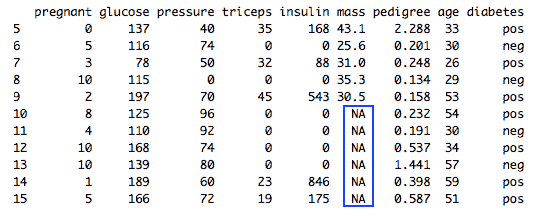

```py
# Test with using the mean, we will set all the missing values 
# To the mean value for the column 

diabmiss$mass[is.na(diabmiss$mass)] <- mean(diabmiss$mass,na.rm = TRUE) 

# Check the values that have been imputed 
data.frame(actual=actual[10:100], impute_with_mean=diabmiss$mass[10:100]) 
```

上述代码的输出如下：


```py
# Check the Root-Mean-Squared-Error for the entire column 
# Root Mean Squared Error provides an estimate for the 
# Difference between the actual and the predicted values 
# On 'average' 

diabmissdf<- data.frame(actual=actual, impute_with_mean=diabmiss$mass) 
rmse1 <- RMSE(diabmissdf$impute_with_mean,actual) 
rmse1 

# [1] 3.417476 

# We will re-run the exercise using knnImputation (from package DMwR) 

# Change the value of the records back to NA 
diabmiss<- diabmiss_orig 
diabmiss$mass[10:100] <- NA 

# Perform knnImputation 
diabknn<- knnImputation(diabmiss,k=25) 

# Check the RMSE value for the knnImputation method 
rmse2 <- RMSE(diabknn$mass,actual) 
rmse2 

# [1] 3.093827 

# Improvement using the knnImputation methods in percentage terms 

100 * (rmse1-rmse2)/rmse1 

[1] 22.20689 
```

尽管它可能不会代表一个显著的变化，但总比使用简单的均值或常数值等天真的方法要好。

R 中有多个用于数据插补的包，以下是几个著名的包：

+   **Amelia II**：时间序列数据中的缺失信息

[`gking.harvard.edu/amelia`](https://gking.harvard.edu/amelia)

+   **使用 R 包进行热 deck 插补**：HotDeckImputation 和 hot.deck

[`cran.r-project.org/web/packages/HotDeckImputation/`](https://cran.r-project.org/web/packages/HotDeckImputation/)

[`cran.r-project.org/web/packages/hot.deck/`](https://cran.r-project.org/web/packages/hot.deck/)

+   **多元插补（链式方程法）**

[`cran.r-project.org/web/packages/mice/index.html`](https://cran.r-project.org/web/packages/mice/index.html)

+   **在贝叶斯框架中使用 R 包进行缺失值填充**：mi

[`cran.r-project.org/web/packages/mi/index.html`](https://cran.r-project.org/web/packages/mi/index.html)

# 变量的重要性

在建模过程中，数据集可能包含数十个变量。并不是所有的变量都会为预测模型增加价值。将数据集缩小到一个子集，允许机器学习程序员将更多的时间用于优化选定的变量和建模过程并不罕见。减少数据集中变量的数量也有技术上的理由。对非常大的数据集（即高维数据集）进行机器学习建模可能会非常耗费计算资源，即可能需要大量的时间、CPU 和内存来执行数值运算。这不仅使某些算法的应用变得不切实际，还会导致不必要的延迟。因此，方法性的变量选择有助于分析时间和算法分析的计算需求。

**变量选择**也叫做特征选择/属性选择。像随机森林和套索回归这样的算法将变量选择作为其算法操作的一部分。但是，变量选择也可以作为一个独立的练习进行。

R 包`caret`提供了一个非常简单易用且直观的界面用于变量选择。由于我们还没有讨论建模过程，我们将在这里学习如何找到重要变量，并在下一章深入探讨这个主题。

我们将使用一个常见的、广为人知的算法，叫做`RandomForest`，它用于构建决策树。这个算法将在下一章中详细描述，但在这里使用它的目的是仅仅为了展示如何进行变量选择。这个例子说明了整个过程的一般步骤。

我们将重新使用之前使用过的数据集，即来自`mlbench`包的`PimaIndiansDiabetes`数据。我们还没有讨论模型训练过程，但在这里已经使用该数据集来推导变量重要性值。此案例中的结果变量是糖尿病，其他变量则作为自变量使用。换句话说，我们是否可以使用现有的数据预测某人是否患有糖尿病：

```py
diab<- PimaIndiansDiabetes 

# We will use the createDataPartition function from caret to split 
# The data. The function produces a set of indices using which we 
# will create the corresponding training and test sets 

training_index<- createDataPartition(diab$diabetes, p = 0.80, list = FALSE, times = 1) 

# Creating the training set 
diab_train<- diab[training_index,] 

# Create the test set 
diab_test<- diab[-training_index,] 

# Create the trainControl parameters for the model 
diab_control<- trainControl("repeatedcv", number = 3, repeats = 2, classProbs = TRUE, summaryFunction = twoClassSummary) 

# Build the model 
rf_model<- train(diabetes ~ ., data = diab_train, method = "rf", preProc = c("center", "scale"), tuneLength = 5, trControl = diab_control, metric = "ROC") 

# Find the Variable Importance 
varImp(rf_model) 
rf variable importance 

         Overall 
glucose  100.000 
mass      52.669 
age       39.230 
pedigree  24.885 
pressure  12.619 
pregnant   6.919 
insulin    2.294 
triceps    0.000 

# This indicates that glucose levels, body mass index and age are the top 3 predictors of diabetes. 

# caret also includes several useful plot functions. We can visualize the variable importance using the command: 

plot(varImp(rf_model)) 
```

上述代码的输出如下所示。它表明葡萄糖、体重和年龄是对创建模型（预测糖尿病）贡献最大的变量。

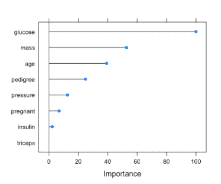

# 训练集、测试集拆分和交叉验证概念

训练集、测试集划分和交叉验证集是机器学习中的基本概念。这是纯统计方法与机器学习方法在本质上不同的一个领域。虽然在统计建模任务中，可能会进行回归、参数化/非参数化检验并应用其他方法，但在机器学习中，算法方法是通过对结果的反复评估与每次迭代中模型的即兴改进来补充的。

# 将数据分为训练集和测试集

每个机器学习建模任务都从数据清洗过程开始，如前所述。下一步是将数据分为训练集和测试集。这通常通过从数据中随机选择行来创建模型，未被选择的行将用于测试最终模型。

通常的数据集划分比例在 70%到 80%之间（训练数据与测试数据）。在 80-20 的划分中，80%的数据将用于创建模型，剩余的 20%将用于测试最终生成的模型。

我们在前面的部分应用过这个方法，但我们可以再次回顾代码。`createDataPartition`函数与参数`p = 0.80`一起使用，以便对数据进行划分。`training_index`变量保存了我们将使用的训练集索引（来自`dataset`，`diab`）：

```py
training_index<- createDataPartition(diab$diabetes, p = 0.80, list = FALSE, times = 1) 

length(training_index) # Number of items that we will select for the train set [1] 615 

nrow(diab) # The total number of rows in the dataset [1] 768 

# Creating the training set, this is the data we will use to build our model 
diab_train<- diab[training_index,] 

# Create the test set, this is the data against which we will test the performance of our model 
diab_test<- diab[-training_index,] 
```

我们不一定非要使用`createDataPartition`函数，相反，使用简单的 R 命令创建的随机样本，如这里所示，也可以满足需求：

```py
# Create a set of random indices representing 80% of the data 
training_index2 <- sample(nrow(diab),floor(0.80*nrow(diab))) 

# Check the size of the indices just created 
length(training_index2) [1] 614 

# Create the training set 
diab_train2 <- diab[training_index2,] 

# Create the test set 
diab_test2 <- diab[-training_index2] 
```

# 交叉验证参数

交叉验证将训练-测试集划分概念提升到了一个新的阶段。机器学习任务的目标，本质上是找到一组模型参数，从而提供最佳的性能。模型参数指的是函数（即模型）所接受的参数。例如，对于决策树模型，参数可能包括模型应构建的深度层数、划分数等。如果有*n*个不同的参数，每个参数有*k*个不同的值，那么总的参数组合数将是*k*^*n*。我们通常为每个参数选择固定的一组组合，可能最终有 100 到 1000+种组合。我们将测试每个参数下模型的表现（例如，正确预测结果的准确性）。

使用简单的训练-测试集划分，比如，如果我们选择了 500 个参数组合，我们只需要将它们应用于训练数据集，并确定哪个组合表现最佳。

使用交叉验证时，我们将训练集进一步拆分成更小的子集，例如，常用三折或五折。如果使用三折，即将训练集拆分为三个子集，我们将其中一个折叠（如 Fold 2）留出，使用 Fold 1 和 Fold 3 的数据集构建模型，并测试其在 Fold 2 上的准确性。这一步会重复多次，每次迭代代表在不同的折叠集合上执行训练-测试过程并收集准确度度量。最终，我们会通过选择表现最佳的模型参数组合来得到最优解。

标准方法可以总结如下：

1.  创建一个 80-20 的训练-测试拆分

1.  使用不同的模型参数组合执行你的模型

1.  选择显示最佳整体性能的模型参数并创建最终模型

1.  在测试集上应用最终模型以查看结果

交叉验证方法要求我们将训练数据集进一步拆分成更小的子集。这些子集通常称为**折叠（folds）**，统称为**k-折叠（k-folds）**，其中 *k* 代表拆分的数量：

1.  创建一个 80-20 的训练-测试拆分

1.  将训练集拆分成 k 折，例如，三折

1.  将 Fold 1 留出，使用 Fold 2 和 Fold 3 构建模型

1.  在 Fold 1 上测试你的模型性能（例如，准确结果的百分比）

1.  将 Fold 2 留出，使用 Fold 1 和 Fold 3 构建模型

1.  在 Fold 2 上测试你的模型性能

1.  将 Fold 3 留出，使用 Fold 1 和 Fold 2 构建模型

1.  在 Fold 3 上测试你的模型性能

1.  计算模型在所有三个折叠上的平均性能

1.  对 *每组模型参数* 重复步骤 1

1.  选择显示最佳整体性能的模型参数并创建最终模型

1.  在测试集上应用最终模型以查看结果

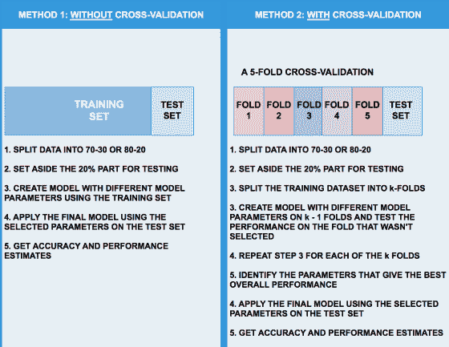

这张图说明了使用不带交叉验证的方式与使用交叉验证的方式之间的区别。交叉验证方法可以说更为稳健，涉及对模型的严格评估。话虽如此，通常还是有必要先尝试不使用交叉验证来构建一个初步的模型，以便大致了解可能期望的性能。例如，如果一个使用 2-3 次训练-测试拆分构建的模型显示的准确率为 30%，那么不太可能通过任何其他方法，包括交叉验证，使其准确率提升到 90%。换句话说，标准方法有助于大致了解可能期望的性能。由于交叉验证可能计算密集且耗时，获取初步的性能反馈有助于对整体过程进行初步分析。

R 中的 caret 包提供了一种非常用户友好的方法，通过交叉验证来构建模型。回想一下，数据预处理必须传递或作为交叉验证过程的一个组成部分。所以，如果我们需要对数据集进行中心化和标准化，并执行五折交叉验证，我们所需要做的就是在 caret 的 `trainControl` 函数中定义我们希望使用的采样类型。

Caret 的 `trainControl` 网页提供了关于功能的详细概述，并附有示例，[`topepo.github.io/caret/model-training-and-tuning.html#basic-parameter-tuning`](https://topepo.github.io/caret/model-training-and-tuning.html#basic-parameter-tuning)。

我们在之前的练习中使用了这种方法，在该练习中我们使用 `RandomForest` 构建了一个模型，数据集是 `PimaIndiansDiabetes`。这里再次展示它是为了说明该技巧的应用：

```py
# Create the trainControl parameters for the model 
# The parameters indicate that a 3-Fold CV would be created 
# and that the process would be repeated 2 times (repeats) 
# The class probabilities in each run will be stored 
# And we'll use the twoClassSummary* function to measure the model 
# Performance 
diab_control<- trainControl("repeatedcv", number = 3, repeats = 2, classProbs = TRUE, summaryFunction = twoClassSummary) 

# Build the model 
# We used the train function of caret to build the model 
# As part of the training process, we specified a tunelength** of 5 
# This parameter lets caret select a set of default model parameters 
# trControl = diab_control indicates that the model will be built 
# Using the cross-validation method specified in diab_control 
# Finally preProc = c("center", "scale") indicate that the data 
# Would be centered and scaled at each pass of the model iteration 

rf_model<- train(diabetes ~ ., data = diab_train, method = "rf", preProc = c("center", "scale"), tuneLength = 5, trControl = diab_control, metric = "ROC") 
```

你可以从 [`cran.r-project.org/web/packages/caret/vignettes/caret.pdf`](https://cran.r-project.org/web/packages/caret/vignettes/caret.pdf) 获取关于 `summaryFunction` 的更详细解释。

`summaryFunction` 参数用于传入一个函数，该函数接收观察值和预测值并估计某些性能度量。该包中已经包含了两个这样的函数：`defaultSummary` 和 `twoClassSummary`。后者将计算特定于二分类问题的度量，如 ROC 曲线下面积、敏感性和特异性。由于 ROC 曲线是基于预测的类别概率（这些概率不会自动计算），因此需要另一个选项。`classProbs = TRUE` 选项用于包含这些计算。

这是来自 `caret` 的 train 函数帮助文件中关于 `tuneLength` 的解释。

`tuneLength` 是一个整数，表示调优参数网格的粒度。默认情况下，此参数是每个调优参数应由 train 生成的级别数量。如果 `trainControl` 具有选项 `search = random`，则这是随机搜索将生成的调优参数组合的最大数量。

请注意，如果提供了该参数，它必须具有名称。

# 创建模型

创建模型后的最终步骤是使用该模型对测试数据集进行预测。通常，这使用 R 中的 `predict` 函数来完成，第一个参数是已创建的模型，第二个参数是你想要预测的目标数据集。

以我们的 `PimaIndiansDiabetes` 数据集为例，在模型构建完成后，我们可以对测试数据集进行预测，如下所示：

```py
# Install the R Package e1071, if you haven't already 
# By running install.packages("e1071") 

# Use the predict function and the rf_model that was previously built 
# To get the predictions on the test dataset 
# Note that we are not including the column diabetes in the test 
# dataset by using diab_test[,-ncol(diab_test)] 

predictions<- predict(rf_model, diab_test[,-ncol(diab_test)]) 

# First few records predicted 
head(predictions)
[1] negnegpospospospos 
Levels: negpos 

# The confusion matrix allows us to see the number of true positives 
# False positives, True negatives and False negatives 

cf<- confusionMatrix(predictions, diab_test$diabetes) 
cf 

# Confusion Matrix and Statistics 
#  
#        Reference 
# Prediction negpos 
#        neg  89  21 
#        pos  11  32 
#  
# Accuracy : 0.7908           
# 95% CI : (0.7178, 0.8523) 
# No Information Rate : 0.6536           
# P-Value [Acc> NIR] : 0.0001499        
#  
# Kappa : 0.5167           
# Mcnemar's Test P-Value : 0.1116118        
#  
# Sensitivity : 0.8900           
# Specificity : 0.6038           
# PosPredValue : 0.8091           
# NegPredValue : 0.7442           
# Prevalence : 0.6536           
# Detection Rate : 0.5817           
# Detection Prevalence : 0.7190           
# Balanced Accuracy : 0.7469           
#  
# 'Positive' Class :neg 
```

让我们检查混淆矩阵告诉我们什么：

```py
# This indicates that of the records that were marked negative (neg) 
# We predicted 89 of them as negative and 11 as positive (i.e., they 
# were negative but we incorrectly classified them as a positive 

# We correctly identified 32 positives but incorrectly classified 
# 21 positives as negative 

# 
#           Reference 
# Prediction neg  pos 
#        neg  89  21 
#        pos  11  32 

# The overall accuracy was 79% 
# This can be improved (significantly) by using more  
# Accuracy : 0.7908           

# We can plot the model using plot(rf_model) as follows 
plot(rf_model) 
```

情节如下：


```py
# And finally we can also visualize our confusion matrix using the 
# inbuilt fourfoldplot function in R 

fourfoldplot(cf$table) 
```

我们得到的图表如下：

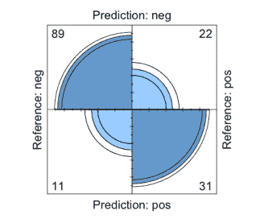

根据*`fourfoldplot`*的文档 [来源: [`stat.ethz.ch/R-manual/R-devel/library/graphics/html/fourfoldplot.html`](https://stat.ethz.ch/R-manual/R-devel/library/graphics/html/fourfoldplot.html)]，二元行列变量之间的关联（比 1 的比值比）通过在一个方向上，斜对角的单元格与另一个方向的单元格在大小上的差异来表示；颜色用来显示这种方向。比值比的置信环允许对无关联的零假设进行视觉测试；相邻象限的环重叠当且仅当观察到的计数与零假设一致时。

# 在模型中利用多核处理

在上一节中的练习在这里被重复，改用 PimaIndianDiabetes2 数据集。这个数据集包含一些缺失值。因此，我们将首先对缺失值进行插补，然后运行机器学习示例。

该练习已经进行了重复，并加入了一些额外的细节，比如使用多核/并行处理来加快交叉验证的运行速度。

要利用多核处理，使用以下代码安装`doMC`包：

```py
Install.packages("doMC")  # Install package for multicore processing 
Install.packages("nnet") # Install package for neural networks in R 
```

现在，我们将按照这里的代码运行程序：

```py
# Load the library doMC 
library(doMC) 

# Register all cores 
registerDoMC(cores = 8) 

# Set seed to create a reproducible example 
set.seed(100) 

# Load the PimaIndiansDiabetes2 dataset 
data("PimaIndiansDiabetes2",package = 'mlbench') 
diab<- PimaIndiansDiabetes2 

# This dataset, unlike PimaIndiansDiabetes has 652 missing values! 
> sum(is.na(diab)) [1] 652 

# We will use knnImputation to fill in the missing values 
diab<- knnImputation(diab) 

# Create the train-test set split 
training_index<- createDataPartition(diab$diabetes, p = .8, list = FALSE, times = 1) 

# Create the training and test dataset 
diab_train<- diab[training_index,] 
diab_test<- diab[-training_index,] 

# We will use 10-Fold Cross Validations 
diab_control<- trainControl("repeatedcv", number = 10, repeats = 3, search = "random", classProbs = TRUE) 

# Create the model using methodnnet (a Neural Network package in R) 
# Note that we have changed the metric here to "Accuracy" instead of # ROC 
nn_model<- train(diabetes ~ ., data = diab_train, method = "nnet",   preProc = c("center", "scale"), trControl = diab_control, tuneLength = 10, metric = "Accuracy") 

predictions<- predict(nn_model, diab_test[,-ncol(diab_test)]) 
cf<- confusionMatrix(predictions, diab_test$diabetes) 
cf 

# >cf 
# Confusion Matrix and Statistics 
#  
#        Reference 
# Prediction negpos 
#        neg  89  19 
#        pos  11  34 
#  
# Accuracy : 0.8039           
# 95% CI : (0.7321, 0.8636) 
# No Information Rate : 0.6536           
# P-Value [Acc> NIR] : 3.3e-05          
#  
```

即使有 650 多个缺失值，我们的模型也能达到 80%以上的准确率。

它当然可以改进，但作为基准，它展示了机器学习模型可以达到的表现。

在一个二分结果变量的情况下，随机猜测有 50%的机会是准确的。80%的准确率显著高于仅凭猜测可能达到的准确率：

```py
 plot(nn_model) 
```

结果图如下所示：

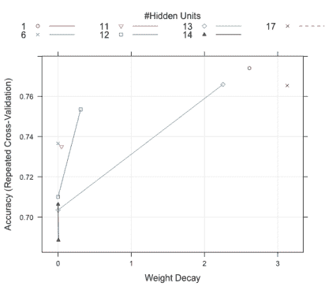

```py
fourfoldplot(cf$table) 
```

结果如下图所示：

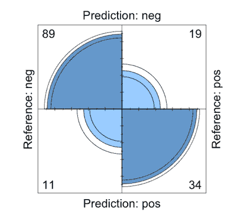

# 总结

在本章中，我们学习了机器学习的基本原理，包括监督学习和无监督学习等不同类型，以及数据预处理、数据插补、管理不平衡类和其他主题的主要概念。

我们还学习了今天常被交替使用的术语之间的关键区别，特别是“人工智能”和“机器学习”这两个术语。我们了解到，人工智能涉及广泛的主题，如博弈论、社会学、约束优化和机器学习；与机器学习相比，人工智能的范围要广泛得多。

机器学习促进了人工智能的实现；即，机器学习算法用于创建*人工智能*系统，但它们在范围上有所不同。回归问题（给定一组点，找出最佳拟合线）可以被视为一种机器学习*算法*，但它更不可能被看作是一种 AI 算法（概念上，尽管从技术上讲它也可以是）。

在下一章，我们将探讨机器学习中的其他一些概念，如偏差、方差和正则化。我们还将学习一些重要的算法，并了解如何使用 R 中的机器学习包应用它们。
