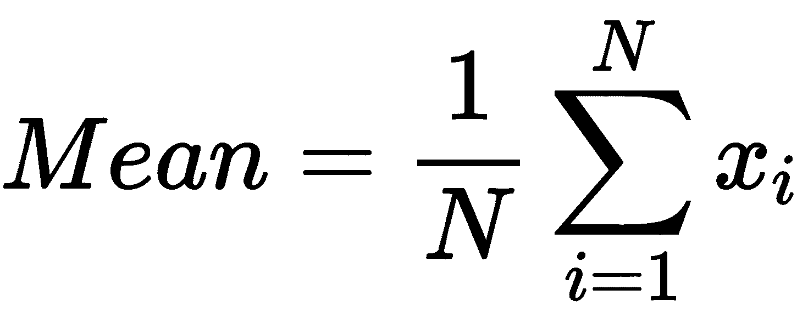
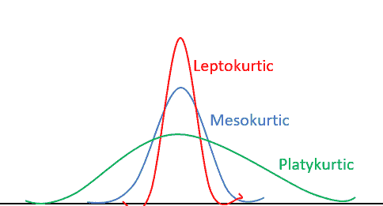
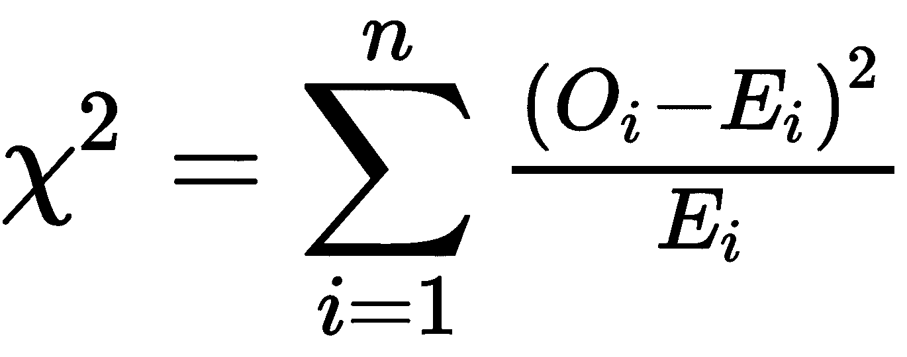

统计学

**探索性数据分析** (**EDA**) 是数据分析和构建机器学习模型的第一步。统计学提供了探索性或描述性数据分析的基础知识和一套工具。本章旨在使您具备处理真实世界数据的能力，这些数据通常具有噪声、缺失值，并从各种来源收集而来。

在进行任何预处理和分析之前，您需要熟悉当前的数据，统计学是唯一能帮助您的工具。这使得统计学成为数据专业人士的一项主要且非常必要的技能，帮助他们获得初步见解和对数据的理解。例如，员工每月工作小时的算术平均数可以帮助我们了解组织中员工的工作负荷。类似地，每月工作小时的标准差可以帮助我们推断工作小时的范围。血压和患者年龄之间的相关性可以帮助我们理解血压和年龄之间的关系。抽样方法在任何类型的主数据收集中都可能有用。我们还可以执行参数和非参数假设检验以推断有关总体的事实。

在本章中，我们将涵盖以下主题：

+   理解属性及其类型

+   测量中心趋势

+   测量离散度

+   偏度和峰度

+   使用协方差和相关系数理解关系

+   中心极限定理

+   收集样本

+   执行参数检验

+   执行非参数检验

# 技术要求

对于本章，以下技术信息可用：

+   您可以在以下 GitHub 链接找到代码和数据集：[`github.com/PacktPublishing/Python-Data-Analysis-Third-Edition/tree/master/Chapter03`](https://github.com/PacktPublishing/Python-Data-Analysis-Third-Edition/tree/master/Chapter03).

+   所有代码块均在`ch3.ipynb`中可用。

+   在本章中，我们将使用 Python 的 NumPy、Pandas 和 SciPy 库。

# 理解属性及其类型

数据是原始事实和统计数据的集合，如数字、文字和观察结果。属性是表示对象特征的列、数据字段或系列，也称为变量、特征或维度。统计学家使用术语*变量*，而机器学习工程师更喜欢术语*特征*。数据仓库中使用术语*维度*，而数据库专业人员使用术语*属性*。

## 属性类型

属性的数据类型对数据分析更为关键，因为某些情况需要特定的数据类型。属性的数据类型帮助分析人员选择正确的数据分析和可视化绘图方法。以下列表显示了各种属性：

1.  **名义属性：** 名义是指类别变量的名称或标签。名义属性的值可以是项目的符号或名称。这些值是类别性的、定性的，且没有顺序性，如产品名称、品牌名称、邮政编码、州、性别和婚姻状况。对于定性和类别性的值，计算均值和中位数是没有意义的，但数据分析师可以计算众数，即出现频率最高的值。

1.  **顺序属性：** 顺序是指具有有意义顺序或排名的名称或标签，但值的大小并不明确。这些类型的属性仅用于衡量主观特质。这就是为什么它们被广泛用于客户满意度调查、产品评级和电影评分等领域。客户满意度评级按以下顺序出现：

    +   1: 非常不满意

    +   2: 有点不满意

    +   3: 中立

    +   4: 满意

    +   5: 非常满意

另一个例子可能是饮料的大小：小号、中号或大号。顺序属性只能通过众数和中位数来衡量。由于顺序属性具有定性的特点，因此无法计算均值。顺序属性也可以通过将定量变量离散化，将其值划分为有限数字范围来重新创建。

1.  **数值属性：** 数值属性以整数或实数值定量表示。数值属性可以分为两种类型：区间尺度或比例尺度。

区间尺度属性是在有序的等大小单位尺度上进行测量的。区间尺度属性两个值之间的有意义差异可以被计算出来，这使得可以进行两者的比较——例如，出生年份和摄氏温度。区间尺度属性值的主要问题是它们没有“真实的零点”——例如，摄氏温度为 0 时并不意味着温度不存在。区间尺度数据可以进行加法和减法运算，但不能进行乘法和除法，因为没有真实零点。我们还可以计算区间尺度属性的均值，除了中位数和众数之外。

比例尺度属性是按等大小单位的有序尺度进行测量的，类似于具有固有零点的区间尺度。比例尺度属性的例子包括身高、体重、纬度、经度、工作年限和文档中的单词数量。我们可以进行乘法和除法运算，并计算比例尺度值之间的差异。我们还可以计算集中趋势度量，如均值、中位数和众数。摄氏度和华氏度温标是按区间尺度进行测量的，而开尔文温标则按比例尺度进行测量，因为它具有真实的零点。

## 离散和连续属性

有多种方式可以对属性进行分类。在前一个小节中，我们已经见过了名义型、顺序型和数值型属性。在本小节中，我们将讨论另一种属性分类方法。这里我们将讲解离散型或连续型属性。离散变量只接受有限个可数的数值，例如班级中有多少学生、卖出多少辆车、出版多少本书。这些数值可以通过计数得到。连续变量则接受无限多个可能的数值，例如学生的体重和身高。这些数值可以通过测量得到。

离散变量接受整数值，而连续变量接受实数值。换句话说，我们可以说离散变量接受的值的分数没有意义，而连续变量接受的值的分数是有意义的。离散属性使用有限数量的值，而连续属性则使用无限数量的值。

在理解了属性及其类型后，接下来我们要关注基本的统计描述，如集中趋势测量。

# 测量集中趋势

集中趋势是值围绕均值、众数和中位数等平均值聚集的趋势。集中趋势的主要目的是计算观测值的中心导向值。集中趋势决定了描述性总结，并提供了关于一组观测值的定量信息。它有能力代表整个观测集。接下来，我们将在各个小节中详细探讨每种集中趋势度量方法。

## 均值

均值是算术平均数或平均值，通过将观测值的总和除以观测次数来计算。它对异常值和噪声非常敏感，因此每当把不常见或异常的值添加到一组数据中时，其均值就会偏离典型的中心值。假设 x[1], x[²], . . . , x [N] 是 *N* 次观测值。这些值的均值公式如下所示：



让我们使用 `pandas` 库来计算沟通技能得分列的均值，如下所示：

```py
# Import pandas library
import pandas as pd

# Create dataframe
sample_data = {'name': ['John', 'Alia', 'Ananya', 'Steve', 'Ben'], 
               'gender': ['M', 'F', 'F', 'M', 'M'], 
               'communication_skill_score': [40, 45, 23, 39, 39],
               'quantitative_skill_score': [38, 41, 42, 48, 32]}

data = pd.DataFrame(sample_data, columns = ['name', 'gender', 'communcation_skill_score', 'quantitative_skill_score'])

# find mean of communication_skill_score column 
data['communcation_skill_score'].mean(axis=0)

Output:
37.2
```

在前面的代码块中，我们创建了一个名为 `data` 的 DataFrame，它有四列（`name`、`gender`、`communication_skill_score` 和 `quantitative_skill_score`），并使用 `mean(axis=0)` 函数计算了均值。这里，`axis=0` 表示按行计算均值。

## 众数

众数是观测值中出现频率最高的项。众数值在数据中出现频繁，主要用于分类值。如果一组数据中的所有值都是独一无二的或不重复的，那么该组数据就没有众数。也有可能有多个值的出现频率相同，在这种情况下，可以有多个众数。

让我们使用 `pandas` 库来计算沟通技能得分列的众数值，如下所示：

```py
# find mode of communication_skill_score column
data['communcation_skill_score'].mode()

Output:
39
```

在前面的代码块中，我们通过使用`mode()`函数计算了沟通技巧得分列的众数。让我们计算另一个集中趋势度量：中位数。

## 中位数

中位数是一个观察组中的中点或中间值。它也被称为第 50 百分位数。中位数比均值更不容易受异常值和噪声的影响，这也是它被认为是更适合报告的统计量度量的原因。它通常接近典型的中央值。让我们使用`pandas`库计算沟通技巧得分列的中位数值，如下所示：

```py
# find median of communication_skill_score column
data['communcation_skill_score'].median()

Output:
39.0
```

在前面的代码块中，我们通过使用`median()`函数计算了沟通技巧得分列的中位数。让我们在下一节中了解离散度量并计算它们。

# 测量离散程度

正如我们所见，集中趋势展示了观察组的中间值，但并未提供观察的整体图像。离散度量衡量的是观察值的偏差。最常见的离散度量有范围、**四分位间距**（**IQR**）、方差和标准差。这些离散度量关注的是观察值的变异性或观察值的分布。让我们详细了解每个离散度量，如下所示：

+   **范围：** 范围是观察值的最大值和最小值之间的差异。它易于计算且易于理解。它的单位与观察值的单位相同。让我们计算沟通技巧得分的范围，如下所示：

```py
column_range=data['communcation_skill_score'].max()-data['communcation_skill_score'].min()
print(column_range)

Output:
22
```

在前面的代码块中，我们通过计算最大值和最小值之间的差异，得出了沟通技巧得分的范围。最大值和最小值是通过使用`max()`和`min()`函数计算得出的。

+   **IQR：** IQR 是第三四分位数和第一四分位数之间的差值。它易于计算且易于理解。它的单位与观察值的单位相同。它衡量了观察值的中间 50%。它表示大多数观察值所在的范围。IQR 也称为中间差距或中间 50%，或者 H-差距。让我们计算沟通技巧得分的 IQR，如下所示：

```py
# First Quartile
q1 = data['communcation_skill_score'].quantile(.25)

# Third Quartile
q3 = data['communcation_skill_score'].quantile(.75)

# Inter Quartile Ratio
iqr=q3-q1
print(iqr)

Output:
1.0
```

在前面的代码块中，我们通过计算得分的第一和第三四分位数之间的差异，得出了沟通技巧得分的 IQR。第一和第三四分位数的得分是通过使用`quantile(.25)`和`quantile(.75)`函数计算得出的。

+   **方差：** 方差衡量的是观察值与均值之间的偏差。它是观察值与均值之间平方差的平均值。方差的主要问题在于其测量单位，因为它是观察值与均值之间差值的平方。假设 x[1]、x[²]、...、x[N]是*N*个观察值，那么这些值的方差公式将如下所示：


让我们计算沟通技巧得分的方差，如下所示：

```py
# Variance of communication_skill_score
data['communcation_skill_score'].var()

Output:
69.2
```

在前面的代码块中，我们使用`var()`函数计算了沟通技能评分的方差。

+   **标准差：** 这是方差的平方根。它的单位与原始观测值相同。这使得分析师更容易评估数据点与均值的偏差。标准差值越小，表示数据点距离均值越近；也就是说，数据分布较集中。标准差值越大，表示数据点距离均值越远——也就是说，数据分布较分散。标准差在数学上用希腊字母 sigma (Σ) 表示。假设 x[1]、x[²]、...、x[N] 是 *N* 个观测值。以下是这些值的标准差公式：


让我们计算沟通技能评分的标准差，如下所示：

```py
# Standard deviation of communication_skill_score
data['communcation_skill_score'].std()

Output:
8.318653737234168
```

在前面的代码块中，我们使用`std()`函数计算了沟通技能评分的标准差。

我们还可以尝试描述这个函数，以便通过一个命令获取所有的摘要统计信息。`describe()`函数返回每个数值型列的计数、均值、标准差、第一四分位数、中位数、第三四分位数、最小值和最大值，具体如以下代码块所示：

```py
# Describe dataframe
data.describe()

Output:
      communcation_skill_score quantitative_skill_score
count         5.000000         5.000000
mean         37.200000         40.200000
std           8.318654         5.848077
min          23.000000         32.000000
25%          39.000000         38.000000
50%          39.000000         41.000000
75%          40.000000         42.000000
max          45.000000         48.000000

```

在前面的代码块中，我们使用`describe()`方法生成了数据的描述性统计摘要。

# 偏度和峰度

偏度衡量分布的对称性。它显示分布偏离正态分布的程度。其值可以是零、正值或负值。零值表示完全正态的分布形状。正偏度表现为尾部指向右侧——即异常值偏向右侧，数据堆积在左侧。负偏度表现为尾部指向左侧——即异常值偏向左侧，数据堆积在右侧。当均值大于中位数和众数时，会出现正偏度；当均值小于中位数和众数时，会出现负偏度。让我们在以下代码块中计算偏度：

```py
# skewness of communication_skill_score column
data['communcation_skill_score'].skew()

Output:
-1.704679180800373

```

在前面的代码块中，我们使用`skew()`方法计算了沟通技能评分列的偏度。

峰度衡量与正态分布相比的尾部（尾部的厚度）。高峰度表示重尾分布，这意味着数据中有更多的异常值；低峰度表示轻尾分布，这意味着数据中异常值较少。峰度有三种形状：中峰、平峰和尖峰。我们逐一定义它们，如下所示：

+   具有零峰度的正态分布被称为中峰分布。

+   平峰分布具有负的峰度值，并且相比于正态分布，它的尾部较薄。

+   尖峰峰度分布的峰度值大于 3，相较于正态分布，它呈现肥尾特征。

让我们看看下图中不同的峰度形态类型：



直方图是展示偏度和峰度的有效方式。让我们计算一下沟通技能分数列的峰度，如下所示：

```py
# kurtosis of communication_skill_score column
data['communcation_skill_score'].kurtosis()

Output:
3.6010641852384015
```

在前面的代码块中，我们使用`kurtosis()`方法计算了沟通技能分数列的峰度。

# 使用协方差和相关系数理解关系

测量变量之间的关系将有助于数据分析师理解变量之间的动态关系——例如，人力资源经理需要了解员工绩效分数与满意度分数之间关系的强度。统计学提供了两种度量协方差和相关性来理解变量之间的关系。协方差衡量一对变量之间的关系。它显示变量的变化程度——即一个变量的变化如何影响另一个变量。其值范围从负无穷到正无穷。协方差的问题在于，它没有提供有效的结论，因为它没有标准化。让我们使用协方差来找出沟通技能和定量技能分数之间的关系，如下所示：

```py
# Covariance between columns of dataframe
data.cov()
```

这将产生以下输出：


在前面的代码块中，协方差是通过`cov()`方法计算的。这里，该方法的输出是协方差矩阵。

## 皮尔逊相关系数

相关性显示了变量之间的相关程度。与协方差相比，相关性提供了更好的理解，并且是协方差的标准化版本。相关性的范围是从-1 到 1。负值表示一个变量的增加导致另一个变量的减少，或者变量朝同一方向变化。正值表示一个变量的增加导致另一个变量的增加，或者一个变量的减少导致另一个变量的减少。零值表示变量之间没有关系，或者变量是独立的。请看下面的代码片段：

```py
# Correlation between columns of dataframe
data.corr(method ='pearson')
```

这将产生以下输出：


`'method'`参数可以取以下三种参数之一：

+   `pearson`: 标准相关系数

+   `kendall`: 肯德尔的 tau 相关系数

+   `spearman`: 斯皮尔曼等级相关系数

## 斯皮尔曼等级相关系数

斯皮尔曼等级相关系数是皮尔逊相关系数在观察值排名上的应用。它是一个非参数的等级相关度量，用于评估两个有序变量之间关联的强度。排名变量是顺序数值，按顺序排列。首先，我们对观察值进行排名，然后计算排名的相关性。它可以应用于连续型和离散型有序变量。当数据分布偏斜或受到异常值影响时，使用斯皮尔曼等级相关性而不是皮尔逊相关性，因为它不对数据分布做任何假设。

## 肯德尔等级相关系数

肯德尔等级相关系数或肯德尔 tau 系数是一个非参数统计量，用于衡量两个有序变量之间的关联性。它是等级相关的一种类型，衡量两个变量之间的相似性或不相似性。如果两个变量都是二元的，则皮尔逊相关系数=斯皮尔曼相关系数=肯德尔 tau 系数。

到目前为止，我们已经学习了描述性统计的主题，例如集中趋势度量、离散度量、分布度量和变量关系度量。现在是时候转向推断统计的主题，如中心极限定理、抽样技术，以及参数和非参数检验。

# 中心极限定理

数据分析方法包括假设检验和置信区间的确定。所有统计检验都假设总体呈正态分布。中心极限定理是假设检验的核心。根据该定理，随着样本量的增加，抽样分布趋近于正态分布。此外，样本的均值会更接近总体均值，样本的标准差会减小。这个定理对于推断统计学至关重要，它帮助数据分析师理解如何通过样本来获取关于总体的见解。

它是否能回答诸如“应该抽取多大样本”或“哪个样本量能准确代表总体”等问题？你可以通过以下图示来理解这一点：


在上面的图示中，你可以看到针对不同样本量（50、100、200 和 500）的四个直方图。如果你观察，会发现随着样本量的增加，直方图趋近于正态曲线。接下来让我们学习抽样技术。

# 收集样本

样本是用于数据分析的小规模群体。抽样是从各个来源收集样本数据的一个方法或过程，它是数据收集过程中至关重要的部分。实验的成功与否取决于数据收集的质量。如果抽样出现问题，将对最终的解读产生巨大影响。此外，收集整个群体的数据几乎是不可能的。抽样帮助研究人员从样本推断总体，并减少收集和管理数据的调查成本和工作量。有许多抽样技术可供选择，适用于不同目的。这些技术可以分为两类：概率抽样和非概率抽样，下面将详细描述这两类抽样方法：

+   **概率抽样：** 这种抽样方法对每个受访者进行随机选择，每个样本被选中的机会相等。这类抽样技术更耗时且成本较高，具体包括以下几种：

    +   **简单随机抽样：** 采用这种技术，每个受访者都是通过随机方式选出的，这意味着每个受访者都有相等的机会被选中。这是一种简单直接的方法——例如，从 500 个产品中随机选出 20 个产品进行质量检测。

    +   **分层抽样：** 采用这种技术时，整个群体被划分为小组，称为“层”，这些层是基于某些相似标准划分的。这些层的大小可能不相等。该技术通过减少选择偏差来提高准确性。

    +   **系统抽样：** 采用这种技术时，受访者会按照规律性的间隔被选出。换句话说，可以说受访者是按系统顺序从目标群体中选出的，例如每隔*n*个受访者选出一个。

    +   **整群抽样：** 这种抽样技术将整个群体划分为若干个群体或小组。群体的划分通常基于性别、地点、职业等因素。整个群体将用于抽样，而不是单独选择某一受访者。

+   **非概率抽样：** 这种抽样方法是非随机地从整个群体中选取每个受访者，选中的样本有不等的机会。其结果可能会存在偏差。这类抽样技术成本较低且更方便，具体包括以下几种：

    +   **方便抽样：** 这是最简单的收集数据的方法。它根据受访者的可用性和参与意愿来选取受访者。统计学家通常偏爱这种方法进行初步调查，因为其成本低且数据收集速度快，但结果容易受到偏差的影响。

    +   **目的性抽样：** 这种方法也称为判断抽样，因为它依赖于统计学家的判断。在实际操作中，统计学家根据一些预先定义的特征来决定谁将参与调查。新闻记者也常使用这种方法，选择他们希望获取意见的人。

    +   **配额抽样：** 该技术预先定义了样本层次和比例的属性。样本受访者被选择，直到满足特定比例为止。它与分层抽样在选择策略上有所不同；它通过随机抽样选择各个层次中的项目。

    +   **滚雪球抽样：** 该技术用于在样本人群稀少且难以追踪的情况下，如非法移民或艾滋病等领域。统计学家联系志愿者，帮助联系受害者。此方法也被称为推荐抽样，因为最初参与调查的人会推荐另一位符合样本描述的人。

在本节中，我们已了解了抽样方法及其类型：概率抽样和非概率抽样。接下来，我们将进入假设检验技术。在接下来的章节中，我们将重点讨论参数假设检验和非参数假设检验。

# 执行参数检验

假设是推断统计的核心主题。在本节中，我们将专注于参数检验。参数检验的基本假设是潜在的统计分布。大多数基础统计方法都是参数性质的。参数检验用于定量和连续数据。参数是代表整个总体的数字量。参数检验比非参数检验更强大、更可靠。假设是建立在总体分布参数上的。以下是一些参数检验的示例：

+   t 检验是一种参数检验，用于检查两个相关组的均值是否存在显著差异。它是最常用的推断统计量，遵循正态分布。t 检验有两种类型：单样本 t 检验和双样本 t 检验。单样本 t 检验用于检查样本与假设总体均值之间是否存在显著差异。我们可以通过 t 检验，检查 10 名学生的平均体重是否为 68 公斤，如下所示：

```py
import numpy as np

from scipy.stats import ttest_1samp

# Create data
data=np.array([63, 75, 84, 58, 52, 96, 63, 55, 76, 83])

# Find mean
mean_value = np.mean(data)

print("Mean:",mean_value)

Output:

Mean: 70.5
```

在前面的代码块中，我们创建了一个包含 10 名学生体重的数组，并使用`numpy.mean()`计算了其算术平均值。

让我们进行一个单样本 t 检验，如下所示：

```py
# Perform one-sample t-test
t_test_value, p_value = ttest_1samp(data, 68)

print("P Value:",p_value)

print("t-test Value:",t_test_value)

# 0.05 or 5% is significance level or alpha.
if p_value < 0.05: 

    print("Hypothesis Rejected")

else:

    print("Hypothesis Accepted")

Output: 
P Value: 0.5986851106160134
t-test Value: 0.5454725779039431
Hypothesis Accepted
```

在前面的代码块中，我们使用`ttest_1samp()`检验了原假设（10 名学生的平均体重为 68 公斤）。输出结果显示，在 95%的置信区间内，原假设被接受，这意味着 10 名学生的平均体重是 68 公斤。

+   双样本 t 检验用于比较两组独立样本之间的显著差异。该检验也被称为独立样本 t 检验。我们可以比较两组独立学生的平均体重，如下所示：

**原假设 H[0]:** 样本均值相等—μ [1] = μ [2]

**备择假设 H[a]:** 样本均值不相等—μ [1] > μ [2] 或 μ [2] > μ [1]

看一下以下代码块：

```py
from scipy.stats import ttest_ind

# Create numpy arrays
data1=np.array([63, 75, 84, 58, 52, 96, 63, 55, 76, 83])

data2=np.array([53, 43, 31, 113, 33, 57, 27, 23, 24, 43])
```

在前面的代码块中，我们创建了两组包含 10 名学生体重的数组。

接下来，我们进行双样本 t 检验，如下所示：

```py
# Compare samples

stat, p = ttest_ind(data1, data2)

print("p-values:",p)

print("t-test:",stat)

# 0.05 or 5% is significance level or alpha.

if p < 0.05: 

    print("Hypothesis Rejected")

else:

    print("Hypothesis Accepted") 

Output:
p-values: 0.015170931362451255
t-test: 2.6835879913819185
Hypothesis Rejected
```

在前面的代码块中，我们使用 `ttest_ind()` 方法测试了两个组的平均体重的假设，结果显示原假设在 95%的置信区间内被拒绝，这意味着样本均值之间存在差异。

+   配对样本 t 检验是一种依赖样本 t 检验，用于判断同一组的两次观察值之间的均值差异是否为零——例如，比较患者群体在某种药物治疗前后的血压变化。这相当于单样本 t 检验，也称为依赖样本 t 检验。让我们进行配对 t 检验，以评估减重治疗的效果。我们已经收集了患者治疗前后的体重数据。可以通过以下假设表示：

***原假设 H[0]*:** 两个依赖样本之间的均值差异为 0。

***备择假设 H[a]*:** 两个依赖样本之间的均值差异不为 0。

看一下以下代码块：

```py
# paired test
from scipy.stats import ttest_rel

# Weights before treatment
data1=np.array([63, 75, 84, 58, 52, 96, 63, 65, 76, 83])

# Weights after treatment
data2=np.array([53, 43, 67, 59, 48, 57, 65, 58, 64, 72])
```

在前面的代码块中，我们创建了两组包含 10 名患者治疗前后体重的数组。接下来，我们进行配对样本 t 检验，如下所示：

```py
# Compare weights

stat, p = ttest_rel(data1, data2)

print("p-values:",p)

print("t-test:",stat)

# 0.05 or 5% is the significance level or alpha.

if p < 0.05: 

    print("Hypothesis Rejected")

else:

    print("Hypothesis Accepted")

Output:
p-values: 0.013685575312467715
t-test: 3.0548295044306903
Hypothesis Rejected
```

在前面的代码块中，我们使用 `ttest_rel()` 方法测试了两个组的平均体重在治疗前后的假设。结果表明，原假设在 95%的置信区间内被拒绝，这意味着减重治疗对患者体重有显著影响。

+   方差分析（ANOVA）：t 检验只适用于两组数据，但有时我们需要同时比较两组以上的数据。**方差分析（ANOVA）**（**ANalysis Of** **VAriance**）是一种统计推断检验，用于比较多个组之间的差异。它分析多个组之间和组内的方差，并同时检验多个原假设。通常，它用于比较两组以上的数据并检查统计显著性。我们可以通过三种方式使用方差分析：单因素方差分析、双因素方差分析和多因素方差分析。

+   使用单因素方差分析（ANOVA）方法，我们基于一个自变量比较多个组——例如，一家 IT 公司想根据绩效分数比较多个员工组或团队的生产力。在我们的例子中，我们正在比较三个位于不同地点的 IT 公司员工的绩效：孟买、芝加哥和伦敦。接下来，我们将进行单因素方差分析检验并检查绩效是否存在显著差异。我们先定义原假设和备择假设，如下所示：

***原假设 H[0]*:** 多个地点的平均绩效得分没有差异。

***备择假设 H[a]*:** 多个地点的平均绩效得分存在差异。

看一下以下的代码块：

```py
from scipy.stats import f_oneway

# Performance scores of Mumbai location
mumbai=[0.14730927, 0.59168541, 0.85677052, 0.27315387, 0.78591207,0.52426114, 0.05007655, 0.64405363, 0.9825853 , 0.62667439]

# Performance scores of Chicago location
chicago=[0.99140754, 0.76960782, 0.51370154, 0.85041028, 0.19485391,0.25269917, 0.19925735, 0.80048387, 0.98381235, 0.5864963 ]

# Performance scores of London location
london=[0.40382226, 0.51613408, 0.39374473, 0.0689976 , 0.28035865,0.56326686, 0.66735357, 0.06786065, 0.21013306, 0.86503358]
```

在前面的代码块中，我们为三个地点：孟买、芝加哥和伦敦创建了三个员工表现分数的列表。

让我们进行一个单因素方差分析（ANOVA）检验，如下所示：

```py
# Compare results using Oneway ANOVA
stat, p = f_oneway(mumbai, chicago, london)

print("p-values:", p)

print("ANOVA:", stat)

if p < 0.05: 

    print("Hypothesis Rejected")

else:

    print("Hypothesis Accepted")

Output:
p-values: 0.27667556390705783
ANOVA: 1.3480446381965452
Hypothesis Accepted
```

在前面的代码块中，我们使用 `f_oneway()` 方法检验了不同地点之间平均表现分数没有差异的假设。前述结果显示，在 95% 的置信区间下，接受了原假设，这意味着各地点的平均表现分数之间没有显著差异。

+   通过双因素方差分析方法，我们基于两个独立变量比较多个组——例如，如果一家 IT 公司想要根据工作时长和项目复杂度来比较多个员工组或团队的生产力。

+   在 N 维方差分析中，我们基于 *N* 个独立变量比较多个组——例如，如果一家 IT 公司想要根据工作时长、项目复杂度、员工培训以及其他员工福利设施来比较多个员工组或团队的生产力。

在本节中，我们详细探讨了参数检验，如 t 检验和方差分析（ANOVA）检验。接下来让我们进入非参数假设检验部分。

# 执行非参数检验

非参数检验不依赖于任何统计分布，因此被称为“无分布”假设检验。非参数检验没有总体的参数。这类检验用于观察的顺序和排名，并需要特殊的排名和计数方法。以下是一些非参数检验的例子：

+   **卡方检验** 是通过单一总体中两个类别变量之间的显著差异或关系来确定的。通常，这个检验评估类别变量的分布是否相互不同。它也被称为卡方拟合优度检验或卡方独立性检验。卡方统计量的较小值意味着观察数据与期望数据吻合，而卡方统计量的较大值则意味着观察数据与期望数据不符。例如，性别对投票偏好的影响，或公司规模对健康保险覆盖范围的影响，可以通过卡方检验来评估：



这里，*O* 是观察值，*E* 是期望值，"*i*" 是列联表中的 "i^(th)" 位置。

让我们通过一个例子来理解卡方检验。假设我们在一家拥有 200 名员工的公司进行了调查，询问他们的最高学历，如高中、高中以上、大专、研究生，并将其与表现水平（如普通和优秀）进行对比。以下是假设和列联标准：

***原假设 H[0]*:** 两个类别变量是独立的——即员工表现与最高学历水平是独立的。

***备择假设 H[a]*:** 两个分类变量不是独立的——也就是说，员工表现与最高学历水平之间并非独立。

列联表可以表示如下：

|  | 高中 | 高等中学 | 本科 | 研究生 |
| --- | --- | --- | --- | --- |
| 平均值 | 20 | 16 | 13 | 7 |
| 优秀 | 31 | 40 | 50 | 13 |

让我们进行卡方检验，并检查变量之间的关联是否存在显著差异，具体如下：

```py
from scipy.stats import chi2_contingency

# Average performing employees
average=[20, 16, 13, 7]

# Outstanding performing employees
outstanding=[31, 40, 60, 13]

# contingency table
contingency_table= [average, outstanding]
```

在上面的代码块中，我们创建了两组员工表现的列表，并构建了一个列联表。

让我们进行卡方检验，具体如下：

```py
# Apply Test
stat, p, dof, expected = chi2_contingency(contingency_table)

print("p-values:",p)

if p < 0.05: 

    print("Hypothesis Rejected")

else:

    print("Hypothesis Accepted")

Output:
p-values: 0.059155602774381234
Hypothesis Accepted
```

在上面的代码块中，我们检验了员工表现是否与最高学历水平独立的假设。结果表明，在 95% 的置信区间内接受了原假设，这意味着员工表现与最高学历水平之间是独立的。

+   **Mann-Whitney U 检验**是 t 检验的非参数对应检验，适用于两个样本。它不假设样本之间的差异符合正态分布。当观察值为序数且 t 检验的假设条件不成立时（例如，比较两组电影评分偏好），可以使用 Mann-Whitney U 检验。让我们通过以下标准比较两组电影评分：

***原假设 H[0]*:** 两个样本分布之间没有差异。

***备择假设 H[a]*:** 两个样本分布之间存在差异。

请查看以下代码块：

```py
from scipy.stats import mannwhitneyu

# Sample1

data1=[7,8,4,9,8]

# Sample2

data2=[3,4,2,1,1]
```

在上面的代码块中，我们创建了两个数据列表。

让我们进行 Mann-Whitney U 检验，具体如下：

```py
# Apply Test

stat, p = mannwhitneyu(data1, data2)

print("p-values:",p)

# 0.01 or 1% is significance level or alpha.

if p < 0.01: 

    print("Hypothesis Rejected")

else:
    print("Hypothesis Accepted")

Output:
p-values: 0.007666581056801412
Hypothesis Rejected
```

在上面的代码块中，我们使用 `mannwhitneyu()` 方法检验了“两个电影评分组之间是否存在差异”的假设。结果表明，原假设在 99% 的置信区间内被拒绝，意味着两个电影评分组之间存在显著差异。

+   **Wilcoxon 符号秩检验**用于比较两个配对样本。它是配对 t 检验的非参数对应检验。它检验的原假设是两个配对样本是否属于同一分布——例如，比较多组治疗观察的差异。让我们通过以下标准比较两组治疗观察的差异：

***原假设 H[0]*:** 两个依赖样本分布之间没有差异。

***备择假设 H[a]*:** 依赖样本分布之间存在差异。

请查看以下代码块：

```py
from scipy.stats import wilcoxon

# Sample-1
data1 = [1, 3, 5, 7, 9]

# Sample-2 after treatement 
data2 = [2, 4, 6, 8, 10]
```

在上面的代码块中，我们创建了两个数据列表。

让我们进行 Wilcoxon 符号秩检验，具体如下：

```py
# Apply 
stat, p = wilcoxon(data1, data2)

print("p-values:",p)

# 0.01 or 1% is significance level or alpha.

if p < 0.01: 

    print("Hypothesis Rejected")

else:
    print("Hypothesis Accepted")

Output:
p-values: 0.025347318677468252
Hypothesis Accepted
```

在前面的代码块中，我们使用 `wilcoxon()` 方法检验了治疗前后组间分布是否有差异的假设。前面的结果表明，在 99%的置信区间内接受了原假设，这意味着治疗前后组之间没有显著差异。

+   **Kruskal-Wallis** 检验是单因素方差分析（ANOVA）的非参数版本，用于评估样本是否来自相同的分布。它比较两个或更多独立样本。它扩展了 Mann-Whitney U 检验的限制，后者仅比较两组样本。我们通过以下代码来比较三组样本：

```py
from scipy.stats import kruskal

# Data sample-1
x = [38, 18, 39, 83, 15, 38, 63, 1, 34, 50]

# Data sample-2
y = [78, 32, 58, 59, 74, 77, 29, 77, 54, 59]

# Data sample-3
z = [117, 92, 42, 79, 58, 117, 46, 114, 86, 26]
```

在前面的代码块中，我们创建了三组数据列表。接下来，我们进行 Kruskal-Wallis 检验，如下所示：

```py
# Apply kruskal-wallis test
stat, p = kruskal(x,y,z)

print("p-values:",p)

# 0.01 or 1% is significance level or alpha.

if p < 0.01: 

    print("Hypothesis Rejected")

else:
    print("Hypothesis Accepted")

Output:
p-values: 0.01997922369138151
Hypothesis Accepted
```

在前面的代码块中，我们使用 `kruskal()` 方法检验了三组样本间是否有差异的假设。前面的结果表明，在 99%的置信区间内接受了原假设，这意味着三组样本之间没有差异。接下来，我们将比较参数检验和非参数检验，如下所示：

| **特征** | **参数检验** | **非参数检验** |
| --- | --- | --- |
| **检验统计量** | 分布 | 任意分布或“无分布假设” |
| **属性类型** | 数值型 | 名义型和有序型 |
| **集中趋势测量** | 均值 | 中位数 |
| **相关性检验** | Pearson 相关性 | Spearman 相关性 |
| **关于总体的信息** | 完整信息 | 无信息 |

在前面的表格中，您看到了基于多种特征（如检验统计量、属性类型、集中趋势测量、相关性检验和总体信息）进行的参数检验和非参数检验的示例。最后，您完成了这一章节。在本章节中，我们探讨了描述性统计学和推断性统计学的基础知识，并结合 Python 进行了实践。

# 总结

统计学的核心基础将为数据分析提供基础，帮助我们理解数据的描述和意义。在本章节中，您学习了统计学的基础知识，如属性及其不同类型（如名义型、顺序型和数值型）。您还学习了用于衡量集中趋势的均值、中位数和众数。范围、四分位距、方差和标准差用于估计数据的变异性；偏度和峰度用于理解数据分布；协方差和相关性用于理解变量间的关系。您还了解了推断性统计学的相关主题，如中心极限定理、样本收集以及参数检验和非参数检验。您还使用 `pandas` 和 `scipy.stats` 库在统计学概念上进行了动手实践。

下一章，第四章，*线性代数*，将帮助我们学习如何解线性方程组，求解特征值和特征向量，并使用 Python 包 NumPy 和 SciPy 学习二项分布和正态分布、正态性检验以及掩蔽数组。
