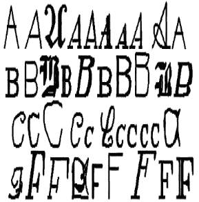
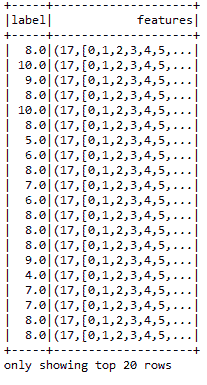
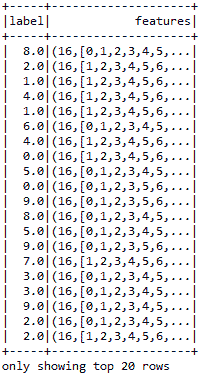
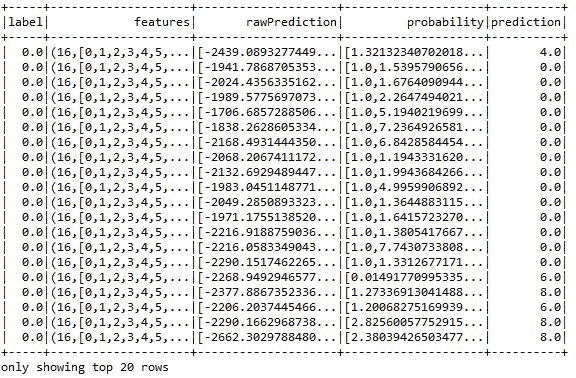
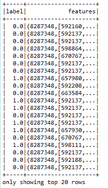
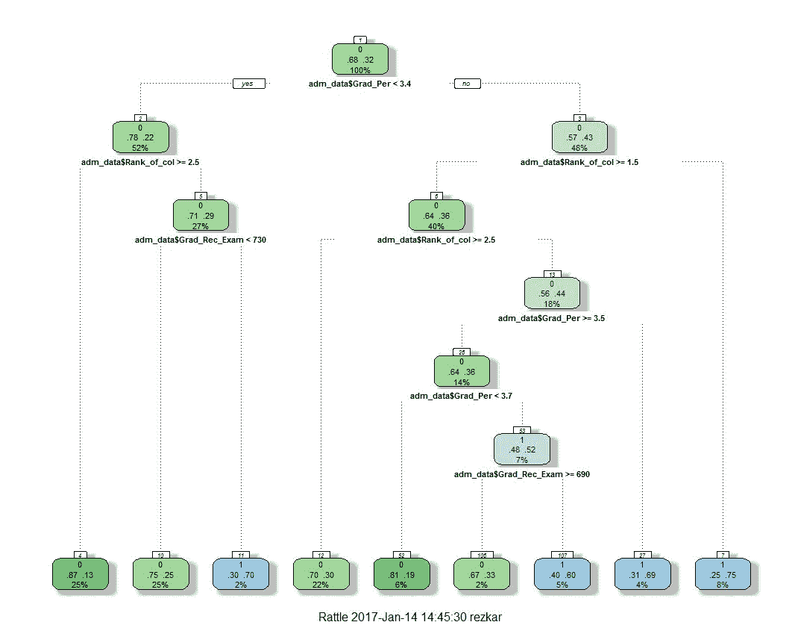
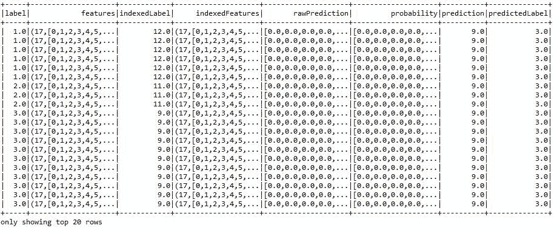
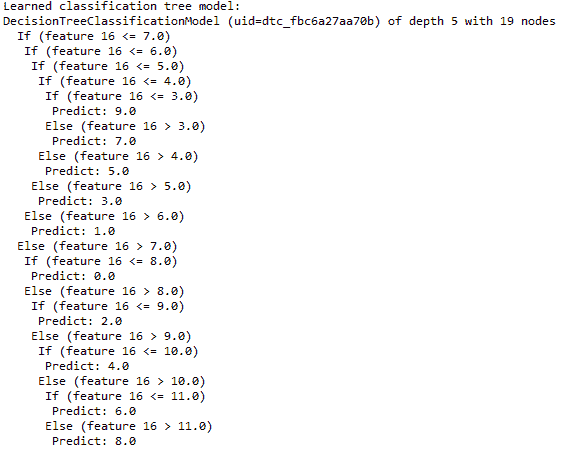

# 我的名字是贝叶斯，朴素贝叶斯

"预测是非常困难的，尤其是当它涉及未来时"

-尼尔斯·玻尔

**机器学习（ML）**与大数据的结合是一种革命性的组合，它在学术界和工业界的研究领域产生了巨大的影响。此外，许多研究领域也开始涉及大数据，因为数据集以空前的方式从不同的来源和技术中生成和产生，通常被称为**数据洪流**。这对机器学习、数据分析工具和算法提出了巨大的挑战，需要从大数据的体量、速度和多样性等标准中提取真正的**价值**。然而，从这些庞大的数据集中做出预测从未如此容易。

考虑到这个挑战，在本章中我们将深入探讨机器学习，并了解如何使用一种简单而强大的方法来构建可扩展的分类模型，甚至更多。简而言之，本章将涵盖以下主题：

+   多项分类

+   贝叶斯推断

+   朴素贝叶斯

+   决策树

+   朴素贝叶斯与决策树

# 多项分类

在机器学习中，**多项式**（也称为多类）分类是将数据对象或实例分类为两个以上的类别的任务，即拥有两个以上的标签或类别。将数据对象或实例分类为两个类别称为**二元分类**。从技术角度讲，在多项分类中，每个训练实例属于 N 个不同类别中的一个，其中`N >= 2`。目标是构建一个模型，能够正确预测新实例属于哪些类别。在许多场景中，数据点可能属于多个类别。然而，如果一个给定的点属于多个类别，这个问题可以简化为一组不相关的二元问题，这些问题可以自然地使用二元分类算法解决。

读者应避免将多类分类与多标签分类混淆，在多标签分类中，每个实例需要预测多个标签。关于基于 Spark 的多标签分类实现，感兴趣的读者可以参考[`spark.apache.org/docs/latest/mllib-evaluation-metrics.html#multilabel-classification`](https://spark.apache.org/docs/latest/mllib-evaluation-metrics.html#multilabel-classification)。

多类别分类技术可以分为以下几类：

+   转换为二进制

+   从二进制扩展

+   层次分类

# 转换为二进制

使用二分类技术转换，多类分类问题可以转化为多个二分类问题的等效策略。换句话说，这种技术可以称为 *问题转换技术*。从理论和实践的角度进行详细讨论超出了本章的范围。因此，我们这里只讨论一种问题转换技术的例子，称为 **一对其余**（**OVTR**）算法，作为该类别的代表。

# 使用一对其余方法进行分类

在本小节中，我们将描述使用 OVTR 算法执行多类分类的例子，方法是将问题转化为多个等效的二分类问题。OVTR 策略将问题拆解并为每个类别训练一个二分类器。换句话说，OVTR 分类器策略包括为每个类别拟合一个二分类器。然后，它将当前类别的所有样本视为正样本，因此其他分类器的样本视为负样本。

这无疑是一种模块化的机器学习技术。然而，缺点是该策略需要来自多类家族的基础分类器。原因是分类器必须输出一个实值，也叫做 *置信度分数*，而不是预测实际标签。该策略的第二个缺点是，如果数据集（即训练集）包含离散的类标签，最终可能导致模糊的预测结果。在这种情况下，单个样本可能会被预测为多个类别。为了使前面的讨论更清晰，下面我们来看一个例子。

假设我们有一组 50 个观测值，分为三个类别。因此，我们将使用与之前相同的逻辑来选择负例。对于训练阶段，我们设定如下：

+   **分类器 1** 有 30 个正例和 20 个负例

+   **分类器 2** 有 36 个正例和 14 个负例

+   **分类器 3** 有 14 个正例和 24 个负例

另一方面，对于测试阶段，假设我有一个新实例，需要将其分类到之前的某一类别中。每个分类器当然都会产生一个关于估计的概率。这个估计是指该实例属于分类器中正例或负例的概率有多低？在这种情况下，我们应始终比较一对其余中的正类概率。现在，对于 *N* 个类别，我们将为每个测试样本获得 *N* 个正类的概率估计。比较它们，最大概率对应的类别即为该样本所属类别。Spark 提供了通过 OVTR 算法将多类问题转换为二分类问题，其中 **逻辑回归** 算法被用作基础分类器。

现在我们来看看另一个真实数据集的示例，演示 Spark 如何使用 OVTR 算法对所有特征进行分类。OVTR 分类器最终预测来自 **光学字符识别** (**OCR**) 数据集的手写字符。然而，在深入演示之前，我们先来探索一下 OCR 数据集，以了解数据的探索性特征。需要注意的是，当 OCR 软件首次处理文档时，它会将纸张或任何物体划分为一个矩阵，使得网格中的每个单元格都包含一个字形（也称为不同的图形形状），这仅仅是对字母、符号、数字或任何来自纸张或物体的上下文信息的详细描述方式。

为了演示 OCR 流水线，假设文档仅包含与 26 个大写字母（即 *A* 到 *Z*）匹配的英文字母字符，我们将使用来自 *UCI 机器学习数据库* 的 OCR 字母数据集。该数据集由 W* Frey* 和 *D. J. Slate* 提供。在探索数据集时，您应该会看到 20,000 个示例，包含 26 个英文字母的大写字母。大写字母通过 20 种不同的、随机重塑和扭曲的黑白字体作为图形呈现，具有不同的形状。简而言之，从 26 个字母中预测所有字符将问题本身转化为一个具有 26 个类别的多类分类问题。因此，二分类器将无法达到我们的目的。

**图 1：** 一些打印字形（来源：使用荷兰风格自适应分类器的字母识别，ML，第 6 卷，第 161-182 页，W. Frey 和 D.J. Slate [1991]）

上图显示了我之前解释过的图像。*数据集* 提供了经过这种方式扭曲的打印字形的示例，因此这些字母对计算机来说具有挑战性，难以识别。然而，人类可以轻松识别这些字形。以下图展示了前 20 行的统计属性：

**图 2：** 数据集的快照，显示为数据框

# OCR 数据集的探索与准备

根据数据集描述，字形通过 OCR 阅读器扫描到计算机上，然后它们会被自动转换为像素。因此，所有 16 个统计属性（见**图 2**）也会记录到计算机中。黑色像素在框的各个区域中的浓度提供了一种方法，可以通过 OCR 或经过训练的机器学习算法来区分 26 个字母。

回想一下，**支持向量机**（**SVM**）、逻辑回归、朴素贝叶斯分类器或任何其他分类器算法（连同它们的学习器）都要求所有特征都是数字格式。LIBSVM 允许你使用稀疏训练数据集，以非传统格式存储数据。在将正常的训练数据集转换为 LIBSVM 格式时，只有数据集中的非零值才会以稀疏数组/矩阵的形式存储。索引指定实例数据的列（特征索引）。然而，任何缺失的数据也会被视为零值。索引用于区分不同的特征/参数。例如，对于三个特征，索引 1、2 和 3 分别对应于 *x*、*y* 和 *z* 坐标。不同数据实例中相同索引值之间的对应关系仅在构造超平面时才是数学上的；这些值作为坐标。如果跳过了中间的任何索引，它应被默认赋值为零。

在大多数实际情况下，我们可能需要对所有特征点进行数据归一化。简而言之，我们需要将当前的制表符分隔 OCR 数据转换为 LIBSVM 格式，以便简化训练步骤。因此，我假设你已经下载了数据并使用他们的脚本转换为 LIBSVM 格式。转换为 LIBSVM 格式后，数据集包含标签和特征，如下图所示：

**图 3：** LIBSVM 格式的 OCR 数据集 20 行快照

有兴趣的读者可以参考以下研究文章以深入了解：*Chih-Chung Chang* 和 *Chih-Jen Lin*，*LIBSVM：一个支持向量机库*，*ACM Intelligent Systems and Technology Transactions*，2:27:1--27:27，2011。你还可以参考我在 GitHub 仓库提供的公共脚本，地址是 [`github.com/rezacsedu/RandomForestSpark/`](https://github.com/rezacsedu/RandomForestSpark/)，该脚本可以将 CSV 中的 OCR 数据直接转换为 LIBSVM 格式。我读取了所有字母的数据，并为每个字母分配了唯一的数字值。你只需要显示输入和输出文件路径，并运行该脚本。

现在让我们深入了解这个例子。我将演示的例子包含 11 个步骤，包括数据解析、Spark 会话创建、模型构建和模型评估。

**步骤 1\. 创建 Spark 会话** - 通过指定主节点 URL、Spark SQL 仓库和应用名称来创建一个 Spark 会话，如下所示：

```py
val spark = SparkSession.builder
                     .master("local[*]") //change acordingly
                     .config("spark.sql.warehouse.dir", "/home/exp/")
                     .appName("OneVsRestExample") 
                     .getOrCreate()

```

**步骤 2\. 加载、解析和创建数据框** - 从 HDFS 或本地磁盘加载数据文件并创建数据框，最后显示数据框的结构，如下所示：

```py
val inputData = spark.read.format("libsvm")
                     .load("data/Letterdata_libsvm.data")
inputData.show()

```

**步骤 3\. 生成训练集和测试集以训练模型** - 让我们通过将 70% 用于训练，30% 用于测试来生成训练集和测试集：

```py
val Array(train, test) = inputData.randomSplit(Array(0.7, 0.3))

```

**步骤 4\. 实例化基础分类器** - 在这里，基础分类器充当多分类分类器。在本例中，它是逻辑回归算法，可以通过指定最大迭代次数、容忍度、回归参数和弹性网络参数等参数进行实例化。

请注意，当因变量是二项（即二元）时，逻辑回归是一种适合进行回归分析的方法。像所有回归分析一样，逻辑回归是一种预测分析。逻辑回归用于描述数据并解释一个二元因变量与一个或多个名义、顺序、区间或比率水平自变量之间的关系。

对于基于 Spark 的逻辑回归算法实现，有兴趣的读者可以参考[`spark.apache.org/docs/latest/mllib-linear-methods.html#logistic-regression`](https://spark.apache.org/docs/latest/mllib-linear-methods.html#logistic-regression)。

简而言之，训练逻辑回归分类器时使用了以下参数：

+   `MaxIter`：这指定最大迭代次数。通常，次数越多越好。

+   `Tol`：这是停止标准的容忍度。通常，值越小越好，这有助于模型进行更密集的训练。默认值为 1E-4。

+   `FirIntercept`：表示你是否希望在生成概率解释时拦截决策函数。

+   `Standardization`：这表示一个布尔值，决定是否希望标准化训练数据。

+   `AggregationDepth`：越大越好。

+   `RegParam`：这表示回归参数。大多数情况下，值越小越好。

+   `ElasticNetParam`：这表示更高级的回归参数。大多数情况下，值越小越好。

然而，你可以根据问题类型和数据集特性指定拟合截距的`Boolean`值为真或假：

```py
 val classifier = new LogisticRegression()
                        .setMaxIter(500)          
                        .setTol(1E-4)                                                                                                  
                        .setFitIntercept(true)
                        .setStandardization(true) 
                        .setAggregationDepth(50) 
                        .setRegParam(0.0001) 
                        .setElasticNetParam(0.01)

```

**步骤 5\. 实例化 OVTR 分类器** - 现在实例化一个 OVTR 分类器，将多分类问题转化为多个二分类问题，如下所示：

```py
val ovr = new OneVsRest().setClassifier(classifier)

```

这里`classifier`是逻辑回归估计器。现在是时候训练模型了。

**步骤 6\. 训练多分类模型** - 让我们使用训练集来训练模型，如下所示：

```py
val ovrModel = ovr.fit(train)

```

**步骤 7\. 在测试集上评估模型** - 我们可以使用转换器（即`ovrModel`）在测试数据上对模型进行评分，如下所示：

```py
val predictions = ovrModel.transform(test)

```

**步骤 8\. 评估模型** - 在这一步，我们将预测第一列字符的标签。但在此之前，我们需要实例化一个`evaluator`来计算分类性能指标，如准确率、精确度、召回率和`f1`值，具体如下：

```py
val evaluator = new MulticlassClassificationEvaluator()
                           .setLabelCol("label")
                           .setPredictionCol("prediction")    
val evaluator1 = evaluator.setMetricName("accuracy")
val evaluator2 = evaluator.setMetricName("weightedPrecision")
val evaluator3 = evaluator.setMetricName("weightedRecall")
val evaluator4 = evaluator.setMetricName("f1")

```

**步骤 9\. 计算性能指标** - 计算测试数据集上的分类准确率、精确度、召回率、`f1`值和错误率，如下所示：

```py
val accuracy = evaluator1.evaluate(predictions)
val precision = evaluator2.evaluate(predictions)
val recall = evaluator3.evaluate(predictions)
val f1 = evaluator4.evaluate(predictions)

```

**步骤 10.** 打印性能指标：

```py
println("Accuracy = " + accuracy)
println("Precision = " + precision)
println("Recall = " + recall)
println("F1 = " + f1)
println(s"Test Error = ${1 - accuracy}")

```

你应该观察如下值：

```py
Accuracy = 0.5217246545696688
Precision = 0.488360500637862
Recall = 0.5217246545696688
F1 = 0.4695649096879411
Test Error = 0.47827534543033123

```

**步骤 11.** 停止 Spark 会话：

```py
spark.stop() // Stop Spark session

```

通过这种方式，我们可以将一个多项式分类问题转换为多个二分类问题，而不会牺牲问题类型。然而，从第 10 步开始，我们可以观察到分类准确率并不理想。这可能是由多个原因造成的，例如我们用于训练模型的数据集的性质。此外，更重要的是，在训练逻辑回归模型时我们并没有调整超参数。而且，在进行转换时，OVTR 不得不牺牲一些准确性。

# 层次分类

在层次分类任务中，分类问题可以通过将输出空间划分为树的方式来解决。在这棵树中，父节点被划分为多个子节点。这个过程一直持续，直到每个子节点代表一个单一的类别。基于层次分类技术，已经提出了几种方法。计算机视觉就是一个典型的例子，其中识别图片或书写文本是使用层次处理的应用。关于这种分类器的详细讨论超出了本章的范围。

# 从二分类到多分类的扩展

这是一种将现有的二分类器扩展到多类分类问题的技术。为了解决多类分类问题，基于神经网络、决策树（DT）、随机森林、k 近邻、朴素贝叶斯和支持向量机（SVM）等算法已经提出并开发出来。在接下来的章节中，我们将讨论朴素贝叶斯和决策树算法，作为该类别的两个代表。

现在，在使用朴素贝叶斯算法解决多类分类问题之前，让我们在下一节中简要回顾一下贝叶斯推理。

# 贝叶斯推理

在这一节中，我们将简要讨论**贝叶斯推理**（**BI**）及其基础理论。读者将从理论和计算的角度了解这一概念。

# 贝叶斯推理概述

贝叶斯推理是一种基于贝叶斯定理的统计方法。它用于更新假设的概率（作为强有力的统计证据），以便统计模型能够不断更新，朝着更准确的学习方向发展。换句话说，所有类型的不确定性都以统计概率的形式在贝叶斯推理方法中揭示出来。这是理论和数学统计中的一个重要技术。我们将在后续章节中广泛讨论贝叶斯定理。

此外，贝叶斯更新在数据集序列的增量学习和动态分析中占据主导地位。例如，时间序列分析、生物医学数据分析中的基因组测序、科学、工程、哲学和法律等领域广泛应用贝叶斯推理。从哲学视角和决策理论看，贝叶斯推理与预测概率密切相关。然而，这一理论更正式的名称是**贝叶斯概率**。

# 什么是推理？

推理或模型评估是更新从模型得出的结局概率的过程。最终，所有的概率证据都将与当前的观察结果对比，以便在使用贝叶斯模型进行分类分析时可以更新观察结果。之后，这些信息通过对数据集中所有观察结果的一致性实例化被传回贝叶斯模型。传送到模型的规则被称为先验概率，这些概率是在引用某些相关观察结果之前评估的，特别是主观地或者假设所有可能的结果具有相同的概率。然后，当所有证据都已知时，计算出信念，这就是后验概率。这些后验概率反映了基于更新证据计算的假设水平。

贝叶斯定理用于计算后验概率，这些概率表示两个前提的结果。基于这些前提，从统计模型中推导出先验概率和似然函数，用于新数据的模型适应性。我们将在后续章节进一步讨论贝叶斯定理。

# 它是如何工作的？

在这里，我们讨论了一个统计推理问题的一般设置。首先，从数据中，我们估计所需的数量，可能也有一些我们希望估计的未知量。它可能只是一个响应变量或预测变量，一个类别，一个标签，或仅仅是一个数字。如果你熟悉*频率派*方法，你可能知道，在这种方法中，未知量，比如`θ`，被假定为一个固定的（非随机）量，应该通过观察到的数据来估计。

然而，在贝叶斯框架中，未知量，比如`θ`，被视为一个随机变量。更具体地说，假设我们对`θ`的分布有一个初步的猜测，这通常被称为**先验分布**。现在，在观察到一些数据后，`θ`的分布被更新。这个步骤通常是使用贝叶斯规则执行的（更多细节请参见下一节）。这就是为什么这种方法被称为贝叶斯方法的原因。简而言之，从先验分布中，我们可以计算出对未来观察结果的预测分布。

这个不起眼的过程可以通过大量论证证明是处理不确定推断的合适方法。然而，保持一致性的是这些论证的理性原则。尽管有强有力的数学证据，许多机器学习从业者对于使用贝叶斯方法感到不适，甚至有些不情愿。其背后的原因是，他们通常认为选择后验概率或先验概率是任意且主观的；然而，实际上，这种选择虽然主观，但并非任意的。

不恰当地，许多贝叶斯学派的人并没有真正用贝叶斯的思想来思考。因此，在文献中可以找到许多伪贝叶斯方法，其中使用的模型和先验并不能被严肃地视为先验信念的表达。贝叶斯方法也可能会遇到计算困难。许多这些问题可以通过**马尔可夫链蒙特卡洛**方法来解决，而这也是我的研究重点之一。随着你阅读本章，关于该方法的细节会更加清晰。

# 朴素贝叶斯

在机器学习中，**朴素贝叶斯**（**NB**）是基于著名的贝叶斯定理的概率分类器示例，其假设特征之间具有强独立性。在本节中，我们将详细讨论朴素贝叶斯。

# 贝叶斯定理概览

在概率论中，**贝叶斯定理**描述了基于与某一事件相关的先验知识来计算事件发生的概率。这是一个由托马斯·贝叶斯牧师最早提出的概率定理。换句话说，它可以被看作是理解概率理论如何被新的信息所影响的方式。例如，如果癌症与年龄相关，关于*年龄*的信息可以被用来更准确地评估某人可能患癌的概率*。*

贝叶斯定理的数学表达式如下：


在前面的方程中，*A* 和 *B* 是事件，且满足 *P (B) ≠ 0*，其他项可以描述如下：

+   *P*(*A*) 和 *P*(*B*) 是观察到 *A* 和 *B* 的概率，彼此之间不考虑相关性（即独立性）

+   *P*(*A* | *B*) 是在已知*B*为真时观察事件*A*的条件概率

+   *P*(*B*| *A*) 是在已知 *A* 为真时观察事件 *B* 的条件概率

正如你可能知道的那样，一项著名的哈佛研究表明，只有 10%的幸福人是富有的。然而，你可能认为这个统计数字非常有说服力，但你也可能会有点兴趣知道，富有的人中有多少人也是真正幸福的*。* 贝叶斯定理帮助你计算这个反向统计信息，方法是使用两个额外的线索：

1.  总体上，幸福的人的百分比，即*P(A)*。

1.  总体上，富有的人的百分比，即*P(B)*。

贝叶斯定理的关键思想是反转统计，考虑整体比例**。** 假设以下信息作为先验是已知的：

1.  40% 的人是快乐的，*=> P(A)。*

1.  5% 的人是富人 *=> P(B).*

现在让我们假设哈佛的研究是正确的，即 *P(B|A) = 10%*。那么富人中快乐的比例，也就是 *P(A | B)，* 可以按如下方式计算：

*P(A|B) = {P(A)* P(B| A)}/ P(B) = (40%*10%)/5% = 80%*

结果是，大多数人也是快乐的！很好。为了更清楚地说明，现在假设世界人口为 1000，为了简化计算。然后，根据我们的计算，存在以下两个事实：

+   事实 1：这告诉我们 400 人是快乐的，而哈佛的研究表明，这些快乐的人中有 40 个人也是富人。

+   事实 2：共有 50 个富人，因此其中快乐的比例是 40/50 = 80%。

这证明了贝叶斯定理及其有效性。然而，更全面的示例可以在 [`onlinecourses.science.psu.edu/stat414/node/43`](https://onlinecourses.science.psu.edu/stat414/node/43) 找到。

# 我的名字是 Bayes，Naive Bayes。

我是 Bayes，Naive Bayes（NB）。我是一个成功的分类器，基于 **最大后验**（**MAP**）的原理。作为分类器，我具有高度的可扩展性，需要的参数数目与学习问题中的变量（特征/预测因子）数量成线性关系。我有几个特点，例如，我计算更快，如果你雇佣我来分类，我很容易实现，并且我可以很好地处理高维数据集。此外，我可以处理数据集中的缺失值。尽管如此，我是可适应的，因为模型可以在不重新构建的情况下用新的训练数据进行修改。

在贝叶斯统计中，MAP 估计是未知量的估计，它等于后验分布的众数。MAP 估计可以用于基于经验数据获取一个未观察量的点估计。

听起来像詹姆斯·邦德的电影情节吗？嗯，你/我们可以将分类器看作是 007 特工，对吧？开玩笑的。我相信我并不像 Naive Bayes 分类器的参数，因为它们像先验和条件概率一样，是通过一套确定的步骤来学习或决定的：这涉及到两个非常简单的操作，这在现代计算机上可以非常快速地执行，即计数和除法。没有*迭代*。没有*周期*。没有*代价方程的优化*（代价方程通常比较复杂，平均而言至少是三次方或二次方复杂度）。没有*误差反向传播*。没有涉及*解矩阵方程*的操作。这些使得 Naive Bayes 及其整体训练更加高效。

然而，在雇用此代理之前，您/我们可以发现它的优缺点，以便我们只利用它的优势像王牌一样使用它。好了，这里有一张表格总结了这个代理的优缺点：

| **代理** | **优点** | **缺点** | **更适合** |
| --- | --- | --- | --- |
| **Naive Bayes (NB)** | - 计算速度快 - 实现简单 - 对高维度数据效果好 - 可以处理缺失值 - 训练模型所需数据量小 - 可扩展 - 可适应性强，因为可以通过新增训练数据来修改模型，而无需重新构建模型 | - 依赖于独立性假设，因此如果假设不成立，表现会差 - 准确率较低 - 如果某个类标签和某个特征值一起没有出现，那么基于频率的概率估计会是零 | - 当数据中有大量缺失值时 - 当特征之间的依赖关系相似时 - 垃圾邮件过滤和分类 - 对新闻文章进行分类（如技术、政治、体育等） - 文本挖掘 |

**表格 1：** Naive Bayes 算法的优缺点

# 使用 NB 构建可扩展分类器

在本节中，我们将通过一步一步的示例来展示如何使用 **Naive Bayes**（**NB**）算法。正如前面所述，NB 具有很强的可扩展性，所需的参数数量与学习问题中变量（特征/预测因子）的数量成线性关系。这种可扩展性使得 Spark 社区能够使用该算法在大规模数据集上进行预测分析。Spark MLlib 中当前的 NB 实现支持多项式 NB 和 Bernoulli NB。

如果特征向量是二进制的，Bernoulli NB 是非常有用的。一个应用场景是使用词袋（BOW）方法进行文本分类。另一方面，多项式 NB 通常用于离散计数。例如，如果我们有一个文本分类问题，我们可以将 Bernoulli 试验的思想进一步拓展，在文档中使用频率计数，而不是词袋（BOW）。

在本节中，我们将展示如何通过结合 Spark 机器学习 API（包括 Spark MLlib、Spark ML 和 Spark SQL）来预测 **基于笔迹的手写数字识别** 数据集中的数字：

**步骤 1. 数据收集、预处理和探索** - 手写数字的基于笔的识别数据集是从 UCI 机器学习库下载的，网址为 [`www.csie.ntu.edu.tw/~cjlin/libsvmtools/datasets/multiclass/pendigits.`](https://www.csie.ntu.edu.tw/~cjlin/libsvmtools/datasets/multiclass/pendigits)。该数据集是在从 44 位书写者收集了大约 250 个数字样本后生成的，样本与笔的位置在每隔 100 毫秒的固定时间间隔内进行相关。每个数字都被写在一个 500 x 500 像素的框内。最后，这些图像被缩放到 0 到 100 之间的整数值，以在每个观测值之间创建一致的缩放。使用了一种著名的空间重采样技术，以获得沿弧轨迹上均匀间隔的 3 个和 8 个点。可以通过根据（x, y）坐标绘制 3 个或 8 个采样点来可视化一个示例图像以及从点到点的连线；它看起来像下表所示：

| 集 | '0' | '1' | '2' | '3' | '4' | '5' | '6' | '7' | '8' | '9' | 总计 |
| --- | --- | --- | --- | --- | --- | --- | --- | --- | --- | --- | --- |
| 训练集 | 780 | 779 | 780 | 719 | 780 | 720 | 720 | 778 | 718 | 719 | 7493 |
| 测试 | 363 | 364 | 364 | 336 | 364 | 335 | 336 | 364 | 335 | 336 | 3497 |

表 2：用于训练集和测试集的数字数量

如前表所示，训练集包含 30 位书写者书写的样本，而测试集包含 14 位书写者书写的样本。


图 4：数字 3 和 8 的示例

关于该数据集的更多信息可以在 [`archive.ics.uci.edu/ml/machine-learning-databases/pendigits/pendigits-orig.names`](http://archive.ics.uci.edu/ml/machine-learning-databases/pendigits/pendigits-orig.names) 上找到。数据集的一个样本快照的数字表示如下图所示：



图 5：手写数字数据集的 20 行快照

现在，为了使用独立变量（即特征）预测因变量（即标签），我们需要训练一个多类分类器，因为如前所述，数据集现在有九个类别，即九个手写数字。为了预测，我们将使用朴素贝叶斯分类器并评估模型的性能。

**步骤 2.** 加载所需的库和包：

```py
import org.apache.spark.ml.classification.NaiveBayes
import org.apache.spark.ml.evaluation
                                 .MulticlassClassificationEvaluator
import org.apache.spark.sql.SparkSession

```

**步骤 3.** 创建一个活跃的 Spark 会话：

```py
val spark = SparkSession
              .builder
              .master("local[*]")
              .config("spark.sql.warehouse.dir", "/home/exp/")
              .appName(s"NaiveBayes")
              .getOrCreate()

```

请注意，这里已将主机 URL 设置为 `local[*]`，这意味着您机器的所有核心将用于处理 Spark 任务。您应根据需求相应地设置 SQL 仓库以及其他配置参数。

**步骤 4. 创建 DataFrame** - 将存储在 LIBSVM 格式中的数据加载为 DataFrame：

```py
val data = spark.read.format("libsvm")
                     .load("data/pendigits.data")

```

对于数字分类，输入特征向量通常是稀疏的，应当提供稀疏向量作为输入，以利用稀疏性。由于训练数据只使用一次，而且数据集的大小相对较小（即只有几 MB），如果多次使用 DataFrame，我们可以对其进行缓存。

**步骤 5. 准备训练集和测试集** - 将数据拆分为训练集和测试集（25% 用于测试）：

```py
val Array(trainingData, testData) = data
                  .randomSplit(Array(0.75, 0.25), seed = 12345L)

```

**步骤 6. 训练朴素贝叶斯模型** - 使用训练集训练朴素贝叶斯模型，方法如下：

```py
val nb = new NaiveBayes()
val model = nb.fit(trainingData)

```

**步骤 7. 计算测试集上的预测结果** - 使用模型转换器计算预测结果，并最终显示每个标签的预测结果，方法如下：

```py
val predictions = model.transform(testData)
predictions.show()

```

**图 6：** 每个标签（即每个数字）的预测结果

正如你在前面的图中看到的，一些标签的预测是准确的，而另一些则是错误的。我们需要了解加权准确率、精确率、召回率和 F1 值，而不是单纯地评估模型。

**步骤 8. 评估模型** - 选择预测结果和真实标签，计算测试误差和分类性能指标，如准确率、精确率、召回率和 F1 值，方法如下：

```py
val evaluator = new MulticlassClassificationEvaluator()
                           .setLabelCol("label")
                           .setPredictionCol("prediction")    
val evaluator1 = evaluator.setMetricName("accuracy")
val evaluator2 = evaluator.setMetricName("weightedPrecision")
val evaluator3 = evaluator.setMetricName("weightedRecall")
val evaluator4 = evaluator.setMetricName("f1")

```

**步骤 9. 计算性能指标** - 计算分类准确率、精确率、召回率、F1 值和测试数据上的误差，方法如下：

```py
val accuracy = evaluator1.evaluate(predictions)
val precision = evaluator2.evaluate(predictions)
val recall = evaluator3.evaluate(predictions)
val f1 = evaluator4.evaluate(predictions)

```

**步骤 10.** 打印性能指标：

```py
println("Accuracy = " + accuracy)
println("Precision = " + precision)
println("Recall = " + recall)
println("F1 = " + f1)
println(s"Test Error = ${1 - accuracy}")

```

你应该观察到如下值：

```py
Accuracy = 0.8284365162644282
Precision = 0.8361211320692463
Recall = 0.828436516264428
F1 = 0.8271828540349192
Test Error = 0.17156348373557184

```

性能并不差。然而，你仍然可以通过进行超参数调优来提高分类准确率。通过交叉验证和训练集拆分选择合适的算法（即分类器或回归器），仍然有机会进一步提高预测准确率，这将在下一节中讨论。

# 调整我的参数！

你已经知道我的优缺点，我有一个缺点，那就是我的分类准确率相对较低。不过，如果你对我进行调优，我可以表现得更好。嗯，我们应该相信朴素贝叶斯吗？如果相信，难道我们不该看看如何提高这个模型的预测性能吗？我们以 WebSpam 数据集为例。首先，我们应该观察 NB 模型的性能，然后看看如何通过交叉验证技术提升性能。

从[`www.csie.ntu.edu.tw/~cjlin/libsvmtools/datasets/binary/webspam_wc_normalized_trigram.svm.bz2`](http://www.csie.ntu.edu.tw/~cjlin/libsvmtools/datasets/binary/webspam_wc_normalized_trigram.svm.bz2)下载的 WebSpam 数据集包含特征和相应的标签，即垃圾邮件或正常邮件。因此，这是一个监督学习问题，任务是预测给定消息是否为垃圾邮件或正常邮件（即非垃圾邮件）。原始数据集大小为 23.5 GB，类别标签为+1 或-1（即二元分类问题）。后来，由于朴素贝叶斯不允许使用有符号整数，我们将-1 替换为 0.0，+1 替换为 1.0。修改后的数据集如下图所示：

**图 7：** WebSpam 数据集的前 20 行快照

首先，我们需要按以下方式导入必要的包：

```py
import org.apache.spark.ml.classification.NaiveBayes
import org.apache.spark.ml.evaluation.MulticlassClassificationEvaluator
import org.apache.spark.sql.SparkSession
import org.apache.spark.ml.Pipeline;
import org.apache.spark.ml.PipelineStage;
import org.apache.spark.ml.classification.LogisticRegression
import org.apache.spark.ml.evaluation.BinaryClassificationEvaluator
import org.apache.spark.ml.feature.{HashingTF, Tokenizer}
import org.apache.spark.ml.linalg.Vector
import org.apache.spark.ml.tuning.{CrossValidator, ParamGridBuilder}

```

现在按以下方式创建 Spark 会话作为代码的入口点：

```py
val spark = SparkSession
      .builder
      .master("local[*]")
      .config("spark.sql.warehouse.dir", "/home/exp/")
      .appName("Tuned NaiveBayes")
      .getOrCreate()

```

让我们加载 WebSpam 数据集并准备训练集以训练朴素贝叶斯模型，如下所示：

```py
// Load the data stored in LIBSVM format as a DataFrame.
 val data = spark.read.format("libsvm").load("hdfs://data/ webspam_wc_normalized_trigram.svm")
 // Split the data into training and test sets (30% held out for testing)
 val Array(trainingData, testData) = data.randomSplit(Array(0.75, 0.25), seed = 12345L)
 // Train a NaiveBayes model with using the training set
 val nb = new NaiveBayes().setSmoothing(0.00001)
 val model = nb.fit(trainingData)

```

在上述代码中，为了可复现性，设置种子是必需的。现在让我们对验证集进行预测，步骤如下：

```py
val predictions = model.transform(testData)
predictions.show()

```

现在让我们获取`evaluator`并计算分类性能指标，如准确度、精确度、召回率和`f1`度量，如下所示：

```py
val evaluator = new MulticlassClassificationEvaluator()
                    .setLabelCol("label")
                    .setPredictionCol("prediction")    
val evaluator1 = evaluator.setMetricName("accuracy")
val evaluator2 = evaluator.setMetricName("weightedPrecision")
val evaluator3 = evaluator.setMetricName("weightedRecall")
val evaluator4 = evaluator.setMetricName("f1")

```

现在让我们计算并打印性能指标：

```py
val accuracy = evaluator1.evaluate(predictions)
val precision = evaluator2.evaluate(predictions)
val recall = evaluator3.evaluate(predictions)
val f1 = evaluator4.evaluate(predictions)   
// Print the performance metrics
println("Accuracy = " + accuracy)
println("Precision = " + precision)
println("Recall = " + recall)
println("F1 = " + f1)
println(s"Test Error = ${1 - accuracy}")

```

您应该收到以下输出：

```py
Accuracy = 0.8839357429715676
Precision = 0.86393574297188752
Recall = 0.8739357429718876
F1 = 0.8739357429718876
Test Error = 0.11606425702843237

```

虽然准确度已经达到了令人满意的水平，但我们可以通过应用交叉验证技术进一步提高它。该技术的步骤如下：

+   通过链式连接一个 NB 估计器作为管道的唯一阶段来创建一个流水线

+   现在为调整准备参数网格

+   执行 10 折交叉验证

+   现在使用训练集拟合模型

+   计算验证集上的预测

诸如交叉验证之类的模型调整技术的第一步是创建管道。通过链式连接转换器、估计器和相关参数可以创建管道。

**步骤 1\. 管道创建** - 让我们创建一个朴素贝叶斯估计器（在以下情况下，`nb`是一个估计器）并通过链式连接估计器创建一个管道：

```py
val nb = new NaiveBayes().setSmoothing(00001)
val pipeline = new Pipeline().setStages(Array(nb))

```

一个管道可以被看作是用于训练和预测的数据工作流系统。ML 管道提供了一组统一的高级 API，构建在[DataFrames](https://spark.apache.org/docs/latest/sql-programming-guide.html)之上，帮助用户创建和调优实用的机器学习管道。DataFrame、转换器、估计器、管道和参数是管道创建中最重要的五个组件。有兴趣的读者可以参考[`spark.apache.org/docs/latest/ml-pipeline.html`](https://spark.apache.org/docs/latest/ml-pipeline.html)了解更多关于管道的信息。

在前面的情况下，我们的管道中唯一的阶段是一个用于在 DataFrame 上拟合以生成转换器以确保成功训练的算法估计器。

**步骤 2. 创建网格参数** - 让我们使用 `ParamGridBuilder` 构建一个参数网格以进行搜索：

```py
val paramGrid = new ParamGridBuilder()
              .addGrid(nb.smoothing, Array(0.001, 0.0001))
              .build()

```

**步骤 3. 执行 10 折交叉验证** - 现在我们将管道视为一个估计器，并将其包装在交叉验证器实例中。这将允许我们为所有管道阶段共同选择参数。`CrossValidator` 需要一个估计器、一组估计器 `ParamMaps` 和一个评估器。请注意，这里的评估器是 `BinaryClassificationEvaluator`，其默认指标是 `areaUnderROC`。但是，如果你使用 `MultiClassClassificationEvaluator` 作为评估器，你还可以使用其他性能指标：

```py
val cv = new CrossValidator()
            .setEstimator(pipeline)
            .setEvaluator(new BinaryClassificationEvaluator)
            .setEstimatorParamMaps(paramGrid)
            .setNumFolds(10)  // Use 3+ in practice

```

**步骤 4.** 使用训练集拟合交叉验证模型，如下所示：

```py
val model = cv.fit(trainingData)

```

**步骤 5.** 如下计算性能：

```py
val predictions = model.transform(validationData)
predictions.show()

```

**步骤 6.** 获取评估器，计算性能指标，并显示结果。现在让我们获取`evaluator`并计算分类性能指标，如准确率、精度、召回率和 F1 值。这里将使用 `MultiClassClassificationEvaluator` 来计算准确率、精度、召回率和 F1 值：

```py
val evaluator = new MulticlassClassificationEvaluator()
                            .setLabelCol("label")
                            .setPredictionCol("prediction")    
val evaluator1 = evaluator.setMetricName("accuracy")
val evaluator2 = evaluator.setMetricName("weightedPrecision")
val evaluator3 = evaluator.setMetricName("weightedRecall")
val evaluator4 = evaluator.setMetricName("f1")

```

现在计算分类准确率、精度、召回率、F1 值和测试数据上的误差，如下所示：

```py
val accuracy = evaluator1.evaluate(predictions)
val precision = evaluator2.evaluate(predictions)
val recall = evaluator3.evaluate(predictions)
val f1 = evaluator4.evaluate(predictions)

```

现在让我们打印性能指标：

```py
println("Accuracy = " + accuracy)
println("Precision = " + precision)
println("Recall = " + recall)
println("F1 = " + f1)
println(s"Test Error = ${1 - accuracy}")

```

你现在应该会收到以下结果：

```py
Accuracy = 0.9678714859437751
Precision = 0.9686742518830365
Recall = 0.9678714859437751
F1 = 0.9676697179934564
Test Error = 0.032128514056224855

```

现在与之前的结果相比，效果好多了，对吧？请注意，由于数据集的随机拆分和你使用的平台，你可能会得到稍有不同的结果。

# 决策树

在这一部分，我们将详细讨论决策树算法。还将讨论朴素贝叶斯和决策树的比较分析。决策树通常被认为是一种监督学习技术，用于解决分类和回归任务。决策树只是一个决策支持工具，使用类似树状的图（或决策模型）及其可能的结果，包括机会事件结果、资源成本和效用。从技术角度讲，决策树中的每一分支代表一个可能的决策、事件或反应，具体体现在统计概率上。

与朴素贝叶斯相比，决策树（DT）是一种更为强大的分类技术。其原因在于，决策树首先将特征划分为训练集和测试集。然后它会生成一个良好的泛化模型，以推断预测标签或类别。更有趣的是，决策树算法可以处理二分类和多分类问题。

**图 8：** 使用 R 的 Rattle 包在入学测试数据集上生成的决策树示例

举例来说，在前面的示例图中，DT 通过录取数据学习，用一组`if...else`决策规则来逼近正弦曲线。数据集包含每个申请入学的学生的记录，假设是申请美国大学的学生。每条记录包括研究生入学考试分数、CGPA 分数和列的排名。现在，我们需要根据这三个特征（变量）预测谁是合格的。DT 可以用于解决这种问题，在训练 DT 模型并修剪掉不需要的树枝后进行预测。通常，树越深，意味着决策规则越复杂，模型的拟合度越好。因此，树越深，决策规则越复杂，模型越拟合。

如果你想绘制前面的图形，只需运行我的 R 脚本，在 RStudio 中执行它，并提供录取数据集。脚本和数据集可以在我的 GitHub 仓库中找到：[`github.com/rezacsedu/AdmissionUsingDecisionTree`](https://github.com/rezacsedu/AdmissionUsingDecisionTree)。

# 使用 DT 的优缺点

在雇佣我之前，你可以从表 3 中了解我的优缺点以及我最擅长的工作时间，以免你事后后悔！

| **代理** | **优点** | **缺点** | **更擅长于** |
| --- | --- | --- | --- |
| **决策树（DTs）** | - 实现、训练和解释简单 - 树形结构可视化 - 数据准备要求较少 - 较少的模型构建和预测时间 - 能处理数值型和类别型数据 - 可通过统计检验验证模型 - 对噪声和缺失值具有鲁棒性 - 高准确率 | - 大型和复杂的树难以解释 - 同一子树中可能出现重复 - 可能存在对角线决策边界问题 - DT 学习器可能创建过于复杂的树，无法很好地泛化数据 - 有时 DTs 可能因数据的小变动而不稳定 - 学习 DT 本身是一个 NP 完全问题（即非确定性多项式时间完全问题） - 如果某些类别占主导地位，DT 学习器会创建有偏的树 | - 目标是高度准确的分类 - 医学诊断和预后 - 信用风险分析 |

**表 3：** 决策树的优缺点

# 决策树与朴素贝叶斯比较

如前表所述，DT 由于其对训练数据集的灵活性，非常易于理解和调试。它们既适用于分类问题，也适用于回归问题。

如果你尝试预测分类值或连续值，决策树（DT）可以同时处理这两种问题。因此，如果你只有表格数据，将其输入到决策树中，它将构建模型来分类你的数据，无需任何额外的前期或手动干预。总之，决策树非常简单，易于实现、训练和解释。只需极少的数据准备，决策树就能在更短的预测时间内构建模型。正如前面所说，它们可以处理数字数据和分类数据，并且对噪声和缺失值非常鲁棒。使用统计测试验证模型也非常简单。更有趣的是，构建的树可以进行可视化。总体而言，决策树提供了非常高的准确性。

然而，决策树的缺点是，它们有时会导致训练数据的过拟合问题。这意味着你通常需要修剪树并找到一个最优的树模型，以提高分类或回归的准确性。此外，同一子树中可能会出现重复现象。有时它还会在决策边界上产生斜对角问题，从而导致过拟合和欠拟合的问题。此外，决策树学习器可能会生成过于复杂的树，无法很好地泛化数据，这使得整体解释变得困难。由于数据中的微小变动，决策树可能不稳定，因此学习决策树本身是一个 NP 完全问题。最后，如果某些类别在数据中占主导地位，决策树学习器可能会生成有偏的树。

读者可以参考*表 1*和*表 3*，获取朴素贝叶斯和决策树的对比总结。

另一方面，使用朴素贝叶斯时有一种说法：*NB 要求你手动构建分类器*。你无法直接将一堆表格数据输入它，它不会自动挑选最适合分类的特征。在这种情况下，选择正确的特征以及重要的特征由用户自己决定，也就是你自己。另一方面，决策树会从表格数据中选择最佳特征。鉴于这一点，你可能需要将朴素贝叶斯与其他统计技术结合，以帮助选择最佳特征并在之后进行分类。或者，使用决策树来提高准确性，特别是在精确度、召回率和 F1 度量方面。另一个关于朴素贝叶斯的优点是，它会作为一个连续的分类器进行输出。然而，缺点是它们更难调试和理解。朴素贝叶斯在训练数据中没有良好的特征且数据量较小时表现得相当不错。

总之，如果你试图从这两种方法中选择一个更好的分类器，通常最好测试每个模型来解决问题。我的建议是，使用你拥有的训练数据构建决策树和朴素贝叶斯分类器，然后使用可用的性能指标比较它们的表现，再根据数据集的特性决定哪一个最适合解决你的问题。

# 使用决策树算法构建可扩展的分类器

正如你已经看到的，使用 OVTR 分类器时，我们在 OCR 数据集上观察到了以下性能指标值：

```py
Accuracy = 0.5217246545696688
Precision = 0.488360500637862
Recall = 0.5217246545696688
F1 = 0.4695649096879411
Test Error = 0.47827534543033123

```

这意味着模型在该数据集上的准确度非常低。在本节中，我们将看到如何通过使用 DT 分类器来提升性能。我们将展示一个使用 Spark 2.1.0 的例子，使用相同的 OCR 数据集。这个例子将包含多个步骤，包括数据加载、解析、模型训练，最后是模型评估。

由于我们将使用相同的数据集，为避免冗余，我们将跳过数据集探索步骤，直接进入示例：

**第 1 步：** 加载所需的库和包，如下所示：

```py
import org.apache.spark.ml.Pipeline // for Pipeline creation
import org.apache.spark.ml.classification
                         .DecisionTreeClassificationModel 
import org.apache.spark.ml.classification.DecisionTreeClassifier 
import org.apache.spark.ml.evaluation
                         .MulticlassClassificationEvaluator 
import org.apache.spark.ml.feature
                         .{IndexToString, StringIndexer, VectorIndexer} 
import org.apache.spark.sql.SparkSession //For a Spark session

```

**第 2 步：** 创建一个活动的 Spark 会话，如下所示：

```py
val spark = SparkSession
              .builder
              .master("local[*]")
              .config("spark.sql.warehouse.dir", "/home/exp/")
              .appName("DecisionTreeClassifier")
              .getOrCreate()

```

请注意，这里将主 URL 设置为 `local[*]`，意味着你机器的所有核心将用于处理 Spark 作业。你应该根据需求设置 SQL 仓库和其他配置参数。

**第 3 步：创建数据框** - 将存储在 LIBSVM 格式中的数据加载为数据框，如下所示：

```py
val data = spark.read.format("libsvm").load("datab
                             /Letterdata_libsvm.data")

```

对于数字分类，输入特征向量通常是稀疏的，应该将稀疏向量作为输入，以便利用稀疏性。由于训练数据只使用一次，而且数据集的大小相对较小（即几 MB），如果你多次使用 DataFrame，可以缓存它。

**第 4 步：标签索引** - 索引标签，向标签列添加元数据。然后让我们在整个数据集上进行拟合，以便将所有标签包含在索引中：

```py
val labelIndexer = new StringIndexer()
               .setInputCol("label")
               .setOutputCol("indexedLabel")
               .fit(data)

```

**第 5 步：识别分类特征** - 以下代码段自动识别分类特征并对其进行索引：

```py
val featureIndexer = new VectorIndexer()
              .setInputCol("features")
              .setOutputCol("indexedFeatures")
              .setMaxCategories(4)
              .fit(data)

```

对于这种情况，如果特征的值大于四个不同的值，它们将被视为连续值。

**第 6 步：准备训练集和测试集** - 将数据分成训练集和测试集（25% 用于测试）：

```py
val Array(trainingData, testData) = data.randomSplit
                                      (Array(0.75, 0.25), 12345L)

```

**第 7 步：** 按如下方式训练 DT 模型：

```py
val dt = new DecisionTreeClassifier()
                     .setLabelCol("indexedLabel")
                     .setFeaturesCol("indexedFeatures")

```

**第 8 步：** 按如下方式将索引标签转换回原始标签：

```py
val labelConverter = new IndexToString()
                .setInputCol("prediction")
                .setOutputCol("predictedLabel")
                .setLabels(labelIndexer.labels)

```

**第 9 步：创建 DT 管道** - 让我们通过组合索引器、标签转换器和树来创建一个 DT 管道：

```py
val pipeline = new Pipeline().setStages(Array(labelIndexer,
                              featureIndexer, dt, labelconverter))

```

**第 10 步：运行索引器** - 使用变换器训练模型并运行索引器：

```py
val model = pipeline.fit(trainingData)

```

**第 11 步：计算测试集上的预测结果** - 使用模型变换器计算预测结果，并最终显示每个标签的预测结果，如下所示：

```py
val predictions = model.transform(testData)
predictions.show()

```

**图 9：** 针对每个标签的预测（即每个字母）

如前图所示，部分标签预测准确，而部分标签预测错误。然而，我们知道加权准确率、精确率、召回率和 F1 值，但我们需要先评估模型。

**第 12 步：评估模型** - 选择预测结果和真实标签来计算测试误差和分类性能指标，如准确率、精确率、召回率和 F1 值，如下所示：

```py
val evaluator = new MulticlassClassificationEvaluator()
                             .setLabelCol("label")
                             .setPredictionCol("prediction")    
val evaluator1 = evaluator.setMetricName("accuracy")
val evaluator2 = evaluator.setMetricName("weightedPrecision")
val evaluator3 = evaluator.setMetricName("weightedRecall")
val evaluator4 = evaluator.setMetricName("f1")

```

**步骤 13.** 计算性能指标 - 计算测试数据上的分类准确率、精确率、召回率、F1 值和错误率，如下所示：

```py
val accuracy = evaluator1.evaluate(predictions)
val precision = evaluator2.evaluate(predictions)
val recall = evaluator3.evaluate(predictions)
val f1 = evaluator4.evaluate(predictions)

```

**步骤 14.** 打印性能指标：

```py
println("Accuracy = " + accuracy)
println("Precision = " + precision)
println("Recall = " + recall)
println("F1 = " + f1)
println(s"Test Error = ${1 - accuracy}")

```

你应该观察到以下值：

```py
Accuracy = 0.994277821625888
Precision = 0.9904583933020722
Recall = 0.994277821625888
F1 = 0.9919966504321712
Test Error = 0.005722178374112041

```

现在性能很优秀，对吧？然而，你仍然可以通过执行超参数调整来提高分类准确率。通过交叉验证和训练集划分，选择合适的算法（即分类器或回归器）还有进一步提高预测准确性的机会。

**步骤 15.** 打印决策树节点：

```py
val treeModel = model.stages(2).asInstanceOf
                                [DecisionTreeClassificationModel]
println("Learned classification tree model:\n" + treeModel
                 .toDebugString)

```

最后，我们将打印决策树中的一些节点，如下图所示：

**图 10：** 在模型构建过程中生成的一些决策树节点

# 总结

本章中，我们讨论了一些机器学习中的高级算法，并了解了如何使用简单而强大的贝叶斯推断方法来构建另一种分类模型——多项式分类算法。此外，我们还从理论和技术角度广泛讨论了朴素贝叶斯算法。在最后一步，我们讨论了决策树与朴素贝叶斯算法的对比分析，并提供了一些指导方针。

在下一章*中*，我们将深入研究机器学习，探索如何利用机器学习将无监督观察数据集中的记录进行聚类。
