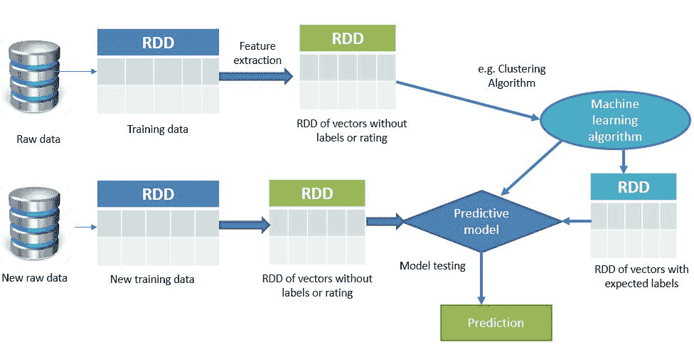
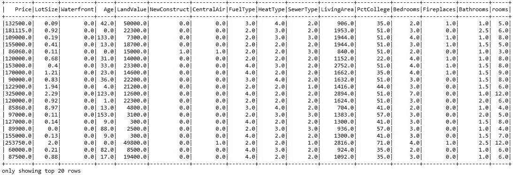
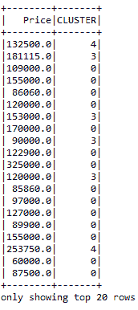
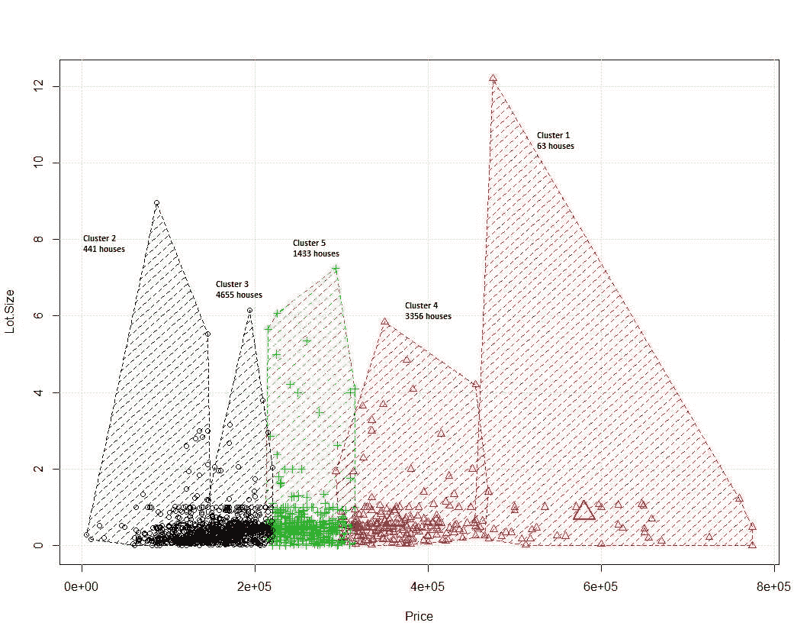
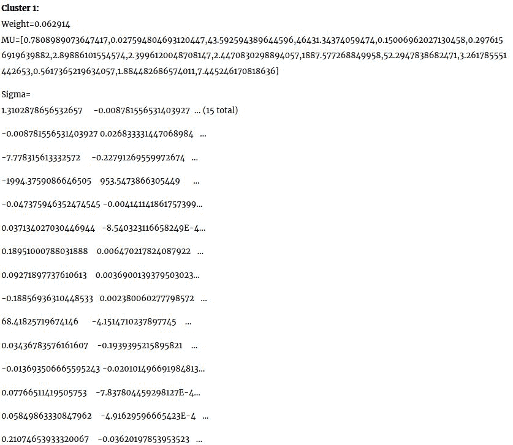
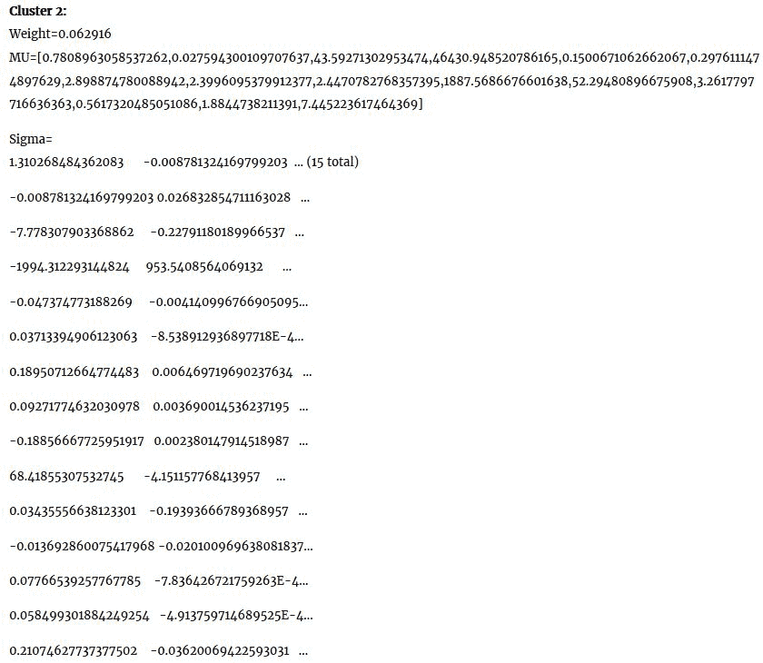
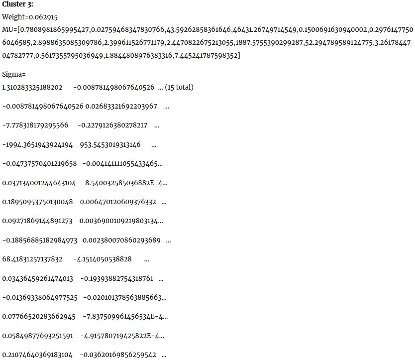
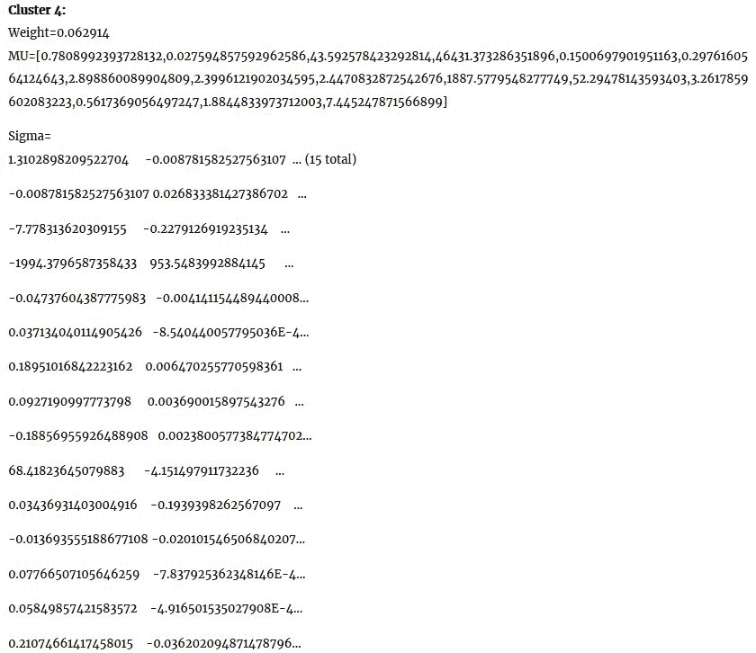
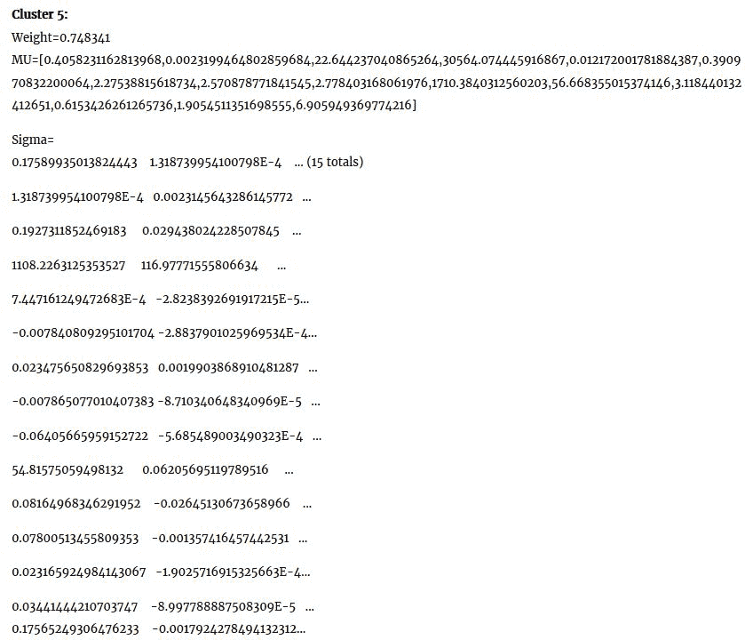
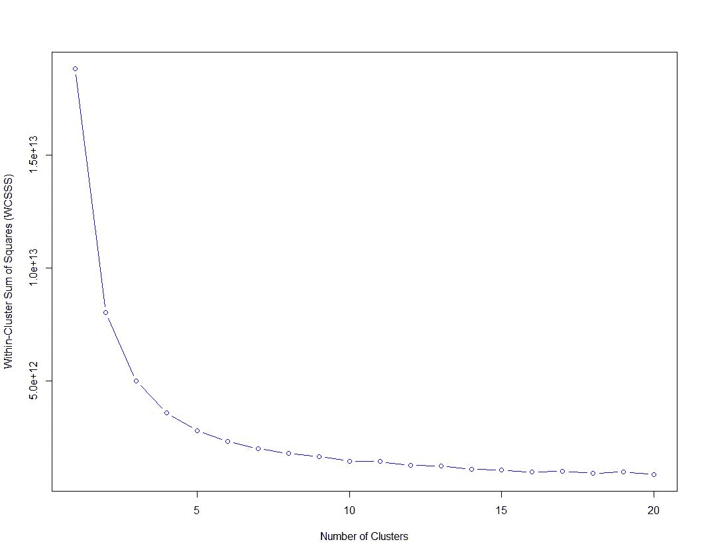

# 是时候整理一下 - 使用 Spark MLlib 聚类你的数据

*“如果你试图把一个星系做大，它就变成了一个星系团，而不是一个星系。如果你试图让它变得比这个还小，它似乎会自我分裂。”*

- 杰里迈·P·奥斯特里克

在本章中，我们将深入探讨机器学习，并了解如何利用它将属于某个特定组或类别的记录聚类到无监督观察数据集中的方式。简而言之，本章将涵盖以下主题：

+   无监督学习

+   聚类技术

+   层次聚类（HC）

+   基于质心的聚类（CC）

+   基于分布的聚类（DC）

+   确定聚类数目

+   聚类算法的比较分析

+   提交计算集群上的任务

# 无监督学习

在本节中，我们将简要介绍无监督机器学习技术，并提供适当的示例。让我们从一个实际例子开始讨论。假设你在硬盘上的一个拥挤且庞大的文件夹里有大量未被盗版的、完全合法的 mp3 文件。现在，如果你能够构建一个预测模型，帮助自动将相似的歌曲分组，并将它们组织到你最喜欢的类别中，比如乡村、说唱、摇滚等等，那该多好。这个将项目分配到某一组的行为，就像是将 mp3 文件添加到相应的播放列表中，是一种无监督的方式。在前几章中，我们假设你得到了一个标注正确的训练数据集。然而，现实世界中，我们并不总是能够拥有这样的奢侈。例如，假设我们想要将大量音乐分成有趣的播放列表。如果我们无法直接访问它们的元数据，那我们如何可能将这些歌曲分组呢？一种可能的方法是将多种机器学习技术结合使用，但聚类通常是解决方案的核心。

简而言之，在无监督机器学习问题中，训练数据集的正确类别是不可用或未知的。因此，类别必须从结构化或非结构化数据集中推导出来，如*图 1*所示。这本质上意味着，这种类型的算法的目标是以某种结构化方式对数据进行预处理。换句话说，无监督学习算法的主要目标是探索输入数据中未标注的*隐藏模式*。然而，无监督学习还包括其他技术，以探索数据的关键特征，从而找到隐藏的模式。为了解决这一挑战，聚类技术被广泛应用于根据某些相似性度量以无监督的方式对未标注的数据点进行分组。

要深入了解无监督算法的理论知识，请参考以下三本书：*Bousquet*, *O.; von Luxburg*, *U.; Raetsch*, *G., eds*（2004）。*高级机器学习讲座*。*Springer-Verlag*。ISBN 978-3540231226，或 *Duda*, *Richard O.*；*Hart*, *Peter E.*；*Stork*, *David G*。（2001）。*无监督学习与聚类*。*模式分类*（第 2 版）。*Wiley*。ISBN 0-471-05669-3 和 *Jordan*, *Michael I.*；*Bishop*, *Christopher M*。（2004）*神经网络*。收录于 *Allen B. Tucker* *计算机科学手册，第 2 版*（第七部分：智能系统）。*佛罗里达州博卡拉顿*：Chapman and Hall/CRC Press LLC。ISBN 1-58488-360-X。

**图 1：** 使用 Spark 的无监督学习

# 无监督学习示例

在聚类任务中，算法通过分析输入示例之间的相似性，将相关特征分组成类别，其中相似的特征被聚集并用圆圈标出。聚类的应用包括但不限于以下几个方面：搜索结果分组，如客户分组，异常检测用于发现可疑模式，文本分类用于在文本中发现有用模式，社交网络分析用于发现一致的群体，数据中心计算机集群用于将相关计算机组合在一起，天文数据分析用于银河系形成，房地产数据分析用于根据相似特征识别邻里。我们将展示一个基于 Spark MLlib 的解决方案，适用于最后一个用例。

# 聚类技术

在本节中，我们将讨论聚类技术、挑战以及适用的示例。还将简要概述层次聚类、基于质心的聚类和基于分布的聚类。

# 无监督学习与聚类

聚类分析是将数据样本或数据点划分并放入相应的同质类或聚类中的过程。因此，聚类的一个简单定义可以被认为是将对象组织成在某种方式上相似的组。

因此，一个*聚类*是一个对象集合，这些对象在彼此之间是*相似的*，而与属于其他聚类的对象是*不同的*。如*图 2*所示，如果给定一组对象，聚类算法会根据相似性将这些对象分组。像 K-means 这样的聚类算法会定位数据点组的质心。然而，为了使聚类更加准确有效，算法需要评估每个点与聚类质心之间的距离。最终，聚类的目标是确定一组未标记数据中的内在分组。

**图 2：** 聚类原始数据

Spark 支持许多聚类算法，如**K-means**、**高斯混合**、**幂迭代聚类**（**PIC**）、**潜在狄利克雷分配**（**LDA**）、**二分 K-means**和**流式 K-means**。LDA 常用于文档分类和聚类，广泛应用于文本挖掘。PIC 用于聚类图的顶点，该图的边属性由成对相似度表示。然而，为了让本章的目标更加清晰和集中，我们将仅讨论 K-means、二分 K-means 和高斯混合算法。

# 层次聚类

层次聚类技术基于这样一个基本思想：对象或特征与附近的对象或特征相比，更相关，而与远离的对象或特征的相关性较低。二分 K-means 是这样一种层次聚类算法的例子，它根据数据对象之间的对应距离将数据对象连接成簇。

在层次聚类技术中，聚类可以通过连接聚类各部分所需的最大距离来简单地描述。因此，不同的聚类会在不同的距离下形成。从图形上看，这些聚类可以使用树状图表示。有趣的是，层次聚类这一常见名称来源于树状图的概念。

# 基于中心的聚类

在基于中心的聚类技术中，聚类通过一个中心向量来表示。然而，这个向量本身不一定是数据点的成员。在这种类型的学习中，必须在训练模型之前提供一个预设的聚类数目。K-means 是这种学习类型的一个非常著名的例子，其中，如果你将聚类数目设置为一个固定的整数 K，K-means 算法就会将其定义为一个优化问题，这是一个独立的问题，用于找到 K 个聚类中心，并将数据对象分配到距离它们最近的聚类中心。简而言之，这是一个优化问题，目标是最小化聚类间的平方距离。

# 基于分布的聚类

基于分布的聚类算法是基于统计分布模型的，这些模型提供了更便捷的方式，将相关的数据对象聚类到相同的分布中。尽管这些算法的理论基础非常稳健，但它们大多存在过拟合的问题。然而，通过对模型复杂度施加约束，可以克服这一限制。

# 基于中心的聚类（CC）

在这一部分，我们将讨论基于中心的聚类技术及其计算挑战。将通过使用 Spark MLlib 的 K-means 示例，帮助更好地理解基于中心的聚类。

# CC 算法中的挑战

如前所述，在像 K-means 这样的基于质心的聚类算法中，设定聚类数 K 的最优值是一个优化问题。这个问题可以被描述为 NP-hard（即非确定性多项式时间困难），具有较高的算法复杂性，因此常见的方法是尝试仅得到一个近似解。因此，解决这些优化问题会增加额外的负担，并因此带来不容忽视的缺点。此外，K-means 算法假设每个聚类的大小大致相同。换句话说，为了获得更好的聚类效果，每个聚类中的数据点必须是均匀的。

该算法的另一个主要缺点是，它试图优化聚类中心而不是聚类边界，这常常会导致错误地切割聚类之间的边界。然而，有时我们可以通过视觉检查来弥补这一点，但这通常不适用于超平面上的数据或多维数据。尽管如此，关于如何找到 K 的最优值的完整内容将在本章后面讨论。

# K-means 算法是如何工作的？

假设我们有 *n* 个数据点 *x[i]*，*i=1...n*，需要将它们划分为 *k* 个聚类。现在目标是为每个数据点分配一个聚类。K-means 算法的目标是通过求解以下方程来找到聚类的位置 *μ[i],i=1...k*，以最小化数据点到聚类的距离。数学上，K-means 算法通过解决以下优化问题来实现这一目标：


在上述方程中，*c[i]* 是分配给聚类 *i* 的数据点集合，*d(x,μ[i]) =||x−μ[i]||²[2]* 是要计算的欧几里得距离（我们稍后会解释为什么要使用这种距离度量）。因此，我们可以理解，使用 K-means 进行的整体聚类操作并非一个简单的问题，而是一个 NP-hard 优化问题。这也意味着 K-means 算法不仅仅是寻找全局最小值，还经常会陷入不同的局部解。

现在，让我们看看在将数据输入 K-means 模型之前，我们如何能制定算法。首先，我们需要预先决定聚类数 *k*。然后，通常你需要遵循以下步骤：


这里 *|c|* 表示 *c* 中元素的数量。

使用 K-means 算法进行聚类时，首先将所有坐标初始化为质心。随着算法的每次迭代，每个点会根据某种距离度量（通常是*欧几里得距离*）分配到离它最近的质心。

**距离计算：** 请注意，还有其他方法可以计算距离，例如：

*切比雪夫距离* 可以用来通过只考虑最显著的维度来度量距离。

*哈明距离*算法可以识别两个字符串之间的差异。另一方面，为了使距离度量具有尺度不变性，可以使用*马氏距离*来标准化协方差矩阵。*曼哈顿距离*用于通过仅考虑轴对齐的方向来衡量距离。*闵可夫斯基距离*算法用于统一欧几里得距离、曼哈顿距离和切比雪夫距离。*哈弗辛距离*用于测量球面上两点之间的大圆距离，也就是经度和纬度之间的距离。

考虑到这些距离测量算法，可以清楚地看出，欧几里得距离算法将是解决 K-means 算法中距离计算问题的最合适选择。接着，质心将被更新为该次迭代中分配给它的所有点的中心。这一过程将重复，直到质心变化最小。简而言之，K-means 算法是一个迭代算法，分为两个步骤：

+   **聚类分配步骤**：K-means 算法会遍历数据集中的每一个 m 个数据点，并将其分配到最接近的 k 个质心所代表的聚类中。对于每个点，计算它到每个质心的距离，并简单地选择距离最小的一个。

+   **更新步骤**：对于每个聚类，计算一个新的质心，该质心是该聚类中所有点的均值。从前一步骤中，我们得到了一个已分配到聚类中的点集。现在，对于每一个这样的点集，我们计算均值，并将其声明为新的聚类质心。

# 使用 Spark MLlib 的 K-means 聚类示例

为了进一步展示聚类的例子，我们将使用从[Saratoga NY Homes 数据集](http://course1.winona.edu/bdeppa/Stat%20425/Datasets.html)下载的*萨拉托加纽约住宅*数据集，采用 Spark MLlib 进行无监督学习技术。该数据集包含了位于纽约市郊区的多栋住宅的若干特征。例如，价格、地块大小、临水、建筑年龄、土地价值、新建、中央空调、燃料类型、供暖类型、排污类型、居住面积、大学毕业率、卧室数量、壁炉数量、浴室数量以及房间数量。然而，以下表格中仅展示了部分特征：

| **价格** | **地块大小** | **临水** | **建筑年龄** | **土地价值** | **房间数** |
| --- | --- | --- | --- | --- | --- |
| 132,500 | 0.09 | 0 | 42 | 5,000 | 5 |
| 181,115 | 0.92 | 0 | 0 | 22,300 | 6 |
| 109,000 | 0.19 | 0 | 133 | 7,300 | 8 |
| 155,000 | 0.41 | 0 | 13 | 18,700 | 5 |
| 86,060 | 0.11 | 0 | 0 | 15,000 | 3 |
| 120,000 | 0.68 | 0 | 31 | 14,000 | 8 |
| 153,000 | 0.4 | 0 | 33 | 23,300 | 8 |
| 170,000 | 1.21 | 0 | 23 | 146,000 | 9 |
| 90,000 | 0.83 | 0 | 36 | 222,000 | 8 |
| 122,900 | 1.94 | 0 | 4 | 212,000 | 6 |
| 325,000 | 2.29 | 0 | 123 | 126,000 | 12 |

**表 1：** 来自萨拉托加纽约住宅数据集的示例数据

该聚类技术的目标是基于每个房屋的特征，进行探索性分析，寻找可能的邻里区域，以便为位于同一地区的房屋找到潜在的邻居。在进行特征提取之前，我们需要加载并解析萨拉托加 NY 房屋数据集。此步骤还包括加载包和相关依赖项，读取数据集作为 RDD，模型训练、预测、收集本地解析数据以及聚类比较。

**步骤 1**. 导入相关包：

```py
package com.chapter13.Clustering
import org.apache.spark.{SparkConf, SparkContext}
import org.apache.spark.mllib.clustering.{KMeans, KMeansModel}
import org.apache.spark.mllib.linalg.Vectors
import org.apache.spark._
import org.apache.spark.rdd.RDD
import org.apache.spark.sql.functions._
import org.apache.spark.sql.types._
import org.apache.spark.sql._
import org.apache.spark.sql.SQLContext

```

**步骤 2. 创建 Spark 会话 - 入口点** - 这里我们首先通过设置应用程序名称和主机 URL 来配置 Spark。为了简化起见，它是独立运行，并使用您机器上的所有核心：

```py
val spark = SparkSession
                 .builder
                 .master("local[*]")
                 .config("spark.sql.warehouse.dir", "E:/Exp/")
                 .appName("KMeans")
                 .getOrCreate()

```

**步骤 3. 加载和解析数据集** - 读取、解析并从数据集中创建 RDD，如下所示：

```py
//Start parsing the dataset
val start = System.currentTimeMillis()
val dataPath = "data/Saratoga NY Homes.txt"
//val dataPath = args(0)
val landDF = parseRDD(spark.sparkContext.textFile(dataPath))
                                 .map(parseLand).toDF().cache()
landDF.show()

```

请注意，为了使前面的代码正常工作，您应该导入以下包：

```py
import spark.sqlContext.implicits._

```

您将得到如下输出：

**图 3：**萨拉托加 NY 房屋数据集快照

以下是`parseLand`方法，用于从一个`Double`数组创建一个`Land`类，如下所示：

```py
// function to create a  Land class from an Array of Double
def parseLand(line: Array[Double]): Land = {
  Land(line(0), line(1), line(2), line(3), line(4), line(5),
   line(6), line(7), line(8), line(9), line(10),
   line(11), line(12), line(13), line(14), line(15)
  )
}

```

读取所有特征为 double 类型的`Land`类如下所示：

```py
case class Land(
  Price: Double, LotSize: Double, Waterfront: Double, Age: Double,
  LandValue: Double, NewConstruct: Double, CentralAir: Double, 
  FuelType: Double, HeatType: Double, SewerType: Double, 
  LivingArea: Double, PctCollege: Double, Bedrooms: Double,
  Fireplaces: Double, Bathrooms: Double, rooms: Double
)

```

如您所知，训练 K-means 模型时，我们需要确保所有数据点和特征都是数值类型。因此，我们还需要将所有数据点转换为 double 类型，如下所示：

```py
// method to transform an RDD of Strings into an RDD of Double
def parseRDD(rdd: RDD[String]): RDD[Array[Double]] = {
  rdd.map(_.split(",")).map(_.map(_.toDouble))
}

```

**步骤 4. 准备训练集** - 首先，我们需要将数据框（即`landDF`）转换为一个包含 double 类型数据的 RDD，并缓存数据，以创建一个新的数据框来链接集群编号，如下所示：

```py
val rowsRDD = landDF.rdd.map(r => (
  r.getDouble(0), r.getDouble(1), r.getDouble(2),
  r.getDouble(3), r.getDouble(4), r.getDouble(5),
  r.getDouble(6), r.getDouble(7), r.getDouble(8),
  r.getDouble(9), r.getDouble(10), r.getDouble(11),
  r.getDouble(12), r.getDouble(13), r.getDouble(14),
  r.getDouble(15))
)
rowsRDD.cache()

```

现在我们需要将前面的 RDD（包含 double 类型数据）转换为一个包含稠密向量的 RDD，如下所示：

```py
// Get the prediction from the model with the ID so we can
   link them back to other information
val predictions = rowsRDD.map{r => (
  r._1, model.predict(Vectors.dense(
    r._2, r._3, r._4, r._5, r._6, r._7, r._8, r._9,
    r._10, r._11, r._12, r._13, r._14, r._15, r._16
  )
))}

```

**步骤 5. 训练 K-means 模型** - 通过指定 10 个集群、20 次迭代和 10 次运行来训练模型，如下所示：

```py
val numClusters = 5
val numIterations = 20
val run = 10
val model = KMeans.train(numericHome, numClusters,numIterations, run,
                         KMeans.K_MEANS_PARALLEL)

```

基于 Spark 的 K-means 实现通过使用*K-means++*算法初始化一组集群中心开始工作， *Bahmani 等人*提出的*K-means++*，VLDB 2012。这是 K-means++的一种变体，试图通过从一个随机中心开始，然后进行多次选择，通过一个概率方法选择更多的中心，概率与它们到当前集群集合的平方距离成正比。它产生了一个可证明的接近最优聚类的结果。原始论文可以在[`theory.stanford.edu/~sergei/papers/vldb12-kmpar.pdf`](http://theory.stanford.edu/~sergei/papers/vldb12-kmpar.pdf)找到。

**步骤 6：评估模型误差率** - 标准的 K-means 算法旨在最小化每组数据点之间的距离平方和，即平方欧几里得距离，这也是 WSSSE 的目标。K-means 算法旨在最小化每组数据点（即聚类中心）之间的距离平方和。然而，如果你真的想最小化每组数据点之间的距离平方和，你最终会得到一个模型，其中每个聚类都是自己的聚类中心；在这种情况下，那个度量值将是 0。

因此，一旦你通过指定参数训练了模型，你可以使用**集合内平方误差和**（**WSSE**）来评估结果。从技术上讲，它就像是计算每个 K 个聚类中每个观察值的距离总和，计算公式如下：

```py
// Evaluate clustering by computing Within Set Sum of Squared Errors
val WCSSS = model.computeCost(landRDD)
println("Within-Cluster Sum of Squares = " + WCSSS)

```

前面的模型训练集产生了 WCSSS 的值：

```py
Within-Cluster Sum of Squares = 1.455560123603583E12 

```

**步骤 7：计算并打印聚类中心** - 首先，我们从模型中获取预测结果和 ID，以便可以将其与每个房子相关的其他信息进行关联。请注意，我们将使用在步骤 4 中准备的 RDD 行：

```py
// Get the prediction from the model with the ID so we can link them
   back to other information
val predictions = rowsRDD.map{r => (
  r._1, model.predict(Vectors.dense(
    r._2, r._3, r._4, r._5, r._6, r._7, r._8, r._9, r._10,
    r._11, r._12, r._13, r._14, r._15, r._16
  )
))}

```

然而，在请求有关价格的预测时，应该提供该数据。可以按照如下方式操作：

```py
val predictions = rowsRDD.map{r => (
  r._1, model.predict(Vectors.dense(
    r._1, r._2, r._3, r._4, r._5, r._6, r._7, r._8, r._9, r._10,
    r._11, r._12, r._13, r._14, r._15, r._16
  )
))}

```

为了更好的可视化和探索性分析，可以将 RDD 转换为 DataFrame，代码如下：

```py
import spark.sqlContext.implicits._val predCluster = predictions.toDF("Price", "CLUSTER")
predCluster.show()

```

这将生成如下图所示的输出结果：

**图 4：** 聚类预测的快照

由于数据集中没有可区分的 ID，我们使用`Price`字段来进行关联。从前面的图中，你可以了解某个价格的房子属于哪个聚类，即属于哪个簇。为了更好的可视化效果，我们将预测的 DataFrame 与原始的 DataFrame 进行合并，以便知道每个房子对应的具体聚类编号：

```py
val newDF = landDF.join(predCluster, "Price") 
newDF.show()

```

你应该在下图中观察到输出结果：

**图 5：** 每个房子预测的聚类快照

为了进行分析，我们将输出数据导入到 RStudio 中，并生成了如*图 6*所示的聚类。R 脚本可以在我的 GitHub 仓库中找到，网址是[`github.com/rezacsedu/ScalaAndSparkForBigDataAnalytics`](https://github.com/rezacsedu/ScalaAndSparkForBigDataAnalytics)。另外，你也可以编写自己的脚本并据此进行可视化。

**图 6：** 社区的聚类

现在，为了进行更广泛的分析和可视化，我们可以观察每个聚类的相关统计数据。例如，下面我打印了与聚类 3 和 4 相关的统计数据，分别在*图 8*和*图 9*中展示：

```py
newDF.filter("CLUSTER = 0").show() 
newDF.filter("CLUSTER = 1").show()
newDF.filter("CLUSTER = 2").show()
newDF.filter("CLUSTER = 3").show()
newDF.filter("CLUSTER = 4").show()

```

现在获取每个聚类的描述性统计数据，见下：

```py
newDF.filter("CLUSTER = 0").describe().show()
newDF.filter("CLUSTER = 1").describe().show()
newDF.filter("CLUSTER = 2").describe().show()
newDF.filter("CLUSTER = 3").describe().show() 
newDF.filter("CLUSTER = 4").describe().show()

```

首先，让我们观察聚类 3 的相关统计数据，见下图：

**图 7：** 聚类 3 的统计数据

现在让我们观察聚类 4 的相关统计数据，见下图：

**图 8：** 聚类 4 的统计数据

请注意，由于原始截图太大，无法适应本页，因此原始图像已被修改，并且删除了包含其他房屋变量的列。

由于该算法的随机性，每次成功迭代时可能会得到不同的结果。然而，您可以通过以下方法锁定该算法的随机性：

```py
val numClusters = 5 
val numIterations = 20 
val seed = 12345 
val model = KMeans.train(landRDD, numClusters, numIterations, seed)

```

**第 8 步：停止 Spark 会话** - 最后，使用 stop 方法停止 Spark 会话，如下所示：

```py
spark.stop()

```

在前面的例子中，我们处理了一个非常小的特征集；常识和目视检查也会得出相同的结论。从上面的 K-means 算法示例中，我们可以理解该算法存在一些局限性。例如，很难预测 K 值，且全局簇表现不佳。此外，不同的初始分区可能会导致不同的最终簇，最后，它对不同大小和密度的簇表现不佳。

为了克服这些局限性，本书中介绍了一些更强大的算法，如 MCMC（马尔可夫链蒙特卡洛；参见[`en.wikipedia.org/wiki/Markov_chain_Monte_Carlo`](https://en.wikipedia.org/wiki/Markov_chain_Monte_Carlo)）在书中呈现：*Tribble*, *Seth D.*, **马尔可夫链蒙特卡洛**算法使用完全均匀分布的驱动序列，斯坦福大学博士论文，2007 年。

# 层次聚类（HC）

在本节中，我们讨论层次聚类技术及其计算挑战。还将展示一个使用 Spark MLlib 的层次聚类的双分 K-means 算法示例，以更好地理解层次聚类。

# 层次聚类算法概述及挑战

层次聚类技术与基于质心的聚类在计算距离的方式上有所不同。这是最受欢迎和广泛使用的聚类分析技术之一，旨在构建一个簇的层次结构。由于一个簇通常包含多个对象，因此还会有其他候选项来计算距离。因此，除了通常选择的距离函数外，还需要决定使用的连接标准。简而言之，层次聚类中有两种策略：

+   **自底向上方法**：在这种方法中，每个观察从其自身簇开始。之后，簇的对会合并在一起，然后向上移动到层次结构中。

+   **自顶向下方法**：在这种方法中，所有观察从一个簇开始，分裂是递归进行的，然后向下移动到层次结构中。

这些自底向上或自顶向下的方法基于**单链聚类**（**SLINK**）技术，该技术考虑最小的对象距离；**完全链聚类**（**CLINK**），该方法考虑对象距离的最大值；以及**无权重配对组法平均法**（**UPGMA**）。后者也被称为**平均链聚类**。从技术上讲，这些方法不会从数据集中产生唯一的划分（即不同的簇）。

对这三种方法的比较分析可以在[`nlp.stanford.edu/IR-book/completelink.html.`](https://nlp.stanford.edu/IR-book/completelink.html)找到。

然而，用户仍然需要从层次结构中选择合适的簇，以获得更好的聚类预测和分配。虽然这一类算法（如二分 K-means）在计算上比 K-means 算法更快，但这种类型的算法也有三个缺点：

+   首先，这些方法对于异常值或包含噪声或缺失值的数据集并不是非常稳健。这个缺点会导致附加的簇，甚至可能导致其他簇合并。这个问题通常被称为链式现象，尤其在单链聚类（single-linkage clustering）中比较常见。

+   其次，从算法分析来看，聚合型聚类和分裂型聚类的复杂度较高，这使得它们对于大数据集来说过于缓慢。

+   第三，SLINK 和 CLINK 曾经在数据挖掘任务中广泛使用，作为聚类分析的理论基础，但如今它们被认为是过时的。

# 使用 Spark MLlib 实现二分 K-means

二分 K-means 通常比常规 K-means 更快，但它通常会产生不同的聚类结果。二分 K-means 算法基于论文《*A comparison of document clustering*》中的方法，作者为 *Steinbach*、*Karypis* 和 *Kumar*，并经过修改以适应 Spark MLlib。

二分 K-means 是一种分裂型算法，它从一个包含所有数据点的单一簇开始。然后，它迭代地找到底层所有可分的簇，并使用 K-means 对每个簇进行二分，直到总共有 K 个叶子簇，或者没有可分的叶子簇为止。之后，同一层次的簇会被组合在一起，以增加并行性。换句话说，二分 K-means 在计算上比常规的 K-means 算法更快。需要注意的是，如果对底层所有可分簇进行二分后得到的叶子簇数量超过 K，则较大的簇会优先被选择。

请注意，如果对底层所有可分簇进行二分后得到的叶子簇数量超过 K，则较大的簇会优先被选择。以下是 Spark MLlib 实现中使用的参数：

+   **K**：这是期望的叶子聚类数量。然而，如果在计算过程中没有可分割的叶子聚类，实际数量可能会更少。默认值为 4。

+   **MaxIterations**：这是 K-means 算法中用于分割聚类的最大迭代次数。默认值为 20。

+   **MinDivisibleClusterSize**：这是最小的点数。默认值为 1。

+   **Seed**：这是一个随机种子，禁止随机聚类，并尽量在每次迭代中提供几乎相同的结果。然而，建议使用较长的种子值，如 12345 等。

# 使用 Spark MLlib 对邻里进行二分 K-means 聚类

在上一节中，我们看到如何将相似的房屋聚集在一起，以确定邻里。二分 K-means 算法与常规 K-means 算法类似，不同之处在于模型训练使用了不同的训练参数，如下所示：

```py
// Cluster the data into two classes using KMeans 
val bkm = new BisectingKMeans() 
                 .setK(5) // Number of clusters of the similar houses
                 .setMaxIterations(20)// Number of max iteration
                 .setSeed(12345) // Setting seed to disallow randomness 
val model = bkm.run(landRDD)

```

你应该参考前面的示例并重新使用前面的步骤来获取训练数据。现在让我们通过计算 WSSSE 来评估聚类，方法如下：

```py
val WCSSS = model.computeCost(landRDD)
println("Within-Cluster Sum of Squares = " + WCSSS) // Less is better    

```

你应该观察到以下输出：`Within-Cluster Sum of Squares = 2.096980212594632E11`。现在，若要进行进一步分析，请参阅上一节的第 5 步。

# 基于分布的聚类（DC）

在这一节中，我们将讨论基于分布的聚类技术及其计算挑战。为了更好地理解基于分布的聚类，将展示一个使用**高斯混合模型**（**GMMs**）与 Spark MLlib 的示例。

# DC 算法中的挑战

像 GMM 这样的基于分布的聚类算法是一种期望最大化算法。为了避免过拟合问题，GMM 通常使用固定数量的高斯分布来建模数据集。这些分布是随机初始化的，并且相关参数也会进行迭代优化，以便更好地将模型拟合到训练数据集。这是 GMM 最强大的特点，有助于模型向局部最优解收敛。然而，算法的多次运行可能会产生不同的结果。

换句话说，与二分 K-means 算法和软聚类不同，GMM 是针对硬聚类进行优化的，为了获得这种类型，通常会将对象分配到高斯分布中。GMM 的另一个优势是，它通过捕捉数据点和属性之间所需的所有相关性和依赖关系，生成复杂的聚类模型。

不过，GMM 对数据的格式和形状有一些假设，这就给我们（即用户）增加了额外的负担。更具体地说，如果以下两个标准不满足，性能会急剧下降：

+   非高斯数据集：GMM 算法假设数据集具有潜在的高斯分布，这是生成性分布。然而，许多实际数据集不满足这一假设，可能导致较差的聚类性能。

+   如果聚类的大小不均，较小的聚类很可能会被较大的聚类所主导。

# 高斯混合模型是如何工作的？

使用 GMM 是一种流行的软聚类技术。GMM 试图将所有数据点建模为有限的高斯分布混合体；计算每个点属于每个聚类的概率，并与聚类相关的统计数据一起表示一个合成分布：所有点都来自 *K* 个具有自身概率的高斯子分布之一。简而言之，GMM 的功能可以用三步伪代码描述：

1.  **Objective function（目标函数）**：使用期望最大化（EM）作为框架，计算并最大化对数似然。

1.  **EM 算法：**

    +   **E 步骤（E step）**：计算后验概率 - 即靠近的数据点。

    +   **M 步骤（M step）**：优化参数。

1.  **Assignment（分配）**：在 E 步骤中执行软分配。

从技术上讲，当给定一个统计模型时，该模型的参数（即应用于数据集时）是通过 **最大似然估计** (**MLE**) 来估计的。另一方面，**EM** 算法是一个迭代过程，用于寻找最大似然。

由于 GMM 是一种无监督算法，GMM 模型依赖于推断的变量。然后，EM 迭代会转向执行期望（E）和最大化（M）步骤。

Spark MLlib 实现使用期望最大化算法从给定的数据点集中引导最大似然模型。当前的实现使用以下参数：

+   **K** 是所需聚类数，用于聚类你的数据点。

+   **ConvergenceTol（收敛容忍度）** 是我们认为收敛已达成时，最大对数似然的变化量。

+   **MaxIterations（最大迭代次数）** 是在没有达到收敛点的情况下执行的最大迭代次数。

+   **InitialModel** 是一个可选的起始点，用于启动 EM 算法。如果省略此参数，将从数据中构造一个随机起始点。

# 使用 Spark MLlib 进行 GMM 聚类的示例

在前面的章节中，我们看到了如何将相似的房屋聚集在一起以确定邻里。使用 GMM，也可以将房屋聚集在一起以寻找邻里，除了模型训练会采用不同的训练参数，如下所示：

```py
val K = 5 
val maxIteration = 20 
val model = new GaussianMixture()
                .setK(K)// Number of desired clusters
                .setMaxIterations(maxIteration)//Maximum iterations
                .setConvergenceTol(0.05) // Convergence tolerance. 
                .setSeed(12345) // setting seed to disallow randomness
                .run(landRDD) // fit the model using the training set

```

你应该参考之前的示例，并重用获取训练数据的先前步骤。现在为了评估模型的性能，GMM 并没有提供像 WCSS 这样的性能指标作为代价函数。然而，GMM 提供了一些性能指标，比如 mu、sigma 和权重。这些参数表示不同聚类之间的最大似然（我们这里有五个聚类）。这可以如下演示：

```py
// output parameters of max-likelihood model
for (i <- 0 until model.K) {
  println("Cluster " + i)
  println("Weight=%f\nMU=%s\nSigma=\n%s\n" format(model.weights(i),   
           model.gaussians(i).mu, model.gaussians(i).sigma))
}

```

你应该观察到以下输出：

**图 9：** 簇 1**图 10：** 簇 2**图 11：** 簇 3**图 12：** 簇 4**图 13：** 簇 5

簇 1 到簇 4 的权重表明这些簇是均质的，并且与簇 5 相比存在显著差异。

# 确定簇的数量

像 K-means 算法这样的聚类算法的优点在于，它可以对具有无限特征的数据进行聚类。当你有原始数据并希望了解数据中的模式时，这是一个非常好的工具。然而，在实验之前确定簇的数量可能并不成功，有时还可能导致过拟合或欠拟合问题。另一方面，K-means、二分 K-means 和高斯混合模型这三种算法的共同之处在于，簇的数量必须事先确定，并作为参数提供给算法。因此，非正式地说，确定簇的数量是一个独立的优化问题，需要解决。

在本节中，我们将使用基于肘部法则的启发式方法。我们从 K = 2 个簇开始，然后通过增加 K 并观察成本函数**簇内平方和（Within-Cluster Sum of Squares）**（**WCSS**）的值，运行 K-means 算法处理相同的数据集。在某些时刻，可以观察到成本函数有一个大的下降，但随着 K 值的增加，改进变得微乎其微。如聚类分析文献所建议的，我们可以选择 WCSS 最后一次大幅下降后的 K 值作为最优值。

通过分析以下参数，你可以找出 K-means 的性能：

+   **中介性（Betweenness）：** 这是中介平方和，也称为*簇内相似度（intracluster similarity）。*

+   **簇内平方和（Withiness）：** 这是簇内平方和，也叫做*簇间相似度（intercluster similarity）。*

+   **总簇内平方和（Totwithinss）：** 这是所有簇内的平方和的总和，也叫做*总簇内相似度（total intracluster similarity）。*

值得注意的是，一个稳健且准确的聚类模型将具有较低的簇内平方和和较高的中介性值。然而，这些值取决于簇的数量，即 K 值，这个值需要在构建模型之前选择。

现在让我们讨论如何利用肘部法则来确定簇的数量。如下面所示，我们计算了 K-means 算法应用于家庭数据（基于所有特征）时，聚类数与成本函数 WCSS 的关系。可以观察到，当 K = 5 时，出现了一个大幅下降。因此，我们选择了 5 作为簇的数量，如*图 10*所示。基本上，这是最后一次大幅下降之后的值。

**图 14：** 聚类数与 WCSS 的关系

# 聚类算法的比较分析

高斯混合模型主要用于期望最小化，这是优化算法的一个例子。与普通 K-means 算法相比，二分 K-means 更快，并且产生略微不同的聚类结果。下面我们尝试对比这三种算法。我们将展示每种算法在模型构建时间和计算成本方面的性能对比。如以下代码所示，我们可以通过 WCSS 计算成本。以下代码行可以用来计算 K-means 和**二分**算法的 WCSS：

```py
val WCSSS = model.computeCost(landRDD) // land RDD is the training set 
println("Within-Cluster Sum of Squares = " + WCSSS) // Less is better 

```

对于本章使用的数据集，我们得到了以下 WCSS 的值：

```py
Within-Cluster Sum of Squares of Bisecting K-means = 2.096980212594632E11 
Within-Cluster Sum of Squares of K-means = 1.455560123603583E12

```

这意味着在计算成本方面，K-means 的表现稍微好一些。不幸的是，我们没有像 WCSS 这样的度量指标来评估 GMM 算法。现在让我们观察这三种算法的模型构建时间。我们可以在开始模型训练前启动系统时钟，并在训练结束后立即停止时钟，如下所示（对于 K-means）：

```py
val start = System.currentTimeMillis() 
val numClusters = 5 
val numIterations = 20  
val seed = 12345 
val runs = 50 
val model = KMeans.train(landRDD, numClusters, numIterations, seed) 
val end = System.currentTimeMillis()
println("Model building and prediction time: "+ {end - start} + "ms")

```

对于本章使用的训练集，我们得到了以下模型构建时间的值：

```py
Model building and prediction time for Bisecting K-means: 2680ms 
Model building and prediction time for Gaussian Mixture: 2193ms 
Model building and prediction time for K-means: 3741ms

```

在不同的研究文章中发现，二分 K-means 算法在数据点的聚类分配上表现得更好。此外，与 K-means 相比，二分 K-means 也能更好地收敛到全局最小值。而 K-means 则容易陷入局部最小值。换句话说，使用二分 K-means 算法，我们可以避免 K-means 可能遭遇的局部最小值问题。

请注意，根据机器的硬件配置和数据集的随机性，您可能会观察到前述参数的不同值。

更详细的分析留给读者从理论角度进行。感兴趣的读者还应参考基于 Spark MLlib 的聚类技术，详情请见 [`spark.apache.org/docs/latest/mllib-clustering.html`](https://spark.apache.org/docs/latest/mllib-clustering.html) 以获得更多见解。

# 提交 Spark 作业进行聚类分析

本章展示的例子可以扩展到更大的数据集以服务于不同的目的。您可以将所有三种聚类算法与所需的依赖项一起打包，并将它们作为 Spark 作业提交到集群中。现在，使用以下代码行来提交您的 K-means 聚类 Spark 作业，例如（对其他类使用类似语法），以处理 Saratoga NY Homes 数据集：

```py
# Run application as standalone mode on 8 cores 
SPARK_HOME/bin/spark-submit \   
--class org.apache.spark.examples.KMeansDemo \   
--master local[8] \   
KMeansDemo-0.1-SNAPSHOT-jar-with-dependencies.jar \   
Saratoga_NY_Homes.txt

# Run on a YARN cluster 
export HADOOP_CONF_DIR=XXX 
SPARK_HOME/bin/spark-submit \   
--class org.apache.spark.examples.KMeansDemo \   
--master yarn \   
--deploy-mode cluster \  # can be client for client mode   
--executor-memory 20G \   
--num-executors 50 \   
KMeansDemo-0.1-SNAPSHOT-jar-with-dependencies.jar \   
Saratoga_NY_Homes.txt

# Run on a Mesos cluster in cluster deploy mode with supervising 
SPARK_HOME/bin/spark-submit \  
--class org.apache.spark.examples.KMeansDemo \  
--master mesos://207.184.161.138:7077 \ # Use your IP aadress   
--deploy-mode cluster \   
--supervise \   
--executor-memory 20G \   
--total-executor-cores 100 \   
KMeansDemo-0.1-SNAPSHOT-jar-with-dependencies.jar \   
Saratoga_NY_Homes.txt

```

# 总结

本章中，我们进一步深入探讨了机器学习，并了解了如何利用机器学习对无监督观测数据集中的记录进行聚类。因此，你学习了通过前几章的理解，如何快速而有力地将有监督和无监督技术应用于新问题。我们将展示的例子将从 Spark 的角度进行说明。对于 K-means、二分 K-means 和高斯混合算法，无法保证算法在多次运行时产生相同的聚类结果。例如，我们观察到，使用相同参数多次运行 K-means 算法时，每次运行产生的结果略有不同。

关于 K-means 和高斯混合模型的性能对比，请参见*Jung 等人的聚类分析*讲义。除了 K-means、二分 K-means 和高斯混合模型外，MLlib 还提供了另外三种聚类算法的实现，分别是 PIC、LDA 和流式 K-means。值得一提的是，为了精细调优聚类分析，我们通常需要去除一些被称为离群点或异常值的无效数据对象。但使用基于距离的聚类方法时，确实很难识别这些数据点。因此，除了欧氏距离外，还可以使用其他距离度量。无论如何，这些链接将是一个很好的起点资源：

1.  [`mapr.com/ebooks/spark/08-unsupervised-anomaly-detection-apache-spark.html`](https://mapr.com/ebooks/spark/08-unsupervised-anomaly-detection-apache-spark.html)

1.  [`github.com/keiraqz/anomaly-detection`](https://github.com/keiraqz/anomaly-detection)

1.  [`www.dcc.fc.up.pt/~ltorgo/Papers/ODCM.pdf`](https://mapr.com/ebooks/spark/08-unsupervised-anomaly-detection-apache-spark.html)

在下一章中，我们将深入探讨如何调优 Spark 应用以提高性能。我们将看到一些优化 Spark 应用性能的最佳实践。
