# 使用 Alluxio 加速 Spark

“显而易见，我们的技术已经超越了人类的能力。”

- 阿尔伯特·爱因斯坦

在这里，你将学习如何将 Alluxio 与 Spark 结合使用，以加速处理速度。Alluxio 是一个开源的分布式内存存储系统，有助于加速跨平台的许多应用程序的速度，包括 Apache Spark。

简而言之，本章将涵盖以下主题：

+   Alluxio 的需求

+   开始使用 Alluxio

+   与 YARN 的集成

+   在 Spark 中使用 Alluxio

# Alluxio 的需求

我们已经看到了 Apache Spark 及其围绕 Spark 核心的各种功能，包括 Streaming、GraphX、Spark SQL 和 Spark 机器学习。我们还讨论了许多围绕数据操作和处理的用例和操作。任何处理任务中的关键步骤是数据输入、数据处理和数据输出。

这里展示的是一个 Spark 作业的示意图：

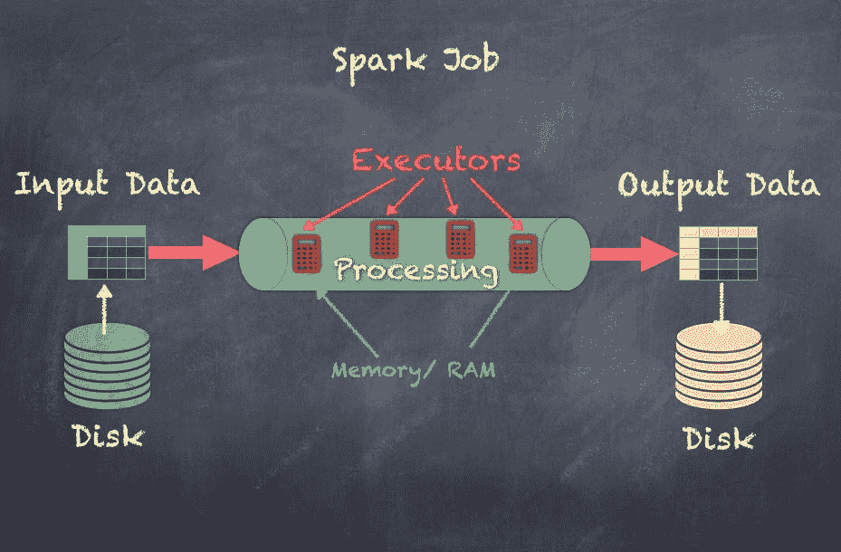

如图所示，一个作业的输入和输出通常依赖于基于磁盘的较慢存储选项，而处理通常是通过内存/RAM 完成的。由于内存的访问速度是磁盘的 100 倍，如果我们能够减少磁盘使用并更多地使用内存，作业的性能就可以显著提升。并不是说在任何作业中都不使用磁盘是不必要的，甚至是不可行的；而是我们只是希望尽可能多地使用内存。

首先，我们可以尽可能将数据缓存到内存中，以便通过执行器加速处理。虽然这对于一些作业可能有效，但对于在分布式集群中运行的大型作业来说，无法提供如此多的 GB 或 TB 内存。此外，即使你的环境中有一个大型集群，仍会有许多用户，因此很难为所有作业使用这么多资源。

我们知道有分布式存储系统，如 HDFS、S3 和 NFS。类似地，如果我们有一个分布式内存系统，我们可以将其用作所有作业的存储系统，从而减少作业或管道中间作业所需的 I/O。Alluxio 正是通过实现一个分布式内存文件系统来提供这一功能，可以被 Spark 用于所有的输入/输出需求。

# 开始使用 Alluxio

Alluxio，前身为 Tachyon，统一了数据访问，连接了计算框架与底层存储系统。Alluxio 的以内存为中心的架构使得数据访问比现有解决方案快了几个数量级。Alluxio 还兼容 Hadoop，从而实现了与现有基础设施的无缝集成。现有的数据分析应用程序，如 Spark 和 MapReduce 程序，可以在 Alluxio 之上运行，而无需任何代码更改，这意味着过渡时间几乎可以忽略不计，同时带来更好的性能：

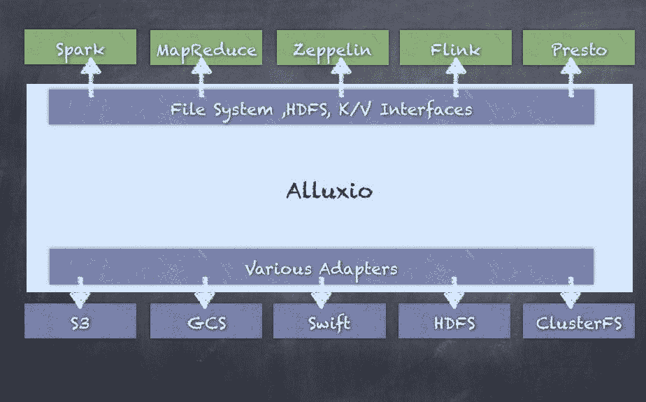

# 下载 Alluxio

你可以通过在[`www.alluxio.org/download`](http://www.alluxio.org/download)网站上注册姓名和电子邮件地址来下载 Alluxio：

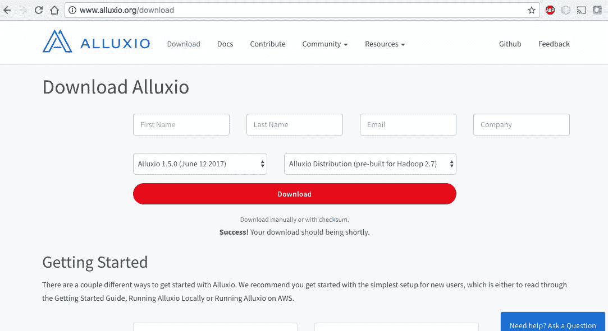

或者，你也可以直接访问[`downloads.alluxio.org/downloads/files`](http://downloads.alluxio.org/downloads/files)并下载最新版本：

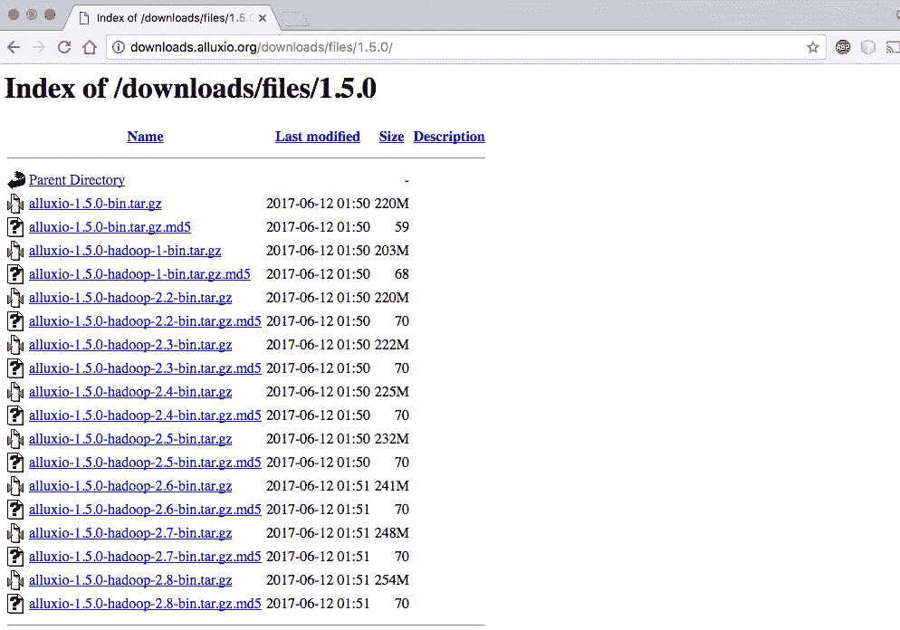

# 在本地安装并运行 Alluxio

我们将安装并在本地运行 1.5.0 版本。你也可以使用其他任何版本。如果你下载了 1.5.0 版本，你会看到一个类似`alluxio-1.5.0-hadoop2.7-bin.tar.gz`的文件。

Alluxio 的前提条件是已安装 JDK 7 或更高版本。

解压下载的`alluxio-1.5.0-hadoop2.7-bin.tar.gz`文件：

```py
tar -xvzf alluxio-1.5.0-hadoop2.7-bin.tar.gz
cd alluxio-1.5.0-hadoop-2.7

```

此外，如果在本地运行，Alluxio 需要一个环境变量来正确绑定到主机，因此请运行以下命令：

```py
export ALLUXIO_MASTER_HOSTNAME=localhost

```

使用`/bin/alluxio`命令格式化 Alluxio 文件系统。

这一步仅在第一次运行 Alluxio 时需要执行，执行时，Alluxio 文件系统中之前存储的所有数据和元数据将被清除。

运行`/bin/alluxio`格式化命令来格式化文件系统：

```py
falcon:alluxio-1.5.0-hadoop-2.7 salla$ ./bin/alluxio format
Waiting for tasks to finish...
All tasks finished, please analyze the log at /Users/salla/alluxio-1.5.0-hadoop-2.7/bin/../logs/task.log.
Formatting Alluxio Master @ falcon

```

本地启动 Alluxio 文件系统：

```py
falcon:alluxio-1.5.0-hadoop-2.7 salla$ ./bin/alluxio-start.sh local
Waiting for tasks to finish...
All tasks finished, please analyze the log at /Users/salla/alluxio-1.5.0-hadoop-2.7/bin/../logs/task.log.
Waiting for tasks to finish...
All tasks finished, please analyze the log at /Users/salla/alluxio-1.5.0-hadoop-2.7/bin/../logs/task.log.
Killed 0 processes on falcon
Killed 0 processes on falcon
Starting master @ falcon. Logging to /Users/salla/alluxio-1.5.0-hadoop-2.7/logs
Formatting RamFS: ramdisk 2142792 sectors (1gb).
Started erase on disk2
Unmounting disk
Erasing
Initialized /dev/rdisk2 as a 1 GB case-insensitive HFS Plus volume
Mounting disk
Finished erase on disk2 ramdisk
Starting worker @ falcon. Logging to /Users/salla/alluxio-1.5.0-hadoop-2.7/logs
Starting proxy @ falcon. Logging to /Users/salla/alluxio-1.5.0-hadoop-2.7/logs

```

你可以使用类似的语法来停止 Alluxio。

你可以通过运行`./bin/alluxio-stop.sh`来停止 Alluxio 本地实例。

通过使用`runTests`参数运行 Alluxio 脚本，验证 Alluxio 是否正在运行：

```py
falcon:alluxio-1.5.0-hadoop-2.7 salla$ ./bin/alluxio runTests
2017-06-11 10:31:13,997 INFO type (MetricsSystem.java:startSinksFromConfig) - Starting sinks with config: {}.
2017-06-11 10:31:14,256 INFO type (AbstractClient.java:connect) - Alluxio client (version 1.5.0) is trying to connect with FileSystemMasterClient master @ localhost/127.0.0.1:19998
2017-06-11 10:31:14,280 INFO type (AbstractClient.java:connect) - Client registered with FileSystemMasterClient master @ localhost/127.0.0.1:19998
runTest Basic CACHE_PROMOTE MUST_CACHE
2017-06-11 10:31:14,585 INFO type (AbstractClient.java:connect) - Alluxio client (version 1.5.0) is trying to connect with BlockMasterClient master @ localhost/127.0.0.1:19998
2017-06-11 10:31:14,587 INFO type (AbstractClient.java:connect) - Client registered with BlockMasterClient master @ localhost/127.0.0.1:19998
2017-06-11 10:31:14,633 INFO type (ThriftClientPool.java:createNewResource) - Created a new thrift client alluxio.thrift.BlockWorkerClientService$Client@36b4cef0
2017-06-11 10:31:14,651 INFO type (ThriftClientPool.java:createNewResource) - Created a new thrift client alluxio.thrift.BlockWorkerClientService$Client@4eb7f003
2017-06-11 10:31:14,779 INFO type (BasicOperations.java:writeFile) - writeFile to file /default_tests_files/Basic_CACHE_PROMOTE_MUST_CACHE took 411 ms.
2017-06-11 10:31:14,852 INFO type (BasicOperations.java:readFile) - readFile file /default_tests_files/Basic_CACHE_PROMOTE_MUST_CACHE took 73 ms.
Passed the test!

```

参见[`www.alluxio.org/docs/master/en/Running-Alluxio-Locally.html`](http://www.alluxio.org/docs/master/en/Running-Alluxio-Locally.html)了解更多选项和详细信息。

你还可以通过打开浏览器并输入`http://localhost:19999/`来使用 Web UI 查看 Alluxio 进程。

# 概览

概览标签页显示了集群的总结信息，例如主节点地址、运行中的工作节点、版本和集群的运行时间。还显示了集群使用情况总结，展示了工作节点的容量和文件系统的 UnderFS 容量。接着，存储使用情况总结也会显示，包括空间容量和已用空间：

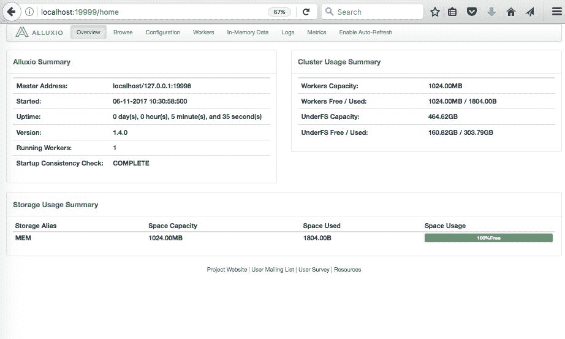

# 浏览

浏览标签页允许你查看内存中文件系统的当前内容。此标签显示文件系统中的内容、文件名、大小和块大小、是否已将数据加载到内存中，以及文件的 ACLs 和权限，指定谁可以访问并执行读写等操作。你将看到所有在 Alluxio 中管理的文件都出现在浏览标签中：

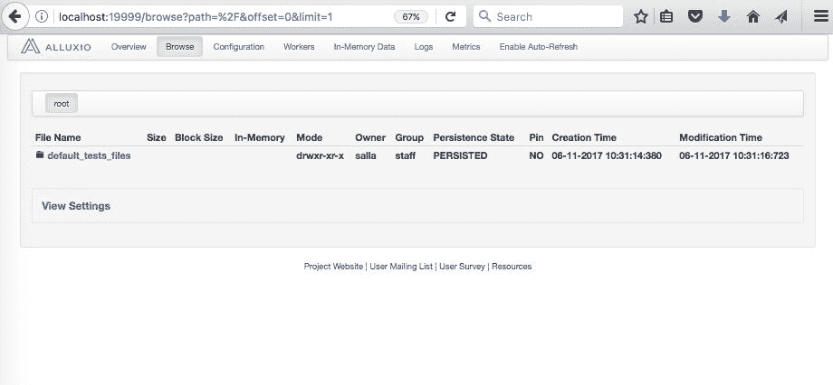

# 配置

配置标签页显示了所有使用的配置参数。最重要的一些参数包括配置目录、CPU 资源和分配给主节点及工作节点的内存资源。此外，还可以看到文件系统名称、路径、JDK 设置等。这些都可以被重写，以根据你的使用案例定制 Alluxio。任何在此处的更改都需要重新启动集群：

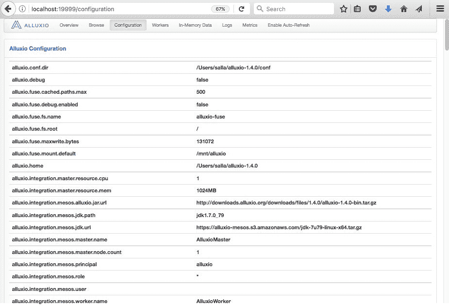

# 工作节点

**Workers** 标签页简单地显示了 Alluxio 集群中的工作节点。在本地设置的情况下，它只会显示本地机器，但在典型的多个工作节点集群中，你将看到所有工作节点及其状态，工作节点的容量、已用空间以及最后接收到的心跳信息，后者可以告诉你一个工作节点是否存活并参与集群操作：

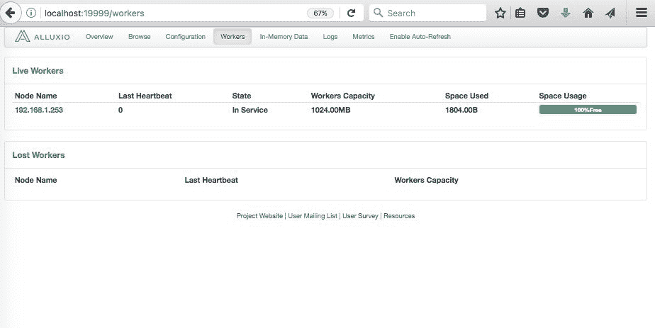

# 内存数据

“内存数据”标签页显示了 Alluxio 文件系统内存中的当前数据。这显示了集群内存中的内容。典型的每个数据集的信息包括权限、所有者、创建时间和修改时间：

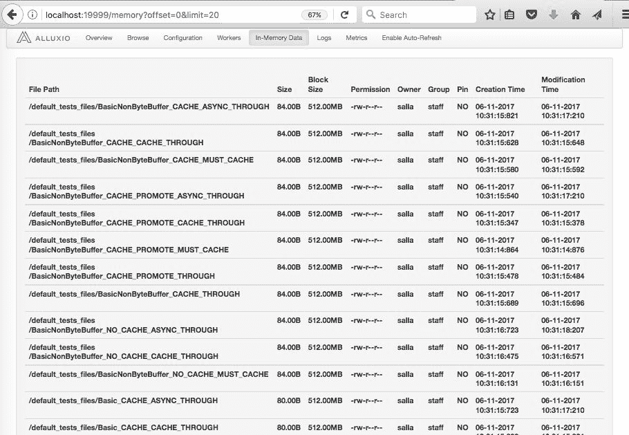

# 日志

“日志”标签页允许你查看各种日志文件以进行调试和监控。你将看到名为 `master.log` 的主节点日志文件，名为 `worker.log` 的工作节点日志文件，`task.log`，`proxy.log`，以及一个用户日志文件。每个日志文件独立增长，对于诊断问题或仅仅监控集群健康非常有用：

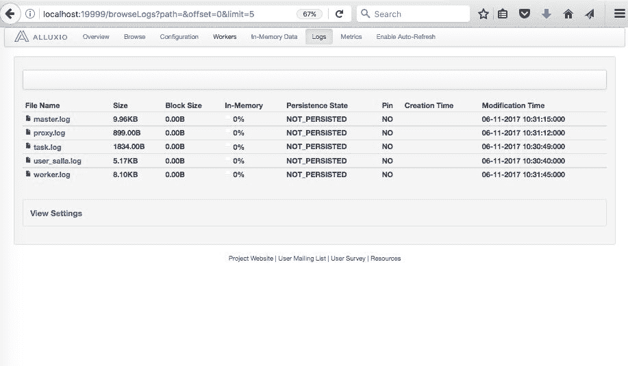

# 指标

“指标”标签页显示了监控 Alluxio 文件系统当前状态的有用指标。这里的主要信息包括主节点的容量和文件系统的容量。还展示了各种操作的计数器，如创建和删除的文件的逻辑操作，以及创建和删除的目录。另一个部分显示了你可以用来监控 CreateFile、DeleteFile 和 GetFileBlockInfo 等操作的 RPC 调用：

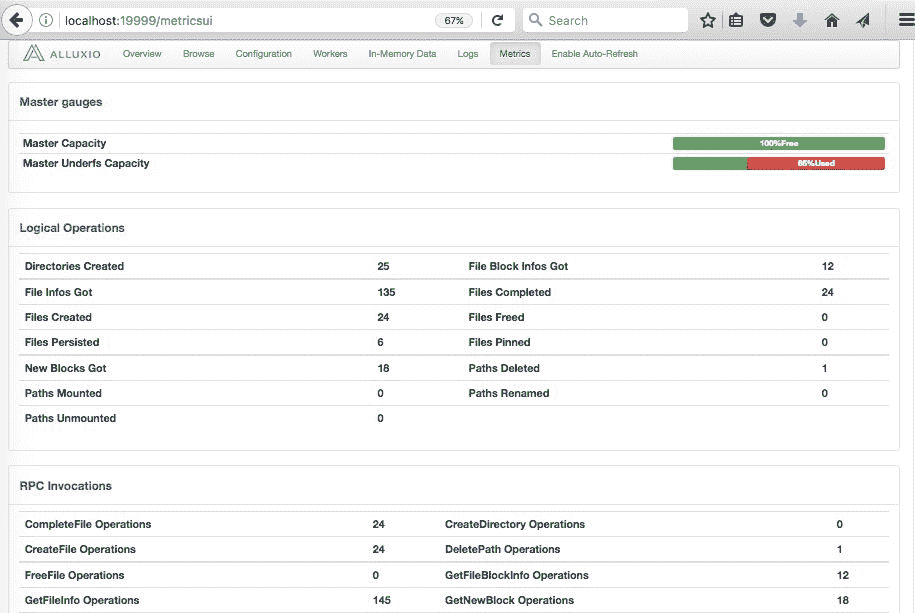

# 当前功能

如前所述，Alluxio 提供了许多功能来支持高速度的内存文件系统，从而显著加速 Spark 或其他许多计算系统。当前版本有许多功能，以下是一些主要功能的描述：

+   **灵活的文件 API** 提供了一个兼容 Hadoop 的文件系统，使得 Hadoop MapReduce 和 Spark 可以使用 Alluxio。

+   **Pluggable under storage** 将内存数据检查点存储到底层存储系统，支持 Amazon S3、Google Cloud Storage、OpenStack Swift、HDFS 等。

+   **分层存储** 除了内存外，还可以管理 SSD 和 HDD，从而允许更大的数据集存储在 Alluxio 中。

+   **统一命名空间** 通过挂载功能实现跨不同存储系统的有效数据管理。此外，透明命名确保了在将 Alluxio 中创建的对象持久化到底层存储系统时，文件名和对象的目录层级得以保留。

+   **Lineage** 可以通过使用血统（lineage）实现高吞吐量的写操作，而不影响容错性，丢失的输出可以通过重新执行创建输出的作业来恢复，就像 Apache Spark 中的 DAG（有向无环图）一样。

+   **Web UI 和命令行** 允许用户通过 Web UI 轻松浏览文件系统。在调试模式下，管理员可以查看每个文件的详细信息，包括位置和检查点路径。用户还可以使用 `./bin/alluxio fs` 与 Alluxio 进行交互，例如，在文件系统中复制数据。

请参考 [`www.alluxio.org/`](http://www.alluxio.org/) 以获取最新的功能和更详细的信息。

这些设置足以让 Alluxio 本地启动。接下来，我们将看到如何与集群管理器（如 YARN）集成。

# 与 YARN 的集成

YARN 是最常用的集群管理器之一，其次是 Mesos。如果你能回忆起 第五章，*解决大数据问题 - Spark 携手登场*，YARN 可以管理 Hadoop 集群的资源，并允许数百个应用共享集群资源。例如，我们可以使用 YARN 和 Spark 集成运行长期运行的 Spark 作业来处理实时信用卡交易。

然而，不建议将 Alluxio 作为 YARN 应用程序运行；相反，Alluxio 应该作为独立集群与 YARN 一起运行。Alluxio 应与 YARN 一起运行，这样所有 YARN 节点都可以访问本地的 Alluxio worker。为了使 YARN 和 Alluxio 共存，我们必须告知 YARN Alluxio 使用的资源。例如，YARN 需要知道为 Alluxio 保留多少内存和 CPU。

# Alluxio worker 内存

Alluxio worker 需要一些内存来支持其 JVM 进程，并为 RAM 磁盘提供一些内存；1 GB 通常足够用于 JVM 内存，因为这部分内存仅用于缓存和元数据。

可以通过设置 `alluxio.worker.memory.size` 来配置 RAM 磁盘内存。

存储在非内存层（如 SSD 或 HDD）中的数据无需包含在内存大小计算中。

# Alluxio master 内存

Alluxio master 存储有关 Alluxio 中每个文件的元数据，因此它的内存应该至少为 1 GB，对于较大的集群部署，最多可达 32 GB。

# CPU vcores

每个 Alluxio worker 至少应分配一个 vcore，而 Alluxio master 在生产部署中可以使用至少一个并最多四个 vcores。

要告知 YARN 每个节点上 Alluxio 需要保留的资源，请修改 `yarn-site.xml` 中的 YARN 配置参数。

修改 `yarn.nodemanager.resource.memory-mb` 来为 Alluxio worker 保留一些内存。

在确定要分配给 Alluxio 的内存量后，从 `yarn.nodemanager.resource.memory-mb` 中减去这一数值，并用新的值更新该参数。

修改 `yarn.nodemanager.resource.cpu-vcores` 来为 Alluxio worker 保留 CPU vcores。

在确定要分配给 Alluxio 的内存量后，从 `yarn.nodemanager.resource.cpu-vcores` 中减去这一数值，并用新的值更新该参数。

更新 YARN 配置后，重启 YARN 以便它能加载新的配置更改。

# 使用 Alluxio 与 Spark

为了在 Spark 中使用 Alluxio，你需要一些依赖的 JAR 文件。这是为了使 Spark 能够连接到 Alluxio 文件系统并进行数据读写。一旦启动了集成了 Alluxio 的 Spark，大部分 Spark 代码保持不变，只有读取和写入部分需要修改，因为现在你必须使用 `alluxio://` 来表示 Alluxio 文件系统。

然而，一旦配置好 Alluxio 集群，Spark 任务（执行器）将连接到 Alluxio 主节点以获取元数据，并连接到 Alluxio 工作节点进行实际的数据读写操作。

这里展示的是一个 Spark 任务使用 Alluxio 集群的示意图：


以下是如何使用 Alluxio 启动 Spark-shell 并运行一些代码的步骤：

**第 1 步**，切换到 Spark 解压目录：

```py
 cd spark-2.2.0-bin-hadoop2.7

```

**第 2 步**，将 Alluxio 的 JAR 文件复制到 Spark 中：

```py
cp ../alluxio-1.5.0-hadoop-2.7/core/common/target/alluxio-core-common-1.5.0.jar .
cp ../alluxio-1.5.0-hadoop-2.7/core/client/hdfs/target/alluxio-core-client-hdfs-1.5.0.jar .
cp ../alluxio-1.5.0-hadoop-2.7/core/client/fs/target/alluxio-core-client-fs-1.5.0.jar .
cp ../alluxio-1.5.0-hadoop-2.7/core/protobuf/target/alluxio-core-protobuf-1.5.0.jar . 

```

**第 3 步**，使用 Alluxio JAR 启动 Spark-shell：

```py
./bin/spark-shell --master local[2] --jars alluxio-core-common-1.5.0.jar,alluxio-core-client-fs-1.5.0.jar,alluxio-core-client-hdfs-1.5.0.jar,alluxio-otobuf-1.5.0.jar

```

第 4 步，将一个示例数据集复制到 Alluxio 文件系统中：

```py
$ ./bin/alluxio fs copyFromLocal ../spark-2.1.1-bin-hadoop2.7/Sentiment_Analysis_Dataset10k.csv /Sentiment_Analysis_Dataset10k.csv
Copied ../spark-2.1.1-bin-hadoop2.7/Sentiment_Analysis_Dataset10k.csv to /Sentiment_Analysis_Dataset10k.csv

```

你可以通过浏览标签查看 Alluxio 中的文件；它是大小为 801.29KB 的 Sentiment_Analysis_Dataset10k.csv 文件：


第 4 步：分别通过 Alluxio 和不通过 Alluxio 访问文件。

首先，在 shell 中设置 Alluxio 文件系统配置：

```py
scala> sc.hadoopConfiguration.set("fs.alluxio.impl", "alluxio.hadoop.FileSystem")

```

从 Alluxio 加载文本文件：

```py
scala> val alluxioFile = sc.textFile("alluxio://localhost:19998/Sentiment_Analysis_Dataset10k.csv")
alluxioFile: org.apache.spark.rdd.RDD[String] = alluxio://localhost:19998/Sentiment_Analysis_Dataset10k.csv MapPartitionsRDD[39] at textFile at <console>:24

scala> alluxioFile.count
res24: Long = 9999

```

从本地文件系统加载相同的文本文件：

```py
scala> val localFile = sc.textFile("Sentiment_Analysis_Dataset10k.csv")
localFile: org.apache.spark.rdd.RDD[String] = Sentiment_Analysis_Dataset10k.csv MapPartitionsRDD[41] at textFile at <console>:24

scala> localFile.count
res23: Long = 9999

```

如果你可以加载大量数据到 Alluxio，Alluxio 集成将提供更好的性能，无需缓存数据。这带来了多个优点，包括无需每个使用 Spark 集群的用户缓存大型数据集。

# 概述

在本附录中，我们探讨了如何利用 Alluxio 作为加速 Spark 应用程序的方式，利用 Alluxio 的内存文件系统功能。这带来了多个优点，包括无需每个使用 Spark 集群的用户缓存大型数据集。

在下一个附录中，我们将探讨如何使用 Apache Zeppelin，这是一种基于 Web 的笔记本工具，用于执行互动数据分析。
