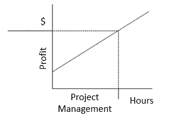
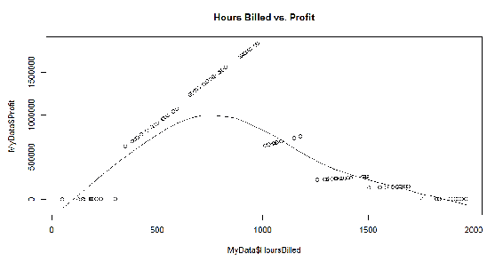
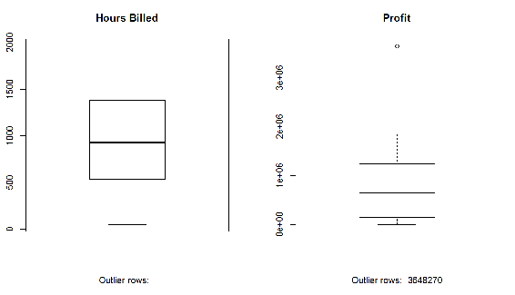
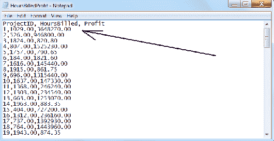
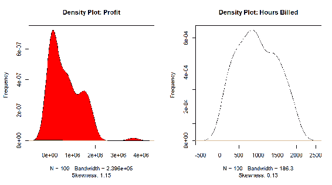
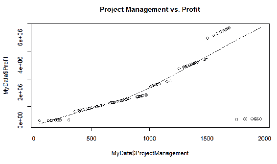
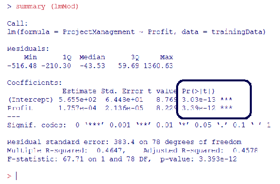

# 数据库的回归进展

在这一章中，我们将通过提供（数据）统计回归的定义来开始，然后继续讨论回归概念，并概述开发人员如何在典型的数据开发项目中使用最常见的回归技术进行预测和预报。

在本章中，我们将信息组织成以下几个领域：

+   统计回归简介

+   识别回归使用机会的方法（在数据项目中）

+   R 与统计回归

+   一个工作示例

# 引入统计回归

如承诺所说，让我们从这一章开始，提供一个关于统计回归的清晰解释。

初步了解，统计回归也常常被称为回归分析，它是估计变量之间关系的一个过程**。** 这个过程包含了多种用于建模和分析变量的技术，重点是因变量与一个（或多个）自变量（或**预测变量**）之间的关系。

具体来说，回归分析是指通过识别和理解一个因变量（**依赖于**其他因素的变量）如何随着任何一个自变量（**独立于**其他变量且不受其影响的变量）的变化而变化的工作，前提是其他自变量保持不变。

一个简单的例子可能是，营销总支出（一个自变量示例）如何影响一段时间内的总销售额（一个因变量示例）（真的是越多的营销就等于更高的销售额吗？），或者也许存在一个关联，即总的营销支出（自变量），产品价格的折扣（另一个自变量），以及销售额（因变量）之间？

记住这个关键点，回归分析用于理解在所有自变量中，哪些与因变量有关，而不仅仅是这些变量之间的关系。此外，推断因果关系（自变量与因变量之间）是一个重要目标。然而，这可能导致错觉或虚假的关系，因此建议小心！

总的来说，回归分析可以被视为在观察自变量的条件下，估计因变量的期望值，也就是说，尝试预测当自变量设置为某些特定值时，因变量的平均值。我称之为杠杆效应——这意味着当一个组件的值增加或减少时，它会直接影响至少一个其他（变量）的值。

回归分析的另一个目标是建立位置参数或分布的分位数。换句话说，这个思想是确定可能作为临界值的值，用于划分概率分布值的范围。

你会发现回归分析是一个非常有用的预测和预测工具（不仅仅是复杂的机器学习应用）。稍后我们会探索一些现实世界的例子，但现在让我们先看一下这个过程的一些技术。

# 回归的技术与方法

你会发现，已经开发并接受了多种进行回归分析的技术。

一些研究可能会展示以下几种顶级技术：

+   线性

+   逻辑回归

+   多项式

+   步骤法

+   岭

+   套索回归

以下是每种方法的简短介绍：

+   **线性回归**：线性回归是最基本的回归类型，通常用于预测分析项目。事实上，当你使用单一预测变量时，我们称之为简单线性回归；如果有多个预测变量，我们称之为多重线性回归。简而言之，线性回归使用线性预测函数，其值是从模型中的数据估算出来的。

+   **逻辑回归**：逻辑回归是一种回归模型，其中因变量是分类变量。这意味着该变量只有两个可能的值，例如通过/不通过、胜/败、生死、健康/生病。如果因变量有两个以上的可能值，可以使用各种修改版的逻辑回归技术，例如多项式逻辑回归、有序逻辑回归等。

+   **多项式回归**：当我们谈到多项式回归时，这项技术的重点是将自变量与因变量之间的关系建模为 n^(次)方多项式。

    +   多项式回归被认为是多重线性回归的一个特例。通过对基线预测变量进行多项式展开得到的预测变量被称为**交互特征**。

+   **逐步回归**：逐步回归是一种技术，它使用某种自动化程序不断执行一步逻辑，即在每一步中，根据预先指定的标准，考虑将某个变量添加到或从自变量集中去除。

+   **岭回归**：通常，预测变量被认为是相互关联的。当这种情况发生时，某个变量的回归系数取决于其他哪些预测变量被包括在模型中，哪些被排除在外。岭回归是一种技术，通过向所选变量添加一个小的偏差因子来改善这种情况。因此，岭回归实际上被认为是一种缓解预测变量之间多重共线性的补救措施。

+   **Lasso 回归**：**Lasso**（**最小绝对收缩和选择算子**）回归是一种既进行预测变量选择，又进行正则化的技术，目的是提高预测准确性和结果的可解释性。

# 选择你的技术

除了上述回归技术外，还有许多其他方法需要考虑，未来可能还会有更多新的方法。面对这么多选项，选择适合你数据和项目的技术非常重要。

选择回归方法不仅仅是选择正确的回归方法，更重要的是选择最有效的回归方法。

通常，你会使用数据来确定将使用的回归方法。首先，你需要为你的数据建立统计资料或特征。在这个过程中，你需要识别并理解不同变量的重要性，它们之间的关系、系数符号**，**以及它们的影响。

总的来说，以下是一些关于选择合适回归方法的一般性建议：

1.  模仿他人已经成功使用的方法。做足研究。将其他项目的成果融入到你的项目中。不要重新发明轮子。而且，即使观察到的方法并不完全适用，也许通过一些简单的调整，它会成为一个不错的选择。

1.  尽量保持方法简单。许多研究表明，简单的模型通常会产生更好的预测结果。从简单开始，只有在必要时才让模型变得更加复杂。你使模型更复杂的可能性越大，就越有可能是将模型专门调整为适应你的数据集，这会导致模型的泛化能力下降。

1.  检查你的工作。当你评估方法时，检查残差图（本章接下来的部分会讲到更多内容），因为它们可以帮助你避免不充分的模型，并调整模型以获得更好的结果。

1.  利用你的领域专业知识。没有任何统计方法能像你一样理解底层过程或领域知识。你的知识是关键部分，也是最可靠的确定最佳回归方法的方式。

# 它是否拟合？

在选择了一个你认为适合你数据的模型（也就是确定该方法最适合）之后，你需要验证你的选择，也就是确定其拟合效果。

拟合良好的回归模型会使预测值接近观察到的数据值。

如果没有信息丰富的预测变量，通常会使用均值模型（该模型对每个预测值使用均值）。因此，拟合的回归模型应该比均值模型的拟合效果更好。

作为数据科学家，你需要仔细审视决定系数，测量估计的标准误差，分析回归参数的显著性和置信区间（稍后在本章中会详细讨论这些内容）。

记住，回归模型拟合得越好，结果的精度通常就越高，或者说结果就越好。

已经证明，简单模型能够产生更精确的结果！在选择方法或技术时，始终记住这一点，甚至在问题可能很复杂时，也不一定非得采用复杂的回归方法。

# 确定统计回归的机会

典型的统计分析工作，通常会成为正式的统计项目，首先从确定一个目标开始，最终确定达到目标的正确方法。

流行的数据科学观点认为，确定一个目标即是确立统计分析的目的，然后将目的分为三个领域：

1.  总结数据（也叫构建数据概况）

1.  揭示并探索数据中变量之间的关系

1.  测试差异的显著性（在数据中的变量或组之间）

# 总结数据

如果你的统计目标是总结数据，你将生成描述性统计量，如均值、标准差、方差等。

# 探索关系

如果你的统计目标是寻找并了解数据中的关系，首先要检查数据是否具有某种形式，换句话说，问问自己：你的数据是围绕频率还是测量展开的？从那里开始，预测变量的数量将告诉你应该使用哪种回归（或其他）方法来进行项目分析。

# 测试差异的显著性

如果你的统计目标涉及测试数据中发现的差异（组之间），你首先需要确定这些组以及组的数量。数据分析涉及单一组（感兴趣的）的数据，通过与均值比较来加以利用，而多组数据则可以使用组的数量来确定应考虑哪种预测方法。

# 项目盈利能力

作为一个实际例子，假设有一个咨询服务组织，它收集了关于其项目工作的时间数据。该组织可能被雇佣来领导各种规模和努力水平的技术或商业相关项目。每个项目都有费用和收入。有些项目是盈利的，有些则不是。公司希望识别哪些变量（如果有的话）可以预测项目的盈利能力，换句话说，哪些变量（特别是哪些）是因变量（在此案例中为盈利能力）的显著预测因子？

检查数据时，我们会看到一份良好的变量和测量的列表，其中一些如下所示：

+   分配给项目的顾问人数 **全职** (**FT**)

+   分配给项目的顾问人数 **兼职** (**PT**)

+   分配给项目的分包商人数（全职或兼职）

+   分配给项目全职的客户资源人数

+   分配给项目的客户资源数量（兼职）

+   与项目核心技术的经验年数

+   总项目管理小时数

+   总开发小时数

+   每小时计费率

+   总计费小时数

+   项目中使用的技术数量

+   项目类型（时间与材料，限制不超过或人员增补）等等

一般而言，当数据科学家使用回归分析时，他或她希望回答以下三个问题：

1.  一组预测变量能否很好地预测结果变量？在我们项目盈利性的例子中，分配给项目的全职顾问人数是否能够很好地预测盈利能力？

1.  哪些变量（特别是）是因变量的重要预测因子？再以我们项目盈利性的例子来看，我们能否通过全职顾问分配到项目中的人数，或许是总项目管理小时数，来确定一个显著的预测因子？

1.  回归方程是什么（即某些变量对其他变量的估计关系或影响），它展示了如何使用一组预测变量来预测结果？在我们项目盈利性的例子中，回归方程是这样的么？



我们的项目盈利性示例看起来可以成为回归分析的合理候选者。

在本章的下一个部分，我们将尝试为项目数据建立一个概况，并使用合适的回归技术来建立它。然后，检查变量之间的关系，并希望基于选定的预测变量预测项目的盈利能力。

# R 和统计回归

在我们直接进入建模之前，让我们先花点时间验证 R 作为我们的统计建模工具的使用。

R 是一个开源的统计环境和强大的编程语言，继续成为统计建模最受欢迎的选择之一。R 是在 S 和 S-Plus 的基础上开发的，它有着不断增长的广泛受众，并由 R 核心开发团队（一个由志愿开发者组成的国际团队）良好维护。

R 和许多相关资源可以很容易地在线找到，并且有详细的说明，指导如何下载软件、附带的包以及其他文档来源。此外，世界各地的人们为 R 编写了大量专门的例程，并作为 R 包免费提供。

由于 R 是一种编程语言，它为你的项目带来了编程的强大功能，但它确实需要一定的工具使用经验。幸运的是，它提供了一个**图形用户界面**（**GUI**），使操作更加简便，并允许你从其他来源和项目中复制粘贴。

# 一个实际的例子

现在让我们回到项目盈利性的现实例子！

我们知道，我们的咨询服务组织的项目结果数据描述了所有项目工作的结果。这些数据中有 100 个项目（或观察值），包含了两个变量：账单小时数和利润。第一个变量不言自明：它是该项目向客户收取的总小时数。第二个是一个美元金额，表示从客户收取的收入，扣除所有费用（与项目相关的费用）后的净收入。

我们知道，每个项目都有费用和收入，而一些项目是盈利的，另一些则不是。此外，即使是盈利的项目，其盈利水平也差异巨大。再次强调，公司希望识别哪些变量（如果有的话）可能用于预测项目的盈利能力。

让我们开始我们的统计分析吧！

# 确定数据特征

在尝试使用我们的项目结果数据建立回归模型之前，通常会先分析数据，识别关键变量。通常，你会通过创建各种数据可视化图表（我们将在本节后续部分逐步演示）来理解数据中变量或群体之间的因果关系。

在统计学中，这些任务通常被称为执行图形分析和相关性研究。

# 图形分析

在我们的统计分析示例中，我们希望构建一个简单的回归模型，通过建立与账单小时（向客户收取的小时数）（hours billed）之间的统计显著线性关系，来预测项目的盈利能力（利润）。因此，我们可以通过多种方式绘制数据，开始我们的图形分析。

通常，对于每个自变量（预测变量），应绘制以下图表以可视化以下行为：

+   **散点图**：用于可视化预测变量与响应变量之间的线性关系。

+   **箱线图**：用于识别变量中的任何异常值。预测变量中的异常值可能会极大地影响预测，因为它们可以轻易地改变最佳拟合线的方向/斜率。

+   **密度图**：用于查看预测变量的分布。理想情况下，最好接近正态分布（钟形曲线），而不是向左或向右偏斜。

散点图可以帮助可视化因变量（响应变量）与自变量（预测变量）之间的任何线性关系。

理想情况下，如果你观察多个预测变量，则应为每个预测变量与响应变量之间绘制散点图。

以下是使用我们项目结果数据中的`HoursBilled`和`Profit`变量，创建散点图可视化的简单 R 命令：

```py
# --- load our project results data 

MyData <- read.csv(file="c:/Worker/HoursBilledProfit.csv", header=TRUE, sep=",") 

# --- build our scatter plot on the relationship between our 
# --- variables 

scatter.smooth(x=MyData$HoursBilled, y=MyData$Profit, main="Hours Billed vs. Profit")  # scatterplot 
```

以下是我们生成的散点图：



**小时计费与利润**的散点图以及前述图表中的平滑线表明，项目的总小时计费与利润变量之间最初是线性增加后再减少的关系。

请注意，线性回归的一个基本假设是响应变量与预测变量之间的关系是线性和加性的，因此这些数据最初看起来符合这一假设。

我们的下一步是查看数据中是否存在任何离群值。位于 1.5 * 四分位距（1.5 * IQR）之外的数据点被视为离群值，其中 IQR 是计算为该变量第 25 百分位和第 75 百分位值之间的距离。

在数据的统计分析中，箱线图通常用于通过四分位数图形化地表示一组数值数据。这些可视化图形可能还会有从箱体延伸出的垂直线（一些数据科学家称这些线为“胡须”），表示上下四分位数之外的变异性。箱线图非常适合用于识别离群值。

以下 R 命令用于生成箱线图：

```py
# --- load our project results data 

MyData <- read.csv(file="c:/Worker/HoursBilledProfit.csv", header=TRUE, sep=",") 

par(mfrow=c(1, 2))  # divide graph area in 2 columns 

# --- box plot for hours billed 

boxplot(MyData$HoursBilled, main="Hours Billed", sub=paste("Outlier rows: ", boxplot.stats(MyData$HoursBilled)$out))   

# --- box plot for Profit 

boxplot(MyData$Profit, main="Profit", sub=paste("Outlier rows: ", boxplot.stats(MyData$Profit)$out))   
```

以下是从我们项目结果数据生成的离群值箱线图：



你可以注意到在利润变量中识别出的离群值（位于前述图形的右侧）。**离群值行：3648270**对应于我们文件中的一个数据点：



最后，可以创建一个密度图来查看我们的响应变量（`ProjectID`，`HoursBilled`和`Profit`）与正态分布的接近程度。为此，我们可以使用以下 R 命令：

```py
# --- load our project results data 

MyData <- read.csv(file="c:/Worker/HoursBilledProfit.csv", header=TRUE, sep=",") 
library(e1071) 

# --- divide graph area in 2 columns 

par(mfrow=c(1, 2))   

# --- density plot for profit 
plot(density(MyData$Profit), main="Density Plot: Profit", ylab="Frequency", sub=paste("Skewness:", round(e1071::skewness(MyData$Profit), 2)))   
polygon(density(MyData$Profit), col="red") 

# --- density plot for hours billed 

plot(density(MyData$HoursBilled), main="Density Plot: Hours Billed", ylab="Frequency", sub=paste("Skewness:", round(e1071::skewness(MyData$HoursBilled), 2)))   
polygon(density(MyData$HoursBilled), col="red")
```

以下是密度图：



那么，我们是否能看到项目的小时计费和项目利润之间的相关关系呢？

我们确认这一点的一种方法是建立变量之间的相关性。相关性表示成对出现的两个变量之间的线性依赖程度，就像我们认为小时计费和（项目）利润之间的关系一样。

如果数据科学家发现利润随着每个项目小时计费的增加而增加，那么这两个变量之间会有很高的正相关性，因此，它们之间的相关性会接近 1。相反，对于反向关系，相关性将接近-1。

值越接近 0，表示变量之间的关系越弱。低相关性（-0.2 < x < 0.2）可能表明响应变量（Y）的变化大部分无法通过预测变量（X）来解释，在这种情况下，我们可能需要寻找更好的解释变量。

R 编程语言再次为我们提供了一种简便的方法来实现这一点：`cor`函数，它可以确定我们两个变量之间的相关性：


根据前面的输出，我们可以确定实际上没有理由相信，随着项目的账单小时数的增加，盈利能力也会增加。鉴于此，我们应当考虑其他可能的预测变量。

为了节省时间（我们想继续进行回归模型的构建），我们不打算重新开始，而是根据经验猜测，或许总项目管理小时数是一个良好的项目盈利预测变量。让我们尝试使用这个变量运行相同的`cor`函数：


正如前面计算出的相关性所示（通过使用 R 函数`cor`生成），变量`ProjectManagement`似乎与项目盈利能力具有更高的正相关性（相比账单小时数）。

通常，我们会花时间重新构建我们在本节中使用此数据所创建的可视化图形（例如以下的散点图），但为了节省时间，我们将继续前进：



从我们的散点图中可以看出：**利润管理与利润**之间存在平滑的线性回归关系。随着项目管理时间的增加，项目的整体盈利能力也随之提高！

继续吧！

现在，我们已经通过散点图（以及前一节中的其他示例）等可视化图表建立了（看似）良好的线性关系，并通过计算出正相关性（使用 R 函数`cor`），我们可以尝试构建实际的线性回归模型。

再次，R 为我们提供了一个相关函数——`lm()`。`lm()`函数有两个主要参数：

+   公式（一个公式类的对象）

+   数据（通常是一个`data.frame`）

以下是我们可以用来生成 R 回归模型的 R 命令：

```py
# --- build linear regression model on all of our 
# --- project results data 

alinearMod <- lm(ProjectManagement ~ Profit, data=MyData) 
print(alinearMod) 
```

以下是构建我们模型的结果：


使用之前的 R 命令构建线性模型后，我们已经建立了预测变量（项目管理小时数）与响应变量（项目的盈利能力）之间的数学公式关系，其中项目管理（ProjectManagement）是`Profit`的函数。

我们可以使用前面输出中的系数（`Intercept: 6.180` 和 `Profit: 1.629`）来创建公式：

*projectmanagement = −6.180 + 1.629 * profit*

利用我们的线性模型和公式，如果知道对应的项目管理总小时数，我们就可以预测项目的盈利值。令人兴奋！

尽管我们已经建立了预测（项目盈利性）的手段，但请记住，在使用任何回归模型之前，必须确保其具有统计学显著性。

# 使用我们的线性模型进行预测

我们刚刚使用 R 命令创建了一个线性回归模型，并使用了所有的项目结果数据。在实际应用中，人们通常会使用所谓的**80:20 样本法则**来分割数据。这意味着 80%的数据将用于训练模型，而剩下的 20%可以用于测试和验证。

现在让我们来经历这个过程。

# 第 1 步：分割数据

我们可以读取项目结果数据，然后使用 R 的 sample 函数将数据分割成两个部分（分别为`trainingData`和`testData`），如下所示的 R 命令：

```py
# --- first load our project results data 
# --- from our CSV file into the object MyData 

MyData <- read.csv(file="c:/Worker/ProjectManagementProfit.csv", header=TRUE, sep=",") 

# --- next we are setting the ""sample seed"" 
# --- to reproduce results of random sampling 

set.seed(100)   
trainingRowIndex <- sample(1:nrow(MyData), 0.8*nrow(MyData))   

# --- create our ""chunk"" of  
# --- model training data 

trainingData <- MyData [trainingRowIndex,] 

# --- create our ""chunk of  
# --- test data   
testData <- MyData [-trainingRowIndex,]
```

# 第 2 步：在训练数据上创建模型

就像我们在本章前面所做的那样，我们可以使用 R 函数 lm 来使用`trainingData`数据块创建回归模型**：**

```py
# --- Build the model on training data  

lmMod <- lm(ProjectManagement ~ Profit, data=trainingData)  
```

# 第 3 步：预测测试数据的预期利润

然后，我们使用 R 函数 predict 来生成项目预测，如下所示的 R 命令：

```py
# --- predict project profitability  

ProfitPred <- predict(lmMod, testData) 

```

以下是前面 R 命令生成的输出：


# 第 4 步：回顾模型

也许我们过程中的最后一步是对模型进行总结并审查其统计显著性。

我们可以使用 R 函数 summary：

```py
# --- generate the summary of the model  

summary (lmMod)
```

这将生成以下输出：



从之前生成的输出中，我们可以看到我们的模型预测器的`p`值在视觉上被解读为显著，通过行末的显著性星号（已标出）可以看到，因此我们知道我们的模型是统计显著的。

# 第 4 步：准确性与误差

我们可以通过实际值（实际项目利润总额）与模型预测值（利润值）之间的简单关联来测试我们项目利润预测的准确性。

如下所示，以下 R 命令再次使用了 R 函数`cor`：


高度的相关性精度意味着实际值和预测值具有相似的方向性变化，即当实际值增加时，预测值也会增加，反之亦然；或者可以假设当一个项目的总项目管理时间增加或减少时，项目的盈利性也会以相同的方式增加或减少！

# 摘要

在本章中，我们介绍了统计回归，概述了最常见的回归方法，并提供了在特定统计项目中选择校正方法的一些建议。此外，我们还提到了如何识别使用统计回归的机会，并讨论了数据总结、探索关系以及检验差异的显著性。

最后，我们通过一个实际的线性回归模型示例，展示了如何预测项目盈利能力。

下一章将向开发者介绍统计正则化的概念，帮助理解统计正则化是什么以及它的重要性，并使开发者对各种统计正则化方法感到熟悉。
